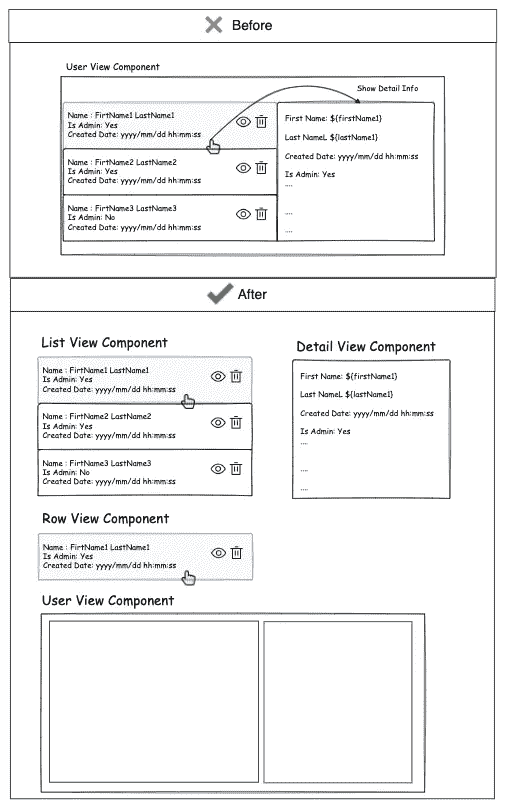
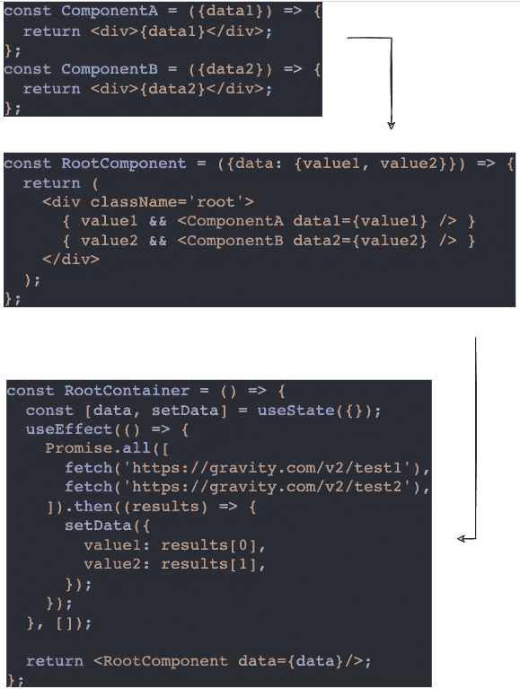

# React 中如何贯彻固体原理？

> 原文：<https://javascript.plainenglish.io/solid-principle-in-react-11272c41b529?source=collection_archive---------4----------------------->

## 关于 SOLID 原理的基础以及如何在 React 中实现它的初学者教程。

本文将为您提供 SOLID 原则的基本概述，以及如何在 React 中实现它。对于每项技术，我们都有不同的方式来遵循这一原则。但是，使用 React，很难在代码中应用这个原则。

先来简单定义一下固体原理。这一原则有助于我们构建有助于以下目标的软件:

*   ***代码复用性。***
*   **中的*便于在特性中进行代码修改。***
*   ***使代码易于维护。***
*   ***易于编写的测试用代码。***

## 固体代表什么？

我们将详细讨论单词中的每一个字母。

## 单一责任

> 一个好的组件应该只有一个职责

例如，将一个大部件分成几个小块:

***这个原则的目标是*** :

*   将做太多事情的大组件分解成小组件
*   将与主要组件功能无关的代码提取到单独的实用函数中(DateUtils，有些业务可以在不同的地方使用)
*   将组件的所有业务逻辑移动到定制钩子中(useEffect、handlers、states)

## o:打开-关闭

> 对扩展开放，但对修改关闭

这个原则与代码维护和新代码更改有关。为了便于理解系统中的原理示例，我们有一个现有的通用组件，它被用在我们项目的许多地方。

我们的组件应该有办法从外部改变，而不是修改自己。当你试图改变现有的组件，可能会有副作用，从其他地方使用它。

代码示例:

***这个原则的目标是:***

新的代码改变不应该影响类的存在，或者它的影响应该尽可能的最小化。它有助于新特性(新代码变更)避免导致错误和影响原始类。相反，要直接修改按钮组件，我们应该应用一些模式，并确保可以从外部覆盖该组件:

*   如果你想访问 DOM 元素[https://reactjs.org/docs/forwarding-refs.html](https://reactjs.org/docs/forwarding-refs.html)就使用 forwardRef
*   通过有条件地将类名连接在一起，使样式易于从外部覆盖。[https://github.com/JedWatson/classnames](https://github.com/JedWatson/classnames)
*   使用“儿童”适当支持来自外部的动态内容，而不是仅固定文本值
*   当我们试图编写一个新的测试用例并找到组件时，添加一个“data-testid”属性非常有用。

## 利斯科夫的替代和界面分离

***这个原则坚持 OOP 和继承概念(我们将跳过)***

你可以看看为什么我们不应该使用继承来重用 React 中组件之间的代码。

 [## 组合 vs 继承-反应

### React 有一个强大的组合模型，我们建议使用组合而不是继承来重用代码…

reactjs.org](https://reactjs.org/docs/composition-vs-inheritance.html) 

然而，我们可以以不同的方式理解这两个原则如何使代码可重用，以及如何更有效地定义 prop(组件的接口)。

在示例中，您可以看到实现对话框和避免重复代码的最佳方式(基本对话框和错误/警告对话框—类似于类中的继承)。我们需要更有效地定义道具(接口)。

回到对话框中的例子，我们可以很容易地定义一个基本对话框，如下所示:

那么现在我们如何实现警告和错误对话框呢？我们不想对基本对话框组件产生副作用。从需求中，我们可以看到(页眉、内容和页脚)在不同的情况下非常复杂。一个好的做法是，我们应该将如何构建的内容传递给父组件，而不是。

解决方案:

*   标题/内容应该作为 React 元素而不是文本来传递。
*   公开一个新类型(default | error | warning)来处理基本组件中的某些特定样式(颜色、文本样式、页脚)。
*   更有效地定义接口(组件属性)。

***这些原则的目标是* :**

1.  在 React 中，我们不使用继承来减少组件之间的重复代码。我们建议使用组合而不是继承来重用组件之间的代码。
2.  接口意味着父类和子类之间的连接。在 React 中，这类似于我们定义组件属性的方式。在 React 中，我们不使用继承来减少带有 having 关键字的组件之间的重复代码。如果在 React 中使用 TypeScript，可以使用 prop-types 库([https://github.com/facebook/prop-types](https://github.com/facebook/prop-types))，这有助于查看组件属性是如何定义的。我们应该更有效地定义组件属性，使它们易于阅读和维护。

## 依赖性倒置

> 一个人应该“依赖抽象，而不是具体。”-维基百科

换句话说，你可以认为一个组件本身不应该包含依赖(外部服务 API 调用)。我们不得不重新使用另一个地方的组件。外部服务应该以单一的方式工作，以减少相互之间的依赖，使代码变得清晰，易于其他组件使用。

示例代码:

移动之后，所有的 API 调用组件:

现在您看到容器是保存数据和控制组件间集成的地方。组件只对 self-it 的视图和行为做出响应。使组件可以重用，减少对它的依赖。

另一个解决方案减少了 API 调用。我们可以使用一些技巧来解决这个问题:

*   特设高阶组件:[https://reactjs.org/docs/higher-order-components.html](https://reactjs.org/docs/higher-order-components.html)。
*   自定义钩子:在组件之间共享公共钩子。
*   Redux & Reselector:管理应用程序状态以避免组件中的大量依赖。
*   组件间集成的提供者。

## 结论

固不是万能的，用每一种语言你都会有办法处理这个问题。一些坚持 OOP(类、接口、抽象)的原则不能应用于 GUI 编程(函数式编程)

这不是一条规则，不要强迫你去想它。它帮助你思考如何使你的代码易于阅读和维护。

*更多内容看* [***说白了。报名参加我们的***](https://plainenglish.io/) **[***免费周报***](http://newsletter.plainenglish.io/) *。关注我们关于*[***Twitter***](https://twitter.com/inPlainEngHQ)[***LinkedIn***](https://www.linkedin.com/company/inplainenglish/)*，以及* [***不和***](https://discord.gg/GtDtUAvyhW) *。***