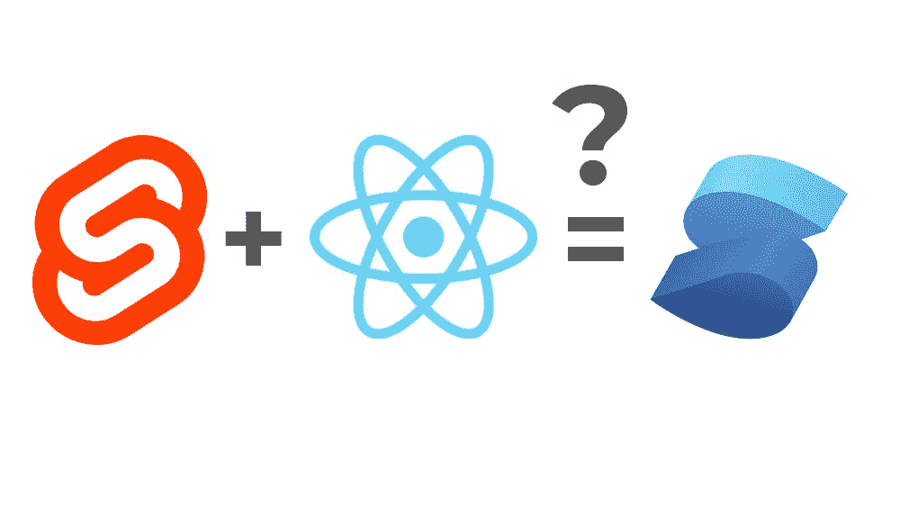

# SolidJS:长相可以骗人？

> 原文：<https://javascript.plainenglish.io/solidjs-looks-can-be-deceptive-65b2f91360fe?source=collection_archive---------7----------------------->

## 就像表面上的反应…但是完全不同



Solid JS 相对来说是 JavaScript 框架领域的新人。然而，在今年的 JavaScript State 调查中，它的受欢迎程度排名第一。是什么让它如此吸引人，值得学习吗？

# 就像 React…乍一看

当你阅读 SolidJS 代码时，它看起来很像 React。组件是返回 JSX 代码的函数。如果你对 React 很熟悉，你可以阅读 SolidJS 代码，并对正在发生的事情有一个很好的了解。事实上，以下代码在 React 和 Solid 中都有效:

```
function MyComponent(props) {
  return <div>Hello {props.name}</div>;
}

<MyComponent name="Solid" />;
```

这是一件好事。已经有足够多的不同框架各自推出自己的语法。而做出反应的是*事实上的*标准。所以在熟悉的领域感觉很好。

但事实并非如此。因为钩子 React 业务逻辑的支柱——甚至不存在于坚固的 JS 中。

# 使用信号而不是使用状态

实体没有 useState 挂钩。相反，它依赖于“信号”。什么是信号？在固态中，信号是这样初始化的:

```
const [count, setCount] = createSignal(0);
```

鉴于熟悉的语法，很容易想象 createSignal 只是 React 的“useState”的变体。从某种意义上说，两者都是为了解决同一个问题:在组件功能的执行过程中跟踪应用程序的状态。那么 SolidJS 的 signals 和 React 的 useState 钩子有什么区别呢？

第一个线索是 createSignal 返回的第一个元素(在上面的例子中是“count”)是一个函数。Solid JS 的网站上写道:“信号是持有订阅列表的事件发射器”。这在实践中意味着什么？

文档还指出，组件函数“被调用一次，然后就不存在了”。它们“存在的目的是组织你的代码，而不是别的”。因此，尽管代码编写方式有相似之处，但感觉底层机制非常不同。

React 使用虚拟 DOM 跟踪组件树中的状态变化。然后 React 根据树中发生变化的位置重新呈现树。树被比较。并且组件函数被重复调用。只要组件状态的任何部分发生变化，就会重新呈现整个组件及其子组件。

另一方面，Solid 跟踪 UI 的哪一部分依赖于什么。它只更新那个，不更新别的。

这感觉很熟悉

# 固体像苗条的管理状态

[苗条](/svelte-from-a-react-perspective-its-weird-but-fun-d9cc9ba242d7)声称是消失的框架。它不像 React 和其他方法那样比较虚拟 DOM 的状态变化，而是重载 JavaScript 语法来跟踪依赖关系。从这个意义上说，它首先是一个编译器。因为它知道界面的哪一部分依赖于哪一个变量，所以它的更新非常精确。

Solid JS 正在做的事情感觉与此非常相似:接口中发生变化的部分被插入到事件侦听器中。副作用(相当于 useEffect)将自己插入到这些事件侦听器中。

那么为什么不直接用 Svelte 或者 React，而不是求助于某个(相对)新贵呢？

# 很有道理

对我来说(这很可能只是一个品味问题)，苗条感觉太像魔术了。它看起来像 JavaScript，但是编译器在它的基础上使用了依赖黑魔法。

另一方面，结实比苗条更有意义。这只是巧妙组织的事件监听器，而不是一些编译器魔术。事件听众，我知道，理解，信任。编译器对我的代码做了奇怪的事情…没那么奇怪。

仔细想想，Solid 甚至比 React 更有意义。我见过的初级开发人员犯的错误表明他们没有掌握何时调用功能组件或者如何管理状态。

从某种意义上说，这是坚实的 JS 最困难的事情。

我学到的关于 React 的概念，已经在我的编码方式中根深蒂固，关于如何管理状态和渲染，不能很好地移植到 Solid JS。我不需要担心组件被调用的频率——因为它们只被调用一次。

在这两种情况下，在 Solid 如何实现反应性和管理 HTML 呈现方面，Solid 感觉比它的“父母”更理智，苗条和反应。

# 比各部分的总和还要好？

所有这些结合起来产生有效和快速的代码。Solid JS 在 JavaScript 框架基准测试中得分很高。在 JavaScript 调查中，它得到了很高的评价。它只有 7kb 重。

那么，为什么我现在还不使用 Solid JS 呢？

嗯，部分问题是 Solid JS 不是 React，我参与的很多项目已经有了一个很大的 React 代码库。研究它们的人知道反应，但他们不知道固体。

但是我有一种感觉，在 React 导致性能问题的地方，在我可以单独工作的项目上，我将在这里和那里散布一些可靠的 JS。

谁知道呢，也许有一天我会独自使用它。因为我喜欢 Svelte 的反应能力，但我不喜欢它的编译器魔力。我喜欢 React 的 JSX 语法和简单性，但我见过太多的人被他们不理解的行为绊倒。

而 Solid JS 看起来像是将两个世界的精华结合在一起，以一种既简单、合理又…可靠的方式。

*更多内容请看*[***plain English . io***](https://plainenglish.io/)*。报名参加我们的* [***免费周报***](http://newsletter.plainenglish.io/) *。关注我们关于*[***Twitter***](https://twitter.com/inPlainEngHQ)*和*[***LinkedIn***](https://www.linkedin.com/company/inplainenglish/)*。查看我们的* [***社区不和谐***](https://discord.gg/GtDtUAvyhW) *加入我们的* [***人才集体***](https://inplainenglish.pallet.com/talent/welcome) *。*