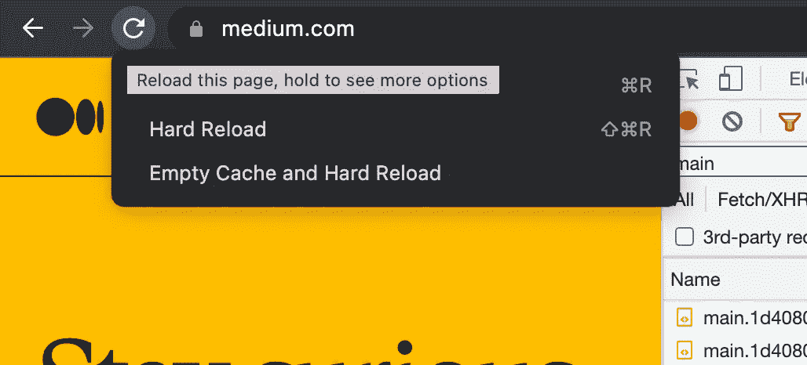

# 给初学开发者的一些实用的 Chrome 技巧

> 原文：<https://javascript.plainenglish.io/some-practical-chrome-tips-for-beginner-developers-6e58284e91b2?source=collection_archive---------10----------------------->

## 使用这些 Chrome DevTools 提示提高您的效率。

Photo by [Alejandro Piñero Amerio](https://unsplash.com/@vjgalaxy?utm_source=medium&utm_medium=referral) on [Unsplash](https://unsplash.com?utm_source=medium&utm_medium=referral)

## 前言

几周前，一名初级开发人员让我帮忙修复一个浪费了他一整天时间的 bug。我发现问题其实很简单，只需要知道一些 Chrome DevTools 的技巧。

这次经历让我意识到，很多我认为很简单的事情，对别人来说是知识的盲点。在这篇文章中，我将分享一些我几乎每天都在使用的 Chrome 技巧。

## 1.模拟移动或调整窗口宽度

你还在 PC 上写代码然后用手机测试页面吗？除了效率低之外，这种方法没有任何问题。如果你想在移动浏览器中调试或检查元素，你可以使用[vConsole—NPM(npmjs.com)](https://www.npmjs.com/package/vconsole)这很有用，但是 Chrome DevTools 更强大。是的，我们可以用 Chrome 来模拟手机。打开 Chrome DevTools，然后点击手机图标。

如果要调整窗口的宽度或高度，可以用`Responsive`改变尺寸，然后拖动屏幕边缘进行调整。您还可以添加一个新设备，该设备可以自定义大小和 userAgent 字符串。

## 2.检查滤芯

许多前端开发人员可以通过右键单击文档元素并单击`inspect`选项打开 DevTools 的`Elements`面板来检查元素，然后他们可以查看元素的所有样式。有一种实用的方法可以帮助您在 DevTools 的任何面板中查看关于元素的更简要的信息:

单击 DevTools 左上角的图标并检查元素，会出现一个包含元素类列表、大小和填充的弹出窗口。如果您已经获得信息，您可以通过点击`ESC`或再次点击图标来取消操作。

## 3.清除浏览器缓存

浏览器用于缓存静态文件，在某些情况下，可能会出现一些错误，特别是在一些公司内部项目中，这些项目总是使用相同的静态文件名称。有很多方法可以清理缓存，比如 Chrome 设置或扩展。作为开发者，我们可以用开发者的方式:

1.  在 DevTools 的网络面板中禁用缓存:

2.点击刷新图标并保持几秒钟，你可以看到更多的选项来重新加载页面。如果您看不到选项，您可能无法打开 DevTools。

## 4.查看元素的各种状态

众所周知，我们可以使用 CSS 伪来提供更好的用户体验，如`:hover`、`:focus`等。有时我们可能想改变这些状态的样式，我们可以这样改变元素状态:

或者右击元素，会出现强制状态选项:

然后我们可以在样式面板中查看相关状态的 CSS 规则。

## 5.网络节流

大多数网页在从后端服务器加载数据时会使用框架或加载图标。如果我们想看到这些元素的样式，我们可以通过限制网络速率来推迟请求。

将会有一些预设选项，它可能无法满足所有情况，然后我们自定义利率:

我们可以利用这个特性来检查网页在弱网络环境下的体验。

## 6.隐藏元素

网页上会有很多元素，如果我们要调试页面，一个有用的技巧就是通过减少页面元素来减少潜在的影响因素。我们可以使用 CSS 隐藏带有`display`或`visibility`的元素。更快捷的方法是通过使用`delete`键或者使用`H`键设置`visibility`属性来删除元素:

## 7.记住一些 DevTools 快捷方式

当你移动鼠标时，Chrome DevTools 中的所有图标都有提示，你也可以看到快捷方式。

记住一些快捷方式会帮助你提高效率。我的经验是学习如何查看快捷方式，而不是背诵。每次用鼠标的时候，想想有没有更快的方法。

## 最后

Chrome DevTools 对于前端开发者来说是一个非常强大的工具，我们都需要更加关注别人如何使用它，并可能获得一些收获。

希望这篇文章能帮助你提高效率，你可以从这些文章中了解更多这些技巧:

 [## 将效率提高 10 倍的 Chrome 技能

### 复制到高亮部分将向右滚动到高亮部分

medium.com](https://medium.com/frontend-canteen/a-chrome-skill-that-improves-efficiency-by-10x-7c6bd8e7e56a)  [## 3 个 Chrome DevTools 提示帮助你提高效率

### 3 Chrome DevTools 提示:复制数据、代码片段和重复请求。

javascript.plainenglish.io](/3-chrome-devtools-tips-to-help-you-be-more-efficient-d1843dbc1205) 

*更多内容请看*[***plain English . io***](https://plainenglish.io/)*。报名参加我们的* [***免费周报***](http://newsletter.plainenglish.io/) *。关注我们关于*[***Twitter***](https://twitter.com/inPlainEngHQ)[***LinkedIn***](https://www.linkedin.com/company/inplainenglish/)*[***YouTube***](https://www.youtube.com/channel/UCtipWUghju290NWcn8jhyAw)*[***不和***](https://discord.gg/GtDtUAvyhW) *。***