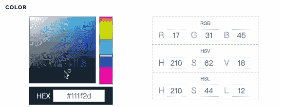

# 有时候你根本不需要 JavaScript

> 原文：<https://javascript.plainenglish.io/sometimes-you-dont-need-javascript-at-all-73a6a226a1c3?source=collection_archive---------0----------------------->

## 用 CSS 实现复杂的 JavaScript 效果

Photo by [Pauline Loroy](https://unsplash.com/es/@paulinel?utm_source=medium&utm_medium=referral) on [Unsplash](https://unsplash.com?utm_source=medium&utm_medium=referral)

最近，我学到了很多很棒的编程技巧，很多我不得不求助于 **JavaScript** 的事情现在只用 **CSS** 就可以完成了。

相信看完这个你也会爱上 CSS 的，一起来看看吧！

# 1.平滑切换图片

我从来没有想过平滑过渡的效果可以用 CSS 来完成，你可以尝试滑动图片，会有惊喜给你！

**HTML**

**CSS**

# 2.颜色选择器

你必须使用像这个组件一样的组件来获得颜色。我们通常需要编写复杂的 JavaScript 来实现其功能，但现在可以通过`input`元素来实现。

我们只需要将**类型**设置为“color ”,就可以获得浏览器本身支持的颜色选择器。

你可以试着点击图片，给猫一个新的颜色。

# 3.打字机效果

你能想象只用 CSS 实现打字机效果吗？那真是太神奇了。

**HTML**

**CSS**

# 4.平滑滚动到顶部

当网页太长时，我们通常会提供一个按钮，以便用户可以平滑地滚动到顶部。我们以前用 JavaScript 来做这个。

我们真的需要那么多麻烦吗？是的，我们只用一行 CSS 就可以做到。

# 最后

**感谢阅读。**我期待着您的关注和阅读更多高质量的文章。

 [## 采访者:“npm 跑 xxx”怎么了？

### 一个大多数人都不知道的秘密。

javascript.plainenglish.io](/interviewer-what-happened-to-npm-run-xxx-cdcb37dbaf44)  [## 每个开发人员都应该知道的 20 种 JavaScript 数组方法

### 你知道这 20 个数组方法是怎么实现的吗？

javascript.plainenglish.io](/20-javascript-array-methods-every-developer-should-know-6c04cc7a557d)  [## 让你看起来像高级开发人员的 8 个很酷的 GitHub 技巧

### 使用 GitHub 可以做的 8 件很酷的事情

javascript.plainenglish.io](/8-cool-github-tricks-to-make-you-look-like-a-senior-developer-ab8fe9ae9b14)  [## 面试官:可以“x！== x "在 JavaScript 中返回 True？

### 你可能不知道的五个神奇的 JavaScript 知识点！

javascript.plainenglish.io](/interviewer-can-x-x-return-true-in-javascript-7e1d1fa7b5cd)  [## 现在是 2022 年，不要再滥用箭头功能了

### 不应该使用箭头函数的 4 种情况。

javascript.plainenglish.io](/its-2022-don-t-abuse-the-arrow-function-anymore-905862a9c668) 

*更多内容请看*[***plain English . io***](https://plainenglish.io/)*。报名参加我们的* [***免费周报***](http://newsletter.plainenglish.io/) *。关注我们关于*[***Twitter***](https://twitter.com/inPlainEngHQ)*和*[***LinkedIn***](https://www.linkedin.com/company/inplainenglish/)*。查看我们的* [***社区不和谐***](https://discord.gg/GtDtUAvyhW) *加入我们的* [***人才集体***](https://inplainenglish.pallet.com/talent/welcome) *。*