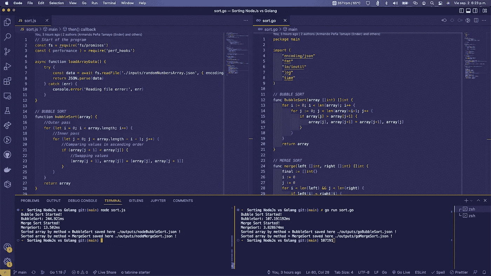
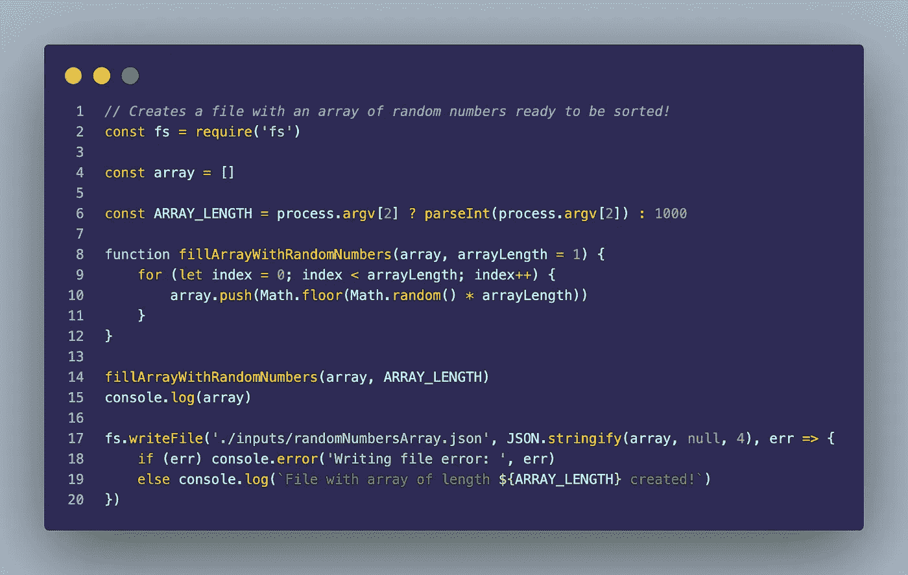
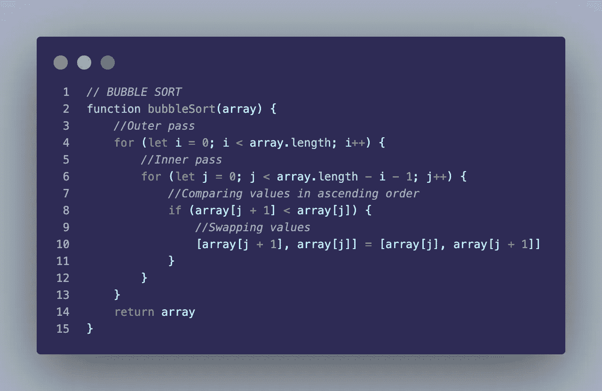
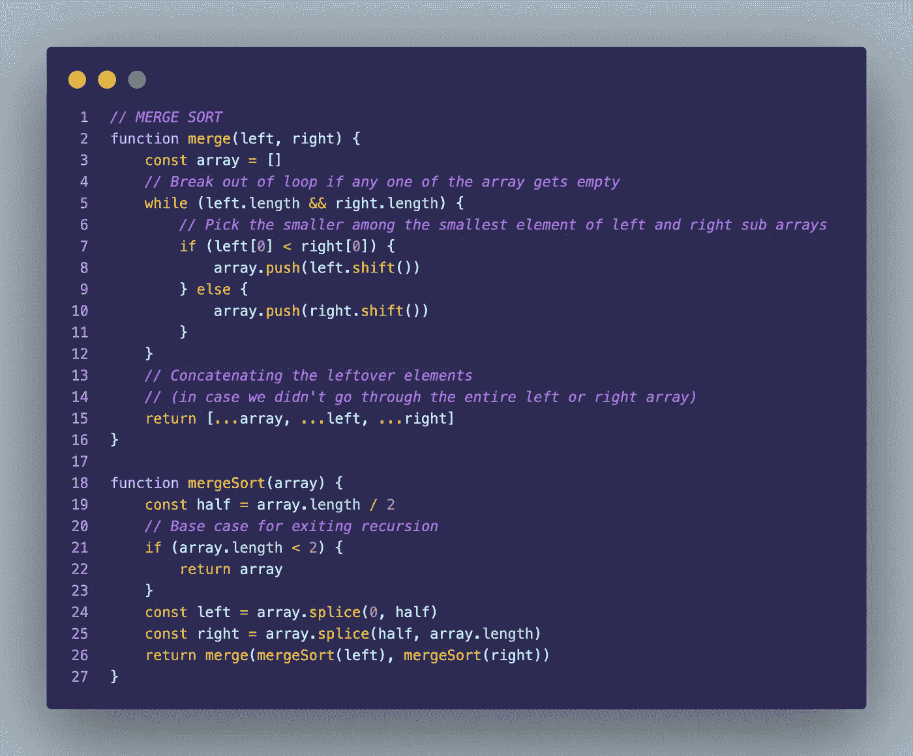
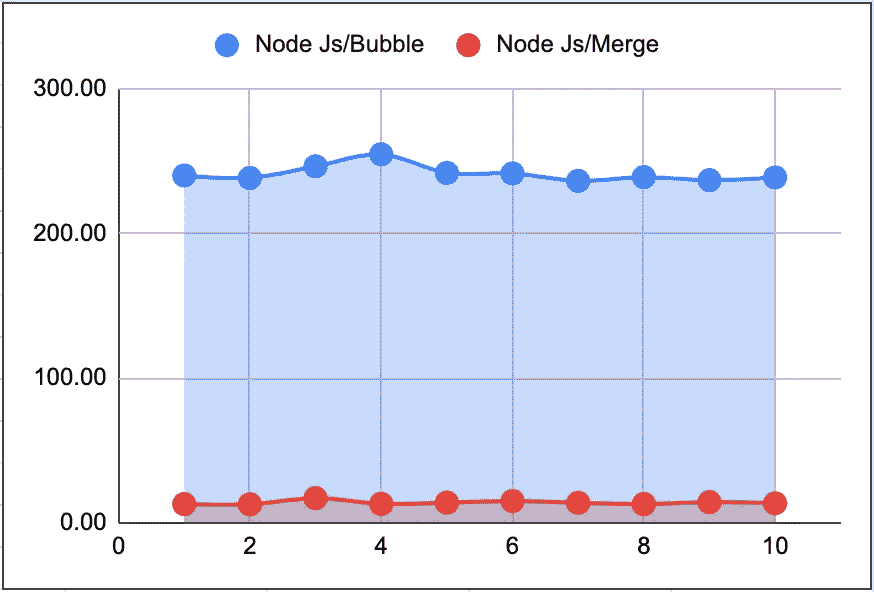
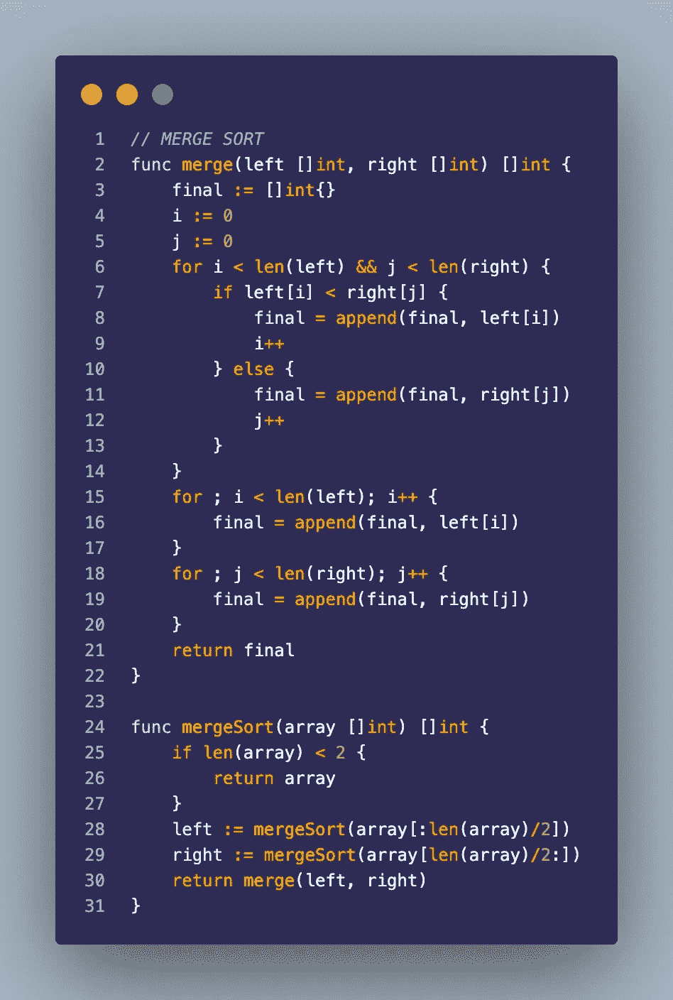
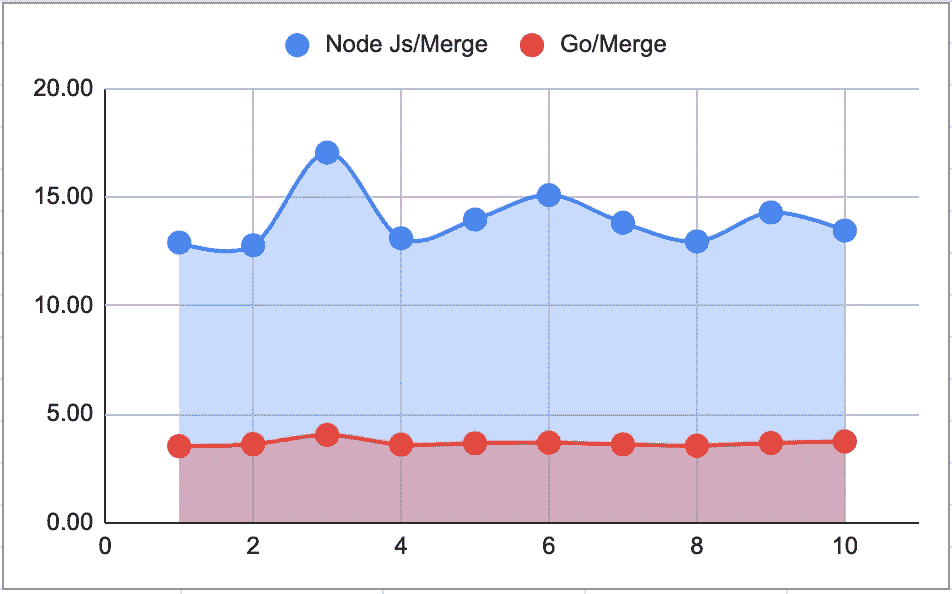
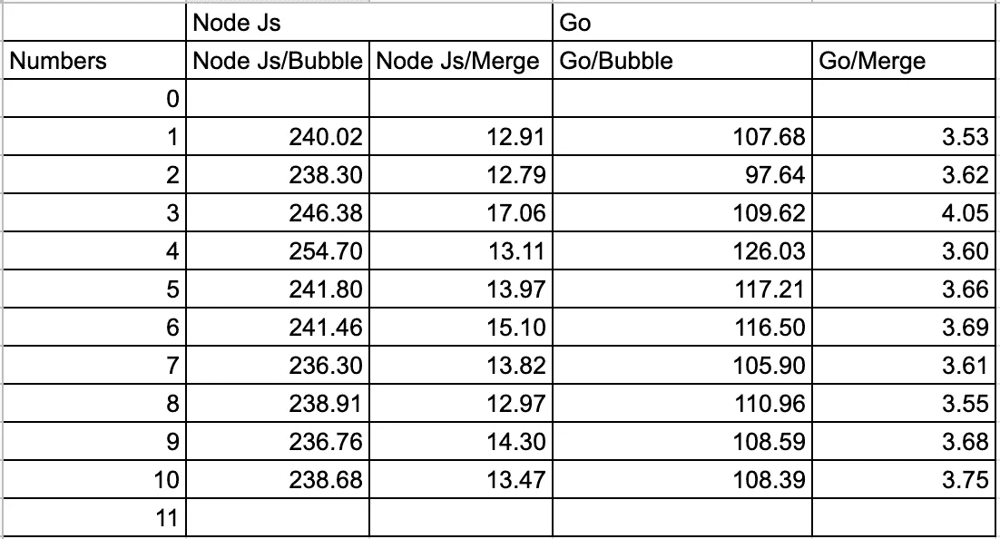

# Node.js vs Golang:哪个性能更好？

> 原文：<https://javascript.plainenglish.io/sorting-algorithms-comparison-node-js-vs-golang-1ea13a264a31?source=collection_archive---------0----------------------->

## 使用 Node.js 和 Go 比较排序算法(冒泡排序和合并排序),看看哪种算法的性能更好。

Visual Studio Code with the sorting project open, Node.js on the left, Go on the right.

最近我得到了很多关于 Golang 语言的令人印象深刻的消息，包括许多 Youtube 视频将它与 Node.js 进行比较。在每一个视频中，人们都会得出这样的结论:Go 是一种令人难以置信的语言。几乎与 Rust 和 C 一样快，但具有 Node.js 易于开发的特性，两全其美！

所以作为一名开发人员，我决定自己测试一下。然后，寻找一个快速的方法来测试它，我想，除了使用经典的排序算法，还有什么最好的方法来测试程序的速度呢？

我做的第一件事是创建一个 Node.js 脚本，该脚本将为我创建一个 JSON 文件，其中包含一个充满随机数的自定义长度的数组。这样我就可以很快地创建一个我想要的长度的示例数组。然后在每个程序中，我会用这个文件来得到我需要排序的数据，很简单吧？

Code of the Node.js script that creates the example array.

之后，我开始编写 Node.js 示例，经典的先冒泡排序:

Bubble Sort algorithm in JavaScript.

代码非常简单，它接收一个数组，循环遍历它，将每个位置与下一个位置进行比较，如果第二个位置小于第一个位置，它就交换值，重复这个过程，直到整个数组排序完毕，然后返回它。这是一个非常慢的过程，因为它必须在数组中循环几次。

然后合并排序:

Merge Sort algorithm in JavaScript.

这个有点难解释，它遵循分而治之的概念。它使用递归将接收到的数组分成两半，然后将这些更小的数组进行比较和排序，基本上是一次性排序整个数组。这是我所知道的最快的排序算法，与简单的冒泡排序相比，在性能和速度上的差异令人难以置信。

这里我们有一个比较图，对 10 个数组进行排序，每个数组包含 10000 个数字，X 轴代表尝试次数，Y 轴代表每个算法对整个数组进行排序所需的毫秒数。正如我们所见，合并算法比冒泡排序快得多，也稳定得多。

Node.js Bubble Sort vs Merge Sort comparison graph.

但接下来的问题是，我们可以用 Go 做出最快的算法吗？

Merge Sort algorithm in Go.

所以这是我第一次写 Go，所以可能有更好的方法来写这段代码，但我也尽量保持逻辑与 Node.js 中的逻辑相似。Go 中没有 while 循环有点奇怪，但最后，for 循环就足够了，正如你所看到的，逻辑与 Node.js 中的相同，代码本身也非常相似，很容易理解。

但是当我们看这个图时，我们可以看到 go 算法是多么的稳定，并且事实上它总是花费比 Node.js 数组少三分之一的时间来排序每个数组。

Node.js Merge Sort vs Go Merge Sort graph.

这里是对 10 个 10000 数字数组排序的所有结果。所有的时间都以毫秒为单位，你可以看到 Node.js 和 Go 之间的巨大差异。

Node.js vs Go comparison.

如果你想检查整个代码，用它来修改测试，你可以在 GitHub 上找到这个项目。

 [## GitHub-Armando 284/nodejs-vs-go-sorting-algorithms:排序算法速度测试 bubble…

### 一个速度测试的排序算法冒泡排序和合并排序在节点 js 和 Go 你需要 Node js 和 Golang…

github.com](https://github.com/Armando284/nodejs-vs-go-sorting-algorithms) 

你觉得怎么样？这是个好例子吗？有什么我应该改变的吗？为了这种级别的性能提高而修改代码值得吗？我很乐意看到你的评论。

*更多内容请看*[***plain English . io***](https://plainenglish.io/)*。报名参加我们的* [***免费周报***](http://newsletter.plainenglish.io/) *。关注我们关于*[***Twitter***](https://twitter.com/inPlainEngHQ)[***LinkedIn***](https://www.linkedin.com/company/inplainenglish/)*[***YouTube***](https://www.youtube.com/channel/UCtipWUghju290NWcn8jhyAw)*[***不和***](https://discord.gg/GtDtUAvyhW) *。对增长黑客感兴趣？检查* [***电路***](https://circuit.ooo/) *。***