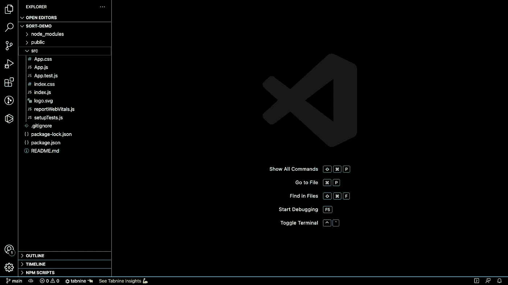

# 使用排序 React 组件。排序()

> 原文：<https://javascript.plainenglish.io/sorting-react-components-using-sort-c443878731ac?source=collection_archive---------3----------------------->

## 关于从对象数组呈现子组件并使用 React 创建排序按钮的过程的指南。


Photo by [Arnold Francisca](https://unsplash.com/@clark_fransa?utm_source=medium&utm_medium=referral) on [Unsplash](https://unsplash.com?utm_source=medium&utm_medium=referral)

最近，我在做一个 React 项目，该项目要求我构建一个组件，该组件(a)接受一个对象数组，(b)将每个对象呈现为一个子组件，以及(c)让用户能够使用排序按钮按字母顺序对呈现的组件进行排序。

我花了几分钟思考如何实现这一点。这项任务听起来很糟糕，但让我松了一口气的是，快速的谷歌搜索显示 JavaScript 有一个内置的方法能够完成这样的工作:数组**T1。排序()方法。**

在本文中，我将介绍从对象数组呈现子组件并使用 React 创建排序按钮的过程。

# 1.项目设置

为了做好准备，我在桌面上用 [create-react-app](https://reactjs.org/docs/create-a-new-react-app.html) 创建了一个新的 React 应用程序，名为 sort-demo。这将创建一个简单的前端构建管道，使我们能够演示这个例子。

```
cd ./Desktop
npx create-react-app sort-demo
cd sort-demo
```

一旦创建了新项目，我就导航到新文件夹，并在我的代码编辑器中打开它。我正在使用 VSCode。



接下来，我将在 src 目录中创建三个新文件: **List.js、ListItem.js、**和**data . js。List**将是父组件，在列表中，我们希望每个存在于 **data.js** (我们的示例数据集)中的对象都有一个 **ListItem** 。


*   包含一个样本对象的数组，每个样本对象包含一个 NBA 球员的数据。不要忘记包含**导出默认数据**，这样我们可以将它导入到其他文件中。


*   List.js 会将其中的每个对象呈现为子对象。现在，我们将呈现一个< ul >标签，其中有一个< li >作为占位符。此外，让我们导入 ListItem，因为我们知道我们将需要它，并且还包括 **props** 作为参数，因为这个组件将需要接收某种数据。最后，将其导出，以便可以导入到其他文件中。


*   **ListItem.js** 是将在列表中为每个对象呈现的内容。因为 List 是一个< ul >标签，所以让我们把 ListItem 变成一个< li >。


*   App.js 是我们基本的 React 应用程序的顶层组件。取出 App 中的占位符内容，导入我们的列表组件和数据，在 return()语句中呈现一个列表组件，并保存所有文件。最后，通过在您的终端中运行 **npm start** 来启动本地开发服务器，然后在您的浏览器中导航到 **localhost:3000** 。


在我的浏览器中，我可以看到来自列表组件的占位符“Hello world ”,并且我可以在控制台窗口中看到**数据**的内容(我在上面的第 8 行添加了一个 console.log 数据，以确认数据正在通过)。设置完成。


# 2.将对象数组呈现为子组件

既然我们已经完成了设置，我们可以开始构建逻辑了。我们已经将数据数组导入 App.js，所以让我们将它传递给 List 组件。在 List 内部，我们可以使用 props.sampleData 访问数组，并且我们将使用 props.sampleData.map()创建一个 ListItem 组件数组。


保存文件并返回浏览器。您应该会看到四次“Hello world”——sampleData 中的每个对象一次。


我们已经成功地将数据传递给了列表组件，但是“Hello world”不是很有用。我们可以增加我们的。map()函数为每个 ListItem 提供更多关于它所映射的每个对象的数据。


现在每个列表项都可以访问三个道具——**第一个**、**最后一个**和**号。**注意，我们也可以将整个**对象**作为一个道具来传递，而不是将其属性作为不同的道具来传递。

在 ListItem 中，我们可以修改 return 语句来显示每一条数据。在下面的例子中，我将

*   的内容放在反勾号(`)中，这允许我将[的每段数据插入到一个字符串中。](https://developer.mozilla.org/en-US/docs/Web/JavaScript/Reference/Template_literals)

保存文件并在浏览器中查看结果。


# 3.添加排序功能

我们需要添加的第一个东西是排序按钮。在列表内部，我添加了一个按钮。我们现在还需要跟踪我们的数据对象，因为对它们进行排序会改变它们的顺序。

*   使用 useState() React 钩子，我们可以告诉 React 通过使用它作为状态来跟踪它接收到的数据属性的变化。从“react”导入 useState 挂钩，并将其初始化为空数组。useState 返回两件事:一个包含我们状态的变量，和一个我们可以用来更新它的函数。(请记住，每次状态改变时，组件都会重新呈现)
*   我们还需要导入 useEffect()钩子，并告诉它在第一次加载页面时将 props.sampleData 设置为 sampleData 状态(通过将一个空数组作为第二个参数传递给 useEffect 来实现)。现在，当组件第一次加载时，它将获取 props.sampleData 中传递给它的值，并将其设置为**sampleData 状态。**


*   定义一个 handleSort()函数，并将其作为新按钮的 onClick 处理程序进行传递。当按钮被点击时，我们要**复制状态数组(sampleData)，运行。sort()，并将状态更新为排序后的数组。**
*   我还用 **sampleData** (我们的新状态)替换了 props.sampleData。生成子组件的映射函数。由于状态正在更新，组件将重新呈现，listComponents 将从*排序的*数组构建。


现在，让我们来介绍一下。sort()函数:

*   。sort()将回调函数作为参数。
*   回调函数接受两个参数，这两个参数代表数组中要比较的两个元素。
*   在函数体内，return 语句包含一个三元表达式:它比较数组中两个元素 A 和 b 的 first (first name)属性。
*   如果元素 A 具有比元素 B“更大”的名字(例如，A 在字母表中更靠后)，则返回 1；否则返回-1。
*   如果返回 1，则首先对元素 A 进行排序。如果返回-1，元素 B 首先被排序。

事实上，现在单击 Sort 按钮可以按名字从 A 到 Z 对记录进行排序。乔尔·恩比德现在列在第一位:

# 4.最后

。sort()是基本 JavaScript 库的一部分，所以它经常被忽略，但它是一个非常通用的方法，有许多可能的应用程序，远远超出了简单的字母排序。在你的下一个项目中试试吧！

感谢您的阅读。

*更多内容看* [***说白了。报名参加我们的***](http://plainenglish.io/) **[***免费周报***](http://newsletter.plainenglish.io/) *。在我们的* [***社区不和谐***](https://discord.gg/GtDtUAvyhW) *获得独家获取写作机会和建议。***