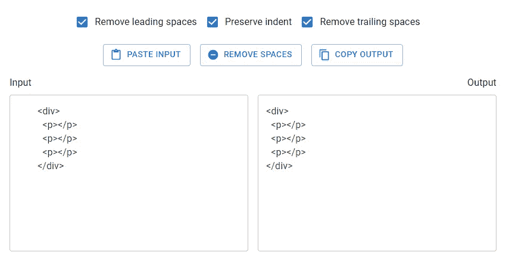

# 如何用 React 构建一个高级的空间去除工具

> 原文：<https://javascript.plainenglish.io/space-remover-app-react-77e64ccf6fb7?source=collection_archive---------2----------------------->


在本文中，我们将学习如何构建一个 web 应用程序，让我们能够轻松地删除任何文本中的前导和尾随空格，并能够选择性地保留文本的缩进。我们将使用 React 库来构建这个工具，让我们开始吧。

# 重要链接

*   [Github 回购](https://github.com/tariibaba/remove-spaces)
*   [网络应用](https://remove-spaces.web.app/)

# 设置项目

让我们首先使用 Create React app 创建一个新的 React App。我们将使用[纱线](https://yarnpkg.com/)。

```
yarn create-react-app remove-spaces
```

我们还将使用一些打字稿，你可以使用这里的指令[来设置它](https://create-react-app.dev/docs/adding-typescript/)。

# 编写 removeSpaces()函数

该应用程序的核心部分将是一个`removeSpaces()`函数，它将一个字符串作为输入，并返回一个删除了空格的新字符串。让我们在一个新的`remove-spaces.ts`文件中编写这个函数。

**src/remove-spaces.ts**

```
export default function removeSpaces(params: {
  text: string;
  leading: boolean;
  trailing: boolean;
  preserveIndent: boolean;
}) {
  let regex: RegExp;
  const { text, leading, trailing, preserveIndent } = params;
  let spaceCountPattern: string | undefined; let leadingMatch: string;
  if (leading) {
    if (preserveIndent) {
      const firstSpacePattern = new RegExp(String.raw`^(\s*).+?((\r\n)|\n|$)`);
      const firstSpaces = text.match(firstSpacePattern)?.[1];
      const spaceCount = firstSpaces?.length;
      spaceCountPattern = `{0,${spaceCount}}`;
    } else {
      spaceCountPattern = '*';
    }
    leadingMatch = String.raw`\s${spaceCountPattern}`;
  } else {
    leadingMatch = '';
  } const trailingMatch = trailing ? String.raw`\s*?` : '';
  regex = new RegExp(String.raw`((()((\r\n)|\n))|(.*?((\r\n)|\n|$)))`, 'g');
  const lines = text.match(regex);
  const lineRegex = new RegExp(
    String.raw`^${leadingMatch}(.*?)${trailingMatch}((\r\n)|\n|$)`,
    'g'
  ); const result = lines
    ?.map((line) => {
      if (line === '\r\n' || line === '\n') return line;
      return line.replace(lineRegex, '$1$2');
    })
    .join('');
  return result;
}
```

除了输入字符串，该函数还接受允许用户自定义如何删除空格的选项。

当`leading`为`true`且`preserveIndent`为`false`时，除了添加缩进的空格外，前导空格将从文本中移除。

当`leading`为`true`且`preserveIndent`为`false`时，所有前导空格将从文本中移除。

当`trailing`为`true`时，所有尾随空格将从文本中删除。

该函数从这些选项的组合中创建一个正则表达式。它使用 [String replace()](https://developer.mozilla.org/en-US/docs/Web/JavaScript/Reference/Global_Objects/String/replace) 方法用从正则表达式中捕获的组替换文本的每一行。

# 测试 removeSpaces()函数

我们可以测试这个函数，以确保它按预期工作。让我们安装 Jest 测试框架来完成这项工作。

```
yarn add --dev jest ts-jest @types/jest
```

用以下命令初始化`ts-jest`:

```
yarn ts-jest config:init
```

让我们在一个新的`remove-spaces.test.ts`文件中为该函数编写一些测试:

**src/remove-spaces . test . ts**

```
import removeSpaces from './remove-spaces';const s2 = '  ';
const s4 = '    ';const text = `${s4}<div>${s4}
${s4}${s2}<p></p>${s4}
${s4}</div>${s4}`;it('removes leading spaces without preserving indent', () => {
  const expectation = `<div>${s4}
<p></p>${s4}
</div>${s4}`;
  const result = removeSpaces({
    text,
    leading: true,
    trailing: false,
    preserveIndent: false,
  });
  expect(result).toBe(expectation);
});it('removes leading spaces and preserves indent', () => {
  const expectation = `<div>${s4}
${s2}<p></p>${s4}
</div>${s4}`;
  const result = removeSpaces({
    text,
    leading: true,
    trailing: false,
    preserveIndent: true,
  });
  expect(result).toBe(expectation);
});it('removes trailing spaces', () => {
  const expectation = `${s4}<div>
${s4}${s2}<p></p>
${s4}</div>`;
  const result = removeSpaces({
    text,
    leading: false,
    trailing: true,
    preserveIndent: false,
  });
  expect(result).toBe(expectation);
});it('removes leading and trailing spaces', () => {
  const expectation = `<div>
<p></p>
</div>`;
  const result = removeSpaces({
    text,
    leading: true,
    preserveIndent: false,
    trailing: true,
  });
  expect(result).toBe(expectation);
});
```

如果编写正确，该函数应该通过所有这些测试。

# 创建文本输入

是时候开始用 React 创建用户界面了。我们将从文本输入开始。我们将创建两个——一个接受用户输入，另一个是只读的并显示输出。

我们将使用 Material UI 框架来使应用程序看起来很棒，你可以使用这里的说明[来设置它。](https://mui.com/material-ui/getting-started/installation/)

**src/App.js**

```
import { Box, Typography, TextField } from '@mui/material';
import { useState } from 'react';function App() {
  const [input, setInput] = useState('');
  const [output, setOutput] = useState(''); const handleInputChange = (event) => {
    setInput(event.target.value);
  }; return (
    <Box
      sx={{
        height: '100%',
        display: 'flex',
        flexDirection: 'column',
        padding: 2,
        boxSizing: 'border-box',
      }}
    >
      <Box
        sx={{
          display: 'grid',
          gridTemplateColumns: 'repeat(auto-fit, minmax(400px, 1fr))',
          justifyContent: 'stretch',
          marginTop: 2,
          rowGap: '16px',
        }}
      >
        <Box sx={{ flex: 1, marginRight: 1, textAlign: 'left' }}>
          <Typography>Input</Typography>
          <TextField
            sx={{ width: '100%', marginTop: 1, minWidth: '300px' }}
            multiline
            value={input}
            minRows={10}
            inputProps={{
              style: { maxHeight: '300px', overflow: 'auto' },
            }}
            onChange={handleInputChange}
          ></TextField>
        </Box>
        <Box sx={{ flex: 1, marginLeft: 1, textAlign: 'right' }}>
          <Typography>Output</Typography>
          <TextField
            sx={{
              width: '100%',
              marginTop: 1,
              minWidth: '300px',
            }}
            multiline
            value={output}
            readOnly
            minRows={10}
            inputProps={{
              style: { maxHeight: '300px', overflow: 'auto' },
            }}
          ></TextField>
        </Box>
      </Box>
    </Box>
  );
}export default App;
```


# 从剪贴板粘贴输入

让我们创建一个按钮，当它被点击时，将文本从系统剪贴板粘贴到输入文本域。

**src/App.js**

```
// ...
import { Box, Typography, TextField, Stack, Button } from '@mui/material';
import { ContentPaste } from '@mui/icons-material';function App() {
  // ... const pasteInput = async () => {
    setInput(await navigator.clipboard.readText());
  }; const handlePasteInput = async () => {
    await pasteInput();
  }; return (
    <Box
      sx={{
        height: '100%',
        display: 'flex',
        flexDirection: 'column',
        padding: 2,
        boxSizing: 'border-box',
      }}
    >
      <Stack
        direction="row"
        spacing={2}
        justifyContent="center"
        sx={{ flexWrap: 'wrap', marginTop: 2 }}
      >
        <Box>
          <Button
            onClick={handlePasteInput}
            variant="outlined"
            startIcon={<ContentPaste />}
          >
            Paste input
          </Button>
        </Box>
      </Stack>
      {/* ... */}
    </Box>
  );
}export default App;
```


# 添加选项

让我们创建选项，让用户决定如何从文本中删除空格。将有三个布尔选项，每个都用一个复选框表示:

1.  删除前导空格
2.  删除尾随空格
3.  保留缩进

当用户决定删除空格时，我们将选项直接传递给`removeSpaces()`函数。

```
import {
  Box,
  Typography,
  TextField,
  Stack,
  Button,
  FormControlLabel,
  Checkbox,
} from '@mui/material';
import { useState } from 'react';
import { ContentPaste } from '@mui/icons-material';function App() {
  // ... const [leading, setLeading] = useState(true);
  const [trailing, setTrailing] = useState(true);
  const [preserveIndent, setPreserveIndent] = useState(true); const handleLeadingChange = (event) => {
    setLeading(event.target.checked);
  }; const handleTrailingChange = (event) => {
    setTrailing(event.target.checked);
  }; const handlePreserveIndentChange = (event) => {
    setPreserveIndent(event.target.checked);
  }; return (
    <Box
      sx={{
        height: '100%',
        display: 'flex',
        flexDirection: 'column',
        padding: 2,
        boxSizing: 'border-box',
      }}
    >
      <Box sx={{ display: 'flex', justifyContent: 'center' }}>
        <FormControlLabel
          control={
            <Checkbox checked={leading} onChange={handleLeadingChange} />
          }
          label="Remove leading spaces"
        />
        <FormControlLabel
          control={
            <Checkbox
              checked={preserveIndent}
              onChange={handlePreserveIndentChange}
            />
          }
          label="Preserve indent"
        />
        <FormControlLabel
          control={
            <Checkbox checked={trailing} onChange={handleTrailingChange} />
          }
          label="Remove trailing spaces"
        />
      </Box>
     {/* ... */}
    </Box>
  );
}export default App;
```


# 删除空格

现在，让我们添加一个按钮，当单击它时，空格将从输入文本中删除。

```
// ...
import removeSpaces from './remove-spaces';function App() {
  const handleRemoveSpaces = () => {
    setOutput(removeSpaces({ text: input, leading, trailing, preserveIndent }));
  }; return (
    <Box
      sx={{
        height: '100%',
        display: 'flex',
        flexDirection: 'column',
        padding: 2,
        boxSizing: 'border-box',
      }}
    >
      <Box sx={{ display: 'flex', justifyContent: 'center' }}>
        {/* ... */}

        <Box>
          <Button
            onClick={handlePasteInput}
            variant="outlined"
            startIcon={<ContentPaste />}
          >
            Paste input
          </Button>
        </Box> {/* Button to remove spaces */}
        <Box>
          <Button
            onClick={handleRemoveSpaces}
            variant="outlined"
            startIcon={<RemoveCircle />}
          >
            Remove spaces
          </Button>
        </Box>
      </Stack>
      {/* ... */}
      </Box>
    </Box>
  );
}export default App;
```


# 将输出复制到剪贴板

让我们创建另一个按钮，当单击该按钮时，它会将输出文本字段中的文本复制到系统剪贴板。

```
// ...
import { ContentCopy, ContentPaste, RemoveCircle } from '@mui/icons-material';
import removeSpaces from './remove-spaces';function App() {
  // ... const handleCopyOutput = () => {
    navigator.clipboard.writeText(output);
  }; return (
    <Box
      sx={{
        height: '100%',
        display: 'flex',
        flexDirection: 'column',
        padding: 2,
        boxSizing: 'border-box',
      }}
    >
      {/* ... */}
      <Stack
        direction="row"
        spacing={2}
        justifyContent="center"
        sx={{ flexWrap: 'wrap', marginTop: 2 }}
      >
        {/* ... */}
        <Box>
          <Button
            onClick={handleRemoveSpaces}
            variant="outlined"
            startIcon={<RemoveCircle />}
          >
            Remove spaces
          </Button>
        </Box> {/* Button to copy output */}        
        <Box>
          <Button
            startIcon={<ContentCopy />}
            onClick={handleCopyOutput}
            variant="outlined"
          >
            Copy output
          </Button>
        </Box>
      </Stack>

    </Box>
  );
}export default App;
```



# 组合粘贴、移除和复制操作

用户很可能会通过按顺序执行以下操作来使用该工具:

1.  点击`Paste Input`按钮，将剪贴板中的文本放入输入文本字段
2.  点击`Remove Spaces`按钮，删除输入文本中的空格，并将结果输入输出文本字段
3.  点击`Copy Output`将文本从输出文本字段复制到剪贴板。

为了使事情变得简单，我们将创建一个按钮，让用户同时执行这三个操作:

```
// ...function App() {
  // ... const handlePasteRemoveCopy = async () => {
    const input = await navigator.clipboard.readText();
    const output = removeSpaces({
      text: input,
      leading,
      trailing,
      preserveIndent,
    });
    navigator.clipboard.writeText(output);
    setInput(input);
    setOutput(output);
  }; return (
    <Box
      sx={{
        height: '100%',
        display: 'flex',
        flexDirection: 'column',
        padding: 2,
        boxSizing: 'border-box',
      }}
    >
      <Box sx={{ display: 'flex', justifyContent: 'center' }}>
        {/* ... */}
        <FormControlLabel
          control={
            <Checkbox checked={trailing} onChange={handleTrailingChange} />
          }
          label="Remove trailing spaces"
        />
      </Box> {/* Button to perform past, remove, and copy actions at once */}
      <Box sx={{ display: 'flex', justifyContent: 'center', marginTop: 2 }}>
        <Button onClick={handlePasteRemoveCopy} variant="contained">
          Paste + Remove + Copy
        </Button>
      </Box> <Stack
        direction="row"
        spacing={2}
        justifyContent="center"
        sx={{ flexWrap: 'wrap', marginTop: 2 }}
      >
        <Box>
          <Button
            onClick={handlePasteInput}
            variant="outlined"
            startIcon={<ContentPaste />}
          >
            Paste input
          </Button>
        </Box>
        {/* ... */}
      </Stack>
    </Box>
  );
}export default App;
```


我们的空间清除应用程序是完整的！我们已经能够构建一个方便的实用程序来删除任何文本中的前导和尾随空格，并在必要时保留缩进。

# 这个工具可以用来做什么？

在 Coding Beauty，我们发现这个工具在创建显示 HTML 或 JSX 标记中缩进了一定量的代码片段时非常有用。例如，在我们的[材质 UI 按钮教程](https://codingbeautydev.com/blog/material-ui-button/)中，有时示例文件包含如下标记:


The complete source code for an example in the tutorial.

但是我们只想显示与示例相关的文件部分:


Explaining contained buttons in the Material UI button tutorial.

这个工具通过删除空格来帮助正确格式化相关部分。


# String trim()呢？

我们不能使用`trim()`或`trimStart()`字符串方法，因为这样就不可能保留整个文本的缩进。这些方法只能移除给定字符串中的所有前导空格。

*最初发表于:*[*【codingbeautydev.com】*](https://cbdev.link/54f1cf)

# JavaScript 做的每一件疯狂的事情

一本关于 JavaScript 微妙的警告和鲜为人知的部分的迷人指南。


[**报名**](https://cbdev.link/d3c4eb) 立即免费领取一份。