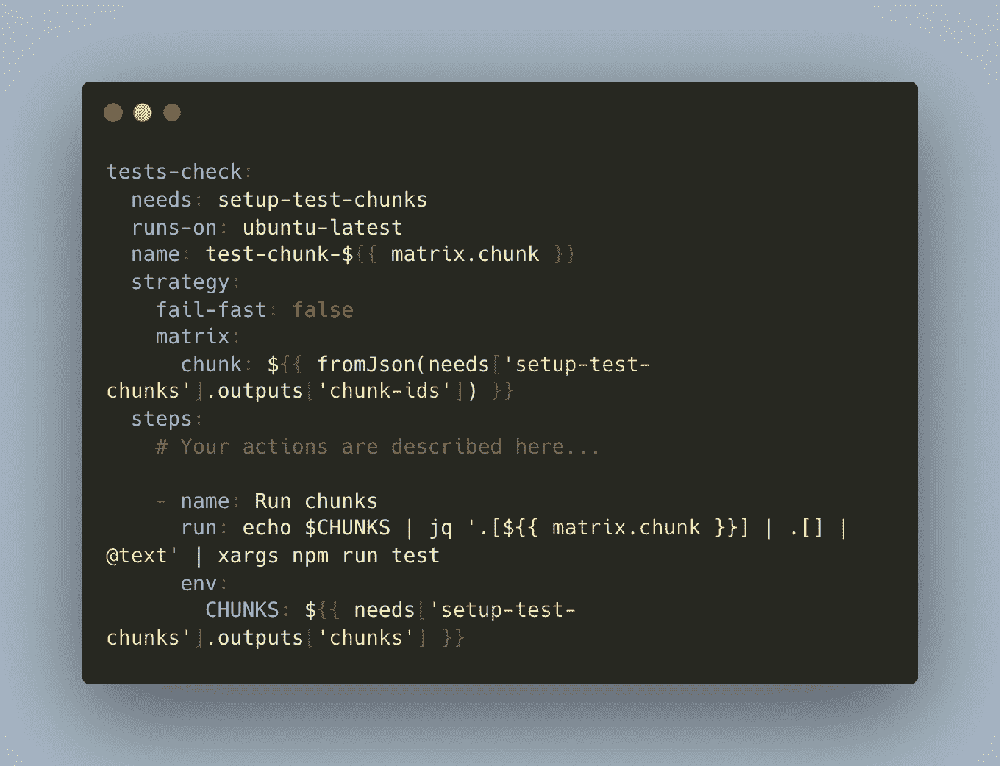

# 用 GitHub 动作加速愉快的 Jest 测试执行

> 原文：<https://javascript.plainenglish.io/speed-up-delightful-jest-tests-execution-with-github-actions-2572f823d113?source=collection_archive---------3----------------------->

Image from [unsplash.com](https://unsplash.com/)

> 人们喜欢编写测试，编写大量的测试，为编写越来越多的测试创建像 TDD/BDD 这样的方法，甚至在实现之前。目标是有尽可能多的测试，以保护你的代码不被破坏并提高质量。

但是每天都有“如何在流水线中更快地执行它们”的问题变得越来越尖锐。当你在执行所有测试之前等待 10 分钟来合并你的拉请求并开始下一个任务或去你甜蜜的家时，这真是令人讨厌。这里的问题不仅仅是团队成员的福祉。它增加了与修复/解决应用程序问题相关的 MTTR 和其他指标。您的 SLA/SLO 可能会因为慢节奏的管道而被违反。

无论如何，管道应该和法拉利一样快。让我们看看如何在 GitHub Actions 工作流中更快地执行 Jest 测试。

## 1.我们就不能增加设施吗？

默认情况下，GitHub Action runner 有一个 2 核 CPU，很可能，想到的第一个选项是使用[自托管 runners](https://docs.github.com/en/actions/hosting-your-own-runners/about-self-hosted-runners) 。但这增加了一些复杂性，我们应该由**负责更新和维护操作系统更新，配置和支付云**等等。当然，这不是最简单的方法，但这是一种选择。

为了清楚起见，让我们更深入地研究 Jest CLI 以及它如何有助于实现我们的目标。

## 2.是否应该立即执行所有测试？

策略是只运行在提交之后添加的测试。逻辑很简单:**如果之前所有的测试都运行执行成功，全新的测试也成功，看起来应该没什么问题**。

根据 Jest CLI 的[官方文档，有可能通过](https://jestjs.io/docs/cli)[–changed-since](https://jestjs.io/docs/cli#--changedsince)<commit _ hash>，然后 Jest 运行与提供的分支或提交 hash 之后的更改相关的测试。如果当前分支已经从给定分支偏离，那么只测试本地做出的改变。

您的“package.json”应该是这样的:

在您的工作流中，运行命令:

但是这种方法也有自己的缺点。例如，**您所做的更改可能会破坏一些外部隐藏的逻辑，那么与之相关的测试将根本不会运行，并且它们可能会失败**。

几年来，这种情况只发生过几次。但是，如果你不接受这一点，偏执狂让你逃避现实，下一个方法是给你的。

## 3.有可能拆分所有测试并并行运行组块吗？

为什么不呢？也许，如果我们把测试分成几个部分，然后**并行运行**，可能会更快。

让我们看看这可能是怎么做的。

首先，我们需要了解如何做到这一点，Jest CLI 再次登场。**参数**[**list tests**](https://jestjs.io/docs/cli#--listtests)**将打印我们拥有的所有测试，并且**[**json**](https://jestjs.io/docs/cli#--json)**标志将以 JSON 格式打印它们**。

现在我们有了一个带有 JSON 格式的具体测试文件路径的字符串数组。它需要被平均分成 N 个块。当然，我们可以通过迭代一个数组并将它分成更小的数组来编写脚本，但是我建议给[JQ·util](https://stedolan.github.io/jq/manual/)一个机会。

> JQ 是一种“过滤器”或“格式化程序”:它接受输入，产生输出。有许多内置的过滤器，用于提取对象的特定字段，或者将数字转换为字符串，或者其他各种标准任务。

那么，让我们来看看这个命令:

长话短说，我们接受了 JSON 格式的所有测试，然后把它交给了 JQ。基本上，过滤器获取数组的长度，将其分为 10(块的数量)并对其进行舍入。然后一个神奇的函数“_nwise”把结果拆分成数组。

这是第一部分，所以我们有一个数组的数组。

因此，让我们创建一个作业 **setup-tesh-chunks** ，我们将在其中使用上面的命令。该作业将返回块和块 id(嵌套数组的索引)。

还有一个作业**测试——检查**是否通过策略矩阵运行它们**,这将克隆作业的次数与传递给它的数组长度一样多(在我们的例子中是 10 次)。**快速失败**值为 false，简单地说就是当其中一个任务失败时不取消其他任务。更多关于战略矩阵的信息请点击。**

动作**遍历块 id 为**的数组，并运行特定的块。最终，您的管道应该是这样的:

## **总而言之。**

GitHub Actions 仍然年轻且充满活力，但它已经拥有了大量有用的功能。在我们的项目中，我们最终使用了最后一种方法，**它有助于将测试速度提高到大约 3-5 倍**。

请在评论中分享你的观点和方法。

感谢阅读！

*更多内容请看*[***plain English . io***](https://plainenglish.io/)*。报名参加我们的* [***免费周报***](http://newsletter.plainenglish.io/) *。关注我们关于*[***Twitter***](https://twitter.com/inPlainEngHQ)*和*[***LinkedIn***](https://www.linkedin.com/company/inplainenglish/)*。查看我们的* [***社区不和谐***](https://discord.gg/GtDtUAvyhW) *加入我们的* [***人才集体***](https://inplainenglish.pallet.com/talent/welcome) *。*