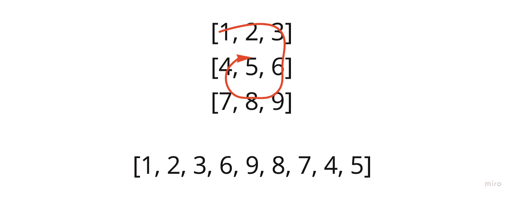

# JavaScript 中的螺旋矩阵遍历

> 原文：<https://javascript.plainenglish.io/spiral-matrix-traversal-83ba758b4900?source=collection_archive---------8----------------------->

## 创建一个函数，该函数接受一个矩阵并在以螺旋顺序遍历时返回其值。

今天的重点是 Leetcode 的中级[螺旋矩阵](https://leetcode.com/problems/spiral-matrix/)问题，因为我特别喜欢矩阵，所以我已经很兴奋了。

该问题要求我们创建一个函数，该函数接受一个矩阵，并在以螺旋顺序遍历时返回其值。

基本上，

## *想清楚…*

马上，当在概念上通过这个想法时，我已经在考虑嵌套迭代(移动穿过第一行，然后沿着右边向下迭代，等等。).

这里的问题是我们的输入大小是未知的，任何基本的迭代方法都可能很快变得复杂。

## *问题的本质*

递归方法会是什么样子？或者，换句话说，有没有一个容易重复的过程，可以给我想要的结果？

如果我试图缩小我要实现的目标的本质，我可以说我需要一层一层地移除矩阵，同时记录每个圆周上的值(上、右、下、左、上、右、下……等等)。).

## *我的解决方案*

为此，我将创建一个递归内部函数，它接受一个数组作为参数。

直到矩阵的长度为 1(我必须达到矩阵的“中心”值)，我将使用一系列步骤从矩阵中删除一个圆周“层”。

1.  (顶部边缘)迭代第一行，将值记录在外部数组中。然后*从矩阵中移除*该行。
2.  (右边缘)从每个后续行中删除最后一个值(沿途记录)*，最后一行的*除外。
3.  (底部边缘)在最后一行时，反向遍历它，记录值，然后将其从矩阵中删除。
4.  (左边缘)然后我将向上移动，记录并删除第一个值。

在这个过程完成后，我将从矩阵的外围移除一层。然后我会用剩下的再次调用递归函数。最终，如果我写得正确，我将在最后一个值(中心)结束，我的结果数组将是完整的。

## *代码*

仅此而已。

内部递归函数将围绕矩阵的边缘移动，记录然后以螺旋运动的方式移除值，直到我们到达最终(中心)值。

*更多内容请看*[***plain English . io***](https://plainenglish.io/)*。报名参加我们的* [***免费周报***](http://newsletter.plainenglish.io/) *。关注我们关于*[***Twitter***](https://twitter.com/inPlainEngHQ)*和*[***LinkedIn***](https://www.linkedin.com/company/inplainenglish/)*。加入我们的* [***社区不和谐***](https://discord.gg/GtDtUAvyhW) *。*