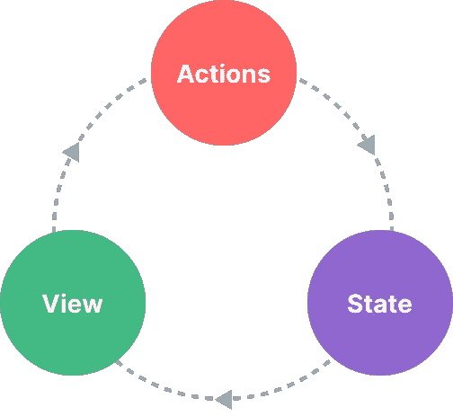

# 使用 Pinia 在 Vue.js 中进行状态管理🍍

> 原文：<https://javascript.plainenglish.io/state-management-in-vue-js-with-pinia-f140fe31bbb2?source=collection_archive---------3----------------------->

## Pinia 状态管理简介


Photo by [Kei](https://unsplash.com/@verkei?utm_source=medium&utm_medium=referral) on [Unsplash](https://unsplash.com?utm_source=medium&utm_medium=referral)

## **为什么要进行状态管理**

状态管理包括在我们的应用程序中实现一个设计模式。它确保我们的状态数据被组织到一个中央单元，我们可以重用，并同步变异，而不影响其他活动的数据状态。

考虑一个场景，其中有一个应用程序在各种组件/部分上操纵一些数据并将其呈现给前端。如果我们让每个组件自己管理和操作数据，我们可能会因为不必要的请求而导致不必要的数据冲突。这就是状态管理的用武之地，它允许我们在一个中心位置构造状态数据，并从那里操纵它。这使得我们的应用程序更容易在一个受信任的源中操作状态数据。

这也意味着，每次我们的状态数据改变时，呈现的状态数据也会改变，反之亦然。基本上，什么状态管理它将所有相关的状态数据、动作和突变组织到一个中央可信来源中。这使得管理这样的状态数据变得更加容易。

状态数据基本上是任何应用程序的数据(可以共享或不共享),可以是用户信息、产品目录等。这些数据可以在应用程序的各个部分使用和呈现。

**国家管理的好处**

*   应用程序中的单一真实来源。
*   减少/最小化来自应用程序的请求(与每个组件独立执行自己的请求相比)。
*   通过一个真实的来源更轻松高效地访问数据。

## **国家管理通论**



State Management Pattern diagram from Vuejs.

## **何时实施状态管理**

根据您的应用程序所消耗的大小和数据，当您的应用程序大小相当大时，广泛建议实现。当只是原型化的东西时，它不一定有用，当你的应用程序很小的时候。

## **什么是状态、获取器、动作**

*   **状态** —这通常是指跨应用程序组件共享的数据。这些共享数据存放在国家内部。
*   **Getters** — Getters 是我们可以调用来获取状态数据的函数。顾名思义，它们获取状态数据，并在被调用时返回给我们。Getters 可以以他们自己的方式操作数据，但不会直接改变/干扰状态数据，即搜索 etc。
*   **动作** —动作是我们可以用来以各种方式改变状态数据的突变。动作功能可能包括状态数据操作，如更新、删除等

## **开店**

Pinia 是一个状态管理库，推荐用于 Vuejs 应用程序中的状态管理。它取代 VueX 成为 Vuejs 中的标准状态管理库。

我们打算用 Pinia 实现商店，看看效果如何。我们将实现一个应用程序，它从 api 获取笑话，并将返回的响应存储到存储状态。从那里，我们可以获得数据，并使用 getters 呈现它们，使用 actions 从状态数据中删除笑话，看看 Pinia 是如何做到这一切的。

**安装 Pinia**

我们可以使用`yarn`或`npm`安装 Pinia，这取决于您首选的软件包管理器。

```
//using yarn yarn add pinia//using npmnpm install pinia
```

**设置店铺**

我们的应用程序商店将会是这样。

```
import { defineStore } from "pinia";//define and export "useJokesStore"
export const useJokesStore = defineStore("jokes", {
  state: () => {
    return {//our state date "jokes" here jokes: [], };
  },
  getters: {//our getters goes here },
  actions: {//here we will have our actions});
```

在上面的示例代码中，我们定义并导出了`useJokesStore`商店。然后我们有了`jokes`状态，在那里我们将存储笑话。

在我们的组件实例中，我们可以调用`useJokesStore`并访问其中的所有属性，包括`getters`和`actions`并存储状态数据。

**用动作更新状态数据**

在这个实例中，我们将从 API 中获取一些编程笑话，并将它们存储在`jokes`存储状态中。为此，我们将使用`actions`功能。

```
actions: {
    async fetchJokes() {
      try {
        const res = await fetch(`[https://joke.deno.dev/type/programming`](https://joke.deno.dev/type/programming`)); const data = await res.json(); //assign returned jokes response to the jokes state data this.jokes = data; } catch (error) {//incase of an error we just log it to the consoleconsole.log(error); }
    },
  },
```

我们的动作是`fetchJokes`，负责获取数据和更新存储。记住，我们需要调用动作`fetchJokes`来获取和更新数据(我们将看看如何在组件内部调用动作)。

**调用商店操作**

为了调用存储操作，我们像下面所示那样调用函数或方法。

```
<script setup lang="ts">
import { useJokesStore } from "./stores/programmingjokes";const jokes = useJokesStore();
</script><template>
  <h1>Programming Jokes API</h1>
  <div class="btn">
//on pressing the button, we invoke the fetchJokes action <button [@click](http://twitter.com/click)="jokes.fetchJokes">fetchJokes</button>
  </div>
</template>
```

**使用获取器访问状态数据**

假设我们只想从 api 获取一个笑话，我们可以设置一个 getter 从`jokes`状态数组中获取一个笑话。我们可以根据`jokes`状态数据使用索引或 id。

```
 getters: { //get a single joke from state using joke index getJokeWithId: (state) => (jokeIndex: number) => {
      return state.jokes[jokeIndex];
    }, },
```

这里我们可以传递一个索引，并从提供的索引中返回一个笑话。

**调用存储 getter**

像 action 一样，我们可以访问 getters，如下所示。

```
<script setup lang="ts">
import { onMounted, ref } from "vue";
import { useJokesStore } from "./stores/programmingjokes";
const jokes = useJokesStore();const jokesId = ref<number>(0);
const joke = ref();function getJoke() {//access the getter and assign the retuned value to joke
  joke.value = jokes.getJokeWithId(jokesId.value);}onMounted(async () => {//fetch jokes when component is mounted
  await jokes.fetchJokes();
});
</script><template>
  <h1>Programming Jokes API</h1>//user input index
  <input v-model="jokesId" /> <div class="btn">
    <button [@click](http://twitter.com/click)="getJoke">getJokeWithIndex</button>
  </div><p v-if="joke">//Render the joke when its index is available
{{ joke.setup }} <span>{{ joke.punchline }}</span>
  </p>
</template>
```

我们从上面的例子中调用 getter 函数，如下所示。

```
jokes.getJokeWithId(jokesId.value)
```

**重置状态**

大多数情况下，我们需要将状态重置为默认值。在这种情况下，我们需要调用我们想要重置的商店上的`$reset`。

在我们的例子中，我们可以通过调用。

```
<script setup lang="ts">
import { useJokesStore } from "./stores/programmingjokes";const jokes = useJokesStore();//reset the jokes statejokes.$reset()</script>
```

**最后的想法**

当开发在各种组件上共享状态数据的大中型应用程序时，状态管理是非常重要的。值得称赞的是，你花时间阅读了这么多。

偶尔，我会发一封独家邮件，里面有我发现的有用的和与技术写作相关的技巧、文章、应用程序、书籍和想法👇。

[***加入像你一样想提高写作技巧的人。***](https://artisanal-thinker-2556.ck.page/6e2ba71172)

**更读**

[](/how-to-add-sitemap-in-nuxt-using-nuxt-content-7ca4619ccc29) [## 如何使用 Nuxt 内容在 Nuxt 中添加 Sitemap

### 通过添加网站地图来改善网站的搜索引擎优化🎉

javascript.plainenglish.io](/how-to-add-sitemap-in-nuxt-using-nuxt-content-7ca4619ccc29) [](/how-to-configure-commitlint-and-generate-useful-changelogs-from-git-commit-messages-baa50764da4b) [## 如何配置 Commitlint 并从 Git 提交消息中生成有用的 CHANGELOGs

### 从 git 提交消息中配置和生成有用的变更日志

javascript.plainenglish.io](/how-to-configure-commitlint-and-generate-useful-changelogs-from-git-commit-messages-baa50764da4b) 

*更多内容看* [***说白了。报名参加我们的***](https://plainenglish.io/) **[***免费周报***](http://newsletter.plainenglish.io/) *。关注我们关于* [***推特***](https://twitter.com/inPlainEngHQ) ，[***LinkedIn***](https://www.linkedin.com/company/inplainenglish/)*，*[***YouTube***](https://www.youtube.com/channel/UCtipWUghju290NWcn8jhyAw)*，以及* [***不和***](https://discord.gg/GtDtUAvyhW) *。对增长黑客感兴趣？检查* [***电路***](https://circuit.ooo/) *。***