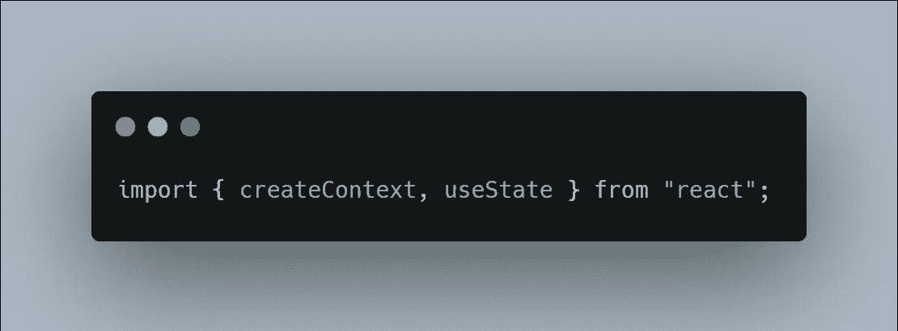
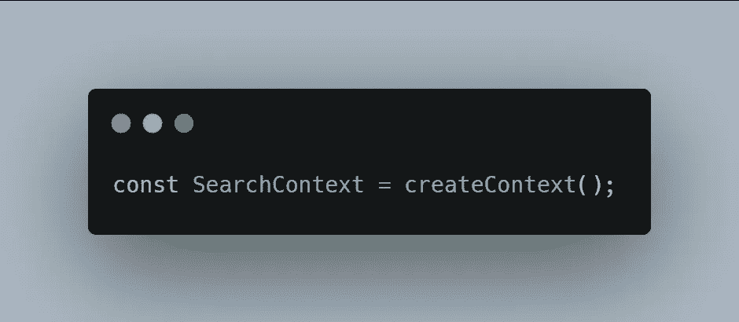
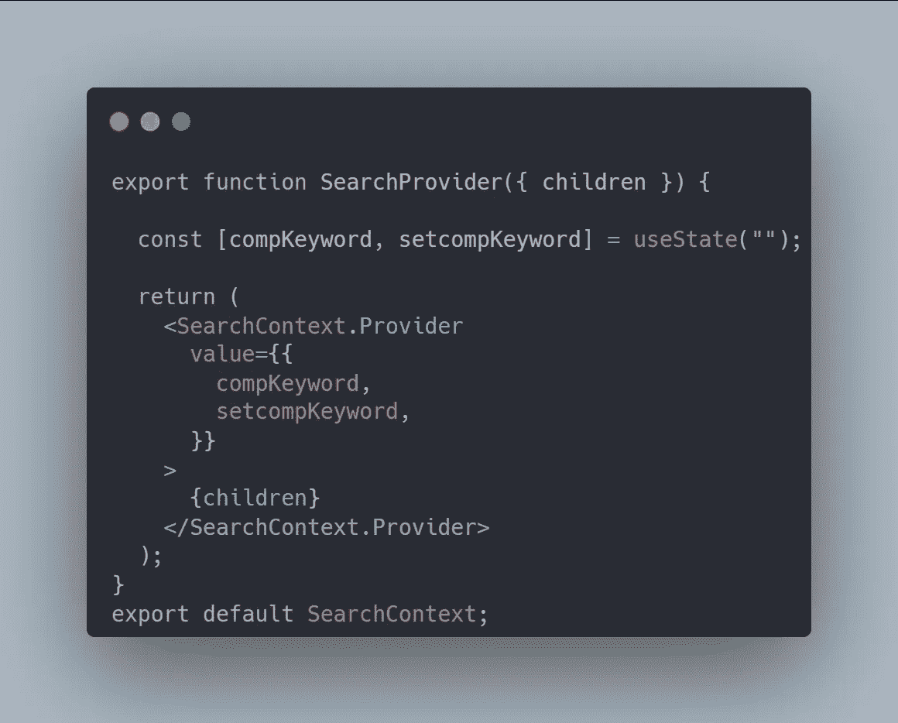
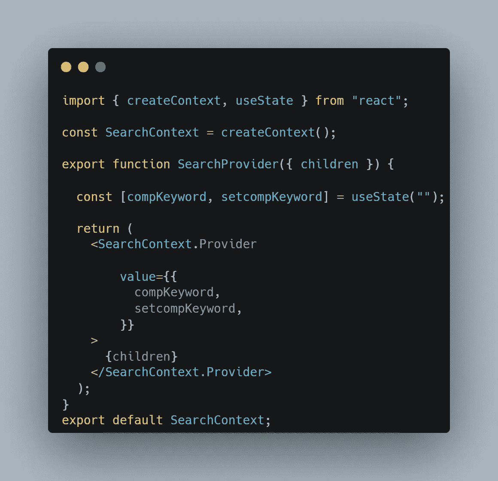
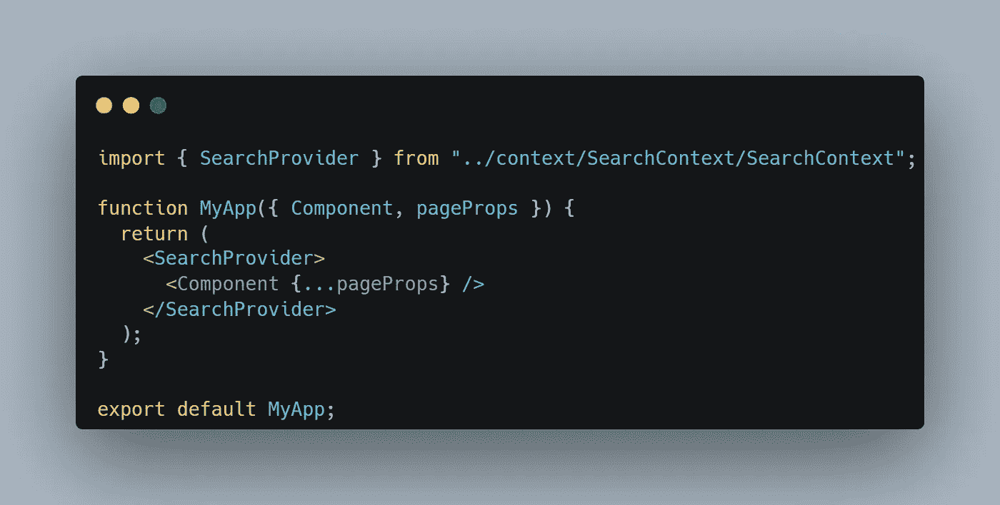
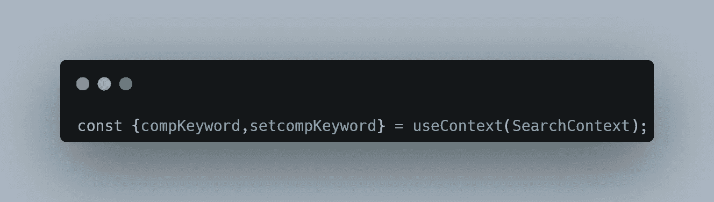
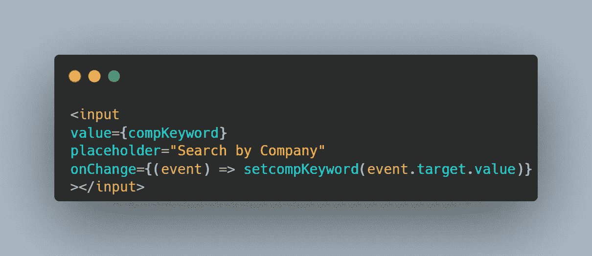

# 使用 Next.js 中的上下文进行状态管理

> 原文：<https://javascript.plainenglish.io/state-management-using-context-in-nextjs-6929b8eeb5f8?source=collection_archive---------2----------------------->

无论您是否使用过 React 并使用 Context API 进行过状态管理，或者您从未尝试过，本文都将帮助您掌握相同的内容。所以让我们从基础开始。

## 什么是状态管理，我们为什么需要它？

您已经知道 React 和 Next.js(一个基于 React 的框架)中有状态。

现在，假设你正在开发下一个应用程序，你需要几个不同的状态，并且需要更新这些状态。

如果你只有一个页面，那么你可以使用 `**useState**` **钩子**简单地**更新本地状态。**

一旦你试图管理多个组件的状态，事情会变得有点棘手。

在你的应用程序中，你将会到达这样一个点，像“提升状态”和向下传递回调以从组件更新你的状态这样的模式会导致很多很多的道具。

如果你想在应用程序的任何地方更新一个组件的状态，你会怎么做？你把它变成**全局状态**。

这就是*状态管理*发挥作用的地方。ContextAPI 在这方面创造了奇迹。

## 开始使用上下文

在您的**根目录**或您的组件或页面所在的目录中，创建一个名为 *Context* 的**新文件夹**。

在其中，我们将创建我们的上下文(*，它就像一个存储所有全局状态的地方*)。在我们的例子中，我们将制作一个**公司关键字搜索仪表板**。因此，让我们将上下文称为 *SearchContext* ，并在上下文文件夹中创建一个名为 **SearchContext.js** 的新文件

## 导入 createContext 和 useState

## 创造环境

## 创建上下文提供者

这就像是为所有组件提供全局状态的函数。

为您的全局状态创建一个 *useState 钩子*，这里我们保留它 comp keyword(company keyword 的缩写)。

然后返回 SearchContext。以值作为状态的提供者及其各自的函数。

## SearchContext.js 的最终外观

## 用提供者 in _app.js 包装

现在，在你开始使用之前，你需要告诉你的 Next.js 应用程序，你已经添加了一个上下文，并且用提供者包装你的组件。

*另外，确保按照我显示的那样导入提供程序。*

you _app.js 应该是这样的:

## 使用全局状态

无论您希望使用哪个组件，只需提取您需要的全局状态，如下所示:

然后像使用本地状态一样使用它们。这里，我们在输入组件中使用它。

瞧啊。您已经在 Next.js 中学习了如何使用上下文进行状态管理。

*更多内容请看*[***plain English . io***](https://plainenglish.io/)*。报名参加我们的* [***免费周报***](http://newsletter.plainenglish.io/) *。关注我们关于*[***Twitter***](https://twitter.com/inPlainEngHQ)[***LinkedIn***](https://www.linkedin.com/company/inplainenglish/)*[***YouTube***](https://www.youtube.com/channel/UCtipWUghju290NWcn8jhyAw)*[***不和***](https://discord.gg/GtDtUAvyhW) *。***