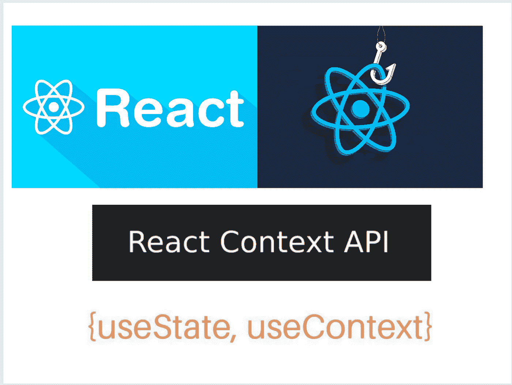
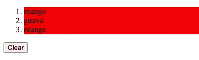
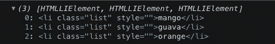

# React 中使用上下文 API 和自定义多选挂钩的状态管理

> 原文：<https://javascript.plainenglish.io/state-management-with-context-api-and-custom-multiselect-hook-in-reactjs-ed3109cce175?source=collection_archive---------9----------------------->

## 如何创建自定义钩子，在 React 中使用上下文 API，以及在应用程序中的任何地方使用状态管理。

State Management with Context API and custom hooks

## 概观

*   创建自定义多选挂钩
*   创建一个上下文，并在其中使用多选挂钩
*   使用 React 挂钩和上下文 API 创建一个演示来测试状态管理

## 先决条件

*   关于 React [钩子](https://reactjs.org/docs/hooks-intro.html)和[上下文 API](https://reactjs.org/docs/context.html) 的基础知识

## 第 1 部分:创建一个定制的多选挂钩

*   自定义挂钩的名称是`useSelection`
*   我们首先为我们的选择声明一个`useState`。在这个钩子里面我们有三个函数:`addSelection`、`addMultipleSelection`和`clearSelection`。
*   `addSelection`接受 2 个参数，item 设置，clear 清空选择。
*   `addMultipleSelection`在数组内部设置多重选择(我们将在下面看到如何使用它)。
*   `clearSelection`将状态清除为空数组。

`useSelection.tsx: Custom hook for selection`

## 第 2 部分:创建`multiSelectionContext`和`MultiSelectionProvider`

*   使用 React 提供的`createContext`创建`multiSelectionContext`。
*   创建包含`multiSelectionContext.Provider`的`MultiSelectionProvider`，并从我们上面创建的`useSelection`钩子传递值。这样，我们可以在应用程序的任何部分使用`useSelection`作为上下文，而无需使用 prop drilling。

`MultiSelectionProvider.tsx: Creating context and the provider`

## 第 3 节:创建 ListComponent 以使用 multiSelectionContext

*   在这个组件中，我们正在创建一个列表，并使用上下文 onClick 将该列表项添加到我们的状态中，并使用`setSelection`和`addMultipleSelection`函数突出显示它。
*   我们还使用`clearSelection`来清除用户点击清除按钮时的状态。

ListComponent.tsx: use of context for updating the selection state value

## 第 4 部分:用 MultiSelectionProvider 包装 ListComponent

*   最后，我们需要用我们的`MultiSelectionProvider`包装`ListComponent`，这样里面的组件就可以使用我们创建的定制钩子的值。

App.tsx: Wrap the component with `MultiSelectionProvider`

## 最终组件将如下所示:

*   在选择所有 3 个列表项时，我们看到所有的背景样式都更新了。

*   同样，如果我们记录`selection`，它包含所有 3 个列表项。

selection state value

希望您理解我们如何创建自己的定制钩子，并在 React 中使用上下文 API 来防止钻柱，并在应用程序中的任何地方使用状态管理。

您也可以在这里查看最终代码:

***感谢阅读！*** *希望你喜欢这篇帖子，关注*[*LinkedIn*](https://www.linkedin.com/in/yg18/)*和*[*Medium*](https://medium.com/@yashguptaa)*了解更多内容。如果您有任何反馈或建议，请在下面的评论中留下，我会尽最大努力回复您。*

一定要看看我的其他博客:

 [## DevOps 中的阶段和应用程序不同阶段中使用的工具

### DevOps 是一个方法和工具的组合，使企业能够开发、测试和分发软件…

yashguptaa.medium.com](https://yashguptaa.medium.com/stages-in-devops-and-tools-used-in-different-stages-of-an-application-da7a476ea02)  [## 在 Kubernetes 中登录的重要性，Grafana Loki 简介和使用舵图部署

### 通过使用应用程序日志，您可以更多地了解应用程序内部的情况。日志非常有用…

blog.devops.dev](https://blog.devops.dev/importance-of-logging-in-kubernetes-and-intro-to-grafana-loki-f8dc6f736e6)  [## Kubernetes 监测和探索普罗米修斯简介

### 应用程序性能监控是 Kubernetes 的许多运营操作和复杂性的特点…

blog.devops.dev](https://blog.devops.dev/introduction-to-kubernetes-monitoring-and-exploring-prometheus-9bd0358ce504) 

*更多内容请看* [***说白了就是***](https://plainenglish.io/) *。报名参加我们的* [***免费每周简讯***](http://newsletter.plainenglish.io/) *。关注我们*[***Twitter***](https://twitter.com/inPlainEngHQ)**和*[***LinkedIn***](https://www.linkedin.com/company/inplainenglish/)*。查看我们的* [***社区不和谐***](https://discord.gg/GtDtUAvyhW) *加入我们的* [***人才集体***](https://inplainenglish.pallet.com/talent/welcome) *。**