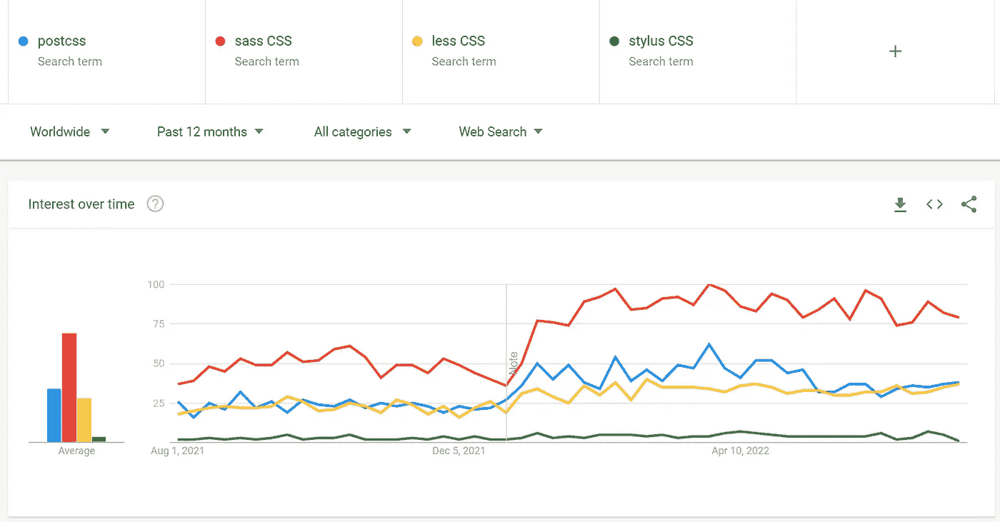

# CSS 2022 的现状:我们目前所知的

> 原文：<https://javascript.plainenglish.io/state-of-css-2022-177466030904?source=collection_archive---------9----------------------->

## *2022 年 CSS 的现状。*

Photo by [Ryunosuke Kikuno](https://unsplash.com/@ryunosuke_kikuno?utm_source=medium&utm_medium=referral) on [Unsplash](https://unsplash.com?utm_source=medium&utm_medium=referral)

本文将对 CSS 语言的当前发展做一个简短的概述。然后，我将概述作为即将到来的 CSS 快照(2022)的一部分的所有模块的当前状态。目前，2021 snapshot 唯一值得注意的变化是 Color Level 5 模块和 color-mix()函数，该函数作为一个例外被提升为所有浏览器供应商都可以实现的功能，尽管该规范不是候选推荐标准。

除此之外，我将快速浏览 Interop 2022 的当前状态，并展示框架和预处理器的快速趋势总结。

## 稳定模块

从文档的角度来看，这些模块被认为是稳定的。浏览器供应商应该根据规范实现它们。任何不符合标准的实现都被认为是一个缺陷。

## 例外

有些模块已经可以安全实现了，尽管它们的规范还没有达到候选推荐(CR)阶段。

这些例外是:

CSS 动画级别 1 和 CSS 过渡级别 1 中的所有内容，以及:dir、:lang 和:focus-within 伪类(选择器级别 4)、逻辑大小属性(CSS 逻辑属性和值级别 1)、最小内容和最大内容(CSS 框大小级别 3)、conic-gradient()函数(CSS 图像级别 4)、纵横比(框大小级别 4)、平移、旋转和缩放函数(变换级别 2)、连字符(文本级别 4)和颜色混合()函数(颜色级别 5)。

## 相当稳定的模块

以下模块已完成设计工作，但尚未获得大量测试和实施经验。

## 没有 1 级/2 级规格的模块

正如您可能已经注意到的，以下模块没有 2 级规范，尽管它们是相对常见的:文本模块、文本装饰模块、分段模块、框对齐模块和显示模块。这些模块已经在 CSS 2 修订版 1 规范中指定。CSS WG 决定将每个文档拆分成自己的规范和自己的级别。因此，获得更新的遗留模块将从第 2 级或第 3 级开始。这取决于规范的最后一级(例如，在规范被拆分之前，它是否在 CSS1 或 CSS2 中被指定)。

## 具有粗略互操作性的模块

尽管这些模块已经被广泛部署，并且具有粗略的互操作性，但是它们的细节还没有解决。

## 互操作 2022

2019 年，Mozilla、Google 和其他主要浏览器厂商开始了调查和研究，以了解 web 开发的现代要求和 web 开发人员的痛点。这极大地改进了网格和 Flexboxes 等特性，这些特性现在得到了跨浏览器的广泛支持。现在，Interop 2022 是三个主要浏览器
供应商同意的基准。

下图显示了到 2022 年应实施的所有功能及其当前状态。图片创作于 2022 年 7 月 26 日。

Numbers according to [https://wpt.fyi/interop-2022](https://wpt.fyi/interop-2022)

## CSS 框架/库

尽管 CSS 正在加快步伐实现创建现代网站所需的功能，但有些东西仍然过于复杂或需要太多时间来开发。CSS 有一个强大的框架和库生态系统来帮助创建令人惊叹的体验。这篇文档旨在概述该语言中一些最流行的新增内容。

毫不奇怪，Bootstrap 仍然是最“流行”的框架之一。尽管它最初的卖点现在已经是 CSS 规范的一部分(例如，网格系统)。然而，受欢迎程度很难衡量。Bootstrap 在 Google Trends 或下载数量中仍然排名靠前，这一事实也与许多遗留项目有关。像 Tailwind 和 Ant Design 这样的框架正在慢慢兴起。

Google Trends analysis. Real numbers differ because CSS has been added as
parameter to ambiguous terms.

Weekly downloads on NPM for some popular CSS frameworks.

Popularity for some CSS frameworks (according to NPM)

## CSS 预处理程序

预处理器帮助解决不同的问题。例如，它们可以允许开发人员使用尚未得到官方跨浏览器支持的特性，通过模块化类名来解决范围问题，以及通过缩小、前缀等等来改善 CSS 的结果。

Google Trends analysis. Real numbers differ because CSS has been added as
parameter to ambiguous terms.

Weekly downloads on NPM for some popular CSS preprocessors.

Popularity for some CSS preprocessors (according to NPM)

就这些了，伙计们！

列表中是否遗漏了另一个积极维护的框架或预处理器？你是否错过了这篇文章中关于 CSS 的另一个大话题？请让我知道并分享你的想法！

非常感谢您的阅读！

*更多内容请看*[***plain English . io***](https://plainenglish.io/)*。报名参加我们的* [***免费周报***](http://newsletter.plainenglish.io/) *。关注我们关于*[***Twitter***](https://twitter.com/inPlainEngHQ)*和*[***LinkedIn***](https://www.linkedin.com/company/inplainenglish/)*。查看我们的* [***社区不和谐***](https://discord.gg/GtDtUAvyhW) *加入我们的* [***人才集体***](https://inplainenglish.pallet.com/talent/welcome) *。*