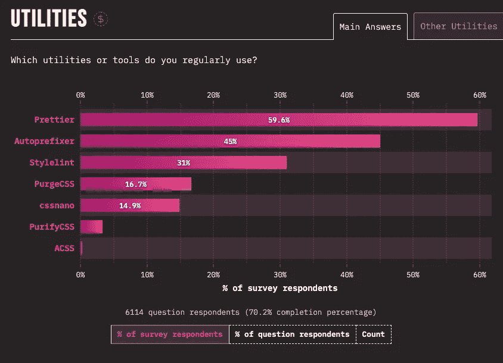

# Web 开发状况大分析:2022 年软件开发人员的最佳技术

> 原文：<https://javascript.plainenglish.io/state-of-js-2021-analysis-best-technologies-to-use-and-most-money-to-earn-as-software-dev-d211b7f5fa9c?source=collection_archive---------14----------------------->

## 网络技术在不断变化——最新的调查显示了有趣的结果

JavaScript，尤其是网络，一直在变化。来自 GitHub 的最新调查和数据分析已经清楚地表明了这一点([JS 的状态](https://2021.stateofjs.com/en-US/)&[JS 的最佳](https://bestofjs.org/)， [Stack-Overflow 开发者调查](https://insights.stackoverflow.com/survey/2021#top-paying-technologies-programming-scripting-and-markup-languages) & [后起之秀](https://risingstars.js.org/2021/en#section-all))。

看看 JavaScript 的开发或者 web 开发本身就很吸引人。一般来说，web 堆栈被认为移动非常快。

框架，尤其是库，每周都会出现，但也经常很快消失。一方面，这使得快速开发成为可能，这在任何其他领域都是鲜为人知的。

另一方面，它也会导致巨大的问题。假设您改变了您的技术堆栈，并依赖于几个月后消失或不再维护的技术。在这种情况下，你的项目可能会有很大的问题。

JS 的*状态的核心是发现参与者是否对 JavaScript 的正确发展方向有看法。*

第一个挑战是关于开发人员对所用语言的了解程度。

# 你统计过你的语言吗？

JavaScript 语言意味着新的特性、改变的语法等等。

有趣的是，来自 JS State 的数据显示，新特性很快就融入了开发人员的日常生活。然而，这些问题涉及 JavaScript、浏览器内 API 的新特性，以及其他特性，如渐进式 Web 应用程序(PWA)和 Web 组装。

Figure 1 — [Language Awareness Grouped By Area](https://2021.stateofjs.com/en-US/features)

按照意识将它们分组，最高的将是可选链接、WebSockets、PWAs，然后是 Nullish 合并。在使用方面，可选链接(91.4%)和无效合并(77.9%)遥遥领先。

另一方面，顶级 await 是相当平衡的。大约 50 %的人听说过，用过，或者没听说过。

# JavaScript 变得越来越简单，节奏越来越慢

没什么好说的，除了所有与会者都认为 JavaScript 在未来会很好。

Figure 3 — [Opinionated Questions](https://2021.stateofjs.com/en-US/opinions): JavaScript Direction

## JavaScript 降低了变化的速度

相比之下，图 4 显示了 JavaScript 生态系统开发速度的调查数据。

Figure 4 — [Opinionated Questions](https://2021.stateofjs.com/en-US/opinions): Ecosystem Speed

这些年来，普遍的看法已经发生了巨大的变化。越来越少的开发者同意 JavaScript 生态系统在进步和变化方面太快的说法。

## JavaScript 变得更容易了👍

对于创建 JavaScript 应用程序是否太复杂，也出现了类似的分歧。同样，越来越少的开发者同意。

Figure 5 — [Opinionated Questions](https://2021.stateofjs.com/en-US/opinions): Difficulty of The Language

这是一个令人兴奋的结果，因为在软件开发中，web 环境被认为是快速变化和复杂的。

Web 栈经常变化，并且在涉及的框架、库和工具的数量方面没有变小。把这个和几年前的世界比较一下。

# 但是它仍然有痛点

图 6 显示了那些很烂的问题的答案。

Figure 6— [Opinionated Questions](https://2021.stateofjs.com/en-US/opinions): Pain Points

> 列表的头几个主题是依赖项及其管理、通用代码架构和状态管理。

几乎在每个项目中都起作用的三点…

# 打字稿？最好了解一下。

TypeScript 以 69%的得票率成功进入网络世界😉

Figure 9 — [Used JavaScript Flavours](https://2021.stateofjs.com/en-US/other-tools)

在填写 JavaScript 风格问题的 69%的参与者中，98.6%使用 TypeScript。

与堆栈溢出调查中的回答相比:超过 30 %的人使用 TypeScript，将近 65 %的人使用 JavaScript。

> JavaScript 连续第九年成为使用最多的编程语言。
> 
> 有意思，因为根据 TIOBE 索引，JavaScript 在 *№7* 保持不变大约一年了。

**Stack Overflow 因此瞄准了软件开发的一个子集，明确地聚焦于 Web 开发。** *选择 JavaScript 新星时，出现了类似的画面。*

在那里，许多库和框架都是用 TypeScript 实现的。在一个项目中使用 TypeScript 作为一等公民的意愿似乎大大增加了。

然而，项目的位置与 TypeScript 作为一种技术没有任何关系。

# 前端框架

## 值得关注的新星——固体和发光🔥

Figure 10 — [Front-end Frameworks](https://2021.stateofjs.com/en-US/libraries/front-end-frameworks) Ranked by Satisfaction

他们最近出现在街区。

恰恰也是满意度问题的症结所在。新鲜和新总是好的，像 Solid 这样刚刚起步的框架有非常自然和高水平的满意度。

一开始 Angular、React 和 Vue 的情况也是如此。

一个框架出现在舞台上，很好的解决了具体的任务。这让这个项目得到了很多关注，每个人都跳上了炒作的列车。然后他们使用这个框架并与之合作。

> 只有过了几年，人们才清楚新框架擅长什么，不擅长什么，因此满意度自然会下降。

然而，类似 Angular 和 Vue 的低迷是可以预期的。

## Angular、React 和 vue . js——三巨头

Angular、React 或 Vue 的痛苦选择。

Figure 11 — [Front-end Frameworks](https://2021.stateofjs.com/en-US/libraries/front-end-frameworks) Ranked by Usage

三巨头在使用量上还是算三巨头。但是当必须回答满意的问题时，竞争变得越来越激烈:

Figure 12 — [Front-end Frameworks](https://2021.stateofjs.com/en-US/libraries/front-end-frameworks) Ranked by Satisfaction

坚固和苗条是你使用的第一框架。但是要注意，React 比 solid 更高，然后下降。有角是脚踏实地，但我不明白为什么。也许是因为我正在使用 V10，这个世界仍然很好🤔

> JS 状态调查在询问满意度、兴趣、使用情况以及对前端和后端框架的了解时做了很好的区分。这很好地表明了 web 框架在各个类别中的表现。

长此以往，你可以看到几乎都下降了几个百分点。这可能会在各自的社区中导致关于框架 A 或 B 是否正在衰落的胡乱猜测。即使你必须为一个新项目使用一个框架 E。

这种情绪是可以理解的，但目前还没有解决。它尤其以调查中收集和评估的数据为基础。

> 你用过 Ember 吗？我在 2017 年听说过它，但一直没有机会使用它。

## 使用范围

前端框架的使用可以在图 13 中看到。React 几年来一直是第一名，没有受到挑战。

Figure 13 — [Front-end Frameworks](https://2021.stateofjs.com/en-US/libraries/front-end-frameworks) Ranked by Usage

堆栈溢出的调查也支持这一数据。如果仅仅是因为更广泛的数据库，这些数字是可以理解的，但是分布是非常相似的。

Figure 14 — [Front-end Frameworks](https://insights.stackoverflow.com/survey/2021#top-paying-technologies-programming-scripting-and-markup-languages) Ranked by Usage

React 也是栈溢出的第一名，仅超过 40%。jQuery 如何让它紧跟其后，这是一个秘密。Express 和 Angular 对我来说更有意义，说实话。

> 但是嘿，有些人骑死马…

很明显，这两项调查针对的是重叠但不完全相同的目标群体。

该调查还揭示了关于后端框架、测试库、移动和桌面开发以及构建工具的其他一些令人兴奋的细节。

这是太多的信息包括在一篇文章中。因此，我们希望您参考网站评估(链接在文章末尾)。

# 测试库

## 令人惊讶的新人——谷歌 ZX

Vite 和 Vitest (94%的满意度)的强劲上升在某种程度上可以用新的 Vue 版本 3 来解释。包括 Vitest，目前正在不可阻挡地向前推进。

该工具首次加入当前调查。从使用率来看，目前已经达到 30%。这是构建工具的持续趋势，Vite 在满意度和兴趣方面也排名很高。

JavaScript Rising Stars 的数据也可以证实这个结果。在那里，Vite 在 Next.js 和 React 之前处于第二位。

Figure 17 — [Most Popular Projects Overall](https://risingstars.js.org/2021/en#section-framework) by risingstars.js

然而，令人惊讶的是，这个排名中的第一名被工具 zx 占据。这使得 Bash 可以被 JavaScript 脚本所取代。

显然，很多开发人员都喜欢这样。

Figure 18 — [Google ZX Stars Per Month](https://risingstars.js.org/2021/en#section-framework)

> GitHub 上的知识库从 2021 年 5 月才开始运行，这段时间已经收集了大约 24k starts，并且享有很高的受欢迎度和使用率。

这种趋势能否持续下去仍令人兴奋。与维特相比，ZX 的新星们在接下来的几个月里下降得非常厉害:

Figure 19 — [Vite Stars Per Month](https://risingstars.js.org/2021/en#section-framework)

## 通常的嫌疑人

Figure 15 — [Testing Frameworks](https://2021.stateofjs.com/en-US/libraries/testing) by Satisfaction

在测试中，**测试库**在满意度方面仍然很高，但在使用方面，它仍然是**的笑话**。但是，嘿，3%的满意度差距是什么？用你喜欢的。

Figure 16 — [Testing Frameworks](https://2021.stateofjs.com/en-US/libraries/testing) by Usage

# 其他库和资源

几乎在每个项目中使用外部库都是一个重要的话题。

一方面，它们带来了外部依赖性，因此会产生问题；另一方面，库提供了节省大量精力的可能性，因为不是所有的东西都必须从头开始开发。调查数据显示，Axios、Lodash、Moment.js 使用较多。

Figure 20 — [Other Tools & Libraries](https://2021.stateofjs.com/en-US/other-tools)

与 Stack Overflow 的调查相比，jQuery 只占 11%。图 5 显示了来自 JS 状态的响应。堆栈溢出的对比如图 6 所示。

Figure 21 — [Other Frameworks & Libraries](https://insights.stackoverflow.com/survey/2021#top-paying-technologies-programming-scripting-and-markup-languages)

这些回答再次表明，Stack Overflow 的调查目标是更广泛的受众。的。NET Framework 和 TensorFlow 也是这里引用的两个例子。

# 对就业市场的影响🤑

在他们的调查中，Stack Overflow 借此机会询问了参与者目前的薪水。因此，分析哪些技术可能带来最高的薪水。

以编程语言为例，Clojure、F#和 Elixir 都在前三位。

Figure 22 — [Most Money Earned](https://insights.stackoverflow.com/survey/2021#technology-most-popular-technologies) Per Language

对于数据库，它是 DynamoDB、Elasticsearch 和 Cassandra。

Figure 23 — [Most Money Earned](https://insights.stackoverflow.com/survey/2021#technology-most-popular-technologies) Per Database

对于平台来说，就是 AWS。

Figure 24— [Most Money Earned](https://insights.stackoverflow.com/survey/2021#technology-most-popular-technologies) Per Platform

对于 web 框架，它是 Ruby on Rails 的一个不小的优势。

所以红宝石仍然有需求。

Figure 25 — [Most Money Earned](https://insights.stackoverflow.com/survey/2021#technology-most-popular-technologies) Per Web Framework

这些数据有多大意义仍是另一个问题。

超过 46，000 名参与者填写了关于薪水的问题。关于技术的问题平均有 42，000 多个回答。因此，它是数据的子集。

# CSS 框架——山中之王

不同 CSS 框架的使用也是一个令人兴奋的游戏。

我写了关于 [PureCSS 和它的极简主义](https://medium.com/geekculture/how-purecss-beats-bootstrap-library-and-tailwindcss-with-minimalism-ba23d5467ebf)的精彩属性，而 Bootstrap 和 Tailwind 则充斥着垃圾。但是正如你所看到的，人们喜欢加载的框架。我也不例外，我喜欢棱角分明。

Bootstrap 等经典产品多年来一直保持在历史最高水平。较新的框架，如 Tailwind CSS，已经有了一个非常陡峭的爬升。

Figure 26 — [Most Used CSS Frameworks](https://2021.stateofcss.com/en-US/technologies/css-frameworks)

> 然而，根据调查参与者的使用数据，Bootstrap 是无可争议的第一名。

例如，其他工具类别询问有价值的工具、浏览器和选择外部库的标准。

Figure 27 — [Most Used Utilities](https://2021.stateofcss.com/en-US/other-tools)

像漂亮器和自动修复器这样的工具就在顶部。任何在生产中使用它们的人都不会感到惊讶。

同样令人兴奋的是关于评估和最终选择标准库的发现。

Figure 27 — [Library Evaluation Rankings](https://2021.stateofcss.com/en-US/other-tools/)

文档和开发以及用户体验就在前面。我不想放弃这三个都是非常容易理解的标准。

如果一个完美的库不会失败，那么在没有文档的情况下很难有效地使用它。

# 结束语

谈到调查，它总是令人兴奋的。

数据显示了过去几年的一些转折点和众所周知的模式。我很激动:比如说**Vue**和它的大规模大修与 3 版会有什么变化？下面的调查会带来什么？

第 3 版增加了学习曲线，这部分反映在调查结果中。

此外，一旦新鲜和新的阶段结束，框架必须努力留在游戏中，不被抛弃，例如，**固体**和**点燃**🔥。

为你自己节省大量的时间，专注于重要的主题。

## 资源

*   [JS 状态](https://stateofjs.com/)
*   [堆栈溢出开发者调查](https://insights.stackoverflow.com/survey/2021)
*   [JavaScript 新星](https://risingstars.js.org/2021/en)
*   [最佳 JS](https://bestofjs.org/)
*   [TIOBE 指数](https://www.tiobe.com/tiobe-index/)
*   [谷歌 zx](https://github.com/google/zx)
*   [CSS 的状态](https://2021.stateofcss.com/en-US/)

*更多内容请看*[***plain English . io***](https://plainenglish.io/)*。报名参加我们的* [***免费周报***](http://newsletter.plainenglish.io/) *。关注我们*[***Twitter***](https://twitter.com/inPlainEngHQ)**和*[***LinkedIn***](https://www.linkedin.com/company/inplainenglish/)*。查看我们的* [***社区不和谐***](https://discord.gg/GtDtUAvyhW) *加入我们的* [***人才集体***](https://inplainenglish.pallet.com/talent/welcome) *。**