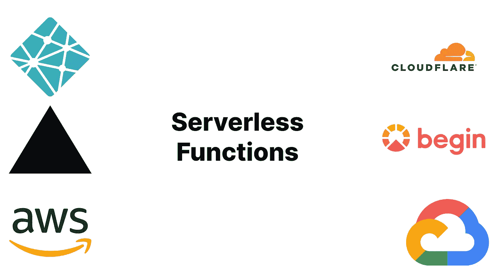

# 网络现状:无服务器功能实用指南

> 原文：<https://javascript.plainenglish.io/state-of-the-web-a-practical-guide-to-serverless-functions-e732453fc1f3?source=collection_archive---------3----------------------->

Logos of serverless function providers

## 什么是无服务器函数，为什么它们很重要，它们目前是如何用于服务器端 JavaScript 的？

无服务器功能(也称为功能即服务)在云上无状态地执行代码。这意味着它们可以无限扩展，在任何地方运行。有许多不同的无服务器功能提供者，如 [AWS Lambda](https://aws.amazon.com/lambda/) 、 [Cloudflare Workers](https://workers.cloudflare.com/) 和 [Vercel](https://vercel.com/) 。

# 无服务器功能的背景

谷歌在其[谷歌应用引擎](https://cloud.google.com/appengine/)产品中创建了第一个无服务器模型，该模型提供了自动缩放的无状态代码执行。App Engine 不同于大多数最近的无服务器功能提供商，但它是第一个尝试这种想法的产品。然而，虽然 Snapchat 等公司使用它，但它并没有在整个开发者社区中流行起来。

作为服务(FaaS)提供商，第一个真正流行的功能是 AWS Lambda。AWS Lambda 是亚马逊在 2014 年 11 月发布的一项无服务器功能服务。Lambda 允许用许多不同语言编写的函数在不到一秒的时间内自动伸缩，同时允许用户不必担心底层硬件。像谷歌、微软和甲骨文这样的公司也为无服务器功能创建了他们自己的服务。尽管直到今天，Lambda 仍然是最流行的无服务器函数提供者，而且自从它发布以来，它变得更快、更灵活、更易于使用。

然而，这并不是故事的结尾。从那以后，许多服务在 AWS Lambda 的模型上有了改进，比如易用性和性能。第一个著名的 FaaS 提供商是 [Vercel](https://vercel.com/) (当时是 ZEIT)，它于 2016 年 4 月发布，比 Lambda 简单得多。另一个卖点是它与 Vercel 制作的 React 框架 [Next.js](https://nextjs.org/) 集成得很好。其他更新的服务也试图变得更容易，比如 [Begin](https://begin.com/) ，尽管 Vercel 仍然是这个群体中最受欢迎的。

无服务器功能的第二个主要创新是轻量级隔离的边缘计算。这是由 2017 年 9 月发布的无服务器产品 [Cloudflare Workers](https://workers.cloudflare.com/) 首创的。它承诺允许您的代码在 Cloudflare 在全球的任何存在点上运行，并使用 [V8 隔离](https://developers.cloudflare.com/workers/learning/how-workers-works#isolates)将启动时间减少到几毫秒，后来甚至为零。

# 为什么无服务器功能如此重要

## 表演

许多无服务器功能提供商提供高速服务。正如背景技术中所述，边缘计算彻底改变了无服务器功能。因为无服务器功能是无状态的，所以它们不需要总是在同一个地方运行。这意味着它们可以像 cdn 一样工作，并自动从靠近用户的数据中心(“边缘”)而不是一个集中的位置交付内容。对于像 Cloudflare 这样的大型网络来说，从边缘提供服务可能会在延迟方面产生巨大差异。并非所有的无服务器功能提供商都支持这一点，但越来越多的人支持，如 [Netlify](https://www.netlify.com/products/edge/edge-handlers/) 、 [Cloudflare Workers](https://workers.cloudflare.com/) 、 [Vercel](https://vercel.com/features/edge-functions) 、[AWS【email protected】](https://aws.amazon.com/lambda/edge/)等等。

## 可量测性

与虚拟机不同，无服务器功能通常可以从零扩展到无穷大。这意味着你永远不会因为请求而过载，你也不必在你没有使用的计算能力上浪费金钱。每当用户请求 HTTP 端点时，大多数无服务器函数提供程序都会自动确定是否已经有可以处理该请求的正在运行的函数。如果没有，则创建一个新函数。此外，如果函数实例没有处理任何东西，它们会自动停止。一些虚拟机和容器服务也提供自动扩展，但因为启动虚拟机/容器需要更长时间，所以它的粒度要小得多。

## 易于设置

无服务器功能通常在硬件上抽象(因此是无服务器的)。提供商不再担心设置服务器和操作系统，而是负责一切。这不一定是无服务器功能所独有的，因为容器和虚拟机通常也会这样做，但是有了无服务器功能，您甚至不需要担心操作系统或软件运行您的代码。不管理您的硬件和操作系统的好处是，您可以更快地开始，而不必担心太多。

# 无服务器功能的状态

## 语言支持

您几乎可以使用任何具有无服务器功能的语言。无论您使用的是 JavaScript、Go 还是 C，大多数无服务器函数提供者都支持它们。但是，如果您使用基于 V8 的无服务器功能设置(大多数 edge 无服务器功能设置都是这样)，语言支持可能会更有限。因为 V8 主要是一个 JavaScript 引擎，所以最受支持的语言是 JavaScript。但是，有时您希望使用不支持编译成 JavaScript 的语言。解决方案通常是 WebAssembly，这是一种可移植的类似汇编的语言，大多数现代语言都支持它作为编译目标。WebAssembly 还有其他优势，比如它通常可以执行得更快。关于 WebAssembly 的更多信息，[你可以看看我们关于 WebAssembly](https://byteofdev.com/posts/webassembly/) 的文章。

## 生产准备就绪

许多不同的公司都在使用无服务器功能，AWS 和 Cloudflare 等 web 托管领域的一些知名公司也支持这种功能。虽然无服务器功能有些新，但它们仍然非常适合生产。

## 在边缘奔跑

边缘无服务器功能在很大程度上仍然是实验性的。然而，一些服务是久经考验的，即 [AWS【电子邮件保护】](https://aws.amazon.com/lambda/edge/)和 [Cloudflare Workers](https://workers.cloudflare.com/) 。这些服务已经存在多年，被 NPM 和亚马逊这样的公司使用。还有其他一些公司提供的服务，比如 Vercel、Netlify 和 Fastly。

# 结论

就是这样！希望现在您已经理解了无服务器功能，为什么它们是有用的，以及它们当前处于什么状态。如果你喜欢这篇文章，一定要在这里注册邮件。我希望你学到了一些东西，感谢你的阅读。

*原载于 2022 年 1 月 16 日 https://byteofdev.com**的* [*。*](https://byteofdev.com/posts/serverless/)

*更多内容请看*[***plain English . io***](http://plainenglish.io/)*。报名参加我们的* [***免费周报***](http://newsletter.plainenglish.io/) *。在我们的* [***社区***](https://discord.gg/GtDtUAvyhW) *获得独家获得写作机会和建议。*