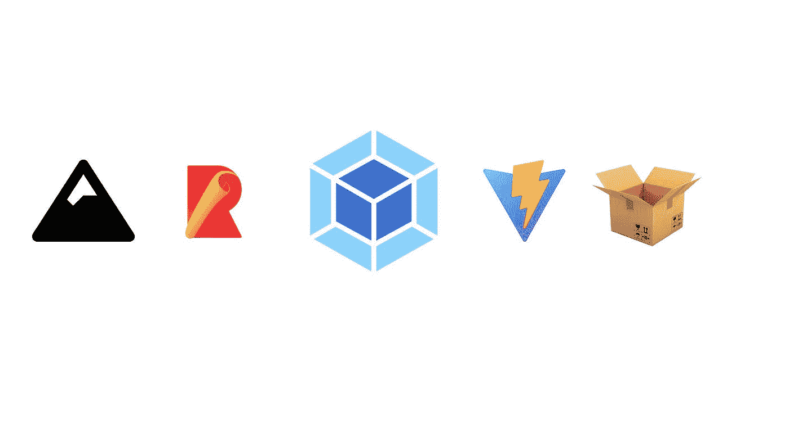

# 网络现状:捆绑器和构建工具

> 原文：<https://javascript.plainenglish.io/state-of-the-web-bundlers-build-tools-f67cf57759a4?source=collection_archive---------5----------------------->

## 了解有关 Webpack、Rollup 和 Vite 等捆扎机的过去、现在和未来的更多信息

自从 Browserify 以来，bundlers 在网络生态系统中一直非常重要。它们提供了自动处理代码的能力，这为性能优化和非本地语言提供了机会。本文着眼于捆绑器的背景，为什么他们是必不可少的，以及他们的现状。

# 捆扎机背景

# 捆扎机之前的网络

对于网络的很大一部分来说，捆绑器并不存在。为了包含脚本，大多数人只是链接到 CDN 上的库，如 [CDNJS](https://cdnjs.com/) 或[谷歌托管库](https://developers.google.com/speed/libraries)。这种情况将在 2009 年 Node.js 发布时开始改变。Node.js 没有使用 cdn，而是附带了它的包管理器 npm。npm 很容易使用，因为每个库都在一个`npm install`之外，并且更新很容易。因为易于使用，许多人想在 web 上使用 npm。然而，这是不可能的，直到 [Browserify](https://browserify.org/) 出现。

# 浏览

Browserify 的标语描述得很好。

> *Browserify 通过捆绑所有的依赖项，让您在浏览器中使用* `*require('modules')*` *。*

Browserify 是第一个 JavaScript“bundler”如果您不知道 bundler 是什么，它是一个将多个脚本捆绑到一个脚本中的工具，并且经常对它捆绑的脚本执行转换。这意味着您可以通过解析代码中的`require()`语句，将来自 NPM 的不同脚本与您的代码捆绑在一起。捆绑还意味着您的站点通常会更快，因为发送出去的 HTTP 请求不多，这减少了开销(在现代浏览器中这种情况较少，因为 HTTP/2 增加了在单个连接上下载多个资源的能力)。由于这些优势，Browserify 很快被采用。同样重要的是要注意在网络上使用模块的其他方式，如 Require.js，它使用 AMD 而不是 CommonJS，以及 Bower，它完全取代了浏览器的 NPM。

# 咕噜&吞咽

虽然 Browserify 非常擅长将脚本捆绑在一起，但它在转换代码方面却不太擅长。假设您希望将咖啡脚本代码编译为 JavaScript。您可以使用普通的 Browserify 来实现这一点。然而，它是笨重和相对不灵活的。为了解决这个问题，一组新的 web 工具诞生了，它专注于运行代码转换。这些人通常被称为任务跑步者，最受欢迎的是 [Grunt](https://gruntjs.com/) 和[glunt](https://gulpjs.com/)。Grunt 是第一个任务管理器，2012 年 1 月首次发布。在使用 Browserify 之类捆绑器或没有捆绑器的情况下，它允许更灵活的代码转换。不过，Grunt 仍然存在一些问题，这些问题都由 glugh 解决了。growth 更快，因为它使用 Node 流而不是临时文件，并并行运行任务，还允许人们使用脚本而不是 JSON 配置文件。然而，这仍然不是完美的，因为使用两个独立的工具是令人讨厌的。这是由 Webpack 修复的

# Webpack

[Webpack](https://webpack.js.org/) 将捆绑和编译结合在一起，比之前的标准 grave+Browserify 更容易实现。Webpack 最早开始流行是在 2016 年，至今仍然流行。Webpack 还有其他一些优势。首先，它支持绑定和转换非 JavaScript 资产，如 HTML、CSS 和图像。其次，API 通常更易于使用(尽管相对于最新的 bundlers，它仍然比较复杂)。许多工具，比如 Create-reaction-App、Next.js 和 Vuepress，都使用了 Webpack。

# 为什么打包工具/构建工具很重要

> *如果已经知道使用打捆机的原因，可以跳过本节*

# 最佳化

一般来说，大多数人不会像这样编写他们的代码:

相反，为了使东西可读，他们可能会写下如下内容:

但是，第一个示例较小，因此传输速度较快。现在，您可能认为必须牺牲大小来提高可读性，但有一个解决方案，即缩小。Minifiers 会自动将源代码转换为更小的形式。实际上，第一个代码示例是由 [Terser](https://terser.org/) 生成的，它是最好的缩小程序之一。打包程序通过插件使使用小型过滤器变得很容易。此外，bundlers 还有助于执行其他优化，例如树摇动，它可以删除未使用的代码。最后，绑定脚本本身可以通过减少所需的 HTTP 请求来提高性能。

# 非网络原生语言

通常，使用像 [Sass](https://sass-lang.com/) 或 [Stylus](https://stylus-lang.com/) 这样的语言比普通的 CSS 更有效。或者，也许你正试图使用 [TypeScript](https://www.typescriptlang.org/) 在你的代码中强制静态类型。不管是哪种情况，使用 web 本身不支持的语言通常更好。捆扎机可以在这方面提供帮助。不用自己运行一堆不同的命令来编译所有的东西，你通常只需要在你的 bundler 配置文件中添加插件并运行 bundler。

# 发展特征

大多数现代捆绑机都有加快迭代速度的功能，比如热模块重装(HMR)。HMR 自动重新加载特定的模块，而不是整个页面发生了变化，使重新加载速度更快。此外，如果您使用 React 这样的框架，React 状态可以保留，这意味着页面数据不会每次都重置。

# 轻松包含模块

将模块捆绑在一起是制造捆扎机的最初原因。即使现在有许多其他功能，这仍然很重要。即使有 ESM 的原生支持，不需要编写完整的导入路径就能够对`import`或`require`模块进行操作仍然是有帮助的(尽管[导入映射](https://github.com/WICG/import-maps)可以在这方面提供帮助)。

# 构建工具的状态

# 采用

如今，几乎每个 web 开发人员都使用这样或那样的 bundler。Webpack 是目前最受欢迎的，Rollup 和 Vite 分别位居第二和第三。目前，Vite 是发展最快的主要捆绑包，已经被 Vitepress、SvelteKit、Astro 等框架所采用。

# ECMAScript 模块(ESM)

大多数现代捆绑机都支持 ESM。虽然 Browserify 等工具不支持 ESM，但大多数新工具或比 Webpack 更新的工具都支持 ESM。此外，ESM 通常是受支持的捆绑商的推荐做法，因为它比 CommonJS 或 AMD 更面向未来，并且更容易静态分析树抖动的导入。ESM 还为非捆绑开发提供了机会，我们将在下面进行介绍。

# 非捆绑发展

非捆绑开发利用浏览器中的原生 ESM 支持来提供超快的开发体验。与捆绑开发中所有内容的传统捆绑器不同，非捆绑开发会转换代码，并将导入路径重写为符合 ESM 的文件路径，而不会捆绑您的代码。此外，大多数这样做的捆绑器会预先捆绑依赖项，因为这减少了所需的导入次数，并且依赖项不太可能经常改变。利用非捆绑开发的两个最著名的捆绑软件是 [Vite](https://vitejs.dev/) 和 [Snowpack](https://www.snowpack.dev/) 。Snowpack 创建于 2019 年，是第一个拥有非捆绑开发经验的捆绑商。然而，虽然 Snowpack 流行了一段时间，但这并没有永远持续下去。2020 年，Vue 背后的团队创造了 Vite。与 Snowpack 相比，Vite 有很多优势，比如易用性、速度、更好的优化等等。此外，像 SvelteKit 这样的流行项目采用了 Vite 而不是 Snowpack。所有这些都帮助 Vite 在下载量上超过了 Snowpack，与 Snowpack 相比，它现在的[下载量超过了 10 倍](https://www.npmtrends.com/snowpack-vs-vite)。事实上，就连 Snowpack 背后的团队创建的项目 [Astro](https://astro.build/) (请留意一篇关于 Astro 的文章)现在也在使用 Vite。总的来说，如果你想要快速、无捆绑的开发，我推荐 Vite。

# 更快的语言

许多人试图加速捆绑和代码转换的另一种方式是通过使用更优化的语言，如 Go 或 Rust。目前，两个最著名的工具是 [esbuild](https://esbuild.github.io/) 和 [SWC](https://swc.rs/) 。esbuild 是 Evan Wallace 在 2016 年使用 Go 创建的。esbuild 扮演了 Babel 的角色，将现代 JavaScript、TypeScript 编译器、Terser 和基本捆绑包都整合到一个包中，这在当时比其他任何工具都要快得多。SWC 是 2017 年由 kdy1 使用 Rust 创建的。SWC 甚至比 esbuild 更快，尽管只是略微快一些。esbuild 目前比 SWC 更受欢迎，被 Vite 等项目使用，尽管 Deno 和 Next.js 已经采用了 SWC。

# 低至零配置

Webpack 有一个非常复杂的插件系统。虽然它非常强大，但对于初学者来说可能会很可怕。幸运的是，有新的捆扎机专注于此。 [Parcel](https://parceljs.org/) 由 Devon Govett 于 2017 年创建，旨在实现简单的零配置捆绑。Parcel 支持 Webpack 插件提供的许多功能，如 Sass、TypeScript 和 JSX，而不需要您做任何事情。此外，由于缓存和 Rust 使用的增加，Parcel v2 可能比 Webpack 更快。Vite 是另一个低配置捆绑器，尽管它在开箱即用时做的不多。

# Webpack 呢？

Webpack 仍然是最受欢迎的捆绑软件。虽然它没有利用上面指定的大规模速度改进的能力，但它仍然在最新版本 Webpack 5 中添加了新功能。Webpack 5 中增加的最大的东西是[模块联盟](https://webpack.js.org/concepts/module-federation/)，或微前端。模块联合分离了一个网站的不同元素，使得像组件库一样共享代码片段变得更加容易。版本 5 中 Webpack 增加的另一件大事是更好的缓存，这可以改善开发中的重新加载时间。总体而言，Webpack 仍在进步，尽管它在某些功能上落后于一些捆绑商。

# 结论

网络捆绑商的世界正在快速发展。希望这篇文章能让你对捆扎机的现状有一个大致的了解。如果您喜欢这篇文章，请注册下面的 ByteofDev 邮件列表(或者不注册，但我希望您注册🙃)，也感谢你的阅读。

*原载于 2022 年 1 月 23 日 https://byteofdev.com***。**

**更多内容看* [***说白了。报名参加我们的***](http://plainenglish.io/) **[***免费周报***](http://newsletter.plainenglish.io/) *。在我们的* [***社区不和谐***](https://discord.gg/GtDtUAvyhW) *获得独家获取写作机会和建议。****