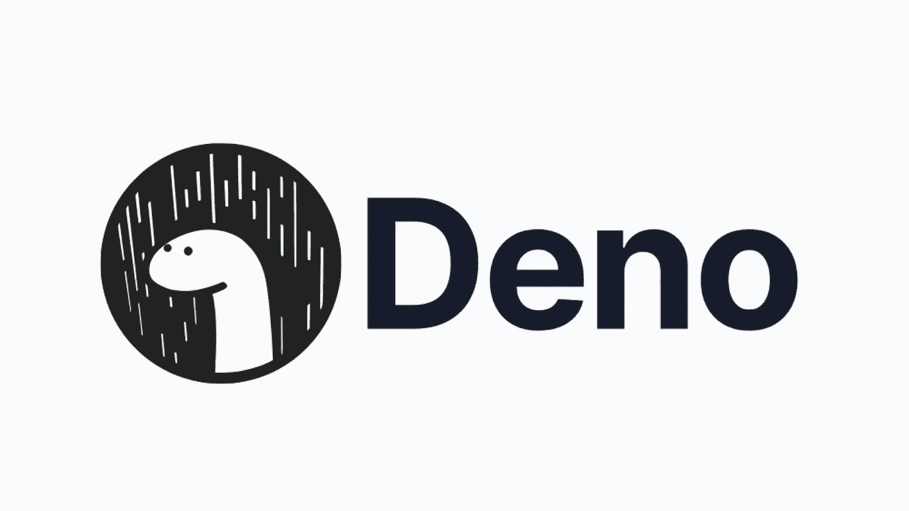

# 网络现状:Deno

> 原文：<https://javascript.plainenglish.io/state-of-the-web-deno-e9de001ce3c7?source=collection_archive---------7----------------------->



Deno logo

[Deno](https://deno.land/) 是一个现代的 JavaScript 运行时，与 Node.js 竞争，承诺安全 I/O 和内置类型脚本支持等特性。Node.js 的创始人 Ryan Dahl 在 Rust 中创建了 Deno。

# Deno 的背景


Deno Dino in a raining city (by Dimitrij Agal)

在 Ryan Dahl 的 talk [关于 Node](https://www.youtube.com/watch?v=M3BM9TB-8yA) 我后悔的十件事里，他谈到了 Node 的很多问题。这包括 Node 未能接受 web 标准、安全性、Node 编译本机模块的方式(GYP)和 NPM 等问题。然后，他透露了德诺。Deno 是一个新项目，它修复了 Ryan Dahl 之前提到的许多问题，以及一些额外的优势，如内置的类型脚本支持。Ryan Dahl 最初在 Go 中构建了 Deno，但后来改用 Rust。

自从 Deno 首次公布以来，它已经取得了重大进展。2020 年 8 月发布了 1.0，Slack 这样的公司已经采用了 Deno。此外，Deno 还发布了自己的 edge serverless 功能平台， [Deno Deploy](https://deno.com/deploy) 。

# 为什么 Deno 如此重要

# 安全性


Phone with lock (by [Franck](https://unsplash.com/@franckinjapan?utm_source=unsplash&utm_medium=referral&utm_content=creditCopyText) on [Unsplash](https://unsplash.com/s/photos/security?utm_source=unsplash&utm_medium=referral&utm_content=creditCopyText))

V8 是一种沙盒语言，使得代码不可能做超出其边界的事情。然而，Node.js 允许访问网络和沙箱内的文件系统，这就消除了 V8 的安全优势。即使对于可信的程序来说，这也是有害的，因为不安全的代码或恶意的依赖可能会造成严重的损害并窃取信息。

Deno 用一个[权限](https://deno.land/manual@v1.17.1/getting_started/permissions)的系统来解决。这些权限使您可以精确地定义程序在沙箱之外可以做什么，比如文件系统访问和环境变量。例如，如果您希望允许读取本地`assets`目录中的文件，您可以使用如下命令运行 Deno:

```
deno run --allow-read=./assets
```

由于这些功能，您可以确保代码不会超出其边界，从而提高安全性。

# 标准化 API

因为 Node.js 和 web 平台是并行发展的，所以它们有很多不同之处。有很多这样的例子，比如模块系统和 HTTP 请求。

## ECMAScript 模块和 CommonJS

当 Node.js 刚创建的时候，JavaScript 不能使用其他模块，只能将它们嵌入到`<script>`标签中，并在全局窗口范围内使用它们。由于 HTML 和窗口在服务器上不可用，Node.js 需要一种模块格式。Nodejs 决定采用一种 CommonJS 形式，这是一种流行、简单、同步的模块格式。然而，CommonJS 并不是浏览器自带的(你必须使用像 [Browserify](https://browserify.org/) 这样的库)，并且 CommonJS 的实现之间存在差异。

多年后的 2016 年，一个名为 ECMAScript Modules (ESM)的新模块规范在 ES6 中定稿。这个模块规范可以在浏览器中没有任何库的情况下工作。此外，它还可以解决 CommonJS 的许多问题，比如异步模块加载和树抖动。然而，Node.js 花了一段时间来添加 ESM 支持，即使在那之后，Node.js 中的 ESM 采用率也不是很高，大多数 NPM 软件包仍然只包含 CommonJS 版本。此外，Node.js 没有完全符合标准的 ESM 实现，并且在包括`.js`文件扩展名等方面有所不同。

相比之下，Deno 仅适用于完全符合标准的 ESM。对于用户和库作者来说，这使得使用 Deno 变得简单多了。根据经验，使用一种模块格式比同时包含 ESM 和 CommonJS 要简单得多。Deno 也更简单，因为它遵循标准，所以您知道您的模块代码在浏览器中可以正常工作。

## HTTP 抓取

发送 HTTP 请求是 Deno 解决的另一个不兼容领域。Node.js 允许通过`http`和`https`标准库函数进行 HTTP 请求。然而，在 web 上运行 HTTP 请求的现代方式是通过`fetch()` API，它是标准化的，比`http`更简单。Node.js 不支持`fetch()`，因此人们不得不转向使用像 [node-fetch](https://www.npmjs.com/package/node-fetch) 这样的包来简化`fetch()`或 [cross-fetch](https://www.npmjs.com/package/cross-fetch) 以实现完全的跨平台兼容性。这是有问题的，因为这是另一个需要的依赖项，如果不导入，它就不会立即可用。不过 Deno 默认支持`fetch()` API，解决了这些问题。

# 分散式模块托管

不，仅仅因为它是分散的并不意味着它使用区块链😉([虽然有区块链](https://nest.land/)支持的 Deno 包托管服务)。相反，Deno 的分散式模块托管允许您通过 URL 请求模块，而不是像 NPM 那样从集中的软件包数据库中请求。这样做可以让模块托管更加自由。Deno 确实在 deno.land/x[的](https://deno.land/x)提供了一个模块托管服务，但是你可以使用许多其他的服务，你甚至可以链接到任何 ESM CDN 或者其他提供 JavaScript 文件的服务。许多人担心远程代码会改变，因为它不一定是受控的，但大多数 Deno 模块托管服务都是不可变的，Deno 缓存远程文件，因此只有当您显式重新加载缓存时，它才会改变。

# 内置的类型脚本支持

Deno 允许你像 JavaScript 一样直接运行一个类型脚本文件，而不需要通过编译器。如果不需要类型检查，Deno 甚至通过缓存产生的 JavaScript 和使用 [SWC](https://swc.rs/) ，一个快速的基于 Rust 的编译器来优化这个过程。内置的 TypeScript 支持提高了效率，因为如果您正在使用 TypeScript 构建应用程序，则不需要设置构建步骤。在 Node.js 中有一些方法可以进行自动的类型脚本编译，比如通过 [ts-node](https://www.npmjs.com/package/ts-node) ，但是它们的功能并不丰富，默认情况下不会安装。

# 德诺州


Planet with the Deno dinosaur (By Hashrock)

# 生态系统

目前，这是 Deno 的最大问题，也是大多数 Node.js 开发人员不迁移到 Deno 的一个重要原因(这是一个令人讨厌的问题，因为如果 Node.js 开发人员不迁移，生态系统会增长得更慢)。deno.land/x 号上有 3501 个模块，而 NPM 号上有 130 万个。然而，许多人使用其他包托管服务(见上面的“分散模块托管”)，大多数现代 web 包应该在 Deno 上工作。节点兼容性的最大障碍是 CommonJS 和节点 API。Deno 提供了一个 [Node.js 兼容模式](https://deno.land/manual@v1.17.2/npm_nodejs/compatibility_mode)，不过是实验性的。

# 发展

Deno 的开发非常活跃，每月都有发布，每个版本都有新的特性。Deno 甚至得到了一家官方公司的支持，这可能是好的也可能是坏的，取决于你如何看待它。Deno 有 600 多名贡献者，这个数字还在增长。基本上，Deno 是一个非常活跃的维护项目

# 部署

Deno 可以被广泛部署，尽管没有 Node.js 那么广泛。

## 容器和托管虚拟机

Deno 对各种容器服务都有 ok 支持。Deno.land 为支持 Docker 的服务提供了一个[官方 Docker 镜像](https://hub.docker.com/r/denoland/deno)。然而，尽管大多数流行的容器服务都支持 Deno，但这种支持通常是非正式的，而且并不总是得到维护。以下是在容器服务上运行 Deno 的工具和资源列表:

## 无服务器功能

无服务器是 Deno 公司的切入点。他们的主要商业产品是 [Deno Deploy](https://deno.com/deploy) ，一个用于 Deno 脚本的无服务器 edge 函数运行程序。它在概念上类似于 Cloudflare Workers，因为它使用 V8 隔离来实现超快的启动时间。Deno Deploy 的优势在于它包括 Deno API 和所有其他使 Deno 如此有用的特性。然而，Deno Deploy 仍处于测试阶段，所以您现在可能想看看其他地方。以下是在各种无服务器函数提供程序上运行 Deno 的工具和资源列表:

# 结论

Deno 是一项新兴技术，有朝一日可能会取代 Node 成为运行 JavaScript 的主要方式。如果您想在《web 开发周刊》上了解更多关于新兴技术的信息，请加入下面的邮件列表。希望你从中有所收获，感谢你的阅读。

*原载于 2022 年 1 月 9 日 https://byteofdev.com**[*。*](https://byteofdev.com/posts/deno/)*

**更多内容看* [***说白了就是***](http://plainenglish.io/) *。报名参加我们的* [***免费周报***](http://newsletter.plainenglish.io/) *。在我们的* [***社区不和谐***](https://discord.gg/GtDtUAvyhW) *获得独家获取写作机会和建议。**