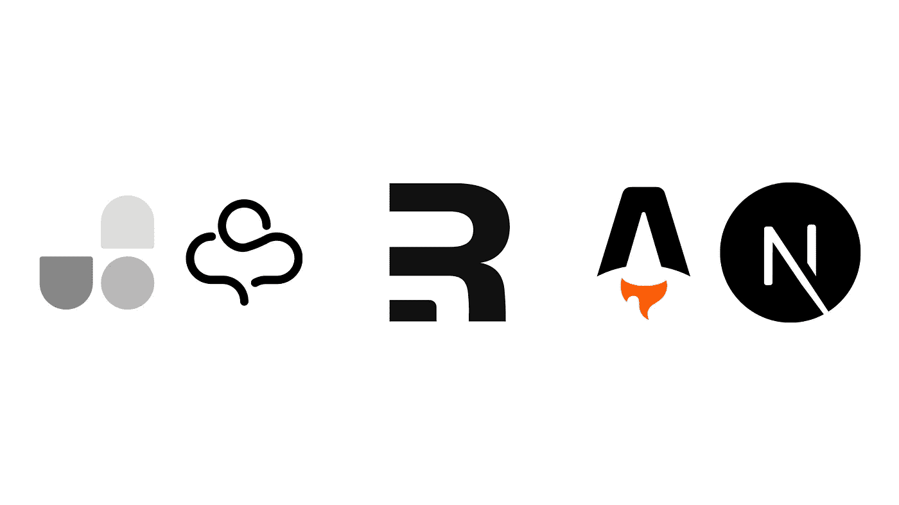

# 网络现状:反应

> 原文：<https://javascript.plainenglish.io/state-of-the-web-react-feaf41f4d194?source=collection_archive---------4----------------------->

## 了解更多关于 React 的过去、现在和未来，以及诸如 Remix、React 18、Solid 等内容。

React 是目前最流行的 JavaScript 框架之一。虽然许多其他框架提供了一些优势，但 React 仍然占据主导地位。React 周围还有一个巨大的生态系统，它正在快速变化。本文旨在概述 React 的最新趋势，如重新混合、服务器组件、部分水合等等。

# 反应背景

# 博尔特和法克斯

大约十年前，脸书开始寻找一种方法来更新其网络应用程序。它变得越来越复杂，他们需要一个框架来简化构建和维护。为了解决这个问题，他们创建了一个名为 Bolt 的项目。Bolt 是建立在 JavelinJS 之上的 MVC 框架，它解决了脸书的许多问题。然而，它并不完美。脸书公司的开发人员乔丹·沃克开发了 Bolt 的下一代产品，名为 [FaxJS](https://github.com/jordwalke/FaxJs) 。它提供了 React 今天拥有的许多特性，比如在客户机和服务器上渲染、DOM diffing 等等。Jordan Walke 将 FaxJS 重新命名为 FBolt，并开始在脸书的代码库中使用。

# React 的创作

2013 年，脸书更名为 FBolt，你猜对了，React。此外，他们开始研究 JSX，这是一个在 React 中定义 UI 的抽象层。JSX 把类似 HTML 的语句编译成 JavaScript 函数调用。有趣的是，根据 React 团队的[帖子，JSX 最初是基于 PHP 中允许嵌入 XML 文字的系统。JSX 最初只是 T4 jsx-XML-literal T5 的一个分支。](https://reactjs.org/blog/2016/09/28/our-first-50000-stars.html#adding-jsx)

# 初始生长

在那之后，React 开始成长。React 的 GitHub 库在 2014 年末达到 10k 颗，2015 年达到 20k 颗，2016 年达到 50k 颗。此外，React 的生态系统开始随着像[React flux](https://www.reactiflux.com/)这样的东西而增长。

# 钩住

钩子是在功能组件中定义生命周期方法的方式。2019 年，React 发布了 hooks，彻底改变了人们在 React 中编写应用的方式。在钩子出现之前，你必须为有状态组件使用类。功能组件只能是依靠道具的简单组件。然而，钩子提供了一种通过函数访问状态的方法，这为完全使用功能组件打开了大门。现在，大多数新的应用程序使用钩子来代替类组件，因为钩子更容易使用，也更简洁。

# 为什么人们使用 React

# 动态更新

如果您的数据发生变化，React 会自动更新您的 UI，从而节省大量时间。例如，如果您有一个包含各种事务的表，设置为每 15 秒更新一次，那么您必须手动定义差异检查和更新。然而，有了 React 这样的框架，您只需更改数据的值，一切都会为您实现。动态更新也使您的 UI 更容易推理，因为您可以保证它表示数据。

# 同构渲染

React 可以用相同的代码在客户端和服务器端呈现 UI。这为客户端的服务器端渲染和合成提供了机会。通过这种方式，React 与许多传统的模板语言形成了鲜明的对比，在传统的模板语言中，你可以生成静态的 HTML，但不能使之自动交互。

React 通过两种不同的 API 来实现这一点。通过`react-dom`公开的主要渲染 API 函数是`render`，它渲染传递给客户端的 JSX。然而，要在服务器上渲染 HTML，在`react-dom/server`下有`renderToString`，它渲染静态 HTML，稍后可以使用`render`进行水合。

# 高级模板

React 允许您做许多事情来减少代码中的重复，包括在组件中嵌入 JavaScript 和模块化标记。这些特性使更新重复的标记变得更加容易，从而有助于减少重复和维护负担。

# 反应的状态

# Remix 和新的 React 框架

Remix 是一个新的 React 框架(像 Next.js 一样)，由 React 路由器的开发者创建，最近才开源，但发展非常迅速。Remix 承诺与 web 平台特性更好的集成，与 edge 的集成，以及更简单的同构代码。Remix 已经成功获得了 12k 星。Remix 的另一个独特之处是，它不提供静态站点生成和动态服务器端呈现，而是完全专注于服务器端呈现。这意味着，虽然 Remix 不支持静态站点生成，但如果您更喜欢在服务器上呈现动态数据，而不是在客户端使用 API 抓取，Remix 可以很好地工作。当然，对于动态数据，在服务器上呈现和在客户机上获取数据都有权衡，这取决于您的用例。最后，由于作者构建 React 路由器的经验，Remix 拥有高级路由，具有嵌套路由和隔离错误等特性。

Remix 并不是唯一的新 React 框架。还有其他的，像[阿童木](https://astro.build/)。Astro 是一个很有前途的[静态站点生成器](https://byteofdev.com/posts/static-site-generators/)，它支持多种构建 UI 的方式，包括 React。Astro 值得注意的另一点是，它支持部分水合，这减少了发送给客户端的 JavaScript，只包含使 web 应用程序交互所需的内容。

# 反应 18

React 18 是一个即将发布的 React 版本，提供了许多新功能，如并发渲染器。并发渲染器允许一次构建多个版本的 UI，这为自动批量更新、流式服务器端渲染等新功能提供了机会。这些功能有助于提高性能。例如，自动批量更新减少了所需的 UI 更新数量，从而提高了客户端的性能。

# 半铸钢ˌ钢性铸铁(Cast Semi-Steel)

在 React 中使用 CSS 有多种方法。当然，您可以使用原生 CSS，但是有许多其他方法可以更好地配合 React 的 UI 样式。

## JS 中的 CSS

JS 中的 CSS 与 React 集成得非常好。JS 工具中最流行的 CSS 是 [styled-components](https://www.npmjs.com/package/styled-components) ，它允许你使用标记模板在 JavaScript 中定义样式。然而，在 JS 中有更新的 CSS 方法，它们在某些方面更胜一筹。其中最有趣的是柳穿鱼和香草精。 [Linaria](https://linaria.dev/) 是一个旨在通过将 JS 中的 CSS 编译为原生 CSS 来优化 JS 中的 CSS 的库。Linaria 还内置了 React 集成，这使得添加动态样式更加容易，并且运行时成本不高。vanilla-extract 做同样的事情，但更好地与 TypeScript 集成，并提供构建定制实用程序样式等功能。

# 原子 CSS

[原子 CSS](https://byteofdev.com/posts/atomic-css/) 由于其作用域，与 React 配合得很好。因为样式是原子性的，所以它们会自动限定在使用它们的元素范围内，从而更容易推断组件的样式。此外，原子 CSS 的重复可以使用组件解决。目前一些最著名的原子 CSS 库是 [Tailwind](https://tailwindcss.com/) 和 [UnoCSS](https://github.com/unocss/unocss) 。到目前为止，Tailwind 是最主要的原子 CSS 库，因为它有各种各样的特性和易用性。UnoCSS 是一个较新的项目，比 Tailwind 快得多，也更灵活。

# 更快的更换反应

虽然 React 有许多优点，但性能不是其中之一。幸运的是，React 的替代品保留了相同或几乎相同的 API。最值得注意的是[预动作](https://preactjs.com/)和[实动作](https://www.solidjs.com/)。首先，我们有 Preact。Preact 比 react 速度更快，而且在 API 相同的情况下，preact 的大小(3kb Gzipped)要小得多。你几乎可以在任何地方使用 Preact，也可以用它来代替`preact/compat`。第二，有扎实。Solid 没有一个相同的 API 来反应，但是它的不同之处允许它获得很大的性能优势。就运行时性能而言，Solid 比 Preact 和 react 都快得多。Solid 通过放弃虚拟 DOM 和只构建一次组件来实现这一点，而不是在状态更新时构建。Solid 也比 React 小，虽然它比 Preact 大一点。

# 结论

我希望你今天从中学到了一些东西。如果你喜欢阅读这篇文章，请在这里注册邮件列表[并订阅 ByteofDev RSS 以获得更多这些文章。感谢阅读！](https://byteofdev.com/signup)

*原载于 2022 年 2 月 13 日 https://byteofdev.com***。**

**更多内容请看*[***plain English . io***](http://plainenglish.io/)*。报名参加我们的* [***免费周报***](http://newsletter.plainenglish.io/) *。在我们的* [***社区***](https://discord.gg/GtDtUAvyhW) *获得独家获得写作机会和建议。**