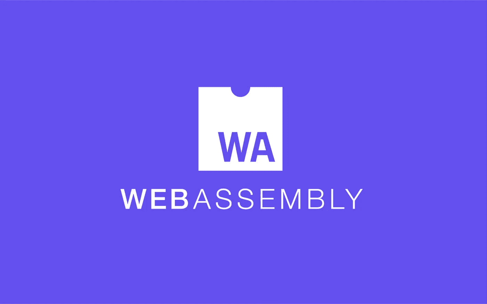
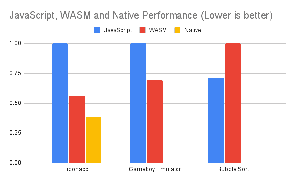
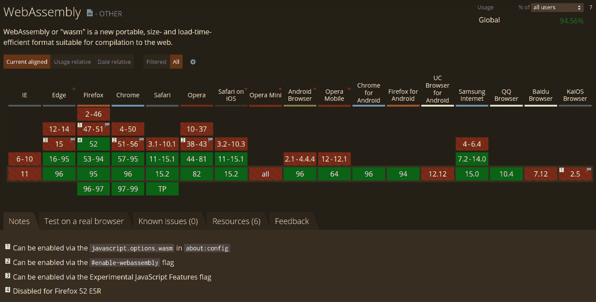
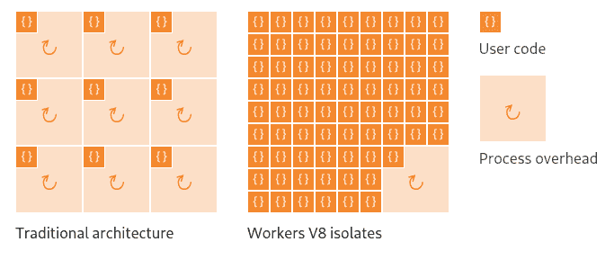

# 网络现状:网络大会

> 原文：<https://javascript.plainenglish.io/state-of-the-web-webassembly-f13863a22862?source=collection_archive---------3----------------------->

WebAssembly Logo

## 什么是 WebAssembly，为什么它很重要，它目前在 web 上是如何使用的？

WebAssembly (WASM)是网络上一种新的类似汇编的语言，旨在允许开发者用他们选择的语言编写快速、可移植的代码。它目前可用于[所有现代浏览器](https://caniuse.com/wasm)和 Node.js，以及一些 WebAssembly 专用运行时。

# WebAssembly 背景

一个浏览器联盟在 2015 年创建了 WebAssembly，作为 asm.js 和谷歌原生客户端的继任者。后来在 2017 年在所有现代浏览器上发布，2018 年发布了正式的 spec。WebAssembly 是一种二进制格式，允许在不使用 JavaScript 的情况下跨平台执行沙盒代码。它还被设计得很紧凑，解析和执行起来比 JavaScript 快得多。它可以在 web 和服务器上使用，以允许安全和可移植的沙盒代码执行。

# 为什么 WebAssembly 如此重要

## 安全性

WebAssembly 是一种沙盒语言，正因为如此，它是安全的。像 [Wasmer](https://wasmer.io) 这样的工具允许用有限的系统调用和计量 CPU 周期在 web 之外运行 WASM。

WebAssembly 的安全性使得类似 [Cloudflare Workers](https://workers.cloudflare.com) 、[Fastly【email protected】](https://www.fastly.com/products/edge-compute/serverless)、 [WasmEdge](https://wasmedge.org/) 等轻量级无服务器功能环境越来越多地采用 WebAssembly。由于编译器的简单性，WebAssembly 甚至可以比 web 上的 JavaScript 更安全。

不像 JavaScript，它有一个复杂的三层 JIT 编译器/运行时，[可能非常容易出错](https://microsoftedge.github.io/edgevr/posts/Super-Duper-Secure-Mode/)。相比之下，因为 WebAssembly 是强类型的，并且更接近于机器码，所以 WebAssembly 的编译器更简单，因此也更安全。由于其沙箱功能，Firefox 甚至使用 WebAssembly 进行字体整形。

## 速度

WebAssembly 的解析和执行速度都非常快。尽管它对 web 世界来说相对较新，但它仍然比 JavaScript 快得多。

就解析速度而言，WebAssembly 已经比 JavaScript 快得多。Firefox 的 WebAsssembly VM 运行 WebAssembly 的速度比从网络接收的速度更快。这消除了 JavaScript 的一个显著的速度问题。

使用 WebAssembly， [Figma 将他们的加载时间减少了 3 倍](https://medium.com/figma-design/webassembly-cut-figmas-load-time-by-3x-76f3f2395164)。至于执行速度，WebAssembly 在发挥其全部潜力之前仍有工作要做，但早期结果是有希望的。目前，WebAssembly 有时比 JavaScript 做得更好，但有时做得更差。

WebAssembly 的另一个性能问题是从 WebAssembly 调用 web APIs 的高开销。 [Mozilla 已经优化了这个](https://hacks.mozilla.org/2018/10/calls-between-javascript-and-webassembly-are-finally-fast-%f0%9f%8e%89/)，但是 Chrome 和 Node.js 还是有这个问题。然而，WebAssembly 的性能正在提高，最终，甚至有可能获得 WebAssembly 的本机性能。

## 灵活性

WebAssembly 专为多语言支持而设计。它有一个文本格式(WAT)，但是很难使用。

目前，您可以将许多语言编译为 WebAssembly，如 TypeScript 的一种形式[，Go，Rust 和 c。这使得您不再局限于 JavaScript，而是可以出于生态系统、语法或平台间代码共享等原因使用另一种语言。](https://www.assemblyscript.org/)

# WebAssembly 的当前状态

广泛采用 WebAssembly 仍然很遥远，但它正在取得进展。现在我们将看看 WebAssembly 在 web 浏览器、服务器上的状态，以及最好使用的语言。

## 网络支持

web 上的 WebAssembly 还处于早期阶段，尽管你已经可以不用接触 JavaScript 就能构建完整的网站。浏览器对 WebAssembly 的支持相当不错，所有现代浏览器都支持它。

如果你试图使用 WebAssembly 创建一个完整的 web 应用程序，目前最简单的方法是使用 Rust 和一个框架，比如带有主干的框架。然而，由于生态系统较小，WebAssembly 目前最适合应用程序中注重性能的小部分，而不是整个应用程序。

## 服务器支持

服务器上的 WebAssembly 正在快速增长。WebAssembly 提供了超轻隔离，这使得它非常适合无服务器功能，因为无服务器功能需要快速启动并且占用空间小。为了举例说明这是如何工作的，让我们看看最流行的无服务器功能服务之一 [Cloudflare Workers](https://workers.cloudflare.com/) 是如何工作的。

Cloudflare Workers 在单独的进程中使用 V8 隔离而不是容器来执行无服务器功能。V8 隔离是轻量级 V8 执行环境，启动速度比传统沙盒环境快得多。

但是，因为隔离只针对 V8 引擎，所以只支持 JavaScript 和 WebAssembly。因为不是每个人都想使用 JavaScript，所以 WebAssembly 是 Cloudflare 工作人员的热门选择。事实上，Cloudflare Workers 非常支持将 Rust 与 WebAssembly 一起使用，并有官方维护的 Rust API。

如您所见，WebAssembly 是服务器的绝佳选择，因为它可以在轻量级、安全的环境中执行。如果你想看看包括 Cloudflare Workers 在内的基准测试来展示隔离的速度提升，[这里](https://blog.cloudflare.com/serverless-performance-comparison-workers-lambda/)是一些。

# 语言支持

目前，如果你想使用 WebAssembly，最好的语言是 [Rust](https://www.rust-lang.org/) 或 [AssemblyScript](https://www.assemblyscript.org/) 。Rust 拥有最广泛的 WebAssembly 生态系统，有用于绑定到 JavaScript 的 [WASM-Bindgen](https://rustwasm.github.io/docs/wasm-bindgen/) 、用于生成 WASM 包的 [WASM-Pack](https://github.com/rustwasm/wasm-pack) 等工具。

然而，即使 AssemblyScript 的生态系统小得多，它也是小型 WebAssembly 模块的一个好选择。AssemblyScript 是具有更高级类型的 TypeScript，因此如果您以前有 JavaScript 经验，很容易学习。

此外，AssemblyScript 通常几乎与 Rust 或 C WebAssembly 一样快，而交付的二进制文件要小得多。

# 结论

WebAssembly 对于 web 世界来说仍然是一个新事物。然而，它已经在轻量级无服务器功能执行中找到了一席之地。我希望你能从中学到一些东西,《网络现状》的第一篇文章到此结束。感谢阅读！

*最初发表于 2022 年 1 月 1 日*[*【https://byteofdev.com】*](https://byteofdev.com/posts/webassembly/)*。*

*更多内容看* [***说白了。报名参加我们的***](http://plainenglish.io/) **[***免费周报***](http://newsletter.plainenglish.io/) *。在我们的* [***社区不和谐***](https://discord.gg/GtDtUAvyhW) *获得独家获取写作机会和建议。***