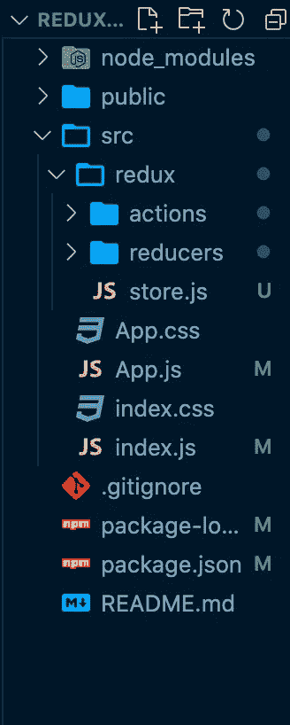
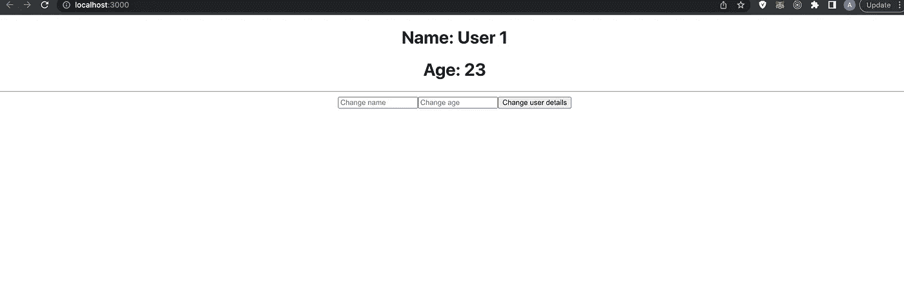

# 分步教程:用钩子反应 Redux 2022

> 原文：<https://javascript.plainenglish.io/step-by-step-tutorial-react-redux-2022-with-hooks-3b5d63b18be9?source=collection_archive---------0----------------------->

## 从头开始创建一个商店，并与挂钩整合。


Image made by author + [Sana](https://unsplash.com/photos/C-EO0Z9utn8)

本教程并不意味着教你任何最佳实践或生产代码；相反，它旨在向您展示 Redux 是如何工作的，以及如何将它与钩子集成在一起！

在任何真正的生产应用程序中，你几乎肯定会使用 Redux Toolkit 而不是基本的 Redux，但是让我们开始吧！

# Redux 解决管理全局状态的问题

众所周知，在大型 web 应用程序中管理状态，甚至是不太复杂的小型应用程序，都是非常困难的。

例如，我们可能需要将道具从一个父组件转移到五个子组件，然后执行那些道具中可用的功能，等等。

这是一个痛苦的跟踪，这就是所谓的**道具钻井**。调试并确保您在使用父组件状态的每个组件中都正确地做到这一点也很困难。

这是 Redux 本身对 Redux 的说法:

> 一个集中的地方来包含应用程序中的全局状态，以及在更新该状态以使代码可预测时要遵循的特定模式。

我最近创建了一个加密 web 应用程序，它允许你跟踪加密，添加货币到你的收藏夹，设置闹钟，等等。

将道具传递到每个组件中会很麻烦，而且会很快失控，因为我有一个 navbar，它有一个 profile 组件，一个 profile 组件，以及一堆没有相同父组件的展开组件。

让我们看看组成 Redux 的各种组件以及它们的含义和作用。

先说数据是怎么流动的。假设我们在一个按钮组件中，我们想改变 Redux 中的状态。我们需要调用一个函数来完成，对吗？或者我们只是更新状态？不，我们调用函数来保存我们想要更新的信息以及我们想要更新的有效载荷。这种状态也不会直接变异。

**这里有一个简单的例子来说明数据是如何流动的:**

当我们点击按钮组件中的一个按钮时，它应该将`count`加 1。因此，当我们单击它时，就会调用一个`redux action` 。

## **不同的部分:**

## 1.商店

我们的 Redux 应用程序的状态和还原器存储在一个名为`store`的对象中。

## **2。减速器**

reducer 负责返回一个新的状态，它这样做取决于传递给它的动作。

reducer 是一个将当前状态和动作对象作为输入并输出新状态的函数。根据文档，纯 reducer 函数用于对状态进行更改:

> 要指定如何基于动作更新状态树，需要编写 reducer 函数。Reducers 是纯函数，它接受前一个状态和一个动作，并返回下一个状态。像任何其他函数一样，您可以将 reducer 拆分成更小的函数来帮助完成工作，或者为常见任务编写可重用的 reducer。

## 3.行动

动作指示 reducer 如何处理状态，比如将状态更改为我们从动作传递给 reducer 的值。reducer 负责实际改变应用程序的状态，而 action 负责指定它应该如何改变。通过传递一个带有类型属性和有效负载属性的对象，这个动作描述了缩减器应该做什么。我们可以使用类型来检查缩减应该做什么。

reducer 可能执行 5 种不同的事情，我们可以使用类型来指定它应该做什么。

例如，更新用户的用户名。

## 4.派遣

派遣是你行动的催化剂。它类似于发射火箭的按钮，在这种情况下就是动作。

需要记住的另一件事是，对于我们的 Redux 项目，更新状态的唯一方法是调用 dispatch 方法并传入 action 对象。

为什么我们不能改变现状呢？因为如果我们不分派一个动作，我们将能够从应用程序中的任何地方改变状态，并且我们将不能找出它来自哪里。

因此，Redux 知道它在何时、何地、以何种方式变异，并且我们能够更容易地用调试工具来调试它。

这也有助于我们有特定的方法来改变状态，而不是从头到尾都有不同的东西。

## 5.中间件

例如，当动作告诉缩减器做什么时，应该通知缩减器做什么，并给它一个参数，但如果动作是一个函数呢？

因此，reducer 将无法执行任何操作，因为它只接受`objects, arrays, primitive values`等形式的参数，而不是必须运行才能返回的函数。

因此，我们需要一个中间件来检测一个函数是否作为参数提供，如果是，就调用这个函数，并将函数产生的任何内容作为有效负载提供给 reducer。

# 开始编码

1.  用`npx create-react-app projectname`旋转一个 React app。
2.  用`npm i redux react-redux`安装 Redux 的依赖项。

既然我们需要的东西都有了，那就开始吧。

我们将制作的应用程序将允许您从 Redux 状态更改用户名和年龄，并在我们的组件中显示它。

**我们将创造什么:**

1.  包含我们商店及其所有部件的文件夹。
2.  包含我们的`reducers`的文件夹
3.  一辆`store.js`将与我们的减速器一起创建商店。
4.  那将包含我们所有不同的行动。
5.  在`app.js`中，我们将使用商店的状态、减少者和行动。

在`src`目录下，创建一个`redux`文件夹。

在 redux 文件夹中，创建一个`reducers`文件夹、一个`actions`文件夹和一个`store.js`文件。

现在应该是这样的:



## 创建减速器

在 reducers 文件夹中创建一个`addUserReducer.js`；这是将返回用户对象的缩减器。

reducer 只是一个函数，它根据动作类型和负载返回一个新的状态。

因此，在这个 [**文件**](https://gist.github.com/antondevv/d00499e64d60becac73fd27570dbcbd5) 中，我们将创建一个函数，它接受一个状态和一个动作对象，检查动作对象中值的类型属性，并根据它包含的类型返回新的状态:

因此，我们检查类型是否是`CHANGEUSERNAME`，如果是，我们返回一个新的状态，并在有效载荷中传递一个新的用户名。

解构主义呢？我们有我们的状态，它是一个可能包含也可能不包含用户的对象；无论哪种情况，我们都希望创建一个包含新用户数据的新对象，所以`...state`将被析构为新对象中的内容，并且我们将从有效载荷向对象添加我们的用户详细信息。

但是，因为我们也希望能够更改用户的年龄，所以让我们包括一个这样的案例:

然后导出缩减器。

现在我们需要一种方法来调用这个缩减器，这可以通过定义一个调度动作来实现。

## 创建操作

添加用户的操作将是一个函数，它接受用户参数并返回一个类型和有效负载对象，这将是新的名称。

现在我们需要一种方法将这个动作从我们的 React 组件分派到 reducer。

为此，我们必须首先将减速器添加到存储中。Redux 有一个`createStore`方法，我们可以用它来发送我们的 reducers、中间件等。

那么让我们从商店开始吧。在我们的`store.js`文件中，我们有以下代码:[https://gist . github . com/antondevv/7 dab 8163 c 180 ce 306781 aa 18083 c 09 b 4](https://gist.github.com/antondevv/7dab8163c180ce306781aa18083c09b4)

在导出之前，我们创建存储并将其传递给我们的 reducer。我们现在可以通过将它导入 React 组件来使用它。

## 获取 React 组件中的状态

React Redux 有一个叫做`useSelector`的东西，它允许我们从应用程序的任何地方访问商店状态！

要使用它，我们必须将我们的 React 应用程序包装在一个`store provider`中，它告诉 React 我们希望能够使用包装在提供者中的任何组件的 Redux。我们在`index.js`中通过导入我们创建的存储和 react-redux 提供者来实现这一点；你的`index.js`应该是这样的:

现在，在我们的 React 应用程序中的任何地方，我们都可以访问商店。

所以让我们从`App.js`中的状态获取用户。

让我们进口`useSelector`:

```
*import* { useSelector } *from* "react-redux";
```

简单地调用 reducer，它会返回状态:

```
const *user* = *useSelector*((*state*)=> *state.userReducer*);
```

现在我们有了用户。

**我们来展示一下:**

现在让我们导入我们的操作:

```
*import* { changeUsersName } *from* "./redux/actions/changeUsersName";*import* { changeUsersAge } *from* "./redux/actions/changeUsersAge";
```

让我们导入触发动作的`dispatch`:

```
*import* { useSelector, useDispatch } *from* "react-redux";
```

现在，我们可以通过将动作传递到分派中来触发动作，如下所示:

```
*dispatch*(*changeUsersName*("name"));
```

因此，让我们添加 2 个输入字段，以便更新用户数据。

**这是** `**App.js**`的最终代码:

**它应该是这样的:**



Image made by author

现在我们都准备好了！而且我们应该可以在 Redux 状态下更新用户！

我包括我的 GitHub 回购，如果你想克隆它:[https://github.com/antondevv/Medium-redux](https://github.com/antondevv/Medium-redux)

*你好，如果你想体验灵媒，请考虑支持我和所有其他作家，注册成为* [***会员***](https://medium.com/@anton.franzen/membership) *每月 5 美元以保持独立写作，在这里注册；)*

除了支持他人，Medium 还可以通过写作和在此安家的强大、积极参与的社区来支持你。

*更多内容请看*[***plain English . io***](https://plainenglish.io/)*。报名参加我们的* [***免费周报***](http://newsletter.plainenglish.io/) *。关注我们关于*[***Twitter***](https://twitter.com/inPlainEngHQ)*和*[***LinkedIn***](https://www.linkedin.com/company/inplainenglish/)*。加入我们的* [***社区不和谐***](https://discord.gg/GtDtUAvyhW) *。*