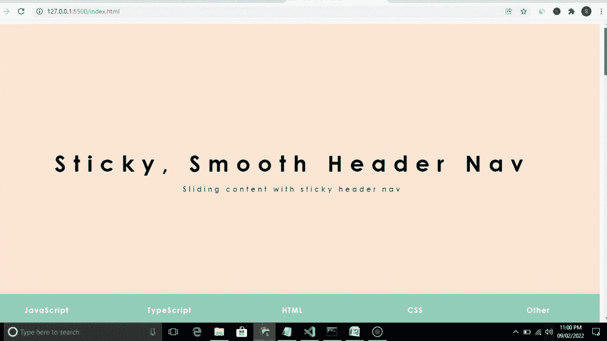

# 粘性平滑滑动滚动条| JavaScript — CoderFact

> 原文：<https://javascript.plainenglish.io/sticky-smooth-sliding-navbar-on-scroll-javascript-coderfact-e0a12cb313d1?source=collection_archive---------15----------------------->

## 使用这个功能，你的导航栏不会与页眉、页脚或任何其他容器重叠。

如果你是一名开发人员，你肯定面临过粘性标题的问题。不是吗？

这是一个导航条的解决方案，在滚动条上有一个光滑的粘性标题。使用这个功能，你的导航栏不会与页眉、页脚或任何其他容器重叠，而且它会尽可能地停留在容器上。

当您滚动时，它会平滑地转到不同的部分，并突出显示相应的选项卡。



在上面的预览中，你可以看到有 5 个标签(JavaScript，TypeScipt，Html，Css，其他)，当我们向下或向上滚动固定在顶部的导航条时，相应的标签带下划线，相应的部分就会显示出来。

整个设计是基于一个单页网站，有多个部分，你可以通过点击导航栏或上下滚动来导航。这是一个响应式设计。我使用 flexbox 来实现响应。

让我们看看代码:

整个项目由 JavaScript，HTML，CSS 创建。

JS 正在处理功能部分。所有滚动和滑动下划线的粘性功能都由 JavaScript 处理。我使用函数**checkTabContainerPosition**来检查容器位置，在此基础上添加一个 st-tabs-container-top CSS 类来固定 navbar 位置。

类似地，另一个函数 findCurrentTabSelector 正在计算当前活动的选项卡，然后我向带下划线的滑块添加 width 和 left。

# 超文本标记语言

创建一个名为 index.html 的 HTML 文件。

```
<!DOCTYPE html>
<html lang="en">
  <head>
    <meta charset="UTF-8" />
    <meta http-equiv="X-UA-Compatible" content="IE=edge" />
    <meta name="viewport" content="width=device-width, initial-scale=1.0" />
    <title>Sticky Slider</title>
    <script src="https://cdnjs.cloudflare.com/ajax/libs/jquery/3.1.0/jquery.min.js"></script>
    <script src="sticky.js"></script>
    <link rel="stylesheet" href="app.css" />
    <link
      href="https://fonts.googleapis.com/css?family=Lato:400,700"
      rel="stylesheet"
    />
  </head>
  <body>
    <!-- Hero -->
    <section class="st-tabs">
      <h1>Sticky, Smooth Header Nav</h1>
      <h3>Sliding content with sticky header nav</h3>
      <div class="st-tabs-container">
        <a class="st-tab" href="#tab-js">JavaScript</a>
        <a class="st-tab" href="#tab-ts">TypeScript</a>
        <a class="st-tab" href="#tab-html">HTML</a>
        <a class="st-tab" href="#tab-css">CSS</a>
        <a class="st-tab" href="#tab-other">Other</a>
        <span class="st-tab-slider"></span>
      </div>
    </section>

    <!-- Main -->
    <main class="st-main">
      <section class="st-slide" id="tab-js">
        <h1>JavaScript</h1>
        <h3>Play with JS</h3>
      </section>
      <section class="st-slide" id="tab-ts">
        <h1>TypeScript</h1>
        <h3>Play with TypeScript</h3>
      </section>
      <section class="st-slide" id="tab-html">
        <h1>HTML</h1>
        <h3>Play with HTML</h3>
      </section>
      <section class="st-slide" id="tab-css">
        <h1>CSS</h1>
        <h3>Play with CSS</h3>
      </section>
      <section class="st-slide" id="tab-other">
        <h1>Other</h1>
        <h3>anything else</h3>
      </section>
    </main>
  </body>
</html>
```

# 半铸钢ˌ钢性铸铁(Cast Semi-Steel)

然后给设计添加 app.css

```
body {
  font-family: "Century Gothic", "Lato", sans-serif;
}

a {
  text-decoration: none;
}

.st-tabs,
.st-slide {
  display: flex;
  flex-direction: column;
  justify-content: center;
  align-items: center;
  height: 100vh;
  position: relative;
  background: #ffe8d6;
  text-align: center;
  padding: 0 2em;
}
.st-tabs h1,
.st-slide h1 {
  font-size: 2rem;
  margin: 0;
  letter-spacing: 1rem;
}
.st-tabs h3,
.st-slide h3 {
  font-size: 1rem;
  letter-spacing: 0.3rem;
  opacity: 0.6;
}

.st-tabs-container {
  display: flex;
  flex-direction: row;
  position: absolute;
  bottom: 0;
  width: 100%;
  height: 70px;
  box-shadow: 0 0 20px rgba(0, 0, 0, 0.1);
  background: #94d2bd;
  z-index: 10;
}
.st-tabs-container--top {
  position: fixed;
  top: 0;
}

.st-tab {
  display: flex;
  justify-content: center;
  align-items: center;
  flex: 1;
  color: #ffffff;
  letter-spacing: 0.1rem;
  transition: all 0.5s ease;
  font-size: 0.8rem;
  font-weight: 900;
}
.st-tab:hover {
  color: white;
  background: #001219;
  transition: all 0.5s ease;
}

.current {
  color: white;
  background: #001219;
  transition: all 0.5s ease;
}

.st-tab-slider {
  position: absolute;
  bottom: 0;
  width: 0;
  height: 6px;
  background: #001219;
  transition: left 0.3s ease;
}

@media (min-width: 800px) {
  .st-tabs h1,
.st-slide h1 {
    font-size: 3rem;
  }
  .st-tabs h3,
.st-slide h3 {
    font-size: 1rem;
  }

  .st-tab {
    font-size: 1rem;
  }
}
html {
  scroll-behavior: smooth;
}

/*# sourceMappingURL=app.css.map */
```

# Java Script 语言

最后，添加 sticky.js 来实现所有功能

```
*class* StickyNavigation {

	constructor() {
		this.currentId = null;
		this.currentTab = null;
		this.tabContainerHeight = 70;
		let self = this;

		$(window).scroll(() => { this.onScroll(); });
		$(window).resize(() => { this.onResize(); });
	}

	onScroll() {
		this.checkTabContainerPosition();
    this.findCurrentTabSelector();
	}

	onResize() {
		if(this.currentId) {
			this.setSliderCss();
		}
	}

	checkTabContainerPosition() {
		let offset = $('.st-tabs').offset().top + $('.st-tabs').height() - this.tabContainerHeight;
		if($(window).scrollTop() > offset) {
			$('.st-tabs-container').addClass('st-tabs-container--top');
		} 
		else {
			$('.st-tabs-container').removeClass('st-tabs-container--top');
		}
	}

	findCurrentTabSelector(element) {
		let newCurrentId;
		let newCurrentTab;
		let self = this;
		$('.st-tab').each(*function*() {
			let id = $(this).attr('href');
			let offsetTop = $(id).offset().top - self.tabContainerHeight;
			let offsetBottom = $(id).offset().top + $(id).height() - self.tabContainerHeight;
			if($(window).scrollTop() > offsetTop && $(window).scrollTop() < offsetBottom) {
				newCurrentId = id;
				newCurrentTab = $(this);
			}
		});
		if(this.currentId != newCurrentId || this.currentId === null) {
			this.currentId = newCurrentId;
			this.currentTab = newCurrentTab;
			this.setSliderCss();
		}
	}

	setSliderCss() {
		let width = 0;
		let left = 0;
		if(this.currentTab) {
			width = this.currentTab.css('width');
			left = this.currentTab.offset().left;
		}
		$('.st-tab-slider').css('width', width);
		$('.st-tab-slider').css('left', left);
	}

}

new StickyNavigation();
```

仅此而已。现在我希望你完全理解如何只用 **HTML CSS JavaScript** 创建**带滚动滑动的粘性导航条**。如果您有任何疑问，请在下面评论。

*原载于 2022 年 2 月 9 日 https://coderfact.com**[*。*](https://coderfact.com/projects/basic/sticky-smooth-sliding-navbar-on-scroll-javascript/)*

**更多内容看* [***说白了就是***](http://plainenglish.io/) *。报名参加我们的* [***免费周报***](http://newsletter.plainenglish.io/) *。在我们的* [***社区不和谐***](https://discord.gg/GtDtUAvyhW) *获得独家获取写作机会和建议。**