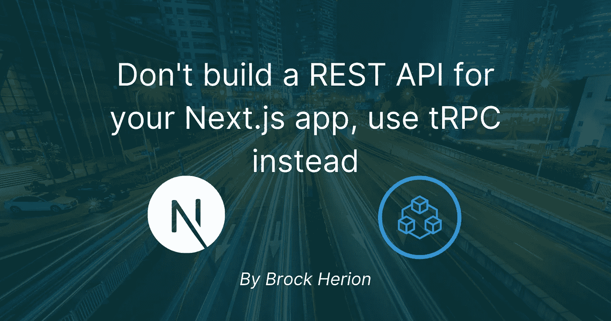

# 停止为你的 Next.js 应用构建 REST APIs，改用 tRPC

> 原文：<https://javascript.plainenglish.io/stop-building-rest-apis-for-your-next-js-apps-use-trpc-instead-4b78e8f4d331?source=collection_archive---------0----------------------->

## 了解 tRPC:一个构建具有端到端类型安全的 API 的工具。



当我第一次开始开发全栈应用程序时，我正在构建和管理自己的 REST APIs。我从用 Spring 在 Java 中构建它们开始，然后转移到。NET，然后用 Express 转到 Node.js，甚至还稍微涉猎了一点 Django。说用不同的语言管理两个不同的项目(有时)很麻烦是有点轻描淡写。

tRPC 是一个构建端到端类型安全 API 的工具。tRPC 允许您非常快速地为 Next.js、React 和 Node.js 应用程序创建健壮且可伸缩的后端。

我激起你的兴趣了吗？那我鼓励你继续读下去！在本文中，我们将了解 tRPC 是什么，以及如何在 Next.js 中设置和使用它。

# tRPC 是什么？

正如我前面提到的，tRPC 允许您为 Next.js、React 和 Node.js 应用程序构建完全类型安全的 API。借助其端到端的类型安全，您能够在编译时而不是运行时捕获前端和后端之间的错误。因为您只使用类型声明，而不导入实际的服务器代码，所以您的构建保持小而快。

# 安装 tRPC

安装 tRPC 非常简单。有几个我们需要的软件包，既有 tRPC 本身的，也有另外两个会让我们的生活变得更容易的。在 Next.js 项目中，运行以下命令来安装依赖项。

```
$ yarn add [@trpc/client](http://twitter.com/trpc/client) [@trpc/server](http://twitter.com/trpc/server) [@trpc/react](http://twitter.com/trpc/react) [@trpc/next](http://twitter.com/trpc/next) zod react-query
```

tRPC 是建立在“react-query”之上的，react-query 是一个用于获取、缓存和管理数据的包，不需要弄乱任何全局状态。我们还使用“zod”来帮助我们的模式和输入验证。

我们需要做的下一件事是确保在我们的“tsconfig.json”中启用严格模式

```
json
// tsconfig.json
{
 // …
 “compilerOptions”: {
 // …
 “strict”: true
 }
}
```

这并不是专门针对 tRPC 的，而是为了让‘zod’正确运行。zod 也不是使用 tRPC 的必要条件，但是，正如你稍后会看到的，它真的很好地配合了 tRPC，使我们的生活变得更容易。

# 创建我们的服务器

在我们的项目根目录中，或者如果你使用 Next.js 的话，在“/src”文件夹中，创建一个名为“/server”的新文件夹。这个文件夹将包含我们的 tRPC 上下文、路由器和我们实际的 API 路由。

这里需要注意的一点是，我们的服务器将被部署为 Next.js API 路由。这段代码是作为服务器端的包发布的，不会以任何方式影响我们的客户端包的大小。

你可以在[next . js Docs]([https://nextjs.org/docs/api-routes/introduction](https://nextjs.org/docs/api-routes/introduction))中阅读更多关于 Next.js API 路线的内容

## 配置我们的上下文

我们首先要创建的是我们的上下文。我们的上下文允许我们将请求数据传递给路由中的每个解析器。要创建新的上下文，让我们创建一个名为“context.ts”的文件，并向其中添加以下代码。

```
// server/context.ts
import { CreateNextContextOptions } from “[@trpc/server](http://twitter.com/trpc/server)/adapters/next”;
import { inferAsyncReturnType } from “[@trpc/server](http://twitter.com/trpc/server)”;export async function createContext(contextOptions?: CreateNextContextOptions) {
 const req = contextOptions?.req;
 const res = contextOptions?.res;return {
 req,
 res,
 };
}export type MyContextType = inferAsyncReturnType<typeof createContext>;
```

这里我们只是将请求和响应传递给我们的路由。你也可以在这里添加你想传递的其他东西。Prisma 客户端和 NextAuth 会话就是很好的例子。

## 创建简单的路由器

接下来，我们继续添加一个“create-router.ts”文件。在这个文件中，我们将设置一个简单的路由器作为根。

```
 // server/create-router.ts
import * as trpc from “[@trpc/server](http://twitter.com/trpc/server)”;
import { MyContextType } from “./context”;export function createRouter() {
 return trpc.router<MyContextType>();
}
```

像这样声明您的路由器非常有用，因为它允许您向使用您的路由器的所有路由添加定制的中间件逻辑。例如，您可以创建一个路由器来检查用户是否登录，或者用户是否有访问资源的正确权限。

## 配置我们的 API 路由

让我们创建一个名为“路由器”的新文件夹，并向其中添加两个文件。首先，添加一个名为` _app.ts '的文件，这个文件将作为我们的根路径。我们添加的任何新路线都将添加到此处。

```
 // server/routers/_app.ts
import { createRouter } from “../create-router”;export const appRouter = createRouter();export type AppRouter = typeof appRouter;
```

接下来，让我们创建第二个文件，并将其命名为“nameRouter.ts”。

```
 // server/routers/nameRouter.ts
import { z } from “zod”;
import { createRouter } from “../create-router”;export const nameRouter = createRouter.query(“getName”, {
  input: z.object({
  name: z.string().nullish(),
 }),
 resolve({ input }) {
  return { greeting: `Hello ${input.name}!` };
 },
});
```

tRPC 使用查询和变异来定义动作。查询用于获取数据，而变异用于创建、更新和删除数据。在上面的代码中，我们创建了一个获取名称的查询。我们的查询接受两个参数。第一个是查询名，第二个是我们的参数。对于我们的参数，我们有输入和解析。输入是可选的，而解析是必需的。Resolve 是我们端点的实际实现。在我们的例子中，我们使用 Zod 来验证我们有一个字符串输入，我们的端点将返回一个字符串，该字符串向我们传入的任何名称问好。

我们现在可以跳回到' _app.ts '并在那里添加我们的路线。

```
 // server/routers/_app.ts
// […]
import { nameRouter } from “./nameRouter”;export const appRouter = createRouter().merge(“names.”, nameRouter);// […]
```

在 Next.js 中添加端点

我们需要在 Next.js 中添加一个新的端点。在`/pages/api `文件夹下，在`/trpc/[trpc].ts `下创建一个新文件。您的文件夹结构应该如下所示:

```
.
+ — pages
| + — api
| + — trpc
  | + — [trpc].ts
```

现在将以下代码添加到`[trpc].ts `:

```
 // pages/api/trpc/[trpc].ts
import { createNextApiHandler } from “[@trpc/server](http://twitter.com/trpc/server)/adapters/next”;
import { appRouter } from “../../../server/routers/_app”;
import { createContext } from “../../../server/context”;export default createNextApiHandler({
  router: appRouter,
  createContext,
  batching: {
  enabled: true,
 },
});
```

现在，我们可以设置我们的前端了！

# 调用我们的 API 路线

将我们的后端连接到我们的前端非常简单。首先，我们需要转到我们的` _app.tsx `文件，并配置 tRPC 和 React Query。为此，我们将使用“withTrpc()”高阶组件。

```
// pages/_app.tsx
// […]
import { withTRPC } from “[@trpc/next](http://twitter.com/trpc/next)”;
import { AppRouter } from “./api/trpc/[trpc]”;function getBaseUrl() {
 if (process.browser) return “”;
 if (process.env.VERCEL_URL) return `[https://${process.env.VERCEL_URL}`](/${process.env.VERCEL_URL}`);return `[http://localhost:${process.env.PORT](http://localhost:${process.env.PORT) ?? 3000}`;
}export default withTRPC<AppRouter>({
 config({ ctx }) {
 const url = `${getBaseUrl()}/api/trpc`; return {
   url,
  };
 },
 ssr: true,
})(MyApp);
```

接下来，我们需要添加一个名为 utils 的新文件夹和一个名为` trpc.ts '的文件

```
 // utils/trpc.ts
import { createReactQueryHooks } from “[@trpc/react](http://twitter.com/trpc/react)”;
import { AppRouter } from “../server/routers/_app”;
import { inferProcedureOutput } from “[@trpc/server](http://twitter.com/trpc/server)”;
```

在这里，我们创建了一个钩子来在客户机上使用 tRPC。钩子是使用我们的 API 的类型签名强类型化的。这就是赋予我们端到端类型安全性的“魔力”。这个钩子让我们调用我们的后端，并从中获得完全类型化的输入和输出。而且，如果您更改了一个路由名称，您将在客户端得到一个错误。很厉害。

我们需要做的最后一件事就是使用我们的查询。创建一个新页面，并将其命名为“name.tsx”

```
 // pages/name.tsx
import { trpc } from “../utils/trpc”;export default function Name() {
 const nameQuery = trpc.useQuery([“name.getName”, { name: “Brock” }]);return (
  <>
   {nameQuery.data ? (
    <h1>{nameQuery.data.greeting}</h1>
   ) : (
    <span>Loading…</span>
   )}
  </>
 );
}
```

当然，你可以把“布洛克”换成你的名字！

让我们运行 Next.js 应用程序，前往我们的新页面。在“/name”页面上，您现在应该看到一条消息，对您输入的任何名称说“Hello”。

# 结论

在本文中，我们研究了 tRPC 是什么以及如何在 Next.js 应用程序中使用它。tRPC 使得为您的应用程序构建 API 非常容易。不仅可以与 Next.js 一起使用，还可以与 React 和 Node.js 应用程序一起使用。更多信息，请查看[tRPC 文档]([https://trpc.io/](https://trpc.io/))。你还可以在[示例应用](【https://trpc.io/docs/example-apps】T2)页面下找到各种示例，包括 Next.js 和 React 原生应用的入门。

大家编码快乐！

*更多内容看* [***说白了就是***](https://plainenglish.io/) *。报名参加我们的* [***免费周报***](http://newsletter.plainenglish.io/) *。关注我们关于*[***Twitter***](https://twitter.com/inPlainEngHQ)*和*[***LinkedIn***](https://www.linkedin.com/company/inplainenglish/)*。查看我们的* [***社区不和谐***](https://discord.gg/GtDtUAvyhW) *加入我们的* [***人才集体***](https://inplainenglish.pallet.com/talent/welcome) *。*