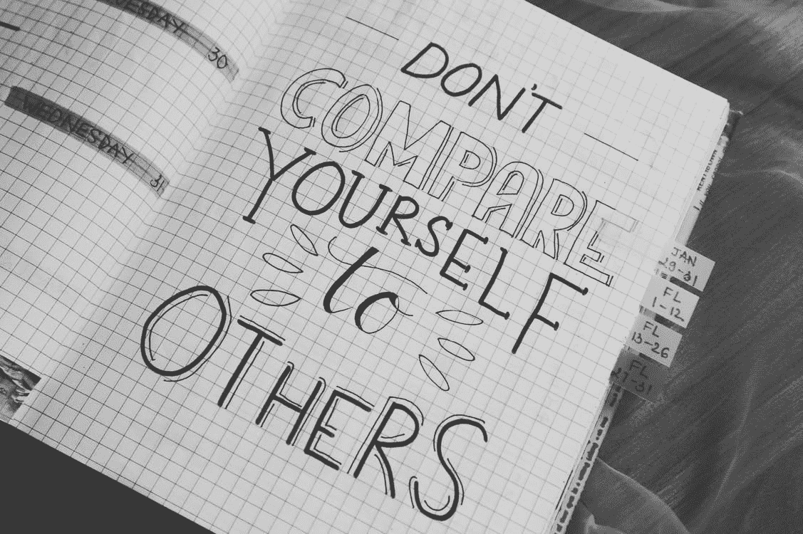

# 不要拿自己和其他程序员比较

> 原文：<https://javascript.plainenglish.io/stop-comparing-yourself-to-other-programmers-bbc2d5e46840?source=collection_archive---------7----------------------->

## 我真的强迫自己停止拿自己和其他程序员比较。

[Pexels](https://www.pexels.com/photo/motivational-quotes-760728/)

看到某人的相似之处和不同之处叫做比较。

作为一名程序员，我们在一个市值万亿美元的巨大行业中工作。因此，你会发现各种类型的程序员都比你优秀，而且工作量少，报酬也比你高。

我个人认识一个年薪 4 万英镑的朋友，那个朋友一直在抱怨我们共同的朋友，他在另一家公司工作，年薪 5.5 万英镑。这里最大的相似之处是他们都是软件开发人员，有着相同的背景和相同的经历。

这种比较导致自我怀疑和焦虑。有时也会导致抑郁。我们脑子里一直有一个想法，那就是“为什么那个家伙的工资比我高？”。

## 意识到你所拥有的

我可以保证，与他人比较永远不会对我们有利。我们会对我们所拥有的东西进行不必要的抱怨，我们会对我们目前的工作场所产生非常负面的影响。

有一段时间[做一个沉默的程序员](/3-traits-of-silent-programmers-which-makes-them-unique-17c53e7c9d88)并意识到我们已经取得的成就都是我们通过巨大的努力赢得的，并且我们将不断地持续努力以取得更多成就，这将给人一种启迪。

给自己一些时间关注生活中积极的方面。渐渐地，你会发现生活中所有积极的方面，这将帮助你更加关注自己未来的目标。

## 开始为自己努力吧

从我个人的经验来看，我可以说很难终止比较的想法。但是，我们应该认识到这样一个事实，比较不会让你有任何收获。事实上，不断的比较会让事情变得更糟。

要明白这样一个事实，你只能控制你生活中的决定，这些决定将引导你成为一名程序员。努力获得晋升或努力提高自己的技能将有助于停止比较，开始专注。

别人拥有什么并不重要，唯一重要的是你拥有什么，以及你打算通过努力实现什么。

一直比较，开始自我怀疑，是非常不现实的。而不是比较确定一个目标并努力实现这个目标。追踪你实现目标的进程。与自己竞争，如果别人有所成就，欣赏他们，而不是比较。

就这样，这是文章的结尾。希望它对你有价值。[如果你喜欢这篇文章，点击这里订阅我的邮件列表。我会通过电子邮件给您发送技术相关的文章。](https://aniketz.medium.com/subscribe)

[**通过邮件获取此类文章点击这里**](https://aniketz.medium.com/subscribe) **|** [**购买 5 美元中等会员**](https://aniketz.medium.com/membership)

[如果你觉得这篇文章很有价值，那么点击这里阅读更多的技术文章](https://aniketz.medium.com/)

 [## 通过我的推荐链接加入 Medium-Aniket

### 作为一个媒体会员，你的会员费的一部分会给你阅读的作家，你可以完全接触到每一个故事…

aniketz.medium.com](https://aniketz.medium.com/membership) 

*更多内容看* [***说白了。报名参加我们的***](http://plainenglish.io/) **[***免费周报***](http://newsletter.plainenglish.io/) *。在我们的* [***社区不和谐***](https://discord.gg/GtDtUAvyhW) *获得独家获取写作机会和建议。***