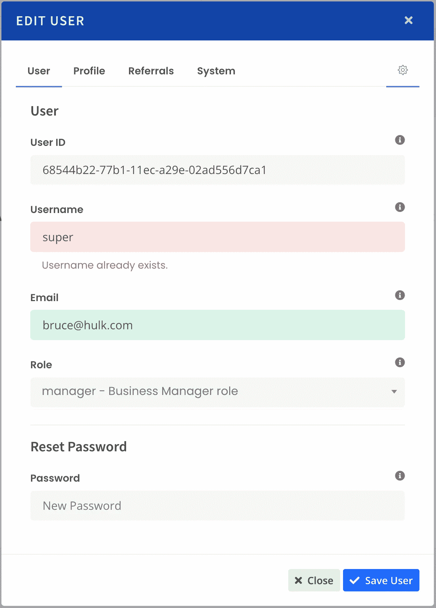

# 停止不良的用户界面验证

> 原文：<https://javascript.plainenglish.io/stop-doing-bad-ui-validation-a84bc9676bd9?source=collection_archive---------9----------------------->

## **如何以正确的方式在 JavaScript 中验证用户体验**


Image by baranq via DepositPhotos

早在 2011 年，我在迪士尼工作，为他们的下一代体验构建 UI。我们有 150 名本地开发人员和一个大规模的海外团队，他们一起工作来构建一些非常漂亮的用户界面。

我们在表单中遇到的问题和我们所有人在用户单击 save 按钮时尝试验证表单数据时遇到的问题是一样的——前端和后端之间的验证冲突。

当时，参考架构(项目中负责建立应用程序架构的人)让我们所有人用*编写 UI 和服务器端的验证器。*

这种使用与我们一起工作的团队规模的恶性分离验证引入了相当多的问题，尤其是，当一个团队在客户端 UI 上工作，另一个团队在中间件服务器端工作时，我们两个对什么是有效数据和什么不是有效数据有不同的想法。

我会编写一个 JavaScript 验证器，它在 UI 中工作得很好，但是当数据被发送到服务器时，由另一个团队编写的代码就爆炸了！，发布的数据将作为无效数据返回。

但是我按照要求做了！对吗？！

是也不是。这个问题通常与类型以及如何编写正则表达式验证器有关。但是最终，服务器总是以 ***权威权威*** 的身份赢得验证战，如果没有其他原因，没有任何东西通过服务器端的验证。

当然，你可以和一个小团队在几分钟内轻松解决这些问题，但是当中间件团队在不同的时区工作时，就需要开一张“故障单”来解决 bug 一些可能需要几天或者等待下一次冲刺才能解决的问题。

即使这样，离岸团队回来说，“这不是一个错误，软件符合要求。”他们是对的，确实如此。但是 UI 和服务器之间的差异仍然存在。

# “我们不能那样做。”

在 NGE 期间，我向参考架构提出了这个问题。我的解决方案是我所谓的“便利验证”。

“我们需要对控件的模糊性进行服务器端验证检查。在用户跳转到下一个输入字段时，对中间件进行快速 Ajax 调用，以验证用户输入。”

反应有点不温不火。"你想让我们对服务器进行 10 次不同的 Ajax 调用来验证吗？"

“是的。这有问题吗？”我问。

“我们不会那样做的。这会造成非常糟糕的用户体验。”

其实恰恰相反。

迪士尼的问题在于，他们运行的是非常庞大的系统，其中一些系统的响应能力并不那么强。这并不是说我的解决方案不好；但是迪斯尼的一些建筑会因交通流量的增加而窒息，不管这个要求有多小。

我的“便利性验证”解决方案实际上暴露了迪士尼当时的一个大问题，即缺乏足够的服务器资源来提供实现他们的 NGE 愿景所需的速度和响应时间。参考架构实际上是“降低”体验，以适应另一个团队无法控制的劣质资源。

迪士尼不是也不是唯一遇到这种问题的大型企业。美国电话电报公司和 IBM 等公司也是如此。不同的团队维护不同的系统，只能通过一个或多个全慢速 API 架构访问；所有这些加起来，你就有了一个真正的大混乱的成分。

具有讽刺意味的是，大约五年后，当我回到迪士尼时，我发现相当多的团队已经在他们的许多较新的孤立项目中进行了我的“便利性验证”!

好吧，至少我觉得自己被证明是对的。

[](/enough-why-its-time-to-rip-out-angular-7d831802c8a2) [## Angular 让公司损失了数十亿美元

### 为什么是时候杀死 Angular 了

javascript.plainenglish.io](/enough-why-its-time-to-rip-out-angular-7d831802c8a2) 

# 验证完成正确

**便利性验证**的最终目标是尽可能提供最好的用户体验。没有人想填写 10 个表单字段，点击保存按钮只会得到服务器的回应:“您的数据很糟糕”，或者用更隐晦的工程师术语:“无效字符。”

与此同时，用户挠头想知道“无效字符”到底是什么？米奇刚被解雇了吗？人们并不总是说我们的开发者行话。

然后一些开发人员决定交付最差的用户体验，清除一开始就有坏数据的表单域，或者更糟的是让您从头开始！我想揍造这种东西的工程师！

正如我之前提到的，便利验证的美妙之处在于，表单字段通过服务器自己的验证立即得到验证，只需对控件的模糊进行快速 Ajax 调用。

**使用表单类**

大多数服务器端框架都提供了实现表单类的概念。这些是 OO(面向对象)类，包含了为客户端表单域实例化和构建 HTML 的代码。大多数表单类还包括预建的验证器和/或数据过滤器。

一旦构建了表单类，在服务器端验证用户输入就变得简单了。

[](https://beau-beauchamp.medium.com/zendframework-1-reborn-b0226b77f34) [## Zend framework 1——重生！

### 为什么 ZendFramework 1 仍然优于 Laminas

beau-beauchamp.medium.com](https://beau-beauchamp.medium.com/zendframework-1-reborn-b0226b77f34) 

在 PHP 中，我见过的最好的表单实现之一是 ZendFramework 的 Zend Form 类。在 ZF1 或 ZF2 中可用(我肯定 Laminas 也有)，表单与输入控件、验证器和过滤器完全解耦，因此您可以在一行代码或几行代码中混合和匹配任何类型的数据，并验证整个表单集合。

```
if ( $form->isValid( $_POST ) ) { ... }
```

表单还允许您选择一个表单控件，并针对一个控件验证一段数据(Zend 将输入字段称为“元素”)。

```
if ( $form->getElement( 'username' )->isValid( $_POST['username'] ) ) { ... }
```

现在，只需编写一个对验证服务的简单 Ajax 调用，传入表单名称、控件名称和来自要验证的控件的数据，就可以方便地启动和运行验证了。

这里的目标是向用户返回一个即时的视觉响应，让他们知道他们刚刚输入的数据是有效的还是无效的；如果无效，用简单易懂的语言告诉用户为什么服务器不接受他们的输入。

# 放在一起

我们中的许多人，如果不是大多数人，已经在我们的注册表单中建立了一些方便的验证。例如，最好的注册表单，那些要求用户输入新用户名的表单，会自动检查(验证)他们新输入的用户名是否已经存在于系统中。

信不信由你，我见过这些表单在 keyup 上有效，而不仅仅是在 blur 上！(不管是谁建造了这些，你们都太棒了！)

老虎平台 是便利性验证工作的一个典型例子。

1.  一个客户端验证插件自动找到并附加到任何具有**数据有效**属性的表单控件。

```
initAutoValidate : function ( ) { return $( ‘input[data-valid], select[data-valid]’ )
        .not( ‘input[type=hidden]’ )
        .not( ‘.no-validate’ ).each( function( i, el ) {
        Class._setAjaxValidate( el );
    });},
```

2.在控件模糊时，运行 AjaxValidate。

```
_setAjaxValidate : function ( el ) { let $this = $( el ); if ( $this.is(‘input:radio’) ) { 
        $this.on( ‘click.autovalidate’, Class._ajaxValidate ); 
    }
    else if ( $this.is(‘input’) ) { 
        $this.on( ‘blur.autovalidate’, Class._ajaxValidate ); 
    } // Set detection so we only validate on changed fields.
    // If data-value is different than the conrol's value,
    // then run the validation.
    $this.attr( ‘data-value’, $this.val() );},
```

3.AjaxValidate 类是对验证服务的简单 jQuery Ajax 请求。如果你愿意，你可以在 GitHub 上看到完整的 JS 代码 [**。**](https://github.com/WebTigers/Tiger/blob/master/application/modules/core/assets/js/tiger/tigerForm.js)

4.在 Tiger 平台的 [**核心服务 Validate**](https://github.com/WebTigers/Tiger/blob/master/application/modules/core/services/Validate.php) 类中，数据负载通过 [**TIGER 服务**](https://medium.com/p/d43e6ef80cbe) 交付，负载自动实例化必要的表单并验证表单字段。

```
if ($element->isValid($params[‘value’], $params)) { // Sends a success response // $this->_response->result = 1;
    $this->_response->form = $this->_form->getName();
    $this->_response->element = $params[‘element’];
    $this->_response->messages = [];} else { // Sends an error response // $this->_setElementMessages($element); $this->_response->result = 0;
    $this->_response->form = $this->_form->getName();
    $this->_response->element = $params[‘element’];}
```

[](/rest-is-dying-get-rid-of-it-d43e6ef80cbe) [## 休息是垂死挣扎。摆脱它。

### TIGER:您现在可以使用的更简单的高级 web 服务

javascript.plainenglish.io](/rest-is-dying-get-rid-of-it-d43e6ef80cbe) 

5.最后一步是使用服务器响应，设置字段级错误消息和/或为有效或无效字段设置一些可选的 CSS 类。

Tiger 使用 Bootstrap 的 alt 字段进行用户输入，所以当我们在这些字段中切换时，服务器会对我们的输入做出一些非常清晰的响应。



现在，用户可以清楚地看到哪些字段通过了规范的服务器端验证器，哪些没有通过，以及原因。

# 结论

便利性验证通过以下方式极大地简化了应用程序的表单，并提供了最佳的用户体验:

*   使用与服务器本身用来保存数据的验证码完全相同的验证码来验证用户输入；
*   通过消除编写或交付单独的客户端验证代码的需要，减少代码膨胀；
*   向用户提供他们的输入无效的即时规范反馈；
*   创建一个更加干净和愉快的用户体验，当用户点击保存按钮时，不会有不好的事情发生。

没有人喜欢试图保存一个充满手动输入的表单，却得到一些他们没有预料到的深奥的错误消息，尤其是密码不符合要求，或者用户名甚至电子邮件地址已经存在。

善待你的用户，在他们点击保存按钮之前给他们方便的验证！

[](https://beau-beauchamp.medium.com/php-is-killing-python-2be459364284) [## PHP 正在杀死 Python

### 为什么 PHP 比以往任何时候都更受欢迎，也更令人讨厌

beau-beauchamp.medium.com](https://beau-beauchamp.medium.com/php-is-killing-python-2be459364284) 

____________________

Beau Beauchamp 是一名 web 应用程序架构师，拥有 20 多年在云中开发企业级应用程序的经验；他是[*WebTigers*](https://webtigers.com)*的创始人，也是老虎平台背后的首席开发者。*

*更多内容看* [***说白了。报名参加我们的***](http://plainenglish.io/) **[***免费周报***](http://newsletter.plainenglish.io/) *。在我们的* [***社区不和谐***](https://discord.gg/GtDtUAvyhW) *获得独家获取写作机会和建议。***