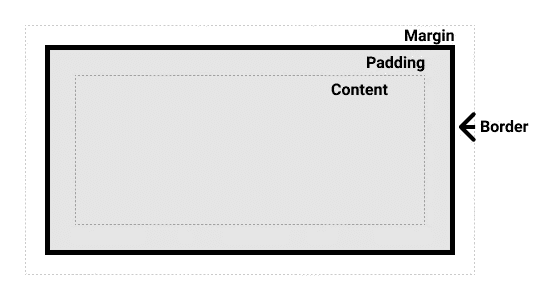
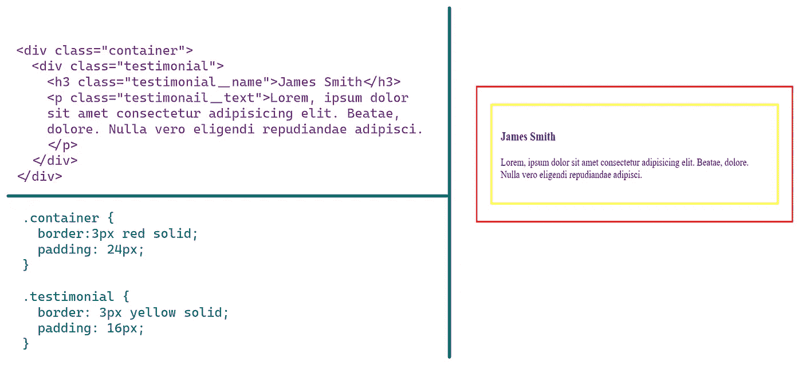
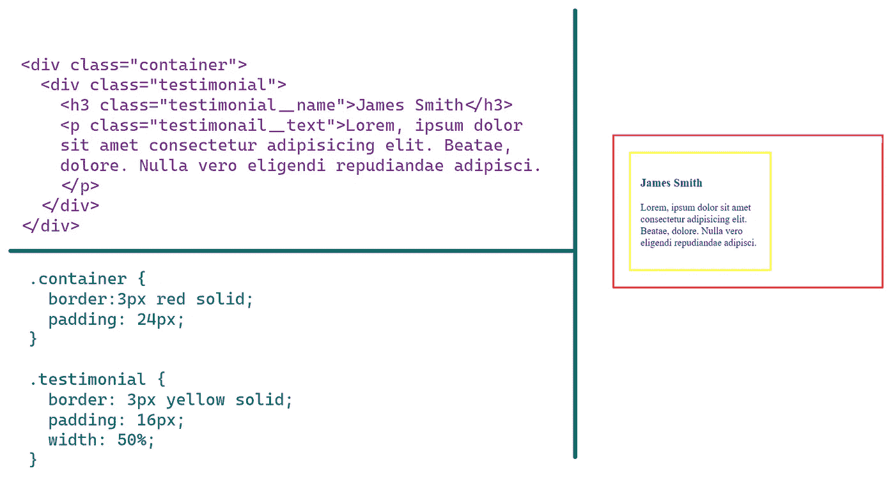
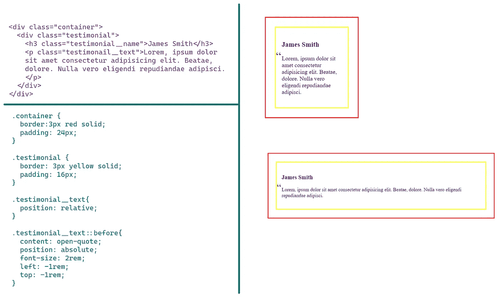
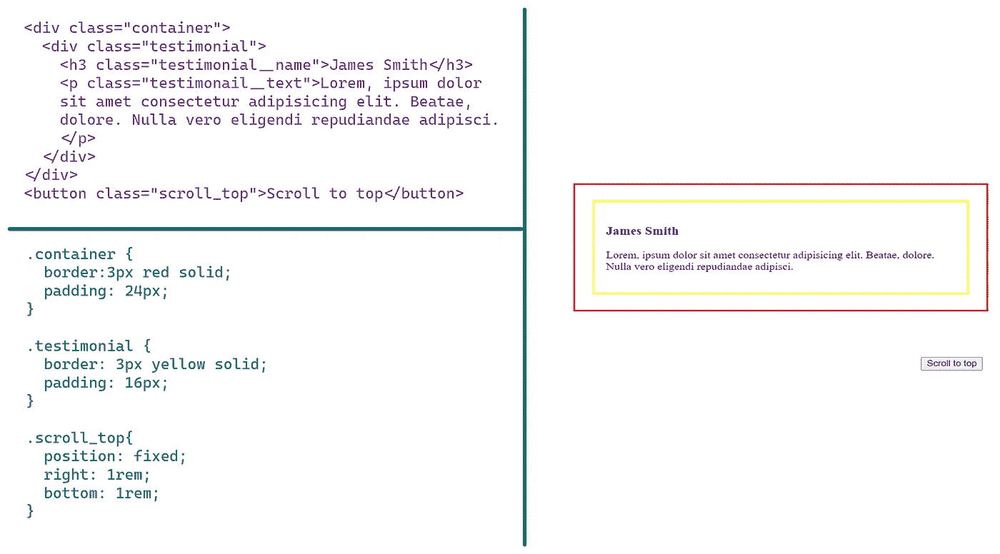

# 停止与 CSS 定位的斗争

> 原文：<https://javascript.plainenglish.io/stop-struggling-with-css-positioning-bce8ebb6ab73?source=collection_archive---------6----------------------->

Photo by [Tim Gouw](https://www.pexels.com/photo/man-in-white-shirt-using-macbook-pro-52608/)

您将元素定位为绝对元素。但是现在你在让它做出反应上遇到了问题。

或者你做了一些固定的东西，并且知道它一直对你有效。但是现在它不再与视口保持固定。

或者您声明了一些粘性的东西，并且确信您已经正确地设置了它。但是已经不贴了。

听起来耳熟吗？

别担心，你并不孤单。无论何时定位一个元素，无论是绝对的、固定的还是其他的，都会影响它与周围元素的交互方式。

要掌握 CSS 中的定位，你需要了解 ***包含块——***一个很少被谈到**的基本概念。**

让我们在这篇文章中了解一下。

# 为什么包含块有用？

元素的大小和位置通常受其包含的块的影响。 *percentage* 中应用于绝对元素的高度、宽度、填充、边距和偏移量属性的值是从该元素的包含块中计算出来的。

# 元素的布局

在深入包含块之前，理解浏览器如何布局元素是很重要的。

每当浏览器构建布局时，它都会为每个元素创建一个框。每个框被分成 4 个区域——*内容区、填充区、空白区和边框区。*

[Layout of an element](https://developer.mozilla.org/en-US/docs/Web/CSS/Containing_block)

# 静态、相对和粘性定位

如果一个元素的位置有值`static`、`relative`或`sticky`，包含的块将是该元素的祖先树中最近的块级元素的内容区域。

让我们看一个例子来看看它是如何工作的。

在这个例子中`h3`是静态定位的。所以它的包含块是`testimonial`T5 的内容区域，因为它是最近的块级容器。

让我们把`testimonial`的宽度设为 50%。50%是什么？它将是`container` `div`内容区域的 50%,是它的包含块。

# 绝对定位

如果元素的位置是`absolute`，包含块将是祖先树中位置值不是`static`的最近元素的填充区域。

让我们看看它是如何工作的。假设我们想给上面例子中的`p`元素添加引号。

我们需要在`p`元素上使用相对位置。我们将对伪元素使用绝对位置，因此这种相对定位确保伪元素相对于`p`元素的填充区域定位，而不是完全脱离文档流。

这太棒了。它适用于不同尺寸的屏幕。

# 固定定位

如果一个元素的位置是`fixed`，那么包含的块就是页面区域的视口。

让我们用这些知识来创建一个滚动到顶部的按钮，它允许用户不需要太多的努力就可以返回到顶部。这些按钮通常浮动在页面的右下角。

首先，我们将创建一个简单的`button`。然后我们将使用`position: fixed`来保持按钮在屏幕的底部。

# 包扎

今天，您学习了确定元素的包含块的过程取决于元素的位置属性。

1.  如果一个元素的位置有值`static`、`relative`或`sticky`，包含的块将是该元素的祖先树中最近的块级元素的内容区域。
2.  如果元素的位置是`absolute`，包含块将是祖先树中位置值不是`static`的最近元素的下一个填充区域。
3.  如果一个元素的位置是`fixed`，包含的块将是页面区域的视口。

希望现在定位一个元素会不那么可怕。你还有什么问题吗？如果你愿意，请在下面留下你的评论，我会尽快回复你。

*如果你喜欢这个，请看看我的**[***其他作品***](https://tahajiru.start.page/)**也一样。***

***更多内容请看*[***plain English . io***](https://plainenglish.io/)*。报名参加我们的* [***免费周报***](http://newsletter.plainenglish.io/) *。关注我们关于*[***Twitter***](https://twitter.com/inPlainEngHQ)[***LinkedIn***](https://www.linkedin.com/company/inplainenglish/)*[***YouTube***](https://www.youtube.com/channel/UCtipWUghju290NWcn8jhyAw)*[***不和***](https://discord.gg/GtDtUAvyhW) ***。*******

*****对缩放您的软件启动感兴趣*** *？检查* [***电路***](https://circuit.ooo/?utm=publication-post-cta) *。***