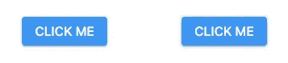
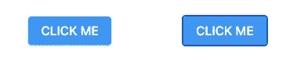
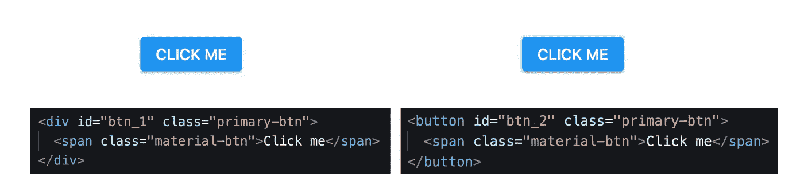

# 别再用 div 做按钮了！

> 原文：<https://javascript.plainenglish.io/stop-using-divs-for-buttons-87a0b3d7945e?source=collection_archive---------6----------------------->

## 语义 HTML 和 web 可访问性介绍


Photo by [Karolina Grabowska](https://www.pexels.com/de-de/@karolina-grabowska?utm_content=attributionCopyText&utm_medium=referral&utm_source=pexels) from [Pexels](https://www.pexels.com/de-de/foto/mann-person-hande-palme-4379959/?utm_content=attributionCopyText&utm_medium=referral&utm_source=pexels)

也许你在疑惑:**他到底是什么意思？**用 HTML 构建一个按钮通常是在第一个“Hello World”教程之后通过简单地使用`button`标签来完成的。基本上，你是对的。不幸的是，有太多可怕的按钮对许多人来说是不可触及的。

让我们来看看两个按钮。你可以在这里找到他们。



Two HTML buttons

他们看起来完全一样，不是吗？我们可以争论这些按钮是否好看，但这不是重点。让我们继续用我们的两个按钮访问[页面，然后把鼠标拿开。尝试单击第一个按钮。如果你不熟悉键盘导航，你通常可以使用键盘的 TAB 键来选择网站上可交互的元素。一旦它们被聚焦，我们可以按 ENTER 来触发它们。如果你在打电话，不要担心，我会告诉你发生了什么。](https://web-platform-pmpbnu.stackblitz.io/)

[](https://medium.com/@mariusbongarts11/we-are-all-disabled-2ea7aa7edaf7) [## 我们都是残疾人！

### 每个人都从可访问的万维网中受益。

medium.com](https://medium.com/@mariusbongarts11/we-are-all-disabled-2ea7aa7edaf7) 

让我们看看，当我使用这两个按钮访问页面并使用 TAB 键选择第一个按钮时会发生什么:



Two HTML buttons with a focused one on the right

我保证，我只按了一次 TAB。您可以看到右边的按钮被聚焦。没有鼠标是没有机会和第一个按钮互动的。对于喜欢用键盘浏览网站的人来说，这很烦人。但更重要的是，许多人，包括许多精细运动控制有限的老年用户，依赖键盘导航，无法与网站互动。

> “网络的力量在于它的普遍性。无论是否残疾，每个人都能获得是一个重要方面。”—蒂姆·伯纳斯·李

让我们弄清楚为什么我们的第一个按钮是不可聚焦的。我们需要检查代码以了解发生了什么。这是我们两个按钮的 HTML 标记的样子:



Two HTML buttons with their code

您可以看到我们的按钮的标记看起来不同。第一个使用了一个`div`标签，第二个使用了一个`button`标签。相应的 CSS 只是让各个部分看起来一样。毕竟，您可以使用 CSS 和 JavaScript 的组合来让任何 HTML 元素按照您想要的方式运行。

但是为什么只能关注第二个而不是第一个按钮呢？为了理解这一点，我们需要看看语义的 html 元素和非语义的 html 元素的区别。

[](https://medium.com/@mariusbongarts11/4-simple-steps-to-make-your-website-accessible-a29ec305da1e) [## 让你的网站易于访问的 4 个简单步骤

### “网络的力量在于它的普遍性。无论是否残疾，每个人都能获得是一个重要方面。”—…

medium.com](https://medium.com/@mariusbongarts11/4-simple-steps-to-make-your-website-accessible-a29ec305da1e) 

# 语义元素

为特定目的正确使用语义 HTML 元素是可访问性设计的基础，可显著提高网站的可访问性。**网页可访问性**意味着我们应该设计网站、工具和技术，以便残障人士可以使用它们。更具体地说，人们可以感知、理解、导航网络，并与网络互动。此外，爬行机器人可以更好地访问你的网站，这将提高你的页面的搜索引擎优化得分。

> *“语义元素=有意义的元素。”——*[*w3schools.com*](https://www.w3schools.com/html/html5_semantic_elements.asp)

当**的非语义**元素如`<div>`和`<span>`对其内容一无所知时，**的语义**元素如`<button>`、`<form>`或`<table>`清楚地向浏览器和开发者描述了其含义。大约有 100 个语义[元素](https://developer.mozilla.org/en-US/docs/Web/HTML/Element)可用。

在我们的例子中，为按钮使用`<button>`标签会自动赋予页面内置的可访问性特性。我们可以通过键盘、手指、语音命令或其他辅助技术来使用我们的按钮。此外，还应用了一些默认的 CSS 规则。这些规则取决于用户代理的平台，但是您可以使用 CSS 来更改外观。如果我们使用非语义元素设计一个按钮，所有这些都会丢失。当然，我们可以给 div-button 添加一个`tabindex=”0"`属性。但是，为什么所有的努力？

让我们看看另一个例子。许多网站包含这样的 HTML 代码来表示**导航**、**页眉**和**页脚**:

```
<body> <div class="nav"></div> <div class=”header”></div> <div class=”footer”></div></body>
```

但是，我们应该使用 HTML 语义元素:`<nav>`、`<header>`和`<footer>`。例如，下面是引用来自 [MDN](https://developer.mozilla.org/en-US/docs/Web/HTML/Element/header) 的`<**header**>`元素的语义:

> *“*`***<header>***`*HTML 元素表示介绍性内容，通常是一组介绍性或导航帮助。它可能包含一些标题元素，也可能包含徽标、搜索表单、作者姓名和其他元素。*

这就是我们的网站使用语义元素的样子:

```
<body> <nav></nav>

  <header></header> <footer></footer></body>
```

拥有这种结构会自动赋予我们的页面内置的辅助功能，并使**屏幕阅读器**能够轻松访问我们的网站。

# **最终想法**

许多开发人员在任何事情上都使用 div。在这个过程中，网站的质量大打折扣。不幸的是，在构建软件和网站时，通常很少关注可访问性。这造成了阻碍人们使用产品和服务的障碍。同时，网络提供了所有必要的先决条件，使每个人都能不受限制地访问。

使用正确的**语义元素**将使你的 web 应用程序更易访问，每个人都会从中受益。不仅如此，高度可访问的软件还会带来其他好处，比如更好的搜索引擎优化或更好的整体用户体验和满意度。遵循 [4 个步骤使你的网站易于访问](https://medium.com/@mariusbongarts11/4-simple-steps-to-make-your-website-accessible-a29ec305da1e)可以成为每个人都可以访问的网站的下一步。

我希望你喜欢阅读这篇文章。我总是很乐意回答问题，也乐于接受批评。随时联系我😊

[**这里是无限制访问介质上每一个内容的链接**](https://medium.com/@mariusbongarts/membership) 。如果你用这个链接注册，我会赚一小笔钱，不需要你额外付费。

[](https://medium.com/@mariusbongarts/membership) [## 通过我的推荐链接加入 Medium-Marius bong arts

### 作为一个媒体会员，你的会员费的一部分会给你阅读的作家，你可以完全接触到每一个故事…

medium.com](https://medium.com/@mariusbongarts/membership) 

关注我不要错过以下文章。我写了关于 Typescript、Web 组件、前端框架、软件设计模式、Web 可访问性、Chrome 扩展以及更多主题的文章！🙏

# 关于作者

Marius Bongarts 是埃森哲互动公司的软件工程分析师。他还创建了 [Web Highlights Chrome 扩展](https://chrome.google.com/webstore/detail/web-highlights-%20-bookmark/hldjnlbobkdkghfidgoecgmklcemanhm)，允许成千上万的用户在每个网站上创建文本亮点和书签。通过提供标签和目录，您可以在 web-highlights.com 的[上的相应网络应用程序中轻松重新找到您的网络研究。看看吧！](https://web-highlights.com/home)

通过**[**LinkedIn**](https://www.linkedin.com/in/marius-bongarts-6b3638171/)**联系我或者在 [**Twitter**](https://twitter.com/MariusBongarts) 上关注我。****

****[](https://medium.com/@mariusbongarts11/will-web-components-replace-frontend-frameworks-535891d779ba) [## Web 组件会取代前端框架吗？

### 它们是为解决不同的问题而构建的。

medium.com](https://medium.com/@mariusbongarts11/will-web-components-replace-frontend-frameworks-535891d779ba) [](https://medium.com/@mariusbongarts11/my-journey-to-the-first-9-99-with-my-side-project-3edc13dd1f2d) [## 我的第一个 9.99 美元之旅与我的副业

### Chrome 扩展带来的被动收入

medium.com](https://medium.com/@mariusbongarts11/my-journey-to-the-first-9-99-with-my-side-project-3edc13dd1f2d) [](https://medium.com/@mariusbongarts11/efficient-research-with-web-highlights-c4aaab3c82d4) [## 利用 Web 亮点进行高效研究

### 组织你的研究的#1 Chrome 扩展

medium.com](https://medium.com/@mariusbongarts11/efficient-research-with-web-highlights-c4aaab3c82d4) 

*更多内容请看* [***说白了就是***](https://plainenglish.io/) *。报名参加我们的* [***免费每周简讯***](http://newsletter.plainenglish.io/) *。关注我们* [***推特***](https://twitter.com/inPlainEngHQ) *和*[***LinkedIn***](https://www.linkedin.com/company/inplainenglish/)*。查看我们的* [***社区不和谐***](https://discord.gg/GtDtUAvyhW) *加入我们的* [***人才集体***](https://inplainenglish.pallet.com/talent/welcome) *。*****