# 停止使用 For 循环，改用迭代器

> 原文：<https://javascript.plainenglish.io/stop-using-for-loops-use-iterators-instead-javascript-62682c74427d?source=collection_archive---------0----------------------->

## For 循环不再是 JavaScript 中迭代数组的最佳方式。相反，使用数组迭代器函数。这里有六个数组原型函数可以用来代替 for 循环。

Modified by [The Soggy Waffle](https://medium.com/@thesoggywaffle) – Original by [愚木混株 cdd20](https://unsplash.com/@cdd20?utm_source=unsplash&utm_medium=referral&utm_content=creditCopyText) on [Unsplash](https://unsplash.com/s/photos/loop?utm_source=unsplash&utm_medium=referral&utm_content=creditCopyText)

For 循环是所有实用代码的基础。从 AP 计算机科学(又名 AP For Loops)到你现在的开发角色，for-loops 无处不在。多年来，JavaScript 标准比其他语言进步得快得多。

通常，您会在 JavaScript 中编写一个常规的 for 循环。此外，您可以编写 for-in 循环或 for-of 循环(类似于 Java 中的 for-each 循环)来使您的代码更易于阅读。

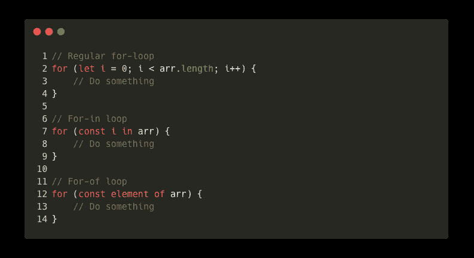

The three for-loops of JavaScript (for array traversal)

不要在 JavaScript(和 TypeScript)中使用普通的 for 循环，而是使用 JavaScript 已经提供的迭代实用程序来:

*   让你的代码更容易阅读
*   简明地描述你的循环做了什么(不带注释)
*   减少行数来完成同样的事情

在本文中，我将介绍以下`Array`功能:

*   `**map**` —基于另一个数组的值生成一个新数组
*   `**filter**` —从数组中过滤值
*   `**forEach**` —对数组中的每个元素执行操作
*   `**sort**` —根据自定义比较函数对数组进行排序
*   `**concat**` —组合两个数组
*   `**every**` —对每个元素执行验证检查

# ⧟映射一个数组

数组映射对每个数组元素进行操作，并基于这些值创建另一个数组。

举一个简单的例子:您有一个数字列表，您想用对象创建另一个数组。每个对象应该包含 double、triple 和 squared 值。

在 JavaScript 中，通常的方法是十行代码。

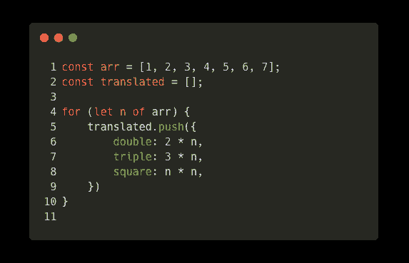

Mapping an array using for-loops

您可以将其减少到只有 7 行代码。您还受益于`map`关键字，所以其他程序员知道您打算映射数组。

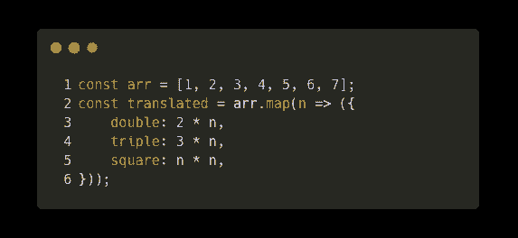

Mapping an array using the map prototype function

# ▦滤波值

过滤是 JavaScript 中的标准过程。有时数组会包含您想忽略的值。例如，在线商店使用过滤来减少品牌或价格范围的搜索结果。

数组过滤的可能用例是无穷无尽的。您通常会编写如下笨拙的代码:

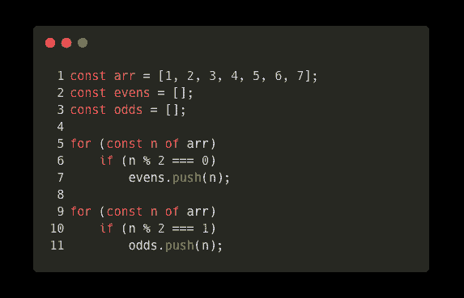

Filtering an array using for-loops

使用 JavaScript `Array.prototype.filter`函数，您现在可以轻松地过滤您的数组。您只需指定一个过滤器回调来调用元素的每个元素。JavaScript 将根据您的过滤器自动生成一个新的集合。

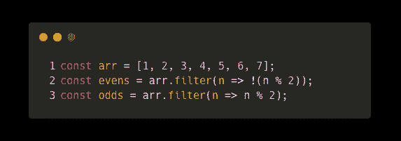

Filtering an array using the Array filter prototype function

非常欢迎你。我刚刚帮你省了八行代码。

如果您对过滤条件感到困惑，我将返回一个数字而不是一个布尔值。JavaScript 中允许用整数代替布尔值，因为`0`等价于`false` **，**以及所有其他数字都等于`true`。如果你想知道为什么你可以这样做，看看[我用 JavaScript 写的另一篇关于 falsy 类型的文章](https://medium.com/@thesoggywaffle/the-7-false-like-values-of-javascript-and-typescript-93df73bda44)。

# 🔁对于每次迭代

Oracle 首先在 Java 中引入了 for-each 循环。目标是使遍历 iterable 变得更简单。因为元素的索引在很多时候并不重要，所以 for-each 循环是首选。

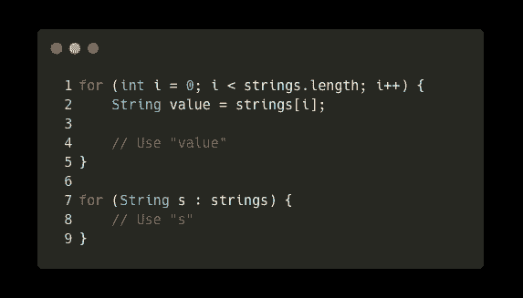

Traversing an an array in Java using a for-each loop

for-each 循环是一个了不起的发明。JavaScript 没有本地 for-each 循环。相反，EcmaScript 的最新版本使用 for-of 循环来迭代元素，或者使用 for-in 循环来迭代数组的索引。

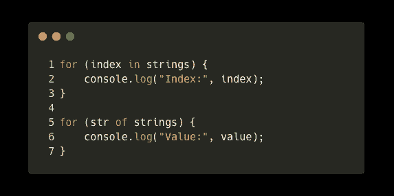

Traversing an array in JavaScript using the for-in and for-of loops

相反，JavaScript 为您提供了一个内置在`Array`原型中的通用 for-each 循环。可以通过参数列表访问当前元素、索引和整个数组；刚刚使用的是`Array.prototype.forEach`号。

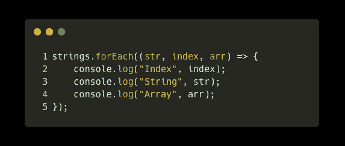

Traversing an array in JavaScript using the forEach Array prototype function

使用`forEach`方法，您可以在一个函数调用中获得`for-in`和`for-of`循环的组合。

# 🔀整理

如果你不熟悉`Array.prototype.sort`，你可能一直在编写自定义排序函数。您的排序功能将不会像`Array.prototype.sort`那样运行。您可能会写错它们，导致致命的错误。

要对数组进行排序，您可能会使用像冒泡排序这样的低效算法:

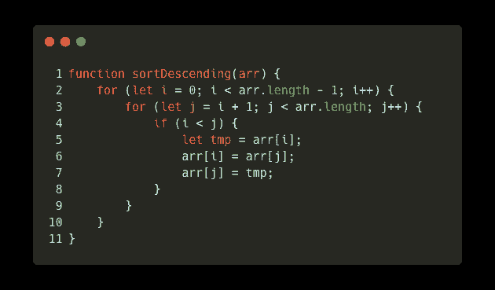

A bubble-sort implementation in JavaScript (descending order)

如果您想简化整个过程，请使用内置的`sort`功能。有了这个，你可以对任何东西进行排序，包括对象。

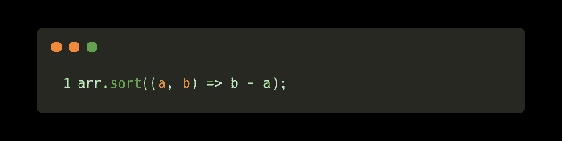

Sorting an array in JavaScript using the sort Array prototype function (descending order)

## ⚠️警告:Array.prototype.sort 的常见错误

在这一点上，我必须警告你。`Array.prototype.sort`有一个常见的程序员错误。

方法对字符串数组进行排序。如果您在一个数字数组上调用`arr.sort`，它将首先把数字转换成字符串并按字母顺序排序。只有当您省略比较函数时，才会出现这个错误，因此`sort`函数使用默认的字母排序。因此，除非您想按字母顺序对数组进行排序，否则应该提供一个比较函数。

你可以在我写的这篇文章中读到更多关于这个 bug 的内容。

# 🖇连接两个数组

程序员经常喜欢将两个对象合并成一个，有时称为“合并”合并两个字符串的过程称为串联。像字符串一样，数组也是线性数据结构(意味着数据结构通过索引以直线方式存储值)。一个名为`concat`的原型函数抛出一个包含合并值的新数组。

使用 for 循环，可以实现如下的数组连接:

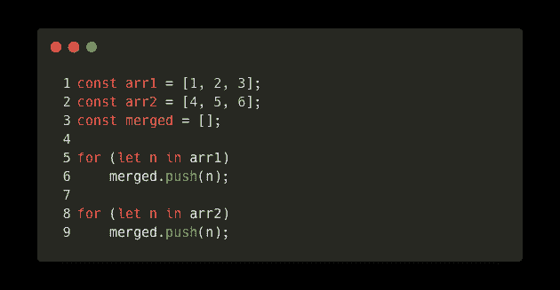

Merging two arrays in JavaScript

使用`concat`原型函数有一个更简单(也更快)的方法:

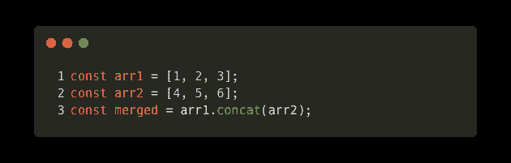

Merging two arrays using the concat Array prototype function

此外，这种合并方法清楚地表明您打算连接两个数组。

# 👌每个元素的验证

数组可以包含任何值。像 Java 这样的语言确保每个元素都是相同的类型。像 TypeScript 这样的语言在编译时执行这种检查。

如果一个元素是`undefined`，不是有效的类型，或者没有通过验证检查。JavaScript 提供了实现这一点的本地方式。

您可以这样编写一个验证器:

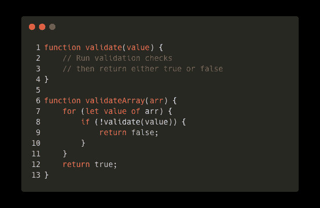

Validating each element in an array using simple iteration

但是 JavaScript 也有自己的`every`数组原型函数。与`forEach`类似，这将在每个阵列上操作。唯一的区别是回调应该返回`true`或`false`。如果是有效值，回调函数或验证函数应该返回`true`，如果是无效值，应该返回`false`。

您可以创建一个简单的验证器，如下所示:

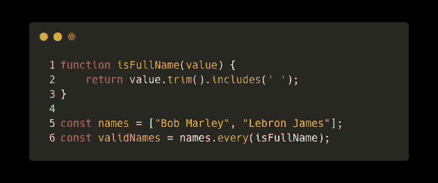

Validating an array using the every Array prototype function

如果回调函数为所有值返回 true，`every`原型函数将返回`true`。如果单个元素没有通过检查，那么它将返回`false`。

使用这些数组原型函数允许您简洁地对数组执行基本操作。此外，他们使用简短的描述性关键字来表明程序员的意图。我希望您喜欢学习这些节省时间的函数来改进您的 JavaScript 代码。

编码快乐！👍

 [## 关于 JavaScript Spread 语法您需要知道的一切

### 对象和数组是旧的。spread 语法相对较新(ES6)，但它可能是最有用的语法之一…

javascript.plainenglish.io](/everything-you-need-to-know-about-the-javascript-spread-syntax-e87adf90de35)  [## 你从来不知道的 4 个很酷的 JavaScript 控制台功能

### 这些 JavaScript 控制台函数在 web 开发课上很少谈到。

javascript.plainenglish.io](/4-cool-javascript-console-functions-you-never-knew-about-c769d24d7c18)  [## 停止使用逻辑 OR，使用？？代替

### 你可以在很多事情上使用逻辑操作符，但是不要在任何事情上都使用它们！我们现在有更好的东西了。

javascript.plainenglish.io](/stop-using-logical-or-use-null-coalescing-instead-f7668c96b0db)  [## 请停止编写 Sh*t JavaScript

### 你做错了什么，以及如何弥补。

medium.com](https://medium.com/@thesoggywaffle/please-stop-writing-sh-t-javascript-ba8fd4e1cd9e) 

*更多内容请看*[***plain English . io***](https://plainenglish.io/)*。报名参加我们的* [***免费周报***](http://newsletter.plainenglish.io/) *。关注我们关于*[***Twitter***](https://twitter.com/inPlainEngHQ)*和*[***LinkedIn***](https://www.linkedin.com/company/inplainenglish/)*。查看我们的* [***社区不和谐***](https://discord.gg/GtDtUAvyhW) *加入我们的* [***人才集体***](https://inplainenglish.pallet.com/talent/welcome) *。*