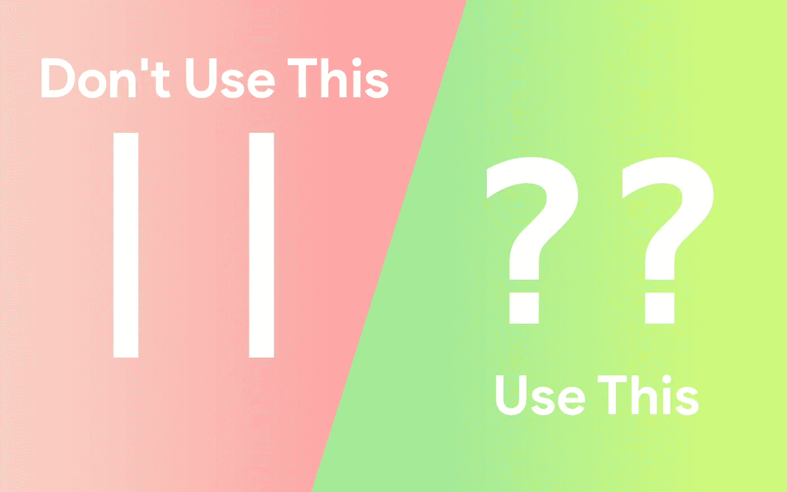
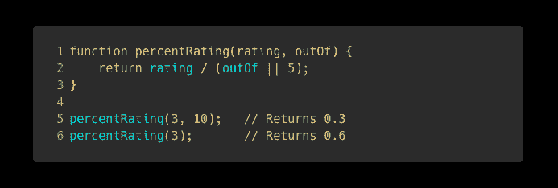
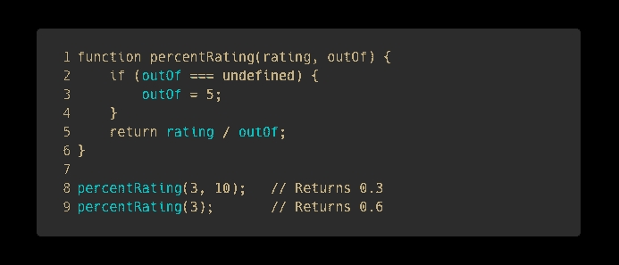
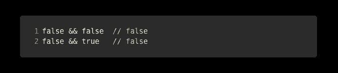
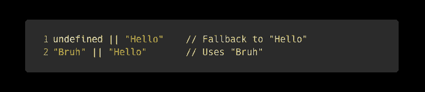
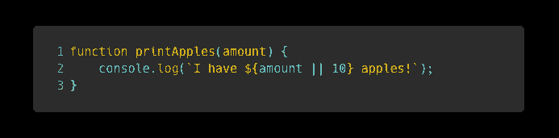
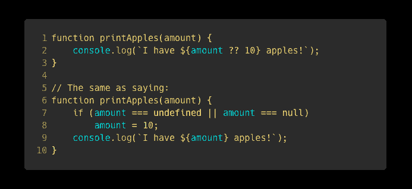

# 停止使用逻辑 OR，使用？？代替

> 原文：<https://javascript.plainenglish.io/stop-using-logical-or-use-null-coalescing-instead-f7668c96b0db?source=collection_archive---------3----------------------->

## 你可以在很多事情上使用逻辑操作符，但是不要在任何事情上都使用它们！我们现在有更好的东西了。

Seriously. Stop using the logical OR when you’re not writing boolean

JavaScript 有非常灵活的语法；你可以用不同的方式使用相同的语法表达来完成不同的事情；这是用 JavaScript 编程的好处之一。

软件开发人员(在任何语言中)在评估布尔表达式的真实性时通常使用`||`操作符。JavaScript 开发人员也可以通过其他方式使用它。

软件通常使用默认值，也称为回退值。如果数据不存在，则使用回退值。在 ES2020 之前，开发人员使用逻辑 OR 运算符来实现这一点。

outOf defaults to 5 if the argument is not provided

请注意，如果`outOf`是`null`或`undefined`，上面的代码如何使用逻辑 OR 运算符返回到 5。上面的代码是一种更好的书写方式:

Using an if-statement for providing a fallback value

首先，我们想知道为什么会这样。然后，我们还想了解为什么这可能是一个问题，是您的软件中的一个主要错误。

# 分配默认值时，逻辑 OR 运算符如何工作

在计算机科学中，有一个布尔表达式短路的概念。短路是计算机通过减少继续执行后续命令所需的操作数量来优化运行时间的方式。

任何由逻辑 AND ( `&&`)连接的真理陈述将是`false`，除非`&&`的两边都为真。所以如果`&&`操作符的左边是`false`，那么计算操作符的右边是没有意义的，因为你已经知道整个语句将是`false`。

Any logical AND will result in false if the preceding value is false

与`&&`操作器类似，`||`操作器也会短路。OR 运算的结果总是`true`，除非两边都是`false`。因此，如果 OR 操作符的左边是`true`，那么计算操作符的右边是没有意义的，因为你已经知道整个语句将是`true`。

Any logical OR will result in true if the preceding value is true

由于逻辑短路，如果不需要的话，JavaScript 引擎甚至不会费心去读取或评估操作符的右边。

在 JavaScript 中，任何值都可以计算为布尔值。我写了一整篇文章([JavaScript(和 TypeScript)](/the-7-false-like-values-of-javascript-and-typescript-93df73bda44) 的 7 个类似错误的值)讨论 JavaScript 中相当于`false`的值。这个想法是，`undefined`和`null`是`falsy`值。

使用 OR 运算符时，如果初始值未定义或为空，表达式将默认为后续值。如果初始值是`undefined` **或** `null`，JavaScript 会使用它。因此，JavaScript 开发人员经常使用`||`操作符来提供后备。

How fallback values work with the logical AND

# 逻辑 OR 的问题是

如果你还没有读我的另一篇文章，我们将在这里讨论它。尽管我强烈建议你先点击这里阅读那篇文章。

JavaScript 中有各种类似`false`的值。有的是`undefined`、`null`、`NaN`、`void`、`""`(空串)，最后是`0`。有问题的情况是`0`和一个空字符串。

假设你有一个接受数值参数的函数。如果该参数缺失，那么它应该默认为`10`。您的代码将如下所示:

A buggy function (try figuring out where the bug is)

你发现问题了吗？花一分钟试着弄明白它。(提示:参考 falsy 值列表)

如果我输入一个参数，但是输入的是数字`0`怎么办？根据 JavaScript，`0`和`false`是一样的。如果我有另一个接受字符串的函数，但是我传递了一个空字符串怎么办？那也和`false`一样。在这些情况下，`||`操作符将强制 JavaScript 使用后续值作为后备。你不会想要这个的！

# 零合并算子

ES2020 引入了指定回退值的新规范。这被称为**零合并操作符**。类似于`||`，你可以使用`??`。

对于回退值，空合并运算符的工作方式类似于`**||**`运算符。唯一的区别是，它确保如果您输入一个空字符串或一个`0`，它将使用那个值，而不是回退。

Using the null coalescing operator

当使用`||`提供默认值时，大多数 JavaScript 开发人员并没有意识到潜在的缺陷。ECMAScript 的开发人员意识到了这一点，并提供了一个方便的修复方法。请确保从现在开始使用该运算符！

编码快乐！

*更多内容看*[***o***](https://plainenglish.io/)**。报名参加我们的* [***免费周报***](http://newsletter.plainenglish.io/) *。关注我们关于*[***Twitter***](https://twitter.com/inPlainEngHQ)*和*[***LinkedIn***](https://www.linkedin.com/company/inplainenglish/)*。查看我们的* [***社区不和谐***](https://discord.gg/GtDtUAvyhW) *加入我们的* [***人才集体***](https://inplainenglish.pallet.com/talent/welcome) *。**