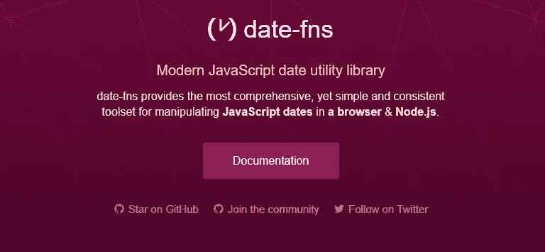

# 停止使用 Moment.js 来表示日期——这是更好的选择

> 原文：<https://javascript.plainenglish.io/stop-using-momentjs-for-dates-this-is-the-better-alternative-2709afb229a0?source=collection_archive---------8----------------------->


在 JavaScript 中使用 Date 对象可能会非常麻烦！如果你没有使用现成的数据库，你可能会花很多时间感到沮丧。

对我们开发人员来说幸运的是，有一些很棒的人在做库，使得用 JavaScript 处理日期变得更加容易。这一类别中最受欢迎的选择之一是 Moment.js。多年来，这一直是开发人员处理日期时的首选库。不幸的是，Moment.js 带来了很多开销和缺点。其中，它有一个巨大的包大小，这将大大降低您的应用程序的速度。

Moment.js 背后的人甚至建议不要使用它。

> 我们现在普遍认为 Moment 是一个处于维护模式的遗留项目。不是*死了*，而是确实是*做了*。
> 
> 考虑在你的项目中使用 Moment？*可能会有更好的现代替代品。* **出自***[**https://momentjs.com/**](https://momentjs.com/)*

*所以如果你应该停止使用 Moment.js，你可能会问应该使用哪个库。*

*Moment.js 有很多替代品。*

*   *[JavaScript 国际化 API](https://developer.mozilla.org/en-US/docs/Web/JavaScript/Reference/Global_Objects/Intl)*
*   *[日期-fns](https://date-fns.org/)*
*   *[day.js](https://github.com/iamkun/dayjs)*

*我个人最喜欢的是**约会——fns！在过去的几年里，约会变得越来越流行。它非常容易使用，可以做很多和 Moment.js 一样的事情。这个包很小，支持树抖动，并且支持类型脚本(耶！)语法也很简单，而且有很棒的文档。***

**

```
*// Install date-fns 
yarn add date-fns 
or 
npm i date-dns// Usage
import { format } from 'date-fns';
format(new Date(2014, 1, 11),   'MM/DD/YYYY');* 
```

*如上所示，Date-fns 提供了大量可以导入的函数。这允许您导入特定的函数，而无需导入整个 date-fns 库。这使得包的大小小了很多。*

*也有可能得到不同地区的支持。Date-fns 实际上支持 50 多种语言。这遵循相同的导入模式；*

```
*import { es, ru } from 'date-fns/locale'*
```

*除此之外，date-fns 的性能非常好！你可以在这里看到一个对比测试:[https://github.com/josemussa/date-fns-momentjs-perf-test](https://github.com/josemussa/date-fns-momentjs-perf-test)它与力矩的对比*

*它还支持我个人非常喜欢的 Typescript！date-fns 库是最好的选择，它为在浏览器 Node.js 环境中处理 JavaScript 日期提供了最全面而简单的工具*

*感谢阅读，我希望你喜欢这篇文章，如果是的话，请点击按钮或订阅来支持我。*

*如果你还不是中等会员，考虑成为一名吧！你可以接触到很棒的内容，并有机会与他人分享你自己的知识。 [**在这里注册每月只需 5 美元。**](https://nickychristensen.medium.com/membership)*

*[](/javascript-a-deep-dive-into-sets-489b7a3dc06d) [## JavaScript:对集合的深入探究

### 布景太棒了

javascript.plainenglish.io](/javascript-a-deep-dive-into-sets-489b7a3dc06d) [](/typescript-interfaces-explained-in-2-minutes-af1637b88bd4) [## 两分钟解释的类型脚本接口

### 在这篇小文章中，您将学习什么是接口，以及如何在您自己的项目中创建和使用接口。

javascript.plainenglish.io](/typescript-interfaces-explained-in-2-minutes-af1637b88bd4) [](/typescript-generics-explained-in-2-minutes-c95e49783347) [## 用 2 分钟的时间用例子解释了类型脚本泛型

### 深入探究类型脚本泛型

javascript.plainenglish.io](/typescript-generics-explained-in-2-minutes-c95e49783347) [](https://medium.com/js-dojo/vuejs-tips-best-practices-39d9962bb255) [## VueJS —技巧和最佳实践

### 在构建 Vue 应用时，你应该做什么，应该避免什么，通常只是一些简单的好建议

medium.com](https://medium.com/js-dojo/vuejs-tips-best-practices-39d9962bb255) [](https://medium.com/js-dojo/build-a-website-using-nuxt-contentful-a-step-by-step-guide-b75217ccdfa) [## 使用 Nuxt & Contentful 建立网站——一步一步的指南

### 了解如何使用 Vue/NuxtJS 构建一个简单的网站 Contentful——还包括一个 Vuex 示例。

medium.com](https://medium.com/js-dojo/build-a-website-using-nuxt-contentful-a-step-by-step-guide-b75217ccdfa) [](https://medium.com/front-end-weekly/a-closer-look-on-array-reduce-with-useful-examples-34f222664e66) [## 通过有用的示例进一步了解 array.reduce()

### 提高您的 javascript 技能，并通过一些有用的示例学习如何使用 Array.prototype.reduce()

medium.com](https://medium.com/front-end-weekly/a-closer-look-on-array-reduce-with-useful-examples-34f222664e66) 

***如果你想找个时间和我聊聊，就关注我的***[***Twitter***](https://twitter.com/nickycdk)***|***[***LinkedIn***](https://www.linkedin.com/in/dknickychristensen/)***或者直接访问我的*** [***网站***](https://nickychristensen.dk/) ***(那个)***

*更多内容看* [***说白了。报名参加我们的***](http://plainenglish.io/) **[***免费周报***](http://newsletter.plainenglish.io/) *。在我们的* [***社区获得独家写作机会和建议***](https://discord.gg/GtDtUAvyhW) *。****