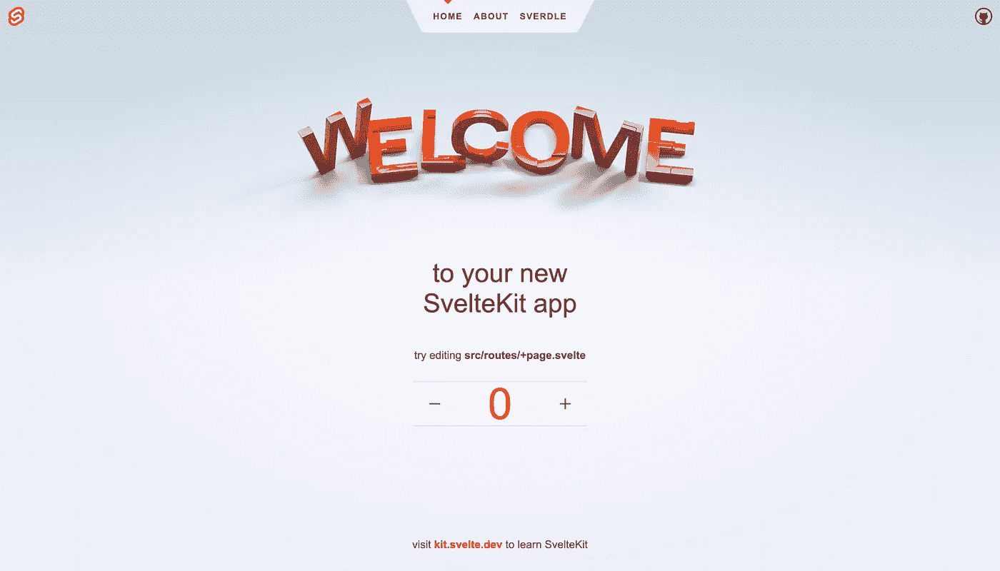
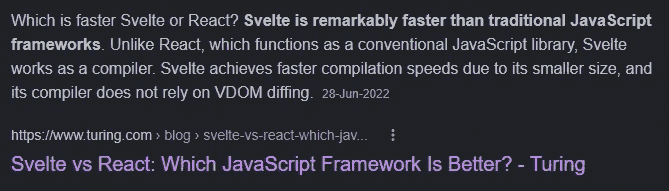
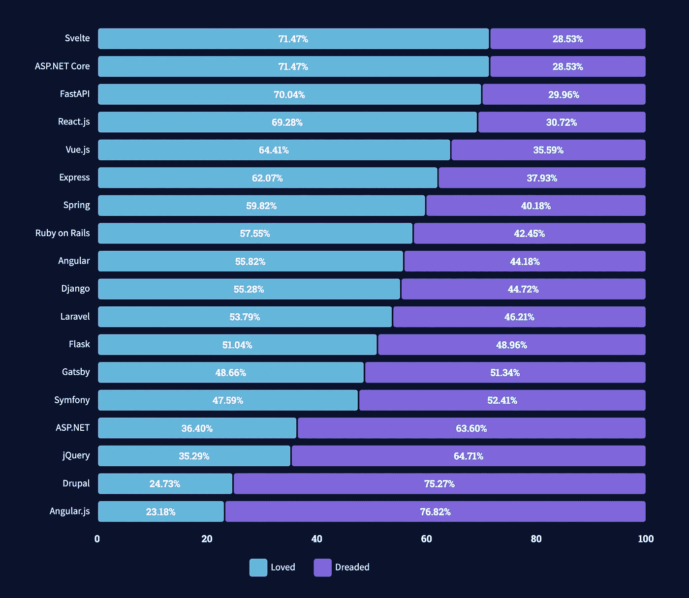

# 停止使用反应，角度，或 Vue，切换到苗条

> 原文：<https://javascript.plainenglish.io/stop-using-react-angular-or-vue-switch-to-svelte-bbd53f94413c?source=collection_archive---------1----------------------->

## 根据 2021 年开发者调查，Svelte 成为最受欢迎的框架。


Photo by [Victor](https://unsplash.com/@victor_g?utm_source=medium&utm_medium=referral) on [Unsplash](https://unsplash.com?utm_source=medium&utm_medium=referral)

在 JavaScript 框架方面，大多数开发者只熟悉 React、Angular 或 Vue。但是，当我告诉你利用苗条，你会感到吃惊，想知道为什么。不要在意；我会解释原因。

让我们从头开始。

作为一名专业的 React 开发人员，我一直认为 React 库是最容易用于构建网站的库之一。毫无疑问，到目前为止都是如此，这就是为什么我没有研究过任何其他框架，比如 Angular 或 Vue。

虚拟 dom 的概念，当事情发生变化时呈现组件的方法，函数钩子的概念，以及我怎么能忘记 useEffect 钩子。

甚至编写代码也很简单。

下面是一个代码示例，当您单击按钮时，它可以增加计数。

```
import React, { useState } from 'react';

function IncrementCount() {
  const [count, setCount] = useState(0);

  return (
    <div>
      <p>You clicked {count} times</p>
      <button onClick={() => setCount(count + 1)}>
        Click me
      </button>
    </div>
  );
}
```

很酷，对吧？

这也是我用 React 几年的原因。是的，我从来没有考虑过学习 Angular，Vue，或者其他任何 JavaScript 框架。然而，我有许多经常使用 Angular 或 Vue 的朋友，他们让我了解最新的发展。

后来，我发现了 Next.js，并在我的几个项目中使用了它。

事实上，Next.js 是一个 javascript 框架，它允许我们使用 React 来构建静态网页或 web 应用程序。我们有服务器端渲染、类型脚本支持、智能绑定、路由预取以及更多功能。

然而，在接到一个基于 Svelte 的项目后，我掌握了它的基本原理。我真的很喜欢它，这就是我写这篇文章的原因。

请记住，这篇文章没有得到任何形式的赞助，也没有人付钱让我谈论苗条。我喜欢这个框架，就这样。

让我们开始吧。

# 苗条——创建网站的现代方式

根据维基百科，Svelte 是一个免费开源的前端编译器，允许你以最简单的方式构建网络应用。

如果不清楚，我来解释一下。

把它看作一个前端框架，或者更准确地说，一个编译器，一种设计用户界面的新方法。其他前端框架，如 React 和 Vue 在浏览器中工作，但 Svelte 在编译阶段工作，使其快速而紧凑。

它编译 HTML 模板以产生直接改变文档对象模型的独特代码。这就是为什么它没有经历与虚拟 DOM 相关的开销，相反，React 和其他传统的 JavaScript 框架。

设置也很简单。

```
npm create svelte@latest my-app
cd my-app
npm install
npm run dev -- --open
```

在这里，我们正在制作一个苗条的应用程序，使用 cd 进入我的应用程序目录，下载一些包，然后执行应用程序。

这是最后的结果。



我想到的下一件事是路由。

我一直很喜欢 Next.js 中路由的工作方式，简而言之，你需要做的就是在 pages 文件夹中创建一些文件。

在 Svelte 中使用了类似的路由方法。

例如:

1.  它将创建一个网址为“mywebsite.com/”的网站
2.  `src/routes/about/+page.svelte` = >将使用 URL“www . my website . com/about”创建“关于”页面

我希望你明白如何制定路线。

接下来呢？

# 苗条的布局

在 React 或任何其他库或框架中，您必须在一个文件中编写 javascript 代码，在另一个文件中编写 CSS 代码。

Nitin，我们可以使用内联 CSS。当然，我的朋友，但是我们不经常这样做。

同样，如果只是用 HTML、CSS、JavaScript 做一个网站，就必须产生三个文件。

难不难？

所以让我带你看一下在一个简单的文件中编写代码的过程。

```
<script>
 // logic goes here
</script>

<div>
  <!-- HTML goes here -->
</div>

<style>
  /* styles go here */
</style>
```

很简单，对吧？

Nitin，仅仅因为简单的走线或者基于布局而使用 Svelte 是没有意义的。

我了解我的朋友，所以让我们来谈谈速度。

# 苗条身材的主要特征

用户在使用网站或应用程序时想要什么？重要的是它工作时的速度。

如果一个网站需要很长时间来加载和处理逻辑，用户肯定会鄙视使用它。

苗条被认为是解决这个问题的最佳人选之一。



Src: Gogle

你接下来想到的是其他程序员是否在使用它。

让我也对此作出回应。

根据 [2021 年开发者调查](https://insights.stackoverflow.com/survey/2021#section-most-loved-dreaded-and-wanted-web-frameworks)，Svelte 成为最受欢迎的框架。



Src: [StackOverflow](https://insights.stackoverflow.com/survey/2021#section-most-loved-dreaded-and-wanted-web-frameworks)

让我们通过讨论几个已经或正在采用苗条身材的企业来结束这篇文章。

首先，许多公司都在使用 Svelte，包括苹果、纽约时报、脸书、Brave、Spotify 和彭博。

希望你喜欢。

就这样——谢谢。

[*如果你喜欢阅读这样的故事，并想帮助我成为一名作家，请考虑成为一名中等成员*](https://nitinfab.medium.com/membership) *。每月花费 5 美元，你可以无限制地访问媒体内容。如果你通过我的链接注册，我会得到一点佣金。*

[](https://medium.com/swlh/8-killer-tools-that-are-so-valuable-they-feel-illegal-to-know-no-bs-76aa1b16f81a) [## 8 个黑仔工具是如此的有价值，以至于他们觉得知道它们是非法的——没有废话

### 请不要期待菲格玛，坎瓦，或者奎尔博特。

medium.com](https://medium.com/swlh/8-killer-tools-that-are-so-valuable-they-feel-illegal-to-know-no-bs-76aa1b16f81a) [](/9-websites-that-will-help-you-learn-web-development-faster-for-free-eb81ccea1999) [## 帮助你更快学习 Web 开发的 9 个网站——免费

### 当然，大多数你都没听说过。

javascript.plainenglish.io](/9-websites-that-will-help-you-learn-web-development-faster-for-free-eb81ccea1999) 

*更多内容请看*[***plain English . io***](https://plainenglish.io/)*。报名参加我们的* [***免费周报***](http://newsletter.plainenglish.io/) *。关注我们上*[***Twitter***](https://twitter.com/inPlainEngHQ)[***LinkedIn***](https://www.linkedin.com/company/inplainenglish/)*[***YouTube***](https://www.youtube.com/channel/UCtipWUghju290NWcn8jhyAw)**和* [***不和***](https://discord.gg/GtDtUAvyhW) *对成长黑客感兴趣？检查* [***电路***](https://circuit.ooo/) ***。*****