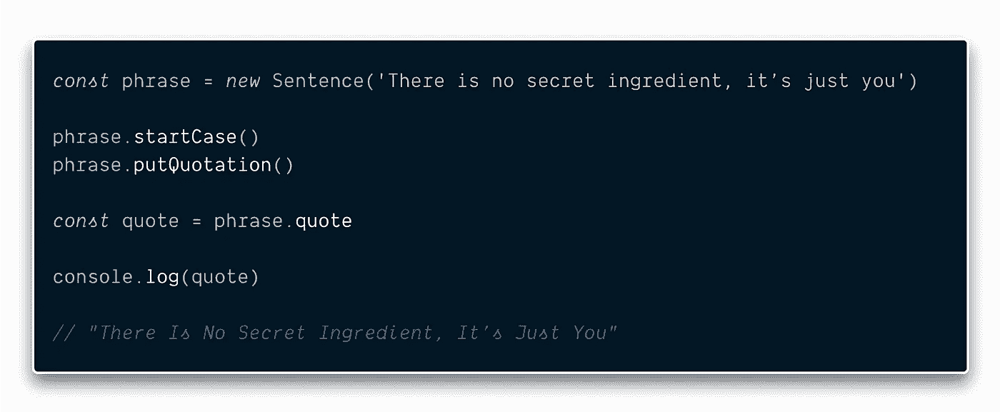

# 不要再用 JavaScript 写类了(你不需要)——用这个代替！

> 原文：<https://javascript.plainenglish.io/stop-writing-classes-in-javascript-you-dont-need-to-use-this-instead-f6d143ef7a28?source=collection_archive---------3----------------------->

玫瑰是红色的，紫罗兰是蓝色的，放弃吧——你也应该放弃！

[📷](https://unsplash.com/@guilhermestecanella?utm_source=medium&utm_medium=referral)

你知道函数式编程和共产主义有什么相似之处吗？两个仇恨阶层的追随者。

不，我不是另一个试图说服你 FP 如何优于 OOP，以及为什么你应该放弃 OOP 而使用 FP 的函数式编程狂热者。

我是来谈话的。

要进行一次谈话，我们必须一起进入这个话题——好吗？

# 哎呀——他们误解你了！

> “当我放下我是什么，我就会成为我可能成为的样子。”
> 
> ——老子

面向对象编程开发中的一个关键见解是程序各部分如何相互通信的模型。

把一个*方法名*和它的*参数*想象成一个消息。

调用方法会将消息发送到对象。每个对象都有自己的行为，当它接收到特定的消息时就会被触发。发送者假设接收者知道如何处理消息

其中一个问题是多态性。识别特定消息的每个对象都有资格接收该消息。接下来会发生什么取决于对象的专门化——这是一个非常强大的想法。

可惜，我们被**的*传承*的**分散了注意力。

继承是一种强大的代码重用模式。代码重用很重要，因为它允许我们减少开发程序的工作量。

继承建立在 ***的思想之上，除了*** 之外，其他都一样。

我们可以说，除了一些重要的区别之外，一些物体或一类物体与另一些物体或一类物体是相同的。当事情很简单的时候，这真的很有效。

应该记住，现代 OOP 始于 Smalltalk，一种面向儿童的编程语言。随着事情变得复杂，继承就成了问题。继承导致了类的紧密耦合。一个类中的变化会导致相关类失败。

> 一个人的蹩脚软件是另一个人的全职工作。

类往往是糟糕的模块。我们也看到太多的注意力放在属性上，而不是对象上。对于每个单独的属性，过分强调 ***getter*** 和 ***setter*** 方法，或者在最坏的设计中，属性是公共的，可以在对象不知道的情况下被改变。

实践良好的设计是可能的，其中属性是隐藏的，方法处理事务而不仅仅是属性突变，但是这并不经常发生。还存在对类型的过度依赖。

# 主人——给我带路！

> 有两种方法可以写出没有错误的程序；只有第三种有效。

类的使用有它的位置。在某些场合确实有道理。但是大多数情况下，你可以避免使用它们——如果可以，你应该这样做。

## 从概念上讲，JavaScript 中没有类

在 JavaScript 中，类建立在原型之上，并被用作创建对象的模板。和其他编程语言一样，它们本质上是**命令式的**。

JavaScript 的*没有*像其他面向对象语言如 Java 或 Ruby 一样有类。

在 Javascript 中，对象是在没有类的情况下创建的！

解释这一点的最佳方式是使用“生物”(如人类)与“非生物”(如汽车、家具)的真实世界类比。

JavaScript 设计中有意省略了类。

> “如果我早在 1995 年 5 月就开始学习 JavaScript，我会被告知它太像 Java 了，或者 JavaScript 正在与 Java 竞争……我接到了营销指令，要让它看起来像 Java，但又不要让它太大……它需要成为一种愚蠢的小兄弟语言。”
> 
> —布伦登·艾希

JavaScript 具有实现 OOP 的所有必要特性，在 ES6 中没有必要添加类，添加它只是为了让 Java 或 C#开发人员感到舒服。

在 JavaScript 中，函数是一等公民——函数式编程就是最大限度地使用函数。

有一个概念叫做:“ [**偏爱组合胜过继承**](https://en.wikipedia.org/wiki/Composition_over_inheritance)”**和**这里我们走的是**相反的方向**，因为**“类”**符号偏爱**“继承胜过组合”。** Class 毁了 JavaScript 的函数式编程部分。

# 模块——更好的方式

> “20 年后，你会对你没有做的事情比你做了的事情更失望。”
> 
> ——马克·吐温

函数模块应该是用 JavaScript 写代码的起点，而不是类。在特定情况下，如果需要的话，可以稍后重构

从你的代码中去掉 ***这个*** 和 ***新的*** 关键词——它们的行为与它们在其他 OO 语言中的行为不同。

理想的程序具有清晰的结构。它的工作方式很容易解释，每个部分都扮演着明确的角色。

Code with Class

Refactored Using Modules

看起来很整洁，干净，容易推理。不是吗？

但是，Som——我不认为它会在现实生活的代码库中工作。

*真的*？我不这么认为。

下面是一个基于类的代码，它把一个短语变成一个引语。

如果你在代码评审中提到这一点，大多数程序员会给出一个共同的回答:**让我们把方法*设为静态。***

There’s no need to create instances anymore.

我们去掉了实例变量——不再有突变。

我们现在也有方法，根据它的参数，确定性地返回值——它们是纯的。

太好了！这绝对是一个进步。

但是，既然我们如此接近——为什么我们不干脆完全摆脱*类呢？*

****

*Learn You Some [**import**](https://developer.mozilla.org/en-US/docs/Web/JavaScript/Reference/Statements/import) and [**export**](https://developer.mozilla.org/en-US/docs/Web/JavaScript/Reference/Statements/export) for Great Good!*

*厉害！我们做到了——我们彻底摆脱了这个阶级！*

*现在，代码是**声明性的**，更容易*测试*，更容易*调试*，并且**树可摇动——**这意味着像 Webpack 和 Rollup 这样的现代构建工具可以删除在特定情况下可能永远不会使用的函数的*死代码*。*

*这将使您的代码包变得更小。*

*模块在一组函数和常量周围形成了逻辑括号，并且在大多数情况下，对于这个目的来说，类是多余的。*

*用模块编写代码有很多好处。*

*其中最引人注目的是代码重用。*

*假设您已经编写了一些以特定方式操作 DOM 的函数——将所有这些函数作为一个' ***模块*** '放入它们自己的文件中，这意味着您可以非常容易地复制该文件并重用它！*

*您也可以使用函数来封装模块中的内部数据/状态。*

**

*The object that is returned is frozen. The object can not be damaged or corrupted. The counter variable is the object’s private property. It can only be accessed through the methods.*

*Som —实例呢？我不能直接从模块创建它吗？*

*您不能直接创建模块的实例。但是在现代 JavaScript 开发中，您真的需要经常使用实例吗？*

*在 JavaScript 中，多态和继承不会像你预期的那样工作。*

*通过原型链的行为委托与虚拟分派的工作方式不同——正如“类”和“扩展”所暗示的那样。*

**

*Always bet on Composition*

*语法主要是模仿来自其他语言的行为，这不是 JavaScript 的固有特性。它造成的混乱比它解决的还要多。*

*经典模式是一种适合所有人的模式。每个对象都必须是一个类的实例。JavaScript 将我们从这种限制中解放出来——并不是所有的对象都需要硬度。*

*大多数时候，JavaScript 中的类没有很好的用途，它们并不真正有用。*

# *结论*

*如果你的大脑还没有被 JAVA 或 C#语法弄得晕头转向，那么**模块**应该是用 JavaScript 编写代码的起点，而不是类。*

*在 JavaScript 中使用 class 的人不知道他们造成了多大的损害。如果 JavaScript 是你的第一语言——跳过 ***类*** 。学习对象和函数，然后继续学习模块。如果您想在 React 这样的框架中工作，这将是非常有益的。*

*大多数编程语言都有好的和不好的部分。*

*在 JavaScript 中，类是非常糟糕的部分。*

*明智的做法是利用好的部分，避免不好的部分。毕竟，你怎么能把坏的部分变成好的呢？*

****P.S:*** *你可能会遇到基于类的代码库(在钩子被引入之前，react 里的大部分东西都是用类组件做的)；因此，你应该熟悉他们。了解仅用于此目的的类。**

# *感谢信*

*我想利用这最后的机会说声谢谢。*

*感谢您的光临！如果没有像你这样的人跟随并带着信念阅读我的帖子，我将无法做我所做的事情。*

*我希望你能 [***和我一起***](https://polymathsomnath.medium.com/subscribe) 在 [**我未来的博客文章**](https://polymathsomnath.medium.com/subscribe) 中，留下来，因为我们这里有一些很棒的东西。*

*我希望在未来的许多年里，我能在你的职业生涯中帮助你！*

*下次见。再见！*

**更多内容请看* [***说白了就是***](http://plainenglish.io/) *。报名参加我们的* [***免费每周简讯***](http://newsletter.plainenglish.io/) *。在我们的* [***社区不和谐***](https://discord.gg/GtDtUAvyhW) *获得独家获取写作机会和建议。**