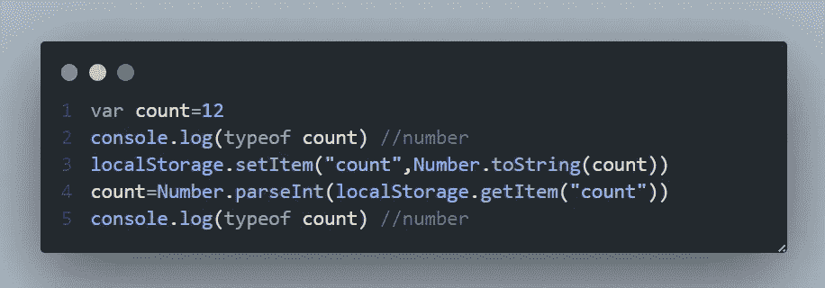

# 如何在 JS 的 localStorage 中存储不同的数据类型

> 原文：<https://javascript.plainenglish.io/storing-different-datatypes-in-localstorage-in-js-ee7f4c5318ff?source=collection_archive---------2----------------------->

## 关于在 JavaScript 的 localStorage API 中存储不同数据类型的教程

让我们首先讨论本地存储，然后我们将讨论如何在其中存储不同的数据类型。localStorage 是一个浏览器 API，用于在浏览器中存储键值对。localStorage API 是一个只读内存，其中的数据可以读取，但不能修改。要修改 localStorage 中的数据，我们需要检索实际的数据，修改它并插入具有相同键名的新数据，这将用最新的数据覆盖当前数据。本地存储是持久的，这意味着其中的数据不会被关闭标签和关闭浏览器等操作删除。应该显式修改或删除本地存储中的数据。

尽管 JS 语言中有各种数据类型，但是 localStorage 只能存储字符串数据类型的键和字符串数据类型的值。从字面上看，localStorage 只能存储字符串。即使你需要存储一个整数，你也需要把它转换成一个字符串，并存储它。

JS 支持的不同数据类型有:

*   数字
*   线
*   布尔代数学体系的
*   空
*   目标
*   排列
*   自定义数据类型

## 1.数字

数字代表各种数据类型，包括浮点、整数、bigInt 等。数字可以直接存储，无需转换成字符串。因为 localStorage 隐式地将数字转换为字符串。

我们也可以将数字显式转换成字符串并存储。在检索时，我们必须将它转换成一个数字。JSON.stringify 方法可用于将 JSON 支持的任何数据类型转换为字符串形式并存储。在检索时，我们将解析数据，将字符串转换成它的实际形式。

我们也可以使用 Number.toString()方法代替 JSON 方法来实现同样的事情。

## 2.线

LocalStorage 只专门存储字符串。因此，在存储和检索字符串时，不需要任何类型的转换。与任何其他数据类型相比，存储字符串是最简单的。

## 3.布尔代数学体系的

当存储任何布尔值时，它被转换成一个字符串，为了检索布尔值，我们必须将字符串转换成一个布尔值。

## 4.空

在本地存储中存储空值是没有用的，但有时我们可能需要检查一些条件，存储空值可以在条件循环中使用。

## 5.目标

大多数情况下，我们将在本地存储中存储一个对象，因为一个对象也是一个键值对数据结构，我们可以在一个键中存储多个键值。

如果我们直接存储一个没有字符串化的对象，我们就不能在控制台(应用程序选项卡)中查看内容。

要解决这个问题，我们必须将数据字符串化，这样我们就可以在控制台中查看数据，并且在检索数据时，我们应该解析数据，将其转换为实际的对象。

## 6.排列

数组不能用存储对象的方法直接存储，因为数组也是 JavaScript 中的对象。

## 7.自定义对象(用户定义)

假设我正在创建一个带有值和左右指针的树节点。然后我实例化一个值为 3 的对象。我可以使用 JSON.stringify 方法存储对象，并且可以通过 JSON.parse 方法检索值。

最后，在将任何东西存储到本地存储之前，只需对其进行字符串化，在检索之后，使用 JSON.parse 方法对其进行解析。这也适用于会话存储。

*更多内容看* [***说白了。报名参加我们的***](https://plainenglish.io/) **[***免费周报***](http://newsletter.plainenglish.io/) *。关注我们关于* [***推特***](https://twitter.com/inPlainEngHQ)[***LinkedIn***](https://www.linkedin.com/company/inplainenglish/)*[***YouTube***](https://www.youtube.com/channel/UCtipWUghju290NWcn8jhyAw)*[***不和***](https://discord.gg/GtDtUAvyhW) *。*****