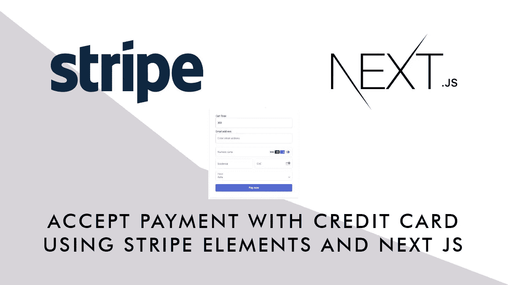
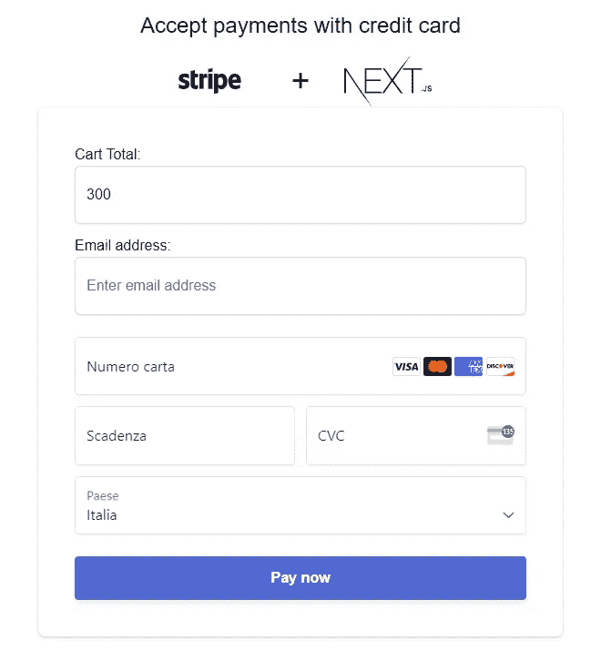
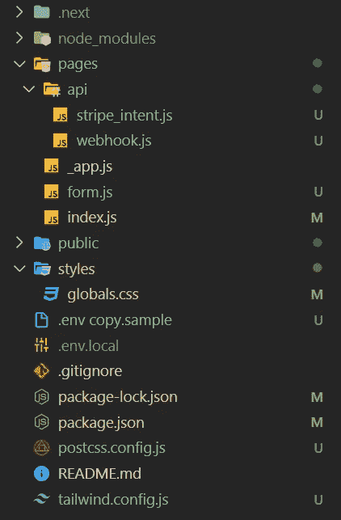
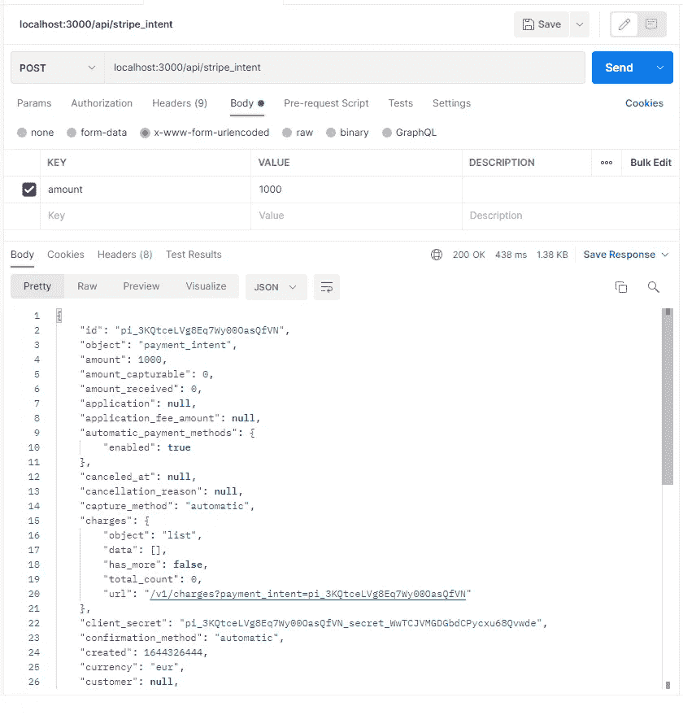
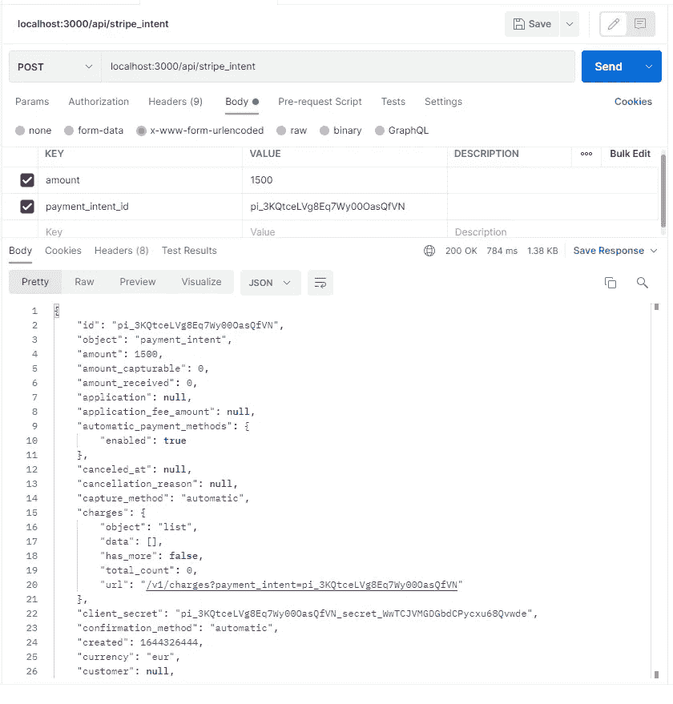
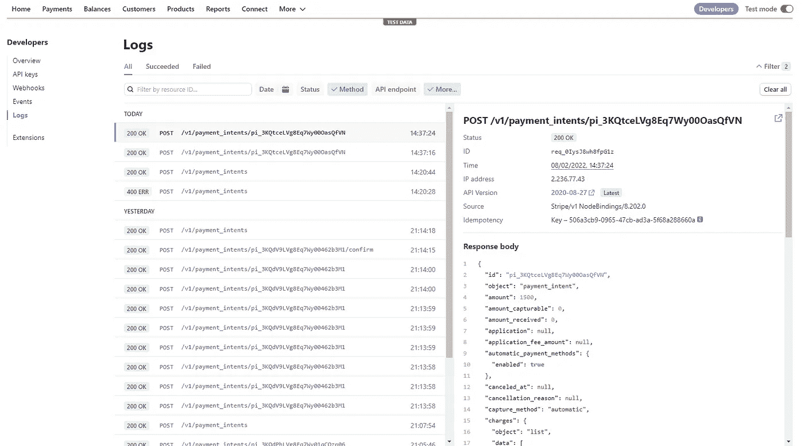

# Next.js 中的条带元素

> 原文：<https://javascript.plainenglish.io/stripe-elements-in-next-js-da59c502af48?source=collection_archive---------0----------------------->



[Stripe](https://stripe.com/) 是信用卡(以及其他支付方式，包括 Google Pay 和 Apple Pay)的在线支付处理系统。他们提供了广泛的功能，从定期付款到延迟付款(对预订非常有用)，而且他们的定价非常方便。

从开发者的角度来看，他们提供了两种在网站或应用上集成支付的主要方式:**结账**和**元素**。

有了 Checkout，一旦你的用户准备好支付，他们会被重定向到一个 Stripe 托管的页面(你可以自定义)，在那里他们完成支付；使用 Elements，您可以在您的网站上创建支付表单，这样您就可以为用户提供出色的体验，使他们在支付过程中不会离开您的网站，同时保持高水平的安全性。

在本教程中，我将重点关注元素，因为它的实现可能比 checkout 稍微复杂一些，而且我们将使用 [Next.js](https://nextjs.org/) 作为我们的框架，因为 Stripe 需要服务器到服务器的通信，Next 提供了这种开箱即用的能力。



How or final page will look

为了跟随本教程，您可以从这里克隆完整的存储库:

 [## GitHub 流行元素/条纹元素

### 这是一个用 create-next-app 引导的 Next.js 项目。首先，运行开发服务器:打开…

github.com](https://github.com/popeating/stripe-elements) 

## 先决条件

为了完成本教程，您需要:

*   一个 Stripe 帐户(你可以在 Stripe 上免费注册)已配置并处于测试模式(可以访问可发布的密钥和 Webhook secret)。
*   了解 Next.js 框架，包括前端开发和 API 开发。
*   了解回调、webhook、服务器到服务器通信的工作原理。
*   关于节点和 NPM 如何安装模块和运行本地服务器的一点知识

您还需要了解一些关于 Tailwind CSS 框架的知识来进行样式设计。

如果你想在本地测试 webhook，你需要[**ngrok**](https://ngrok.com/)**(免费版本对本教程来说很有用)或者 [**Stripe CLI**](https://stripe.com/docs/stripe-cli) 。**

## **条纹元素的工作原理**

**在开始编码之前，我们应该先了解一下条带事务是如何工作的。假设您正在从事电子商务(但任何其他需要支付的网站也可以)，在某一点上，您的客户/用户将到达结账页面，这里将开始 Stripe 工作流(我们稍后将详细介绍每个操作):**

*   **在登陆该页面时，你的应用程序将与 Stripe 服务器通信以创建一个 **PaymentIntent** ，发送购物车的金额并接收回一个 id 和一个密钥；将 id 存储在客户端的某个地方是一个好主意。**
*   **如果用户改变购物车(添加或删除产品，应用优惠券等)，应用程序将更新 Stripe 服务器上的 **PaymentIntent** 的值(保存 id 允许用户离开购物车，稍后返回，仍然有一个 PaymentIntent 准备好)**
*   **与此同时，该页面将从 Stripe 服务器动态获取构建支付表单所需的 javascript，由于安全规则，该 JavaScript 不能存储在本地，信用卡表单将作为页面内的一个 *iframe* 呈现。该表单已经通过之前生成的密钥为当前的 **PaymentIntent** 进行了配置**
*   **此时，用户将在表单中填写信用卡详细信息并提交。您的应用程序将调用远程 **confirmPayment** Stripe 端点，该端点将制作卡并发回结果(并重定向用户)。**
*   **在此期间，除了正常的响应，Stripe 将通过 webhook 与我们的服务器通信(如果在 Stripe Dashboard 上配置了 web hook ),通知我们发生的一切；这对于处理支付后操作(更新订单、发送电子邮件、更新股票)特别有用，无需等待客户端回调。稍后将详细介绍。**

## **初始化项目和依赖项**

**使用以下内容创建新项目:**

```
npx create-react-app stripe-element
```

**进入新创建的文件夹并安装以下依赖项:**

```
npm i @stripe/stripe-js @stripe/react-stripe-js stripe micro npm i -D tailwindcss postcss autoprefixer @tailwindcss/forms
```

**除了 stripe 模块，我们还安装了 *micro* ，它是一个小工具，我们将在 webhook 开发过程中使用，它允许我们访问原始格式的请求正文内容。我们还将 Tailwind 安装为一个开发依赖项。**

**设置(可选)tailwind.css:**

```
npx tailwindcss init -p
```

**并像这样配置 tailwind.js.conf:**

**准备好你的*。env* 文件(不要忘记将它添加到。gitignore 并在部署期间将变量放置在您的托管服务的环境中)，使用测试数据从您的 Stripe 仪表板中获取这些数据(webhook secret 可以在以后配置，一旦您启用了 webhooks)。**

**设置您的工作空间，准备我们需要的文件(您可以安全地删除其他文件):**

****

**Project structure**

## **付款意向**

**正如工作流中提到的，我们需要处理的第一件事是 paymentIntent，为此我们使用一个本地访问的 API，它将与 Stripe 服务器通信并返回到我们的应用程序。**

**编辑文件`**/pages/api/stripe_intent.js**` (代码在最后注释):**

**基本上，这个 API(可以在 URL**http://localhost:3000/API/stripe _ intent**访问)将用两个参数调用: **amount** ，我们要开账单的金额，以及 **payment_intent_id** ，(但是您也可以处理更多参数，比如*描述*，在我们的例子中是硬编码的)我们要更新的先前创建的 paymentIntent(如果存在的话)的 id。基于这些参数，API 将检索，然后更新或创建一个新的支付内容，并将其返回到我们的应用程序。正如 Stripe 建议的那样，总是尝试重用 paymentIntent，这将有助于跟踪用户活动，并将保持工作流“干净”。**

**您可以通过使用 body param **amount** 发布到**http://localhost:3000/API/stripe _ intent**来测试这个 API(使用 rest 工具，如 [Postman](https://www.postman.com/) 或 REST client for vs code ), API 将回复一个 paymentIntent 对象，该对象将包含一个 id(如果我们需要，将用于更新它)和一个 client_secret(将用于完成支付)。**

****

**Creating a paymentIntent**

**如果您再次调用 API，使用新的金额，但是指定 payment_intent_id 参数，使用您从以前的回复中获得的值和新的金额，作为回复，您将获得一个具有相同 id 和新金额的对象。**

****

**Updating a paymentIntent**

**您也可以尝试错误(例如，不传递金额将导致错误)。**

**通过访问您的 Stripe 仪表板并访问开发人员部分以检查事件和日志，您可以检查一切是否真正与 Stripe 通信，以及是否在 Stripe 服务器上有效地创建了 paymentIntent:**

****

**一旦一切都对齐正确，你可以开始工作的前端应用程序**

## **结账/支付页面**

**我们创建了一个页面(index.js ),假设这是一个虚构的电子商务网站结帐页面，用户将在这里填写他的帐单/送货地址并确认付款。我们的页面将使用 *loadStripe* 作为包装器来加载 Stripe Elements 组件和所需的 js 库。在*元素*组件中，我们将呈现 *CheckoutForm* 组件，它是账单表单本身:**

**当我们到达结帐页面时(在我们的例子中是 index.js ),我们通过获取我们的 *stripe_intent* API 来创建一个新的 paymentIntent，传递我们要开账单的金额。在这种情况下，金额是硬编码的，但在现实场景中，金额将是购物车总额(或我们希望向用户收取的金额)。金额作为较低货币单位的整数传递，在我们的例子中(€，但美元是相同的)是分，因此 3000 导致€ 300，00 的帐单。**

**API 响应被处理，两个相关数据(clientSecret 和 paymentIntend id)被存储在一个状态中。您可能也想将 id 存储在客户机上的某个地方(比如 LocalStorage)，这样即使用户离开页面以后又回来，也可以再次访问它。**

**我们实例化 Elements 组件，传递一个对主 *stripe* 实例的引用，以及一个对包含 *clientSecret* 的 *options* 对象和一个将用于定制账单表单的 Apparence 对象的引用(关于 Apparence API 的更多信息可以在这里找到:[https://stripe.com/docs/stripe-js/appearance-api](https://stripe.com/docs/stripe-js/appearance-api)**

**我们还将 *paymentIntent id* 传递给 CheckoutForm。**

## **结帐表单**

**结帐表单将呈现该表单以捕获支付数据并处理其提交。它还将用于通知用户支付错误/成功。在我们的例子中，它还将收集一封电子邮件，并跟踪账单金额的变化(例如，当用户从购物车中移除产品时，金额必须在 *paymentIntent* 上更新)**

**我们将大多数变量(如金额、电子邮件、结果消息和付款的加载状态)保存在 react 状态中。**

**我们定义了一个函数来跟踪更新的金额值，在每次更改时(在生产环境中，更明智地选择事件可能更有意义，比如在失去焦点时或者就在表单提交之前)我们使用本地的 *stripe_intent* API 更新 *paymentIntent* 金额。**

**我们还定义了一个函数来处理表单提交。它基本上确认了对当前*条带元素*的支付，这些元素已经在条带服务器上创建。您可以向 *confirmPayment* 端点传递一系列参数，比如 receipt_email(这将使 Stripe on production 向用户发送一封包含付款收据的电子邮件)、账单和运输细节(更多信息请参见:[https://stripe.com/docs/js/payment_intents/confirm_payment](https://stripe.com/docs/js/payment_intents/confirm_payment))。唯一必需的是 *redirect_url* ，用户在成功支付后被重定向到这个 url，在这个重定向 URL 上附加了支付状态和客户端密码作为参数，您可以使用这些参数在支付后向用户显示一条消息(在我们的例子中是在页面的 useEffect 部分实现的)。**

**在一个真实的电子商务示例中，在确认付款之前，您希望在您的系统上创建并存储订单(可能有一个*等待*状态)，以便您可以向 Stripe 发送对它的引用，一旦付款成功，您希望更新订单并重定向到一个感谢页面，该页面将处理退货状态参数，您可能还希望基于该状态更新订单。**

## **Webhooks**

**Stripe 还可以使用 webhooks 与您的服务器通信。您可以激活 webhooks(并从 Stripe dashboard 中选择触发它们的操作。**

**首先，在`**/pages/api/webhook.js**`中创建 webhook 端点**

**Stripe 将对每个 webhook 请求进行签名，验证使用请求的原始内容(以及标题 Stripe 签名和 webhookSecret)。由于 next 不支持原始内容，我们需要禁用 bodyparser 并用 *micro 将请求转换为原始内容。***

**剩下的就很简单了，如果请求被验证，我们就可以读取哪个事件被传递了等等(我们只是简单地记录几个事件，但是您可以使用 webhooks 通知您的客户，更新订单和股票，通知团队发生了一些动作)。**

**如果您正在生产级别上工作，总是建议使用 webhook，而不是等待客户端。**

**由于 webhooks 运行在 localhost 上，但是 Stripe 需要从远程访问它，所以在 Stripe dashboard 上配置它之前，您需要一种方法让 localhost 从外部访问。我个人使用的是 **ngrok** ，它给你一个映射到本地主机的公共 URL。就像这样运行 ngrok:**

```
**ngrok http http://localhost:3000**
```

**它会像这样回复**

```
**Forwarding                    http://d12b-2-236-77-43.ngrok.io -> http://localhost:3000**
```

**并且在 Stripe 上配置时可以使用 http://d12b-2-236-77-43 . ngrok . io 作为 webhook 端点。**

## **下一步是什么**

**Stripe(和 Stripe Elements)是一个非常灵活的工具，它的 API 是有据可查的(带有 React 代码片段)，它将允许你保存客户、存储支付数据用于重复支付、延迟支付等等；它是补充需要集成客户体验和定制支付解决方案的电子商务网站或 web 应用程序的最佳解决方案之一。**

## **进一步阅读**

**[](https://blog.bitsrc.io/next-js-13-what-do-the-new-bleeding-edge-features-actually-do-d3e5fd418563) [## Next.js 13:新的前沿特性实际上是做什么的？

### 你听说过 Next.js 13 是一个游戏改变者，但是为什么？让我们看看有哪些新功能，有哪些变化，以及它们…

blog.bitsrc.io](https://blog.bitsrc.io/next-js-13-what-do-the-new-bleeding-edge-features-actually-do-d3e5fd418563) 

*更多内容请看*[***plain English . io***](https://plainenglish.io/)*。报名参加我们的* [***免费周报***](http://newsletter.plainenglish.io/) *。关注我们关于*[***Twitter***](https://twitter.com/inPlainEngHQ)[***LinkedIn***](https://www.linkedin.com/company/inplainenglish/)*[***YouTube***](https://www.youtube.com/channel/UCtipWUghju290NWcn8jhyAw)*[***不和***](https://discord.gg/GtDtUAvyhW) *。对增长黑客感兴趣？检查* [***电路***](https://circuit.ooo/) *。*****