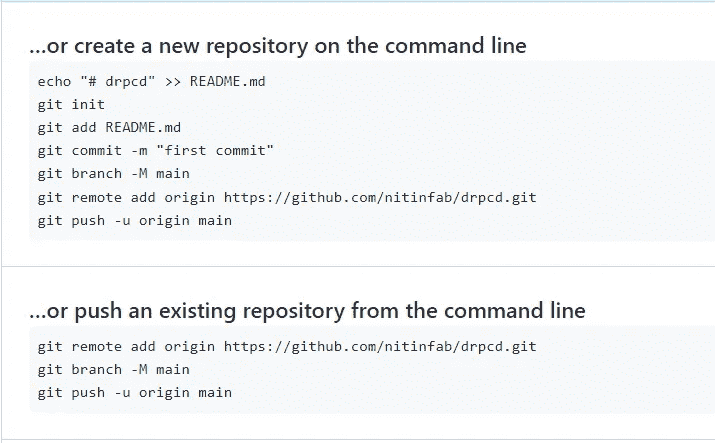
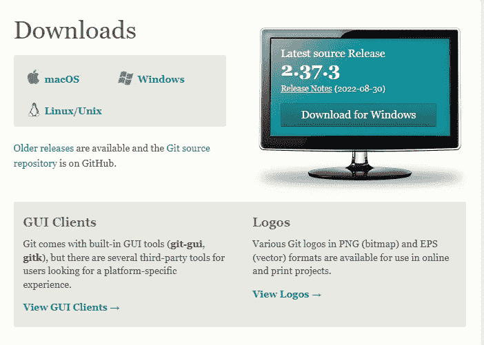
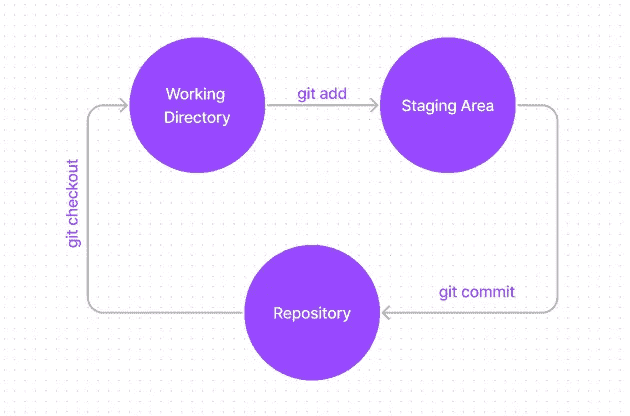
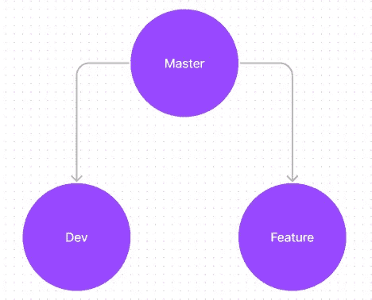
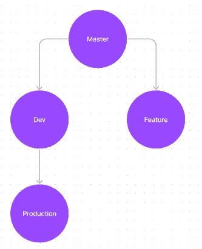

# 愚蠢的简单指南学习 Git 并在 5 分钟内使用它

> 原文：<https://javascript.plainenglish.io/stupidly-simple-guide-to-learn-git-and-use-it-in-5-minutes-4d4f0847e01b?source=collection_archive---------7----------------------->

## 使用这个简短的指南快速学习使用 Git。


Photo by [AltumCode](https://unsplash.com/@altumcode?utm_source=medium&utm_medium=referral) on [Unsplash](https://unsplash.com?utm_source=medium&utm_medium=referral)

当你写一门编程语言，创建一个网站，或者创建一个应用程序时，你必须经常使用 Git 和 GitHub。

然而，与将本地存储库上传到 GitHub 相比，使用 Git 有点困难。

只需创建一个 GitHub repo，它将提供提交本地文件的命令。



Src: GitHub

这就是我写这篇文章的原因。它是为想快速学习和使用 Git 的人设计的，不会是一个全面的指南。

是的，你可以为更多的命令添加书签和注释。

我们开始吧。

Git 是什么？这是一个版本控制系统。简而言之，它是一个记录你的修改历史的分类账。

您必须首先为您的操作系统下载 Git 才能使用它。就像去[网站](https://git-scm.com/downloads)下载到你的设备上一样简单。



Source: Git website

您可以在下载 g it 之后查看您已经安装的 Git 版本(在命令提示符下)。

```
git --version
```

它将显示 Git 版本。如果不能查看版本，说明你做错了。

您可以添加您的姓名和电子邮件地址，让每个人都知道您是做出更改的人(在任何 GitHub repo 中)。

```
git config --global user.name "your name here"
```

你可以在这里签名。

您可以使用以下命令对您的电子邮件地址进行同样的操作:

```
git config --global user.email "your email id here"
```

以确定您的用户名和电子邮件地址是否已被修改。简单的命令是:

```
git config --global user.name
```

它会显示你的名字。

同样的，

```
git config --global user.email
```

它会显示你的电子邮件地址。

有许多方法可以更改或更新您的详细信息，但这是最好的一种。

让我们现在做一个文件夹。您可以在命令提示符下导航到您的首选目录，或者使用 VS Code(我使用它)终端。

```
mkdir your-directory-name
```

现在，将您的目录更改到指定的文件夹。

```
cd your-directory-name
```

您会希望在您的目录中包含 Git。首先，您必须初始化 Git。

```
git init
```

初始化 Git 后，必须添加要提交的文件。

```
git add fileName
```

或者添加所有文件

```
git add .
```

稍后，您可能会提交一个消息，创建一个分支(如 main)，然后将其推送到您新创建的 GitHub repo。

```
git commit -m "first commit"
git branch -M main
git remote add origin [https://github.com/nitinfab/drp.git](https://github.com/nitinfab/drp.git)
git push -u origin main
```

## 简单的概念

你可能想知道为什么我们要包括这个文件；有什么原因吗？绝对的。

这里有一个插图可以帮助你理解它。



工作目录中的文件是您编写代码的地方。在将修改提交到存储库之前，暂存区是您保存修改的地方。

让我尽可能简单地解释一下。

您在工作目录中编写代码，工作目录是 Visual Studio 代码中的一个文件。稍后，初始化 git 并使用 git add 命令将所有或单个文件添加到 staging 区域。

然后你提交一个文件。

要提交文件，命令是:

```
git commit -m "write the message"
```

要查找您已经完成的提交次数，命令是:

```
git log
```

假设您已经对一个文件进行了多次更改，并将其添加到存储库中。

你可以写信了解你对回购协议做了哪些修改。

```
git status
```

使用 git status，您可以看到有许多提交，每个提交都有一个 hashcode 或 id。

所以，如果你想回到之前的代码，你要做的就是写:

```
git checkout hashcode
```

您可以使用它直接导航到以前的提交。

这也是分部的基本思路。在 git checkout 的帮助下，你还可以在不同的分支之间穿梭。可以，可以做不同的分支；稍后我会详细解释。

只需写信了解您现在在哪一个分支机构:

```
git branch
```

要创建一个分支，您只需编写:

```
git branch branchName
```

要创建一个分支并直接转到该分支，只需使用以下命令:

```
git checkout -b branchName
```

## 分支概念

现在我们来解释一下分支概念。

主(或主，你可以叫它)是第一个分支。当我们第一次发布它时，它是 git 提供的第一个分支。

假设我们创建了一个新分支，dev。

```
git branch dev
```

它将构建在树形结构中。

首先是 master(或 main)，然后是 dev。

现在我们在主分支上，我们将建立另一个名为“特性”的分支。

```
git branch feature
```

所以分支的结构会是这样的:



如果我们用命令“git checkout dev”转到 dev 分支，然后创建另一个分支，它将在 dev 分支内。

例如，假设我们在 dev 分支中(您可以使用命令 git branch 查看您在哪个分支中)，然后我们创建了另一个名为 production 的分支。

```
git branch production
```

所以分支的结构会是这样的:



希望你能理解。

假设您现在已经在生产分支中创建了一些功能，并且完全正常工作。因此，您可以立即将其合并到 dev 分支。

首先，转到 dev 分支。

```
git checkout dev
```

然后合并生产分支。

```
git merge production
```

您的功能现在已经添加到 dev 分支中。

要推送到 GitHub 存储库，命令是:

```
git push -u origin master
```

只会推送主(或主要)分支。

如果您希望推送另一个分支，只需导航到该分支并这样做。我们将进入开发分支。

```
git checkout dev
```

然后推动它。

```
git push -u origin dev
```

这些是帮助您使用 git 的基本命令。

就这样——谢谢。

如果你愿意，你可以免费获得我的 side hustle [电子书](https://nitinfab.gumroad.com/l/programming-side-hustle-book)。

[*如果你喜欢看这样的故事，并想帮助我成为一名作家，可以考虑成为一名中等会员*](https://nitinfab.medium.com/membership) *。它每月花费 5 美元，给你* [*无限制访问媒体内容*](https://nitinfab.medium.com/membership) *。如果你通过我的链接注册，我会得到一点佣金。*

[](https://medium.com/swlh/9-side-hustle-tools-that-will-blow-your-mind-6ebb57787eb6) [## 9 个让你大吃一惊的侧推工具

### 无论你是程序员、员工还是创造者。

medium.com](https://medium.com/swlh/9-side-hustle-tools-that-will-blow-your-mind-6ebb57787eb6) [](/6-killer-online-programming-tools-i-can-no-longer-live-without-14fbfc44dbcc) [## 6 黑仔在线编程工具我不能没有

### 它不包括 Canva、opinion 或任何类似的东西。

javascript.plainenglish.io](/6-killer-online-programming-tools-i-can-no-longer-live-without-14fbfc44dbcc) 

*更多内容请看*[***plain English . io***](https://plainenglish.io/)*。报名参加我们的* [***免费周报***](http://newsletter.plainenglish.io/) *。关注我们关于*[***Twitter***](https://twitter.com/inPlainEngHQ)[***LinkedIn***](https://www.linkedin.com/company/inplainenglish/)*[***YouTube***](https://www.youtube.com/channel/UCtipWUghju290NWcn8jhyAw)*[***不和***](https://discord.gg/GtDtUAvyhW) *。对增长黑客感兴趣？检查* [***电路***](https://circuit.ooo/) *。***