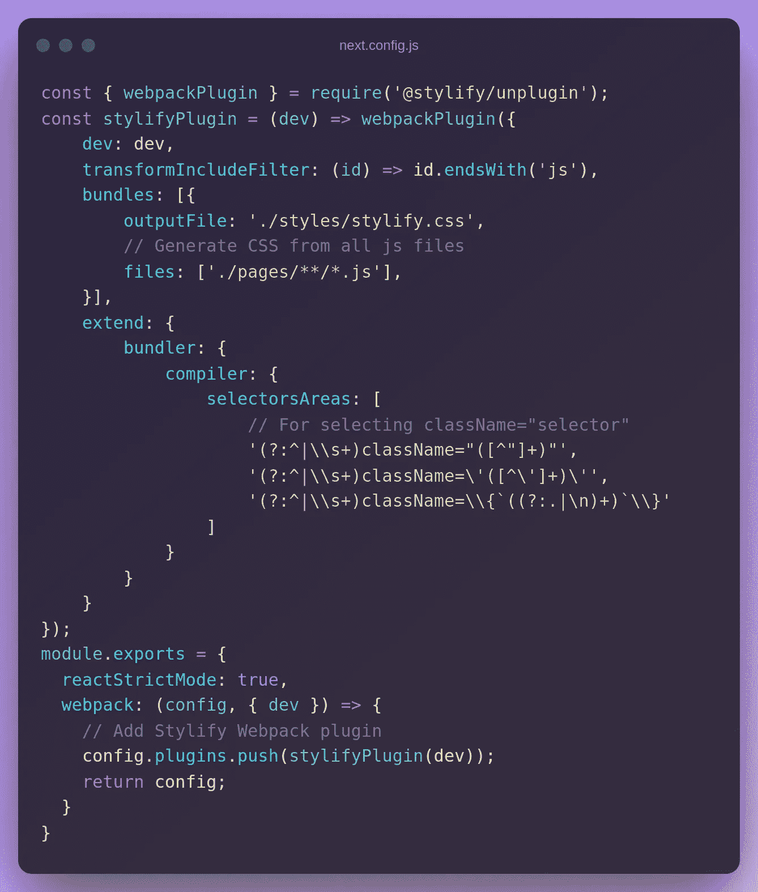
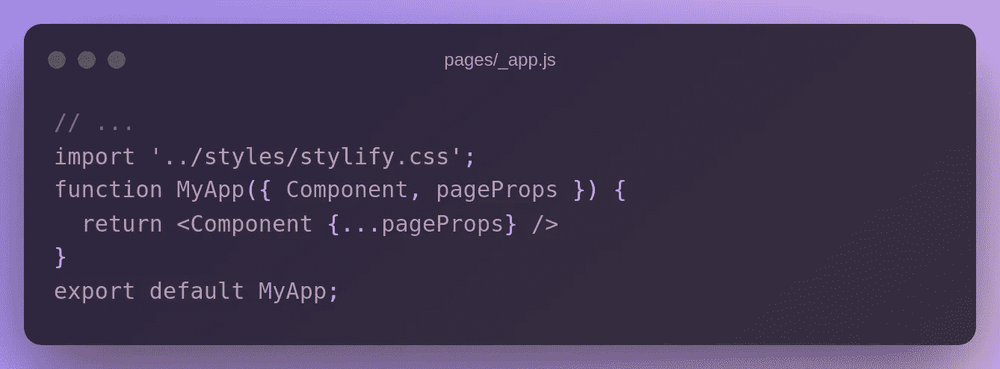
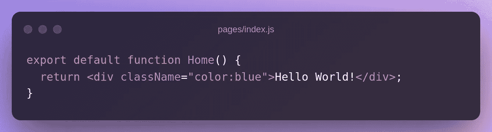
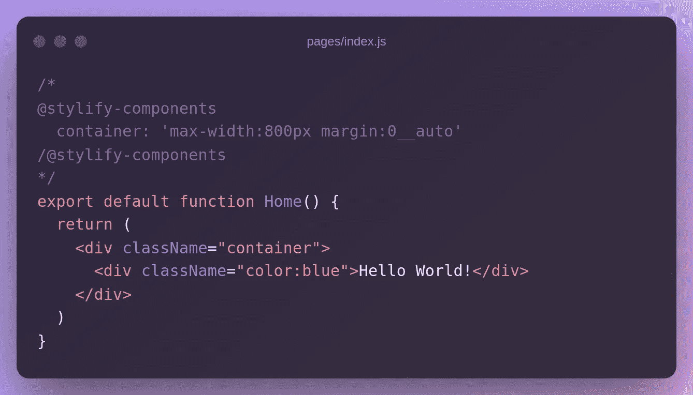
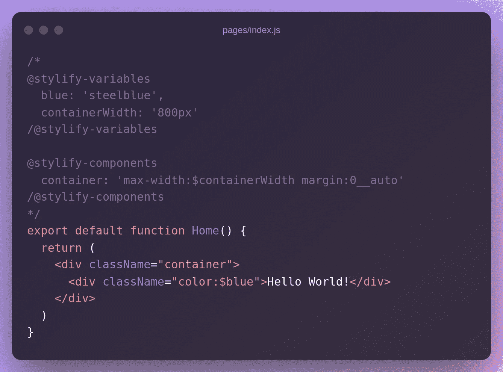
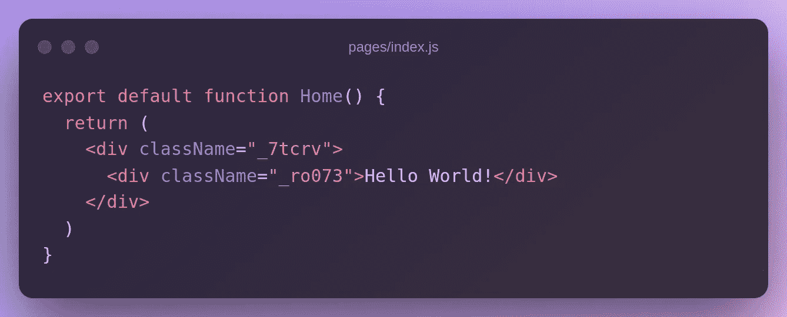
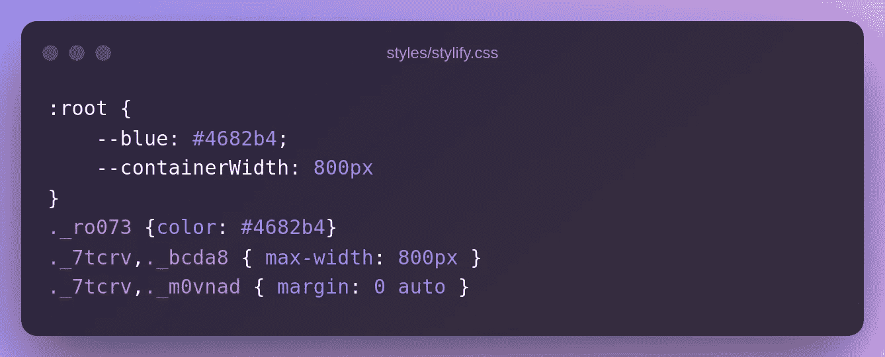

# 使用 Stylify CSS 更快地设计你的 Next.js 网站

> 原文：<https://javascript.plainenglish.io/style-your-next-js-website-faster-with-stylify-css-43b67b543e74?source=collection_archive---------1----------------------->


使用 [Stylify](https://stylifycss.com/) 更快、更有效、更直观地设计您的 Next.js 网站。不要研究选择器和语法。使用纯 CSS 语法，获得自动生成的 CSS，并针对生产进行高级优化。

为了更容易开始，你可以看看 [Stylify Stackblitz 游乐场](https://stackblitz.com/edit/stylify-nextjs-template?devtoolsheight=33&file=pages%2Findex.js)🎮。

# 介绍

[Stylify](https://stylifycss.com/) 根据你写的东西动态生成 CSS。语法类似于 CSS `property:value`。定义的实用程序与组件选择器相结合，并在生产中被最小化，如`.color\:red,.button {color:red}`到`_zx, _ga{color:red}`。

使用 Stylify，您可以获得非常小的包，生成额外的 lazyloaded CSS 块，并通过编写 HTML 和选择器来设计页面样式🤟。

# Next.js 设置

设置 Next.js 最简单的方法是使用 CLI:

*   运行`yarn create next-app`
*   选择您的项目名称

这样，您将获得默认的 Next.js 应用程序框架。

# 风格化集成

使用 NPM 或纱线安装 [@stylify/unplugin](https://stylifycss.com/docs/unplugin) 组件:

```
yarn add @stylify/unplugin
npm i @stylify/unplugin
```

打开`next.config.js`，将以下内容复制进去:



最后一步，打开`pages/_app.js`并添加路径到`stylify.css`:



# 设计网站

如果您将下面的代码复制到`pages/index.js`并运行`yarn dev`，您将得到一个样式化的`Hello World!`文本:



Stylify 观察`js`文件中的任何变化，并在`styles/stylify.css`中生成 CSS。

如果你添加一个类似`font-size:24px`的选择器，CSS 将会自动更新🎉。

直接在 Stackblitz.com 的[上尝试 Stylify💡。](https://stackblitz.com/edit/stylify-nextjs-template?devtoolsheight=33&file=pages%2Findex.js)

# 成分

被实用选择器弄得臃肿的模板很难阅读。Stylify 允许你直接在文件中定义组件，通过[内容选项](https://stylifycss.com/docs/get-started#defining-a-component)(想想没有括号的 JavaScript 对象)或者在[编译器配置](https://stylifycss.com/docs/get-started#defining-a-component)中使用它们。



# 变量

避免选择器中的硬编码值是一个好习惯。[变量](https://stylifycss.com/docs/get-started#adding-a-variable)可以像组件一样定义:



# 生产大楼

当我们使用`yarn build` + `yarn start`运行生产构建时，JSX 标记将被破坏成这样:



CSS 也被缩短了:



# 配置您需要的任何东西

上面的例子没有包括 Stylify 能做的所有事情:

*   您可以在模板中映射[嵌套文件](https://stylifycss.com/docs/bundler#files-content-option)
*   样式[全局选择器](https://stylifycss.com/docs/stylify/compiler#plainselectors)
*   定义[自定义屏幕](https://stylifycss.com/docs/stylify/compiler#screens)
*   添加[自己的宏](https://stylifycss.com/docs/stylify/compiler#macros)像`ml:20px`一样用于左边距
*   还有更多

请随意[查看文档](https://stylifycss.com/docs/get-started)了解更多信息💎。

# 让我知道你的想法！

我会很高兴得到任何反馈！风格化仍然是一个新的库，有很大的改进空间🙂。

保持联系:
👉 [@8machy](https://twitter.com/8machy)
👉[@ stylifycss](https://twitter.com/stylifycss)👉[stylifycss.com](https://stylifycss.com/)👉[dev.to/machy8](https://dev.to/machy8)👉[medium.com/@8machy](https://medium.com/@8machy)

*更多内容请看*[***plain English . io***](https://plainenglish.io/)*。报名参加我们的* [***免费周报***](http://newsletter.plainenglish.io/) *。关注我们关于*[***Twitter***](https://twitter.com/inPlainEngHQ)*和*[***LinkedIn***](https://www.linkedin.com/company/inplainenglish/)*。查看我们的* [***社区不和谐***](https://discord.gg/GtDtUAvyhW) *加入我们的* [***人才集体***](https://inplainenglish.pallet.com/talent/welcome) *。*