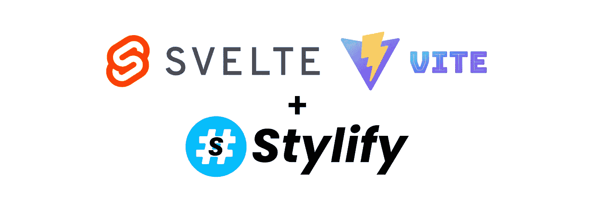
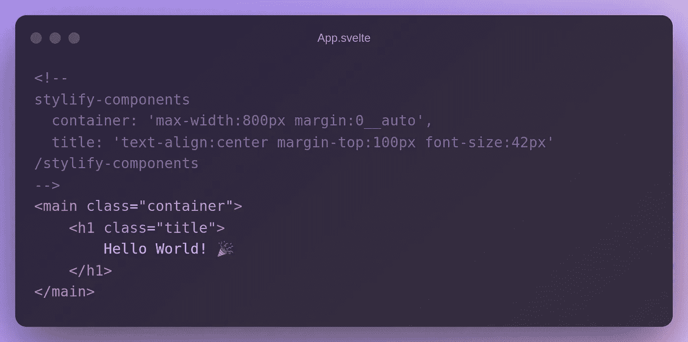
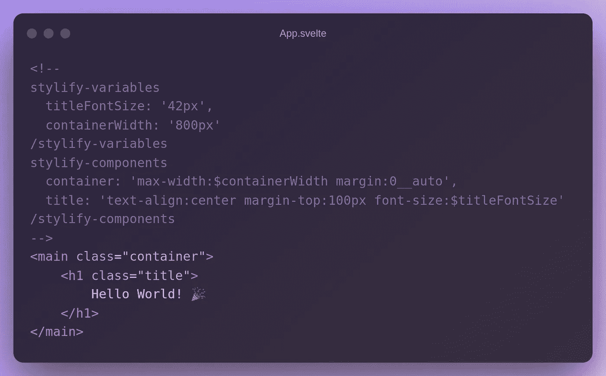
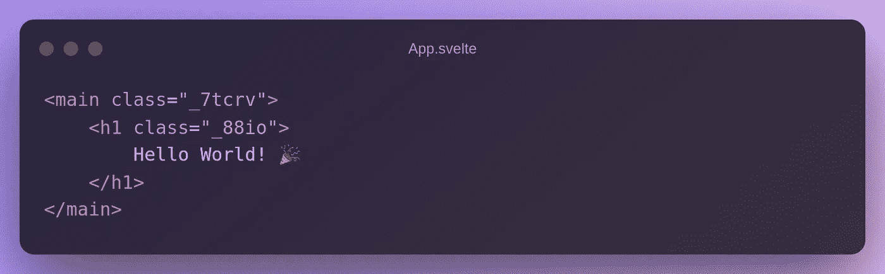
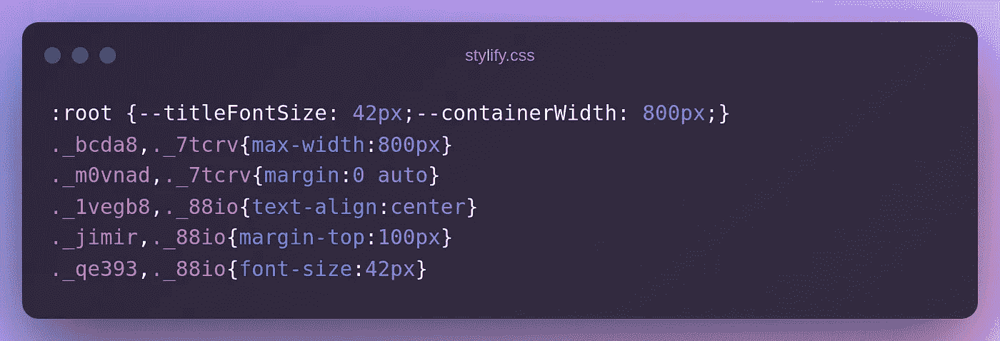

# 使用 Stylify CSS 更快地设计你的苗条网站

> 原文：<https://javascript.plainenglish.io/style-your-svelte-website-faster-with-stylify-css-de420c5c6a0f?source=collection_archive---------18----------------------->

## 一个关于如何使用 Stylify CSS 快速设计你的苗条网站的教程。



[风格化](https://stylifycss.com/) +苗条+ Vite。使用 Stylify 更快地设计您的苗条网站。不要研究选择器和语法。使用纯 CSS 语法，并获得生成的 CSS 与先进的优化生产。

为了更容易开始，你可以看看 [Stylify Stackblitz 游乐场](https://stackblitz.com/edit/stylify-svelte-vite?file=README.md,src%2FApp.svelte)🎮。

# 💎风格化介绍

[Stylify](https://stylifycss.com/) 根据你写的东西动态生成 CSS。语法类似于 CSS `property:value`。定义的实用程序与组件选择器相结合，并在生产中被最小化，如`.color\:red,.button {color:red}`到`._zx, ._ga{color:red}`。

Stylify 允许您获得非常小的包，生成额外的 lazyloaded CSS 块，并通过编写 HTML 和选择器来设计页面样式🤟。

# 🚀苗条的身材

设置 Svelte 最简单的方法是使用 CLI:

*   运行`yarn create vite app`
*   选择`svelte`或`svelte-ts`
*   然后`cd app`

这样你将得到默认的苗条的应用程序框架。

# 🔌风格化集成

使用 NPM 或纱线安装 [@stylify/unplugin](https://stylifycss.com/docs/unplugin) 包:

复制

```
yarn add @stylify/unplugin
npm i @stylify/unplugin
```

打开`vite.config.js`，将以下内容复制到其中:


最后一步，打开`src/main.js`并添加到`stylify.css`的路径:

```
// ...
import './stylify.css'
```

# 设计网站

如果您将下面的代码复制到`src/App.svelte`并运行`yarn dev`，您将得到一个样式化的`Hello World! 🎉`文本:


Stylify 观察文件中与包文件中的掩码相匹配的任何变化，并在`src/stylify.css`中生成 CSS。

例如，如果您添加了`color:blue`，CSS 将会自动更新🎉。

继续尝试直接在[Stackblitz.com](https://stackblitz.com/edit/stylify-svelte-vite?file=README.md,src%2FApp.svelte)上进行风格化💡。

# 成分

为了避免带有实用程序的臃肿的模板，你可以直接在文件中使用组件，在文件中通过[内容选项](https://stylifycss.com/docs/get-started#defining-a-component)(期望 JavaScript 对象不带括号)或者在[编译器配置](https://stylifycss.com/docs/get-started#defining-a-component)中使用它们。



# 变量

如果您喜欢干净的代码，您也希望避免选择器中的硬编码值。[变量](https://stylifycss.com/docs/get-started#adding-a-variable)可以像组件一样定义:



# 生产建筑

如果您运行`yarn build` + `yarn preview`，这个纤细的标记将会变成这样:



CSS 也被缩短了:



# 配置您需要的任何东西

上面的例子没有包括 Stylify 能做的所有事情:

*   您可以在模板中映射[嵌套文件](https://stylifycss.com/docs/bundler#files-content-option)
*   样式[全局选择器](https://stylifycss.com/docs/stylify/compiler#plainselectors)
*   定义[自定义屏幕](https://stylifycss.com/docs/stylify/compiler#screens)
*   添加你自己的宏[像`ml:20px`一样用于左边距](https://stylifycss.com/docs/stylify/compiler#macros)
*   还有更多

请随意[查看文档](https://stylifycss.com/docs/get-started)了解更多信息💎。

保持联系:

👉 [@8machy](https://twitter.com/8machy)

👉 [@stylifycss](https://twitter.com/stylifycss)

👉[stylifycss.com](https://stylifycss.com/)

👉[dev.to/machy8](https://machy8.hashnode.dev/dev.to/machy8)

👉[medium.com/@8machy](https://machy8.hashnode.dev/medium.com/@8machy)

*更多内容请看*[***plain English . io***](https://plainenglish.io/)*。报名参加我们的* [***免费周报***](http://newsletter.plainenglish.io/) *。关注我们关于*[***Twitter***](https://twitter.com/inPlainEngHQ)**和*[***LinkedIn***](https://www.linkedin.com/company/inplainenglish/)*。查看我们的* [***社区不和谐***](https://discord.gg/GtDtUAvyhW) *加入我们的* [***人才集体***](https://inplainenglish.pallet.com/talent/welcome) *。**