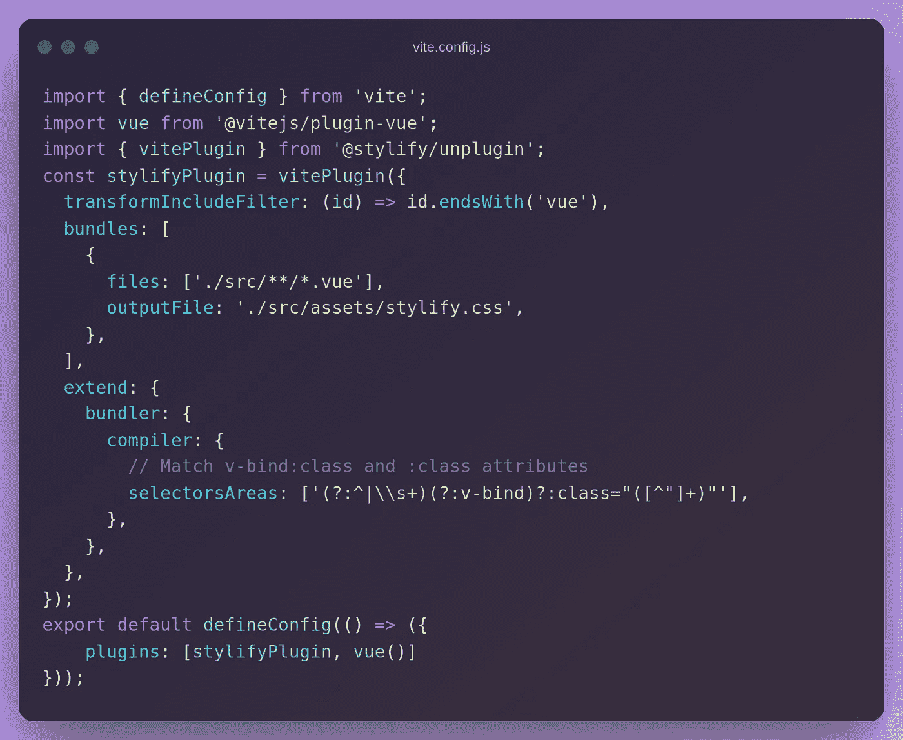
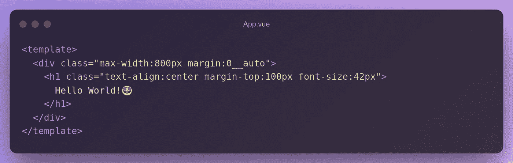
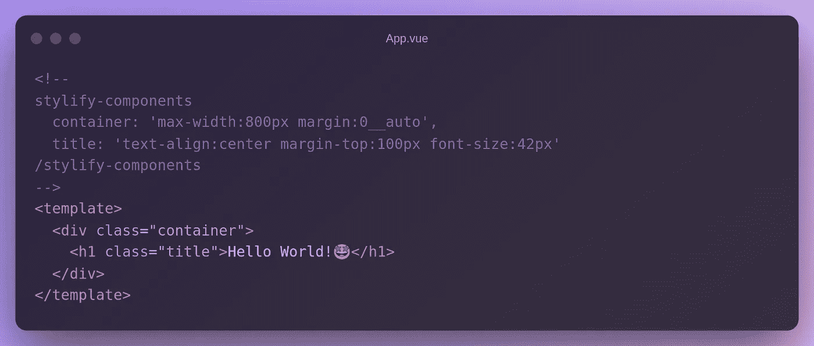
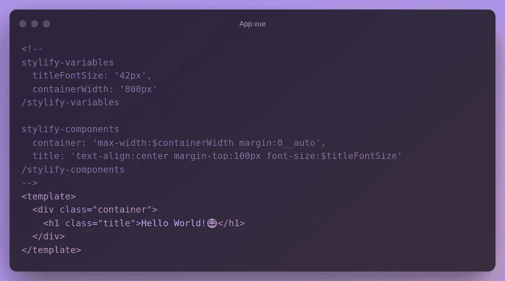
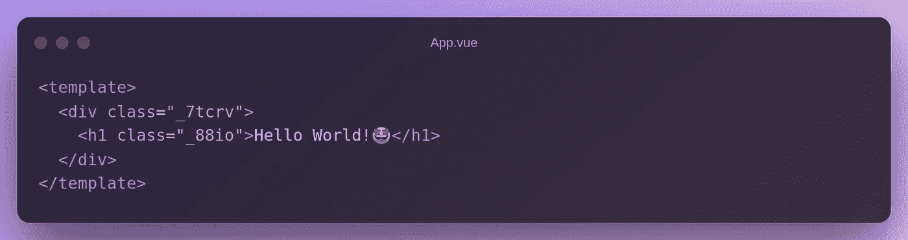
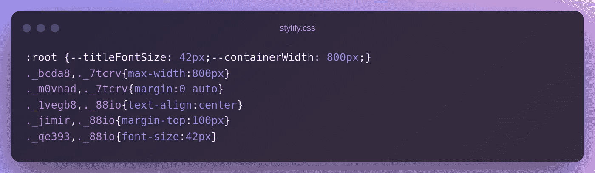

# 使用 Stylify CSS 更快地设计您的 Vue.js 网站

> 原文：<https://javascript.plainenglish.io/style-your-vue-js-website-faster-with-stylify-css-85a22c7e5178?source=collection_archive---------12----------------------->

## 关于如何使用 Stylify CSS 更快地设计 Vue.js 网站样式的教程。


[风格化](https://stylifycss.com/) + Vue.js + Vite。使用 Stylify 更快地设计您的 Vue 网站。不要研究选择器、语法和文档。使用纯 CSS 语法，并获得生成的 CSS 与先进的优化生产。

为了更容易开始，你可以看看 [Stylify Stackblitz 游乐场](https://stackblitz.com/edit/stylify-vitejs-vue-template?devtoolsheight=33&file=src%2FApp.vue)🎮。

# 💎风格化介绍

[Stylify](https://stylifycss.com/) 根据你写的东西动态生成 CSS。语法类似于 CSS `property:value`。定义的实用程序与组件选择器相结合，并在生产中被最小化，如`.color\:red,.button {color:red}`到`._zx,._ga{color:red}`。

Stylify 允许您获得非常小的包，生成额外的 lazyloaded CSS 块，并通过编写 HTML 和选择器来设计页面样式🤟。

# 🚀Vue.js 设置

设置 Vue.js 最简单的方法是使用 CLI:

*   运行`yarn create vite app`
*   选择`vue`
*   然后`cd app`

这样，您将获得默认的 Vue.js 应用程序框架。

# 🔌风格化集成

使用 NPM 或纱线安装 [@stylify/unplugin](https://stylifycss.com/docs/unplugin) 包:

```
yarn add @stylify/unplugin
npm i @stylify/unplugin
```

打开`vite.config.js`，将以下内容复制到其中:



最后一步，打开`src/main.js`并添加到`stylify.css`的路径:


# 设计网站

如果您将下面的代码复制到`src/App.vue`并运行`yarn dev`，您将得到一个样式化的`Hello World! 🎉`文本:



Stylify 观察文件中与包文件中的掩码匹配的任何变化，并在`src/stylify.css`中生成 CSS。

例如，如果您添加了`color:blue`，CSS 将会自动更新。

继续尝试直接在[Stackblitz.com](https://stackblitz.com/edit/stylify-vitejs-vue-template?devtoolsheight=33&file=src%2FApp.vue)上进行风格化💡。

# 成分

为了避免带有实用程序的臃肿的模板，你可以直接在文件中使用组件，在文件中通过[内容选项](https://stylifycss.com/docs/get-started#defining-a-component)(期望 JavaScript 对象不带括号)或者在[编译器配置](https://stylifycss.com/docs/get-started#defining-a-component)中使用它们。



# 变量

如果您喜欢干净的代码，您也希望避免选择器中的硬编码值。[变量](https://stylifycss.com/docs/get-started#adding-a-variable)可以像组件一样定义:



# 生产建筑

如果您运行`yarn build` + `yarn preview`，Vue.js 标记将被破坏成这样:



CSS 也被缩短了:



# 配置您需要的任何东西

上面的例子没有包括 Stylify 能做的所有事情:

*   您可以在模板中映射[嵌套文件](https://stylifycss.com/docs/bundler#files-content-option)。
*   样式[全局选择器](https://stylifycss.com/docs/stylify/compiler#plainselectors)。
*   定义[自定义屏幕](https://stylifycss.com/docs/stylify/compiler#screens)。
*   添加[自己的宏](https://stylifycss.com/docs/stylify/compiler#macros)像`ml:20px`一样用于左边距。
*   还有很多。

请随时查看[文档](https://stylifycss.com/docs/get-started)了解更多信息。

保持联系:

👉 [@8machy](https://twitter.com/8machy)
👉[@ stylifycss](https://twitter.com/stylifycss)👉[stylifycss.com](https://stylifycss.com/)👉[dev.to/machy8](https://dev.to/machy8)👉[medium.com/@8machy](https://medium.com/@8machy)

*更多内容请看*[***plain English . io***](https://plainenglish.io/)*。报名参加我们的* [***免费周报***](http://newsletter.plainenglish.io/) *。关注我们关于*[***Twitter***](https://twitter.com/inPlainEngHQ)**和*[***LinkedIn***](https://www.linkedin.com/company/inplainenglish/)*。查看我们的* [***社区不和谐***](https://discord.gg/GtDtUAvyhW) *加入我们的* [***人才集体***](https://inplainenglish.pallet.com/talent/welcome) *。**