# 风格化反应应用程序:风格化 vs 风格化组件

> 原文：<https://javascript.plainenglish.io/styling-react-app-stylify-vs-styled-components-3b4e4a523e76?source=collection_archive---------10----------------------->

## 这两种工具在设计 React 应用程序时的方法比较。

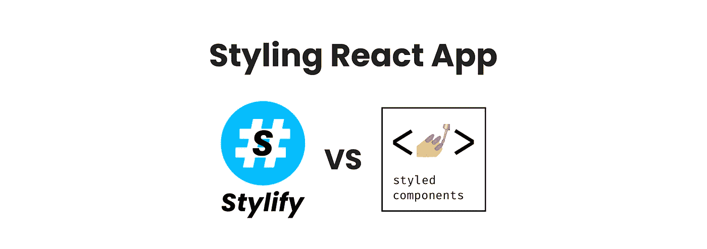

[Stylify](https://stylifycss.com/) 根据你写的内容生成实用优先的 CSS。它适用于任何框架和任何工具。[样式组件](https://styled-components.com/)是一个用于样式化 React 组件的库。

这篇文章不是关于哪个工具更好，而是关于用这些工具设计应用程序时的比较方法。

# 设置

对于下面的所有例子，我将使用 vite-react 设置。

[Stylify](https://stylifycss.com/) 需要安装和一点配置。这是因为 CSS 是在应用程序初始化之前的构建过程中生成的:

```
npm i -D @stylify/unplugin
```

以及 vite.config.js:

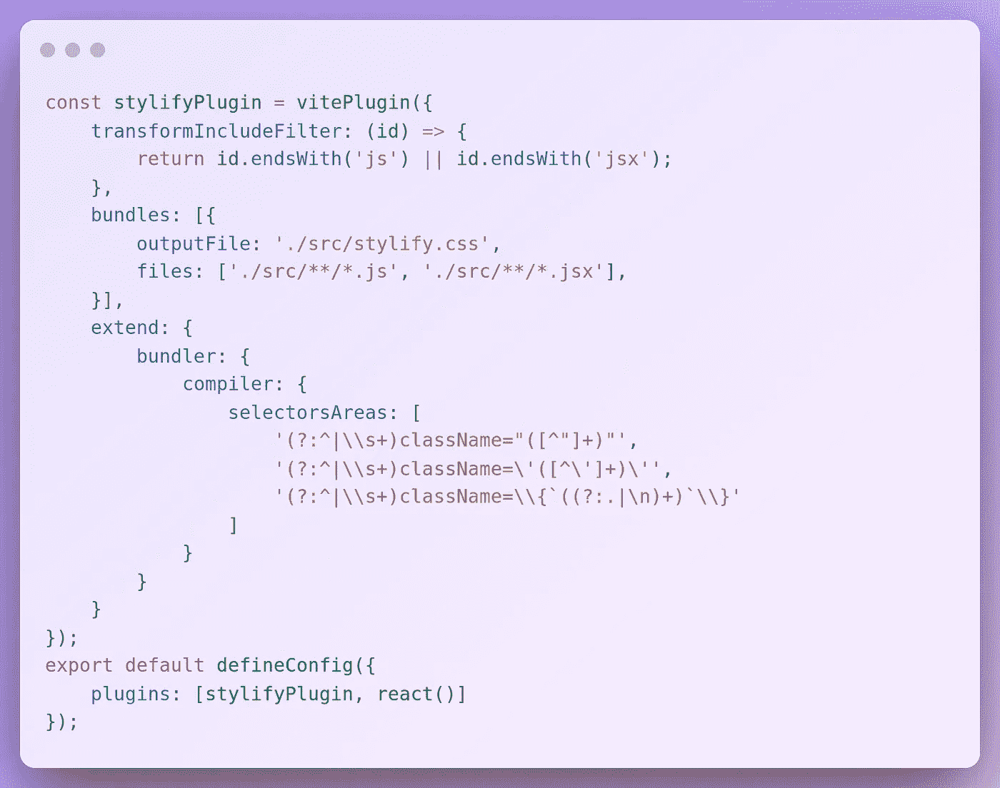

你可以尝试在 Stackblitz 上编辑 [Stylify+Vite+React](https://stackblitz.com/edit/stylify-react-vite?file=src%2FApp.jsx) 和 [Stylify+Next](https://stackblitz.com/edit/stylify-nextjs-template?devtoolsheight=33&file=pages/index.js) 的例子。

样式化的组件只需要安装这个库，就可以立即使用。

```
npm i styled-components
```

# 语法和用法

当您想要使用样式化组件来样式化元素时，您可以使用 CSS API 或创建一个组件:

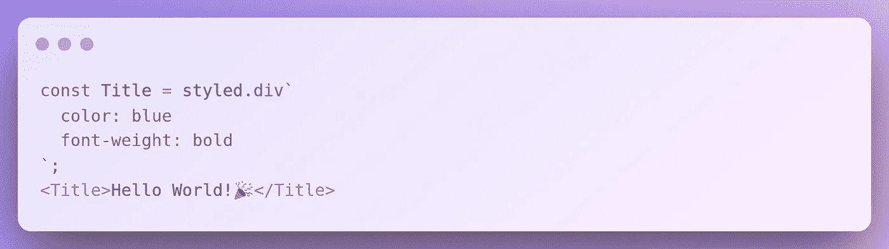

生成的 CSS 如下所示:

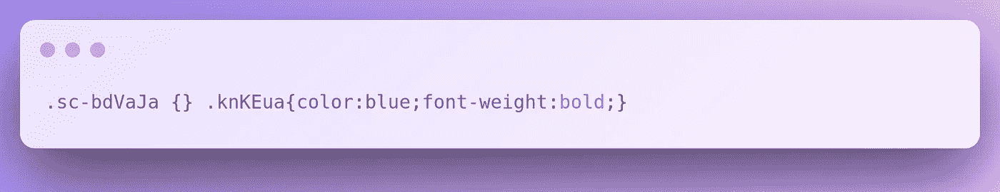

[Stylify](https://stylifycss.com/) 另一方面获取文件内容并为每个匹配的选择器生成 CSS。默认情况下，每个选择器都是一个实用程序，并且只生成一次。

默认情况下，[语法](https://stylifycss.com/docs/stylify/compiler/#syntax)是原生 CSS `property:value`。此外，在写入值时，可以使用`__`(两个下划线)代替空格，使用`^`(一顶帽子)作为引号。它类似于 Tailwind，但是不需要学习和记忆自定义的选择器和快捷键。如果你了解 CSS，你就已经知道 Stylify 选择器。如果你需要更短的或者定制的选择器，你可以[添加你自己的宏](https://stylifycss.com/docs/stylify/compiler#macros)。

无需定义组件，就可以立即编写选择器。

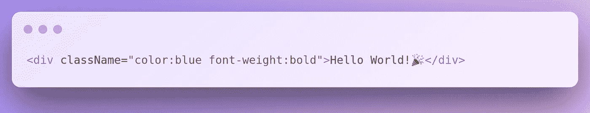

CSS 输出:

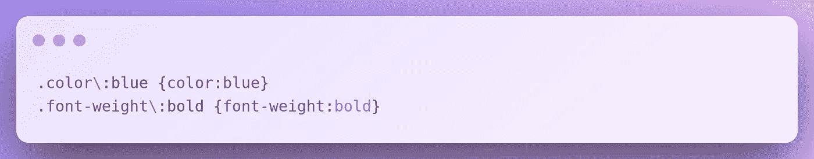

然而，没有人想要带有实用程序的臃肿的模板。有时[组件](https://stylifycss.com/docs/stylify/compiler#components)是必要的。它们可以在配置文件中全局定义，也可以在本地文件中定义(通过[内容选项](https://stylifycss.com/docs/stylify/compiler/#contentoptionsprocessors))。在该文件中，它需要一个不带括号的 javascript 对象。建议在注释中使用该定义，因为几乎任何文件格式都可以处理注释。在 [Stylify](https://stylifycss.com/) 中，组件是一个 CSS 类，它可以用在任何元素上:

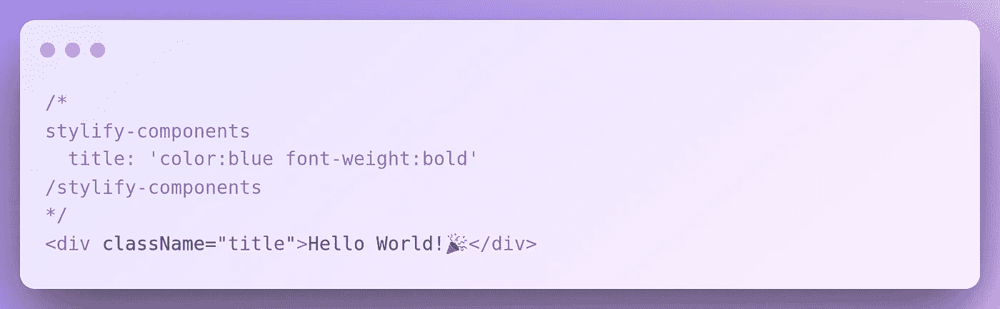

CSS 中的`title`选择器被附加到它需要的每个选择器上。因此，选择器/副本更少，CSS 也更小。

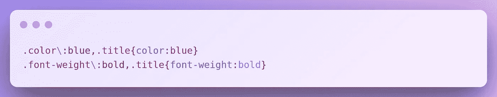

当涉及到生产时，选择器可以缩小:

HTML:

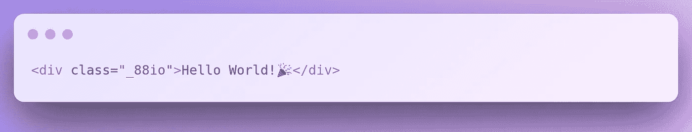

CSS:

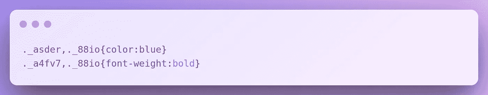

# 媒体查询

当我们需要为各种媒体查询使用不同的样式时，我们可以在样式化组件中这样做:

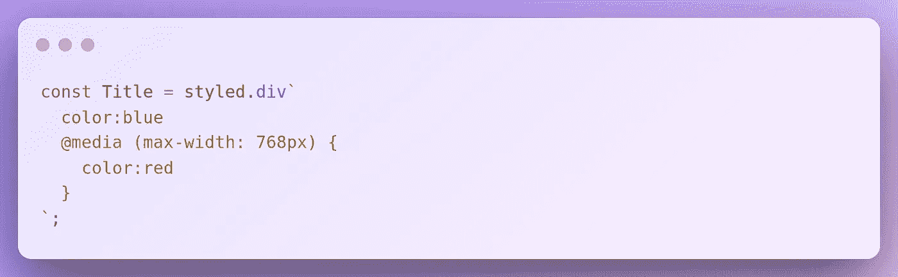

通过 Stylify，您可以使用[预定义屏幕或动态屏幕](https://stylifycss.com/docs/stylify/compiler/#screens):

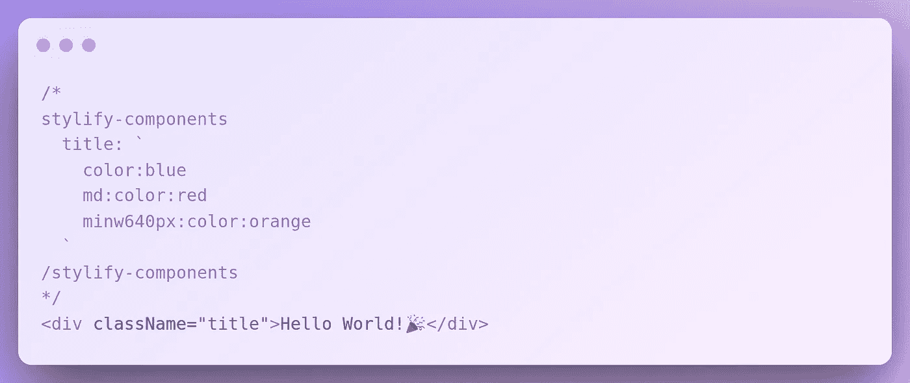

# 变量

变量可以直接在样式中的样式组件内使用:

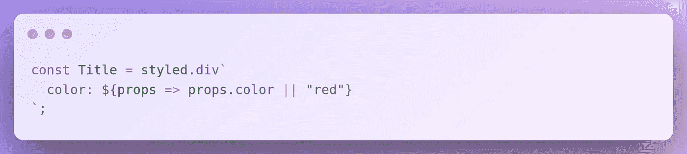

Stylify 允许您定义[变量](https://stylifycss.com/docs/stylify/compiler/#variables)，然后在选择器中使用它们:

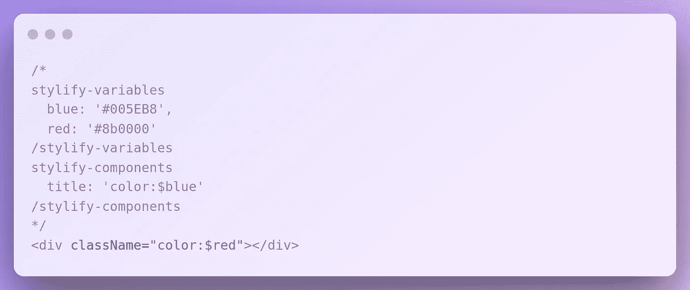

当我们需要不同类型的按钮时，我们需要在 Stylify 中编写完整的选择器:

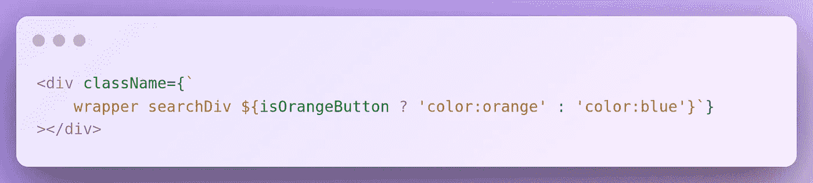

# 关键帧

样式化组件中的关键帧可以这样定义:

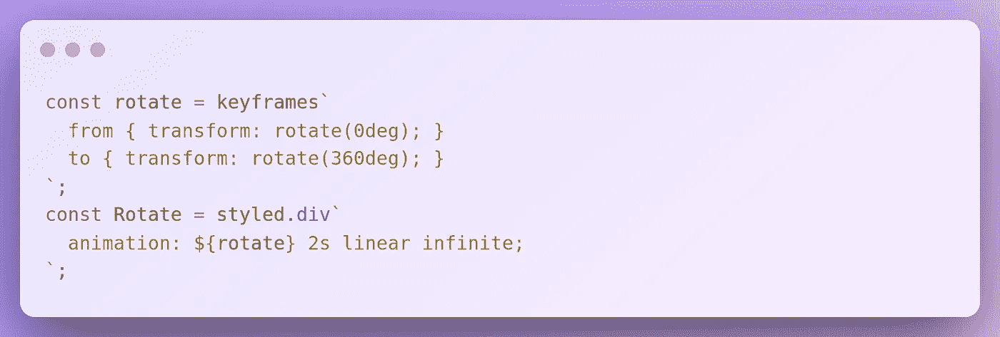

在 Stylify 中，它看起来有点不同:

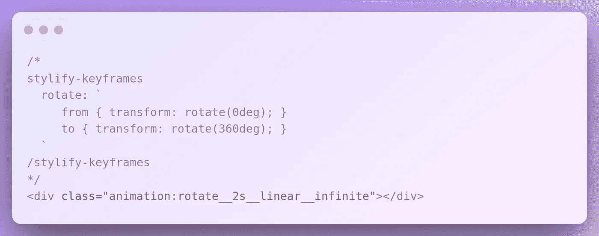

一个简单的动画示例:

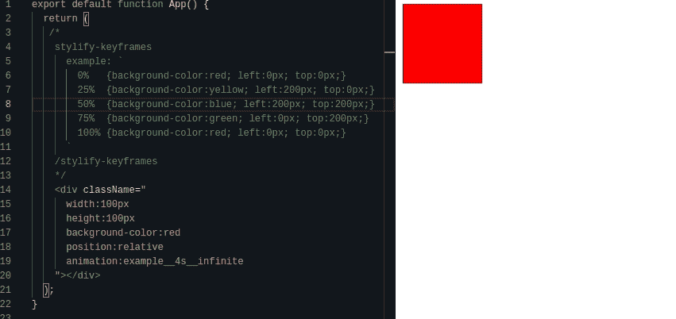

Stylify keyframes example

# 普通选择器

当谈到全局样式和简单选择器时，可以使用`createGlobalStyle`在样式化组件中定义它们:

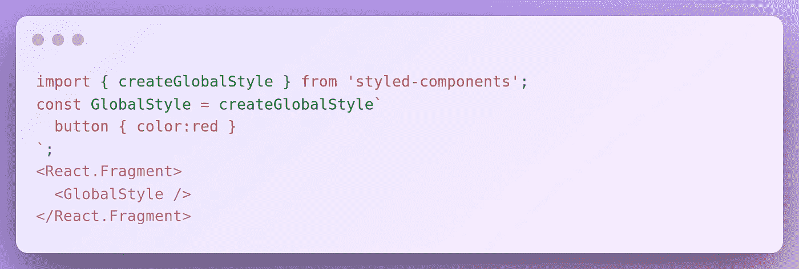

在 Stylify 中，使用[普通选择器](https://stylifycss.com/docs/stylify/compiler/#plainselectors)可以实现同样的功能。选择器直接注入到生成的 CSS 文件中。

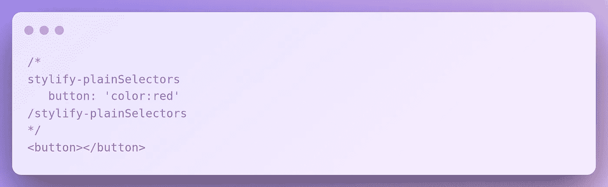

# 拆分 CSS

Styled Components 在优化方面做得很好，因为它自动将 CSS 分为关键和非关键，并注入那些被使用的组件的 CSS。但是，编译是在应用程序运行时完成的。

Stylify 不是那样工作的。它根据你的配置生成 CSS 文件，你必须告诉应用程序什么时候应该加载 CSS。
您可以分别为每个页面/组件/布局配置一个包。尽管你可以任意分割 CSS，但是由于工具/组件的组合，CSS 的大小会相对较小，因为选择器只生成一次。所以有时候只有 Front + Admin CSS 是有意义的。Stylify 网站小于 20 Kb，其他网站在 30-50kb 之间。
还有一个特点是，它不会降低应用程序的速度，因为 CSS 是在应用程序初始化之前生成的。

# 让我知道你的想法！

我会很高兴得到任何反馈！T4 仍然是一个新的图书馆，有很大的改进空间🙂。

此外，非常感谢卢克·史茹回顾了关于风格化组件的信息。

保持联系:

👉[@ stylifycss](https://twitter.com/stylifycss)👉[stylifycss.com](https://stylifycss.com/)👉 [@8machy](https://twitter.com/8machy)
👉[dev.to/machy8](https://dev.to/machy8)👉[medium.com/@8machy](https://medium.com/@8machy)

*更多内容请看* [***说白了就是***](https://plainenglish.io/) *。报名参加我们的**[***免费每周简讯***](http://newsletter.plainenglish.io/) *。关注我们关于* [***推特***](https://twitter.com/inPlainEngHQ) ，[***LinkedIn***](https://www.linkedin.com/company/inplainenglish/)*，*[***YouTube***](https://www.youtube.com/channel/UCtipWUghju290NWcn8jhyAw)*，* [***不和***](https://discord.gg/GtDtUAvyhW) *。**