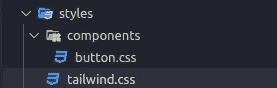
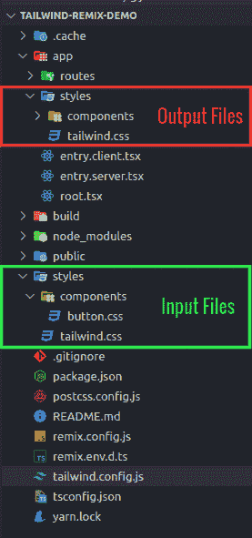

# 用顺风设计混音应用

> 原文：<https://javascript.plainenglish.io/styling-remix-app-with-tailwind-c3e064eace8f?source=collection_archive---------3----------------------->

## PostCSS 插件—使用 postcss-import 组织 CSS 文件


Photo by [Mitchell Luo](https://unsplash.com/@mitchel3uo?utm_source=medium&utm_medium=referral) on [Unsplash](https://unsplash.com?utm_source=medium&utm_medium=referral)

开发者们好💻💻我写这篇短文是为了展示我们如何在 Remix 应用程序中使用顺风。在项目中使用顺风有几种方式。我将使用 Tailwind 作为 PostCSS 插件。这样做的原因是，我们可以使用其他 PostCSS 插件，如 **postcss-import** 来将我们的 CSS 文件组织成多个文件，这使它变得干净和可维护。

> 现在有了官方的[文档](https://tailwindcss.com/docs/guides/remix)来在 Remix 应用中设置 tailwind。所以这篇文章只有在你想从头开始安装 tailwind 的时候才有帮助。

## 我们开始吧

让我们从创建一个全新的 Remix 应用程序开始。运行:

```
npx create-remix@latest
```

我选择 **Remix App Server** 作为部署目标，选择 **TypeScript。您可以根据自己的需求和喜好选择选项。**

运行命令`yarn dev`来启动你的服务器。

## 安装依赖项

运行下面的命令来安装所有需要的依赖项(我们将在本文后面了解它们的需求)

```
yarn add postcss-cli postcss tailwindcss autoprefixer postcss-import concurrently
```

现在运行下面的命令来生成两个配置文件:

`npx tailwindcss init -p`

```
Created Tailwind CSS config file: **tailwind.config.js**
Created PostCSS config file: **postcss.config.js**
```

## postcss.config.js

我们将使用 3 个 PostCSS 插件。`tailwindcss`利用顺风类名的插件，`autoprefixer`解析 CSS 并通过**将厂商前缀添加到规则中的插件，以及**和`postcss-import`使用@import 语句组织多个 CSS 文件的插件。

## tailwind.config.js

在这里的`content`键中，我们添加了包含所有源文件的路径，在这些文件中我们将使用 Tailwind 提供的类名。Tailwind 将扫描所有这些提供的源文件，并为这些使用的类名生成所有相应的 CSS。

## 式样

在这里，我们将 CSS 文件组织成多个文件，并在构建时提前使用`@import`语句将它们组合在一起，而不是在浏览器中。

在项目的根目录下添加`styles`文件夹。将`tailwind.css`添加到`styles`文件夹中。另外，在`styles`文件夹内的`components`文件夹内添加`button.css`。



## 按钮. css

这里我们写按钮相关的样式。我们以后会用到它。

## tailwind.css

这里我们结合了核心的顺风样式和我们的定制样式(在我们的例子中是按钮样式)。

这里我们使用了`@import "tailwindcss/base"`语法，而不是普通的`@tailwind base`语法，这样我们就可以将自定义 CSS 结合到核心 CSS 中，避免``@import` statements must come first`错误。

有关详细信息，请参考[本](https://tailwindcss.com/docs/using-with-preprocessors)文档。

## package.json

在这里，我们准备脚本将顺风 CSS 文件转换为正常的 CSS。

现在你可以运行`yarn dev:css`将上面的顺风 CSS 文件转换成普通的 CSS。或者运行`yarn dev`来转换我们的顺风 CSS 文件，同时运行我们的 remix 服务器。对于开发环境，我们使用了`-w`选项来观察对 CSS 文件的任何更改，并自动转换它们。

上面的`postcss`脚本镜像了相对于路径的目录结构(用`— base`选项 ie 提到)。`styles`文件夹)在输出目录中(用 `— dir`选项即`app/styles`提及)。

## 最终文件夹结构



## 。gitignore

将生成的输出文件`/app/styles/*`添加到`.gitignore`文件中。

## root.tsx

将生成的 CSS 文件导入到`root.tsx`文件中。现在任何文件都可以利用顺风风格。

## 使用

```
// use tailwind css 
<div *className*="bg-red-500">Primary</div>// use our defined button styles
<button *className*="btn-primary">Click Here</button>
```

# 结论

如果你在任何地方迷路了，你可以检查我的 Github 项目。

[](https://github.com/dipeshhkc/remix-tailwind) [## GitHub-dipeshkc/Remix-tail wind:Remix 应用程序中的顺风设置

### 此时您不能执行该操作。您已使用另一个标签页或窗口登录。您已在另一个选项卡中注销，或者…

github.com](https://github.com/dipeshhkc/remix-tailwind) 

这是我们在 remix 应用程序中使用 Tailwind 作为 PostCSS 插件的短暂旅程的结束。希望这对你的项目有所帮助。任何建议都是非常值得的。快乐编码☺.

*更多内容请看* [***说白了就是***](http://plainenglish.io/) *。报名参加我们的* [***免费每周简讯***](http://newsletter.plainenglish.io/) *。在我们的* [***社区不和谐***](https://discord.gg/GtDtUAvyhW) *获得独家获取写作机会和建议。*