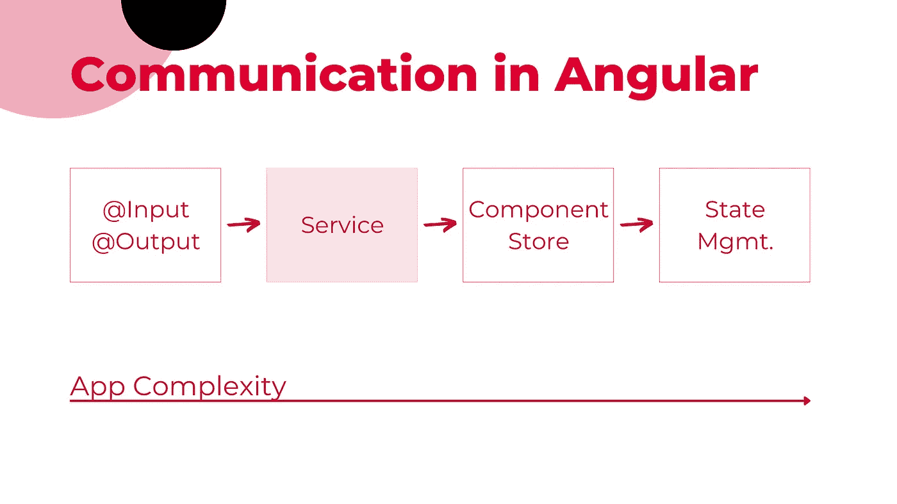
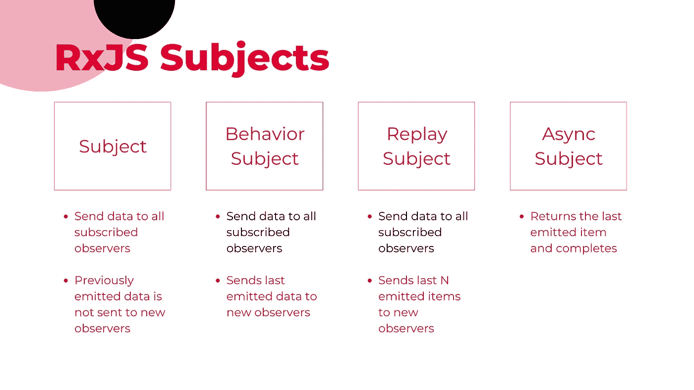

# 主题 RxJS —角度示例

> 原文：<https://javascript.plainenglish.io/subject-rxjs-angular-example-b35332482cd?source=collection_archive---------4----------------------->

## [RXJS](https://medium.com/@lorenzozar/list/rxjs-39bc4f4110ec) ，[角形](https://medium.com/@lorenzozar/list/angular-5496c492a185)

## 这个例子将展示如何在一个简单的角度应用程序中使用 RxJS 主题

使用 Angular 的一个好处是它基于组件的 UI 构建方法。许多采用基于组件方法的框架和库都是如此。

然而，基于组件的方法并不是免费的，它也伴随着复杂性。例如，组件可能需要相互通信。

有几种情况下组件需要相互通信:

*   **父/子** —孩子可能在 DOM 树的深处
*   **仪表盘** —许多兄弟姐妹甚至不认识对方，但必须交流
*   **组件列表** —组件被有条件地呈现，并且可能需要在不知道彼此的情况下相互通信

如果场景是一个简单的父/子结构，我们可能会选择`@[Input](https://angular.io/api/core/Input)()`和`@[Output](https://angular.io/api/core/Output)()`装饰器。然而，这很快就会变得疯狂。尤其是当父组件和子组件之间有多个组件时。

当应用变得复杂时，状态管理才是真正的问题。在这种情况下，NgRx 或者它的轻量级版本 ComponentStore 应该是维护单一事实来源和组件间通信的首选方式。

[](https://levelup.gitconnected.com/an-introduction-to-ngrx-2d849c0baac4) [## NgRx 简介

### NgRx 是一个使用 Redux 模式的状态管理库。通过构建应用程序，了解使用它的原因、时间和方法。

levelup.gitconnected.com](https://levelup.gitconnected.com/an-introduction-to-ngrx-2d849c0baac4) 

然而，有时候，包括状态管理在内的解决方案有些矫枉过正。

当你处于两者之间时，服务可能是一个不错的选择。在服务中使用主题是一种很好的模式

*   向多个组件发送数据，
*   从多个组件接收数据，
*   相应地更新每个组件

这就是受试者来拯救的地方。

一般来说，主题被放在一个服务中，当`@[Input](https://angular.io/api/core/Input)()`和`@[Output](https://angular.io/api/core/Output)()`装饰者不足，但是状态管理有点太多的时候可以使用。



Use the Subject in service pattern when the complexity is medium

# RxJS 主题概述

主体是一种特殊类型的可观察对象。它是可观察的，同时也是观察者。

将多播值提交给许多观察者。这意味着，与普通的可观测物不同，它们向所有观测者发出相同的值。

值得一提的是 [RxJS 提供多个【科目】](https://rxjs.dev/guide/subject#subject)。下面是跳转到 RxJS 主题之前的概述。

## 科目

主题向所有订阅的观察者发送数据。

任何以前发出的数据都不会发送给新的观察者。您只有在订阅后才能获得数据。

## **行为主体**

BehaviorSubject 将最后发出的数据发送给新的观察者。它还将发送任何未来的数据。像主题，但它也发送最后发出的项目。

## **ReplaySubject**

先前发送的数据可以“重放”给新的观察者。您可以决定向新的观察者重放所有内容，或者只重放一部分数据。

现在你可以把 BehaviorSubject 想象成一个只重放一次的 ReplaySubject。

类似于 Subject，但它发送最后 N 个发出的项目，其中 N 由您决定。

## **异步主题**

AsyncSubject 返回最后发出的项并完成。以前和将来的项目不重要。

下图概括了四种类型的 RxJS 主题。



Recap of the four types of RxJS Subjects.

# 主题 RxJsS—角度示例

下面的例子将在服务中使用一个主题，遵循一个常见的可观察服务模式。

可观察服务模式的目的是创建一个系统，当服务中的数据发生变化时，所有使用该服务的组件都会得到通知和更新。

我们将有一个 AppComponent 创建随机数并将其传递给服务的应用程序。该服务使用一个主题来通知所有订户。

## 服役中

我们首先在服务中创建一个主题的新实例。类型是数字，因为`bingoSubject`只会发出数字。

通过使用关键字`private`,我们封装了`bingoSubject`,这样就不能从服务外部访问它。

```
private bingoSubject = new Subject<number>();
```

这是一个很好的实践，否则我们应用程序的其他部分可能会错误地使用主题并触发数据发射。

为了能够订阅`bingoSubject`,我们定义了一个公开主题的只读可观察部分的公共变量。

```
randomNumber$ = this.bingoSubject.asObservable();
```

由于`randomNumber$`是可观测的，我们给它加上一个`$`符号。这是一个帮助我们发现代码中可观察到的地方的约定。

发出新值时，`randomNumber$`的所有订阅者将收到相同的值。

最后，我们添加一个方法来改变这个数字。由于`randomNumber$`是一个可观察值，我们可以使用`next`方法来发出一个新值。

```
updateNumber(item: number) {
 this.bingoSubject.next(item);
}
```

## 在 AppComponent 类中

在 AppComponent 类中，我们声明两个变量:`receivedNumber`和`subscription$`。分别是服务中主体发出的号码和服务中主体实例的订阅。

然后，我们在构造函数中注入`bingoService`，最后，我们访问服务中的主体实例`randomNumber$`。

```
receivedNumber: number;
subscription$: Subscription;

constructor(private bingoService: BingoService) {}

ngOnInit() {
  this.subscription$ = this.bingoService.randomNumber$.subscribe(
    (x: number) => (this.receivedNumber = x)
  );
}
```

在同一个类中，我们添加了一个从模板触发的`extractNumber`方法。该方法创建一个随机数，调用服务中的`updateNumber`方法，并将新数传递给它。

```
extractNumber() {
  const randomNumber = Math.ceil(Math.random() * 100);
  this.bingoService.updateNumber(randomNumber);
}
```

## 在 AppComponent 模板中

该模板有一个触发`extractNumber`方法的按钮。单击按钮后，会发生以下情况:

1.  按钮点击触发`extractNumber`
2.  `extractNumber`方法生成一个新数字，并将其传递给服务的`updateNumber`方法。
3.  在服务中，`updateNumber`接收数字，并使用主题实例的`next`方法，例如`bingoSubject`来发出值。
4.  由于`bingoSubject`被分配给`randomNumber$`，所有订阅它的观察者将被通知新的号码。
5.  在 AppComponent 类中，我们订阅了`randomNumber$`,并将值赋给了`receivedNumber`,后者在模板中得到更新和呈现。

```
<button (click)="extractNumber()">New Number</button>
<p>The number in the Subject is: {{ receivedNumber }}</p> 
```

这差不多就是这个主题了。

你可以在 StackBlitz 上找到一个例子。在这个例子中，我添加了三个订阅了`randomNumber$`的子组件。

您会注意到，一旦`randomNumber$`发出一个新值，它们就会得到更新。

[](https://stackblitz.com/edit/angular-ivy-o5s3fc?file=src/bingo.service.ts) [## 主题堆叠

### RxJS 主题示例

stackblitz.com](https://stackblitz.com/edit/angular-ivy-o5s3fc?file=src/bingo.service.ts) 

# 最终意见

我们上面说过，RxJS 科目可以对你的角度应用产生积极的影响。然而，如果复杂性显著增加，您可能需要考虑像 NgRx 这样的[状态管理解决方案。](https://medium.com/gitconnected/an-introduction-to-ngrx-2d849c0baac4)

在这个例子中，我们的代码不是反应式的，可以做一些改进。使用[角异步管道](https://medium.com/better-programming/go-reactive-with-angular-async-pipe-b290988f4000)是朝着这个方向迈出的一步。

*更多内容请看*[***plain English . io***](https://plainenglish.io/)*。报名参加我们的* [***免费周报***](http://newsletter.plainenglish.io/) *。关注我们关于*[***Twitter***](https://twitter.com/inPlainEngHQ)[***LinkedIn***](https://www.linkedin.com/company/inplainenglish/)*[***YouTube***](https://www.youtube.com/channel/UCtipWUghju290NWcn8jhyAw)*[***不和***](https://discord.gg/GtDtUAvyhW) *。对增长黑客感兴趣？检查* [***电路***](https://circuit.ooo/) *。***