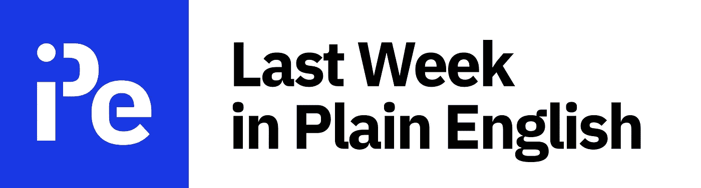

# 订阅我们的免费时事通讯

> 原文：<https://javascript.plainenglish.io/subscribe-to-our-free-newsletter-67e0a86bdfe5?source=collection_archive---------2----------------------->

## 我们会让你了解整个技术世界到底发生了什么。

[http://newsletter.plainenglish.io](http://newsletter.plainenglish.io)

第一次瞥一眼科技世界的幕后，你可能会发现自己淹没在信息的海洋中。新的框架、新的语言、工作环境、市场趋势、人工智能突破、安全风险、公司丑闻、游戏、太空探索、绿色技术、机器人——这些都是我想不到的，但我已经感到有点头晕了。

忠实于我们的名字，在《简明英语》,我们相信让我们的读者尽可能容易地获取信息。我们也意识到互联网上的信息是多么的饱和。这就是为什么我们上周用简明英语创造了**，让你更容易跟上技术世界的最新发展(广义上)。**

无论是最新的趋势框架还是最新的爆炸性丑闻，我们都会让你了解整个技术世界到底发生了什么。除此之外，你还可以阅读我们出版物中本周最有趣内容的精选列表。

所有这些以及更多每周都在等着你。所以赶快加入我们的 [**免费周报**](http://newsletter.plainenglish.io/) 吧。

