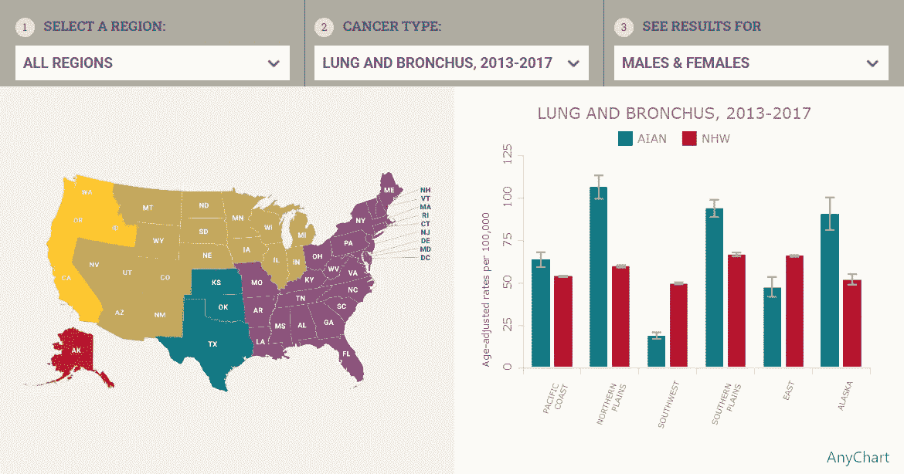

# SunnyByte 使用 AnyChart JS 可视化美洲原住民癌症数据

> 原文：<https://javascript.plainenglish.io/sunnybyte-visualizes-native-american-cancer-data-using-anychart-js-4766bad81264?source=collection_archive---------25----------------------->

## 了解 SunnyByte 为新墨西哥大学建立的 AIAN 癌症数据网站&看看 AnyChart JS 是如何使用的。

开箱即用的[误差条](https://www.anychart.com/chartopedia/chart-type/error-chart/)和能够[创建一个很酷的误差图](https://www.anychart.com/blog/2022/02/03/error-chart-js/)而没有争论，这一直是 AnyChart 的一个主要吸引力，除此之外还有其他伟大的[功能](https://www.anychart.com/features/)促使开发人员选择我们的 [JavaScript 图表库](https://www.anychart.com)。如果你想看看这种可视化的实际例子，SunnyByte 的合伙人 Shen DeShayne 最近为我们带来了一个有趣的新用例。美国印第安人阿拉斯加土著癌症数据网站，他为新墨西哥大学建立的网络开发机构，在由 AnyChart 支持的交互式错误图表中显示信息。通过一个简短的采访，了解更多关于这个项目以及我们的 JavaScript 库是如何使用的。

## 你好，沈！让我们从一个简单的介绍开始:什么是 SunnyByte？

Shen DeShayne:在 SunnyByte，我们让 web 开发体验变得简单而轻松。我们与机构和公司合作，充当他们团队的开发延伸，以确保他们的项目，无论是网站、应用程序构建、数据集成还是任何介于两者之间的项目，都是成功的！[我们专门从事 Craft CMS](https://www.sunnybyte.com/craftcms) ，我们在这个项目中使用它来提供一个简单的编辑内容和图表数据的界面。我们是一家[认证的 Craft CMS 合作伙伴开发机构，总部位于洛杉矶](https://craftcms.com/partners/sunnybyte)。

## **答:什么是美洲原住民癌症数据项目，你是如何参与其中的？**

SD:生活在美国不同地区的美洲印第安人和阿拉斯加土著人(AIAN)患癌症和死于癌症的比率不同。我们的机构合作伙伴 Seasons Communications 与新墨西哥大学合作开展一个项目，他们找到我们，询问关于建立一个信息中心的问题，该信息中心提供高度注释的癌症监测数据和教育信息，以支持美国 AIAN 社区的癌症控制工作。该信息中心现已在[nativeamericancancerdata.org](https://www.nativeamericancancerdata.org)提供。

## **答:** [**数据可视化**](https://www.anychart.com/blog/2018/11/20/data-visualization-definition-history-examples/) **有多大帮助？为什么这个项目需要它？**

SD:数据可视化使 AIAN 能够快速了解他们的风险状况，并了解预防和治疗方法。这些原始数据只能在难以使用的数据仓库中获得，并且提供有限的过滤和排序。

## 你如何使用 AnyChart？

SD: AnyChart 是唯一一个能够将我们需要的数据切片的图表工具。最重要的是，它允许我们向访问者提供[多系列](https://docs.anychart.com/Working_with_Data/Series_Manipulation) [条形图](https://www.anychart.com/chartopedia/chart-type/bar-chart/)和[柱形图](https://www.anychart.com/chartopedia/chart-type/column-chart/)，其中包括[误差条](https://www.anychart.com/chartopedia/chart-type/error-chart/)以指示癌症数据的不确定性。

## 你对这个项目有什么想法？

SD:该网站是使用 Craft CMS 在后端构建的，允许非技术用户更新图表数据和编辑网站上的其他内容。在前端，它使用 TailwindCSS 和 Vue.js 构建以提供交互性。

## 你最喜欢我们的 JavaScript 图表库的哪一点？

AnyChart 不仅赞助了这个项目，而且是唯一满足我们需求的 JavaScript 图表库。

## 你对我们应该改进的地方有什么意见或建议吗？

SD:没有抱怨，图书馆的[文档](https://docs.anychart.com)完全足够快速地移动。

## **A:你会如何向别人推荐任何一张图表？**

SD: AnyChart 是一个健壮的、文档非常完善的付费图表库，它允许您专注于发布新功能，而不是与您的工具斗争！

*想分享你的 AnyChart 故事吗？* [*让我们认识一下*](https://www.anychart.com/support/) *！*

*别错过其他炫酷的* [*客户故事*](https://www.anychart.com/blog/tag/customer-story/)*[*精选案例分析*](https://www.anychart.com/company/success_stories/) *。**

**原载于 2022 年 2 月 16 日 https://www.anychart.com**[*。*](https://www.anychart.com/blog/2022/02/16/native-american-cancer-data-visualization/)**

**更多内容请看*[***plain English . io***](http://plainenglish.io/)*。报名参加我们的* [***免费每周简讯***](http://newsletter.plainenglish.io/) *。在我们的* [***社区不和谐***](https://discord.gg/GtDtUAvyhW) *中获得独家写作机会和建议。**