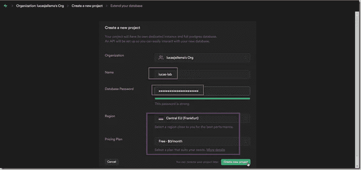
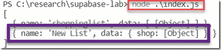
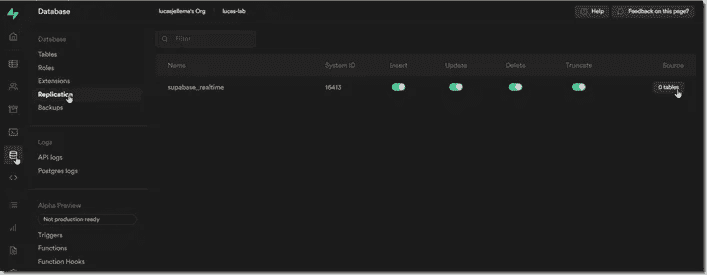
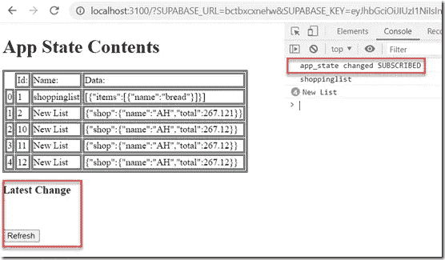

# 在普通 HTML/JS Web 应用程序中支持持久性和服务器到客户端的推送

> 原文：<https://javascript.plainenglish.io/supabase-for-persistence-and-server-to-client-push-in-vanilla-html-javascript-web-application-a-99ddd9e4e307?source=collection_archive---------1----------------------->

## 如何在普通的 HTML/JavaScript web 应用程序中使用 Supabase 进行持久化和服务器到客户端推送的分步指南。

Supabase 为 web 应用程序提供基于云的后端服务。这意味着任何(静态)web 应用程序都可以使用 Supabase 进行用户认证和数据持久化。Supabase 提供服务器到客户端的推送通知服务，它具有服务器端的无服务器功能，例如，可以处理 webhooks(来自许多不同互联网服务的触发器)。本文描述了我使用 Supabase 和一个仅包含 HTML 和 JavaScript 的简单 web 应用程序的初步尝试。


Vanilla HTML & JavaScript web application directly interacting with Supabase backend for data persistence and real-time data update notifications

我的目标是:使用普通的 HTML 和 JavaScript 创建一个 web 应用程序，并将其连接到 Supabase 后端，以便为应用程序的数据提供持久性，并在数据库更新时实时更新应用程序。我将首先创建一个连接、插入、查询和订阅[通知]的简单节点应用程序。一旦我掌握了这一点，我将创建做类似事情的客户端。

一位同事最近提醒我注意 Supabase:一种为 web 应用程序提供后端的服务，包括用户管理和认证、数据持久化、实时数据推送、文件存储和无服务器(edge)功能。数据持久性由托管 PostgreSQL 数据库提供。Supabase 允许我们从他们的免费层开始——也可以在本地运行平台——独立于云后端。Supabase 被定位为 Firebase 的替代产品。但是，我对 Firebase 不够了解，无法进行任何比较。

看过一些文章，浏览过网站。我还没有尝试过 Supabase，也不知道如何开始。我很快就会找到答案，并在本文中分享我的经历。

# Supabase 项目

Supabase 组织项目中的资源。每个项目都有自己的数据库实例、自己的一组数据库策略、用户和身份验证规则。要使用 Supabase，注册是第一步，项目的创建紧随其后。

前往[https://app.supabase.com/](https://app.supabase.com/)


Sign up with GitHub on Supabase homepage

使用 GitHub 登录。出现提示时，在 GitHub 上授权 Supabase。


点击新建项目。


为项目提供一个名称，并为数据库访问设置密码。



Provide project details — such as name, password for database account, region and plan

选择区域并选择计划(免费可能是一个好的开始)。

点击创建新项目。

创建项目后，转到数据库区域的 SQL 编辑器。


Navigate to the SQ:L Editor

点击创建表格。

稍微编辑一下提议的表定义——将其名称改为 *app_state* 。


Select the Create Table snippet


Edit the proposed Create Table statement

单击 Run 在数据库中创建表。


Feedback after running the create table command

REST API 现在也生成了。


Details on the REST API that is created for accessing the project’s database backend


The situation at this point: a database with one table (APP_STATE) and a REST API that can be accessed to query and manipulate data

成功创建表后，切换到 API 选项卡。这里提供了与为表生成的 API 进行交互的说明。

现在后端已经创建好了，是时候创建一个应用程序来与之交互了。

# 本地开发—节点应用程序


Overview of a local Node application interacting with Supabase project

为了体验与 REST API 的交互，我首先创建了一个简单的节点应用程序，它使用 Supabase JavaScript SDK 与后端进行交互。应用程序建立连接，从 APP_STATE 表中读取记录，并在该表中创建新记录。在第二次迭代中，我将添加对 APP_STATE 表中的更改的订阅，任何更改都将作为推送通知报告给节点应用程序。

注意:本文中显示的所有代码都可以从 GitHub Repo 获得:[https://github.com/lucasjellema/supabase-lab/tree/main/lab1](https://github.com/lucasjellema/supabase-lab/tree/main/lab1)

在我的本地开发环境——Lucas-lab 中创建一个新文件夹。在命令行上，执行:

```
npm init
```

在随后的对话框中接受所有默认值。

现在执行:


```
npm install -save @supabase/supabase-js
```

创建文件 index.js 并复制以下代码:

```
const { createClient } = require('[@supabase/supabase-js](http://twitter.com/supabase/supabase-js)')const supabaseUrl = '[https://bctbnehetetyatkfw.supabase.co'](https://bctbxcxnehetetyatkfw.supabase.co')
const supabaseKey = process.env.SUPABASE_KEY
const supabase = createClient(supabaseUrl, supabaseKey)const main = async () => {let { data, error } = await supabase.from('app_state').select('name, data').range(0,10)if (error) {console.error(error)return}console.log(data)
```
```

这段代码只是从 Supabase 项目后端的 APP_STATE 表中查询前 10 条记录，并将检索到的数据写入控制台。

使用“设置-API-项目 API 密钥”中的值设置环境变量 SUPABASE_KEY 和 SUPABASE_URL。

```
export SUPABASE_KEY="<key value>"export SUPABASE_URL="<url value>"
```

或者在 Windows Powershell 下:

```
$Env:SUPABASE_KEY = '<key value>'$Env:SUPABASE_URL = '<url value>'
```

(当然，对于只在我的本地环境中运行的代码，我也可以直接在源代码中设置“const supabaseKey”和“const supabaseUrl”的值)。

使用以下内容运行此应用程序:

```
node index.js
```

输出结果可能并不令人印象深刻，但却很有意义:


Output from running index.js with no data yet in table APP_STATE

建立到 Supabase API 的连接，并从表中检索数据。只是现在不多。


Adding a record to table APP_STATE in the SQL Editor

接下来，我使用表编辑器在客户机 UI 中向表 APP_STATE 添加了一条记录。

我再次运行该应用程序，效果稍微好一点:


Running index.js again — this time showing a single record from table APP_STATE

我将下面的代码片段添加到应用程序中。这构成了对 Supabase 后端的调用，以在表 APP_STATE 中创建新记录，列名设置为“新列表”，数据设置为带有属性*商店*的对象的 JSON 表示。

```
let { dataI, errorI } = await supabase.from('app_state').insert([{ name: 'New List', data: {shop:{name:"AH", total:267.12}} }])
```

添加为 main 函数中的第一个条目。

运行这段代码的输出:



Running index.js again — two records are shown — one is inserted by the application just prior to querying the data

显示从表中检索到了一条新记录——这条记录是通过我刚才添加的 insert 语句添加的。

下面是 Supabase web 控制台中的表格编辑器(也包含新记录):


New record inserted in Node application showing in Supabase Table Editor

# 实时—服务器向客户端推送表更改通知

Supabase 可以通知客户端应用程序所选表中数据的任何变化。我们需要做两件事来实现这一目标:

1.  确保在 Supabase 后端，对相关表的更改包含在复制机制中
2.  为客户端应用程序中的函数订阅指定表中的相关更改


Two things to get Real Time (notifications) for APP_STATE to work: add table to replication set and subscribe to changes

1.将表添加到复制:



Enabling Database Replication and drilling down to table set

点击侧边栏中的数据库。然后在复制时；复制很可能已经启用。如果不是，那么现在就启用它。要将表 APP_STATE 添加到已发布更改的表集中，请单击标题*Source*下的图标，该图标指示当前正在复制的表的数量。


Enable replication for table APP_STATE

从可用的表中选择表 APP_STATE。

2.为客户端订阅实时数据更改

应用程序订阅表 APP_STATE 中的实时更改是通过下面的代码片段完成的，在 function main 中的某个位置:

```
subscription1 = supabase.from('app_state').on('UPDATE', (v) => console.log('UPDATE on app_state', v)).on('INSERT', (v) => console.log('INSERT on app_state', v)).subscribe((change) => console.log('app_state changed', change))
await sleep(30000)supabase.removeSubscription(subscription1);
```

需要添加函数 sleep()，以暂停处理节点应用程序，让我们有时间在 Supabase 表编辑器中进行更改，并查看推送到客户端应用程序的更改:

```
function sleep(time) { return new Promise(resolve => setTimeout(resolve, time));}
```

运行节点应用程序。当它开始时，您有 30 秒的时间通过表编辑器对表 APP_STATE 中的数据进行更改，并在控制台上看到效果。


Make a change in a table record in the Table Editor in Supabase web console

节点应用程序的输出:


Report on the change made in the backend table as handled by the Node application

这是强大的东西。通过几行代码，该应用程序可以保存其状态、检索状态并订阅更改中的更改——从任何基于云的后端工作的客户端进行操作。

# 普通的 HTML 和 JavaScript Web 应用程序

比从服务器端节点应用程序利用 Supabase 更有用的是从浏览器中运行的 web 应用程序直接访问 Supabase 的能力，在服务器端节点应用程序中，我们可以轻松访问各种后端服务。


The real objective of this article: a static web application that only runs JavaScript — interacting with Supabase backend

图中仍然显示了 Node——但只是为了向浏览器提供静态 web 应用程序(也可以是 nginx 或 apache httpd ),与 Supabase 的所有交互都发生在客户端——浏览器中的 JavaScript 代码。

我创建了节点文件 web-server.js，它只做一件事:为子目录 *web* 中的文件 index.html 提供服务:

```
const http = require('http')const fs = require('fs')const PORT = 3100// create an HTTP server that handles HTTP requests; it is handed two parameters: the request and response objectsconst server = http.createServer((req, resp) => {fs.readFile("web/index.html", function (error, page) {if (error) {resp.writeHead(404);resp.write('Contents you are looking are Not Found');} else {resp.writeHead(200, { 'Content-Type': 'text/html' });resp.write(page);}resp.end();})})server.listen(PORT);console.log(`HTTP Server is listening at port ${PORT} for HTTP GET requests`)
```

index.html 文件是这里有趣的一个。它在浏览器中显示 APP_STATE 表的内容:


index.html — this IS the vanilla HTML & JavaScript web application powered by a Supabase persistent and pushing backend

代码的简短指南:

1.  加载 Supabase JavaScript 客户端(SDK)(这一行类似于 package.json 中的“@supabase/supabase-js”依赖项和节点应用程序中 index.js 中的 require([' @ supa base/supa base-js '](mailto:'@supabase/supabase-js'))的组合)
2.  Supabase 密钥和 URL 不是硬编码的；相反，它们是在运行时从 URL 查询参数中学习的
3.  当文档加载到浏览器中时，将执行此功能，并初始化 Supabase 客户端，随后从表 APP_STATE 中查询数据
4.  就像在节点应用程序中一样，调用 Supabase REST API(通过客户端 SDK)从指定的表 APP_STATE 中查询多达 10 条记录
5.  对于从 Supabase 检索的数据中的每条记录，都会在 HTML 表中添加一个新行


运行节点应用程序 web-server.js

[http://localhost:3100/？supa base _ URL = bctaasdsaqwfw&supa base _ KEY = eyJhqams](http://localhost:3100/?SUPABASE_URL=bctaasdsaqwfw&SUPABASE_KEY=eyJhqams)

然后使用以下 URL 在本地浏览器中打开 web 应用程序:

查询参数 SUPABASE_URL 的值是 URL 中的第一个路径段(不包括前导的 https://也不包括一般的. supabase.co 后缀)。

浏览器会打开——我没有说它会很漂亮——并显示一个表，其中包含从 APP_STATE 后端表中检索到的数据:


Vanilla Web Application in browser — showing data retrieved from Supabase backend

# Web 应用程序中的实时变更报告—实时服务器到客户端推送

当在 APP_STATE 表中进行更改并且刷新浏览器时，将显示数据的最新状态。我们可以做得更好——至少是一个——使用实时服务器向客户端发送通知。

向 index.html 页面添加一小段 HTML 代码——就在元素下面:


```
<h3>Latest Change</h3>
<div id=”breakingNews”></div>
<br /><br />
<button id=”refresh” onclick=”refreshData()”>Refresh</button>
```

然后将函数 *subscribeAppState* 添加到 index . html 中的<脚本>部分，并在为 *DOMContentLoaded* 事件注册的函数中包含对该函数的调用:


```
function subscribeAppState() {subscription1 = supabaseClient.from('app_state').on('UPDATE', (v) => { console.log('UPDATE on app_state', v); reportDataChange(v) }).on('INSERT', (v) => { console.log('INSERT on app_state', v); reportDataChange(v) }).on('DELETE', (v) => { console.log('DELETE on app_state', v); reportDataChange(v) }).subscribe((change) => console.log('app_state changed', change))}
```

保存文件 index.html。刷新浏览器。



Changes in Web Application to support Real-Time Data Change Notifications

该表仍然显示，还有一个标题*最新更改*和一个标记为*刷新*的按钮。控制台显示一条消息，指示订阅已经发生。

如果我现在在 Supabase 表格编辑器中进行更改，例如删除一条记录:


Delete a record from the Table APP_STATE through the Supabase Table Editor

然后，浏览器几乎会立即报告这一更改。


The deletion of the record from the table is reported to the web application

按下按钮*刷新*后，表格也会更新，以反映表格 APP_STATE 中的当前情况。

# 在 GitHub 页面上运行 Web 应用程序

web 应用程序现在在我的笔记本电脑上本地运行，使用的是 Node web 服务器应用程序。这是可行的，但不是理想的情况。理想情况下，我不需要运行任何东西来访问应用程序，尤其是为了让您访问我的应用程序。当然，在这种情况下，我需要分发 Supabase 密钥和应用程序的 Url，以便您可以使用——但也许我会这样做。那么，我如何才能使这个静态 web 应用程序(运行应用程序只需将静态的、不可更改的 web 资源一次性下载到浏览器中)对任何人都可用呢？

这就是 GitHub Pages 的用武之地。 [GitHub Pages](https://pages.github.com/) 旨在托管来自 GitHub 存储库的个人、组织或项目页面。这就是我使应用程序可访问的全部内容。

为此，我将转到 GitHub 存储库控制台并启用 GitHub 页面——指定可发布资产所在的分支和目录:


Enable GitHub Pages for the Repository containing the Supabase Lab sources

保存这些更改后，将出现以下消息:


Instruction for accessing GitHub Pages

完成发布可能需要几分钟时间。届时，我和您都可以通过以下网址访问该应用:[https://lucasjellema . github . io/supabase-lab/lab 1/web/index . html](https://lucasjellema.github.io/supabase-lab/lab1/web/index.html)。当然，需要添加查询参数 SUPABASE_KEY 和 SUPABASE_URL。


Running the web application from GitHub Pages; anyone in the world can access the application. However, they need the SUPABASE_KEY and SUPABASE_URL to make good use of it

# 资源

本文中显示的所有代码都可以从 GitHub Repo 获得:【https://github.com/lucasjellema/supabase-lab/tree/main/lab1 

Supabase JS 客户端库—[https://supabase . com/docs/reference/JavaScript/supabase—客户端](https://supabase.com/docs/reference/javascript/supabase-client)和[https://github.com/supabase/supabase-js](https://github.com/supabase/supabase-js)和(数据库相关命令)[https://supabase.com/docs/reference/javascript/insert](https://supabase.com/docs/reference/javascript/insert)

阅读关于如何为表启用实时变更发布的描述:[https://supabase.com/docs/guides/database/replication](https://supabase.com/docs/guides/database/replication)

*原载于 2022 年 6 月 5 日*[*https://technology . amis . nl*](https://technology.amis.nl/frontend/supabase-for-persistence-and-server-to-client-push-in-vanilla-html-javascript-web-application-a-step-by-step-guide/)*。*

*更多内容请看*[***plain English . io***](https://plainenglish.io/)*。报名参加我们的* [***免费周报***](http://newsletter.plainenglish.io/) *。关注我们关于*[***Twitter***](https://twitter.com/inPlainEngHQ)*和**[***LinkedIn***](https://www.linkedin.com/company/inplainenglish/)*。查看我们的* [***社区不和谐***](https://discord.gg/GtDtUAvyhW) *加入我们的* [***人才集体***](https://inplainenglish.pallet.com/talent/welcome) *。**