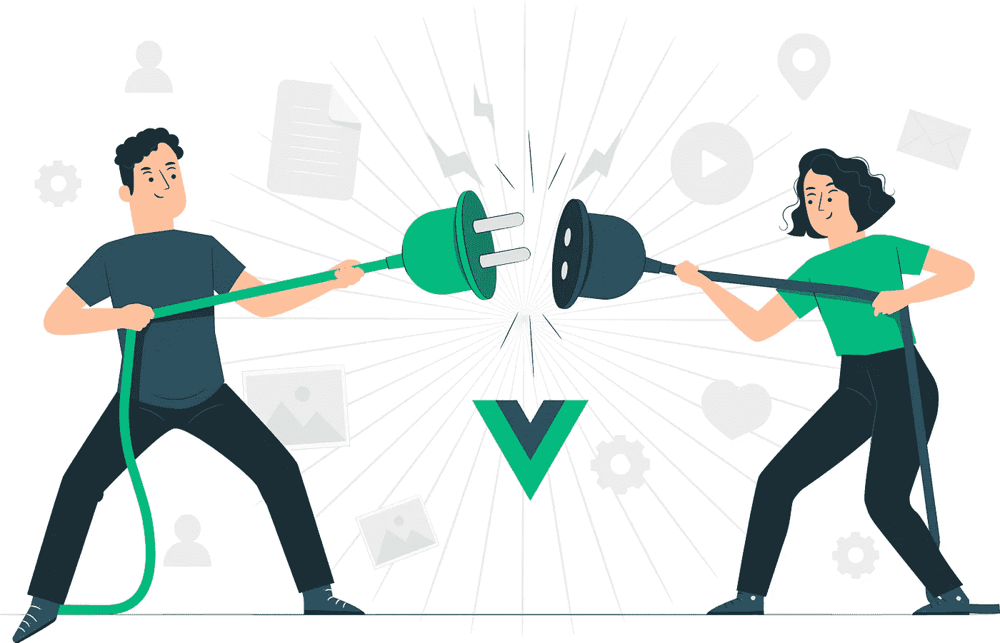
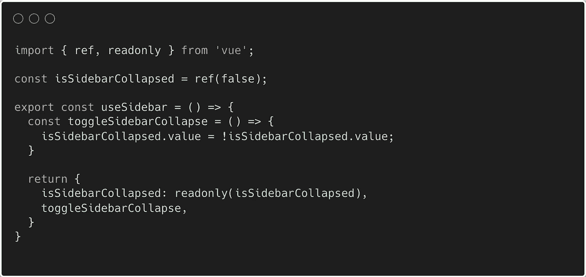
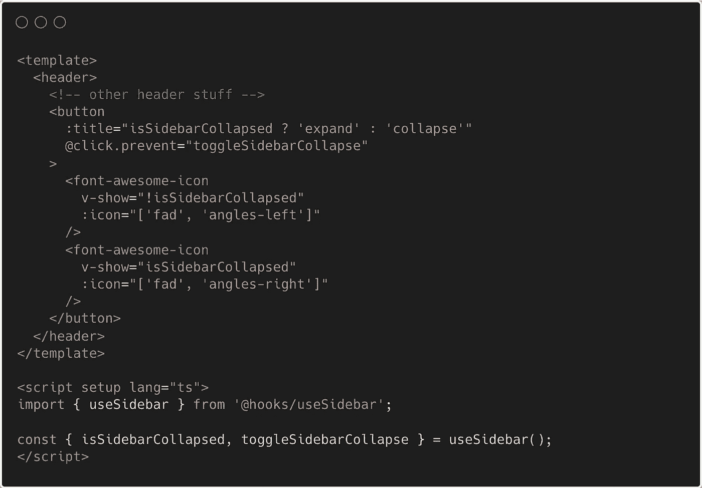

# Vue.js 中的超级简单全局状态

> 原文：<https://javascript.plainenglish.io/super-simple-global-state-in-vue-js-2022-9a307a13f556?source=collection_archive---------4----------------------->

## 在多个组件之间共享状态

管理状态是任何应用程序的一个重要方面。在 Vue.js 中，我们有几个在组件之间共享状态的选项。我们可以使用 prop drilling、提升状态、使用 provide/inject 或像 Pinia 或 Vuex 这样状态管理库。
今天我们将看看如何利用 Vue.js 的 composition API 并创建一个带有全局状态的简单定制钩子。让我们深入研究一下。

在我正在开发的一个应用程序中，有一个可以折叠的侧边栏。根据这种折叠状态，我们希望更新多个组件的布局。此外，我们希望能够从多个组件折叠侧边栏。让我们看看如何将这种全球状态付诸行动:

useSidebar hook

让我们更深入地了解一下这里发生了什么。通过在 *useSidebar* 函数之外重新定位我们的 reactive*isSidebarCollapsed*变量，我们利用了单例模式。

*单例模式将特定对象的实例数量限制为一个。这个单独的实例称为单例。*

这意味着我们只创建了一个 reactive*isSidebarCollapsed*变量的实例。在我们的 *useSidebar* 钩子中，我们将 *isSidebarCollapsed* 变量返回为只读。这样做是为了避免变量直接从组件变异而来。直接从组件改变全局状态是一种不好的做法，随着时间的推移会变得难以调试。
为了更新 *isSidebarCollapsed* 状态，我们还创建了一个 *toggleSidebarCollapse* (想不出更好的名字了😅)功能并导出该功能。我们现在可以从任何地方切换折叠状态。

**钩子在行动** 让我们看看如何实现钩子:

Hook implementation

我们现在可以通过从 useSidebar 钩子中析构我们的 *isSidebarCollapsed* 和 *toggleSidebarCollapse* 来使用我们的钩子，并在我们的模板中使用它们。就这么简单。

我希望你喜欢这篇文章。如果你有，你可能也会喜欢我写的这篇关于如何在 Vue.js 中创建一个基本的 useFetch 钩子的文章:

 [## 在 Vue.js 中创建一个基本的 useFetch 钩子

### 胜利的 Vue 合成 API！

javascript.plainenglish.io](/create-a-basic-usefetch-hook-in-vue-b3ff113872d7) 

*更多内容请看*[***plain English . io***](https://plainenglish.io/)*。报名参加我们的* [***免费周报***](http://newsletter.plainenglish.io/) *。关注我们关于*[***Twitter***](https://twitter.com/inPlainEngHQ)*和**[***LinkedIn***](https://www.linkedin.com/company/inplainenglish/)*。加入我们的* [***社区***](https://discord.gg/GtDtUAvyhW) *。**