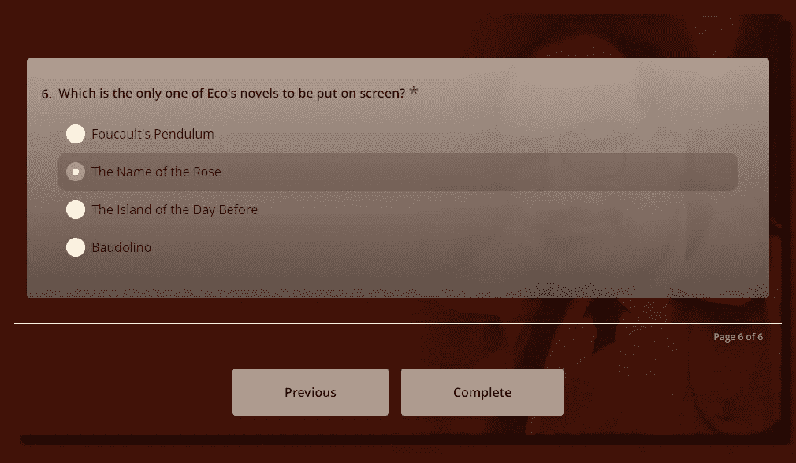

# SurveyJS:为什么它比普通的 JavaScript 调查库要好

> 原文：<https://javascript.plainenglish.io/surveyjs-why-its-better-than-your-average-javascript-survey-library-521ffd28761e?source=collection_archive---------11----------------------->

## SurveyJS 是一个免费的开源库，它不仅仅是做调查，还有 5 种方式。

Open license illustrations @ [UnDraw](https://undraw.co/).

SurveyJS 是一个快速而强大的 JavaScript 库，让创建复杂的调查变得轻而易举。

它支持大量的问题和字段类型、条件逻辑、完全可视化定制、多语言支持、webhooks，最棒的是，它是*也是* [免费和开源的，受](https://en.wikipedia.org/wiki/Free_and_open-source_software)[麻省理工学院许可](https://choosealicense.com/licenses/mit/)。你可以用它来构建几乎任何东西并自己托管，免版税。

这里有 5 种你可能没有考虑过的利用调查的方法。

# 1.使用 SurveyJS 处理客户支持票证

这个食谱有三个部分。

1.  SurveyJS 具有内置的 [webhook](https://en.wikipedia.org/wiki/Webhook) 功能(通过 [onComplete](https://surveyjs.io/Documentation/Library?id=surveymodel&utm_source=medium&utm_medium=referral&utm_campaign=JS_in_plain_English_4#onComplete) 触发器)，
2.  它将调查输出保存为行业标准的 JSON，并且
3.  大多数公司使用类似于 ZenDesk 的东西作为他们的客户支持平台，这些服务通常有他们自己的 API。

所有这些加起来就是一个完美的用例，让 SurveyJS 大放异彩。您可以只使用 SurveyJS' `onComplete`触发器通过他们的 API 将客户的支持请求发送到 ZenDesk。JSON 正是 ZenDesk API 要求新请求进入的格式，然后这些请求被保存为你公司账户下的票据。

不使用 ZenDesk 怎么办？好了，有了 JSON 形式的表单模型*和*表单数据——一种通用的、结构良好的、自我文档化的数据交换格式——您可以使用内部后端逻辑将提交的 JSON 输出转化为您自己的数据专业人员可以轻松使用、存储的内容(在任何支持 JSON、text 或 BLOB 数据类型的现代数据库解决方案中，每个票证/调查提交只占一行。)，并进行分析以获得有意义的见解，从而让您更好、更快地为客户服务。

# 2.使用 SurveyJS 处理招聘

SurveyJS 提供了一系列不同的字段类型，包括合同的[签名](https://surveyjs.io/Documentation/Library?id=questionsignaturepadmodel&utm_source=medium&utm_medium=referral&utm_campaign=JS_in_plain_English_4)，简历的[文件上传](https://surveyjs.io/Documentation/Library?id=questionfilemodel&utm_source=medium&utm_medium=referral&utm_campaign=JS_in_plain_English_4)，以及强大的客户端输入验证，这使得它成为潜在员工申请你的工作并上传简历的完美用例

同样，webhook 支持意味着您可以将提交的简历与 Workable 或 LinkedIn 集成，使招聘和跟踪对双方来说都更加轻松。

例如，您可以设计一个调查:

*   要求回答者选择他们要申请的空缺职位，
*   获取它们的个性化名称，
*   然后给他们一个简短的角色描述，以及一个适合这个角色的人的简介。
*   最后，它会要求他们的 LinkedIn 个人资料、电子邮件 id 和简历，同时使用 SurveyJS 的内置验证来确保所有这些看起来像一个正确的 LinkedIn 个人资料页面、一个有效的电子邮件 ID，并限制上传为预先批准的格式，如 PDF。

> *💡*当然，所有这些验证仅仅是客户端的。这带来了很好的用户体验，因为如果他们做错了什么，他们会立即得到反馈，但是你仍然需要实现后端逻辑来验证上传没有恶意。

此外，面试结束后，他们可以通过电子邮件收到一份候选人体验调查，以评估作为招聘人员，你如何更好地处理面试，无论是选拔过程、问题… *还是简单地说等候室的咖啡需要煮得更好*。

> *💡*不用说，**不要*实际上*在 CodeSandbox** 上试用这段代码时上传你的简历。你输入的任何数据都不会被用于任何目的，只会被临时存储，上传后会被删除，但在网上安全总比后悔好，对吗？如果你想了解一下，这里有 [CodeSandbox 的隐私政策](https://codesandbox.io/legal/privacy)。此外，请注意，SurveyJS 受[麻省理工学院许可](https://choosealicense.com/licenses/mit/)保护，按原样提供，不承担任何因其使用而产生的担保或责任。

# 3.利用调查帮助新员工入职

说到新兵；工作的第一天可能会令人生畏——我们都经历过这种情况。在另一个阵营，让新员工入职是一个费力且通常令人疲惫不堪的过程。

这里有一个想法！减少*T4 因此，通过邮寄新员工**由 SurveyJS 创建的对话调查**——平衡非正式和专业。*

这些“调查”的语气要个性化，目的是让你的新队友感到轻松，这一点很重要。确保你先知道他们的名字，然后设计调查，使其控制和进度完全由新员工决定。这些调查可以根据需要重复进行，并对新员工进行公司文化培训。

这些特别调查应该包括你的新队友第一天会是什么样的，和谁谈话，谈什么，什么时候出现，最重要的是，不要担心什么！整个事情以一种有趣、友好、个性化的对话形式进行，不仅会给他们信心，还会帮助他们缓解任何新工作带来的焦虑和压力。

# 4.使用 SurveyJS 为学生进行突击测验

SurveyJS 允许您在定义调查时设置一个`correctAnswer`属性，并将答案存储在指定的 JSON 字段中。这意味着您可以将调查用作*测验*——通过将选择与`correctAnswer`进行比较来计算分数，然后使用`onComplete` 触发器立即显示分数，或者将分数保存到数据库中。

这非常适合各种用例。

最明显的是教育。您可以在课程开始时**和结束时**使用 SurveyJS 建立的定性突击测验(即不仅仅是对/错问题),作为一种工具来测试学生对呈现给他们的材料的理解，强化关键点，并提高学生的参与度。奖励可以是额外的学分。在日常课外测验中表现出色的学生，通常在期末考试中表现更好。SurveyJS 使这成为一个廉价、快速设计和快速分发的工具，以衡量学生对关键概念的理解程度，并准确指出哪个学生需要帮助，以及在哪里需要帮助。

当然，你可以做得更多。在工作会议或演示中进行以行业为中心的小测验，以此作为吸引听众注意力和表达观点的创造性方式？**没错**。以品牌为中心的社交媒体营销，以宣传半价销售或著名作家路过你的商店参加签名售书活动？**绝对**！为周末在米德大厅举行的问答比赛设计全面的测验？SurveyJS 擅长那个！

测验需要丰富多彩的设计和交互性，所以选择有趣和相关的图像，选择 SurveyJS 提供的你喜欢的主题，或者更好，就像我在这里为安伯托·艾柯主题的琐事测验所做的那样，滚动你自己的 CSS，完全按照你想要的方式定制它！

不要忘记阅读 SurveyJS 文档[这里](https://surveyjs.io/Examples/Library/?id=survey-customcss&platform=jQuery&utm_source=medium&utm_medium=referral&utm_campaign=JS_in_plain_English_4#content-docs)你可以用你的自定义 CSS 来挂钩 CSS 类和属性。

# 5.使用 SurveyJS 帮助申请办公室设备和内部服务

到目前为止，您可能已经看到了这样的东西是如何工作的。这些“调查”的功能更像内部网应用程序，位于您受保护的网络上，并根据需要将请求发送给 IT、人力资源、法律或会计部门。*这比因打印机故障而打电话给服务台要好得多！*

像往常一样，您还可以使用 SurveyJS' `onComplete` 触发器将这些请求与[吉拉](https://www.atlassian.com/software/jira)集成，使它们完全可跟踪。

再做一点工作，您就可以为每个团队准备不同的调查方案/模板了！您可以根据服务请求是针对哪个团队的，从您的内部后端提供不同的调查，这意味着可以分析和跟踪每个团队的表现，从而弥补漏洞并进一步提高您组织的效率。

# 事情并不象初看到的那样简单

你能自己用定制的内部 HTML 和 JavaScript 表单完成所有这些吗？你当然可以！但是，将所有这些功能都包含在一个棒极了的[免费开源](https://en.wikipedia.org/wiki/Free_and_open-source_software)包中是非常有用的，而且你可以避免走为*你需要的每个*特定功能构建定制解决方案的糟糕路线，以及维护它们所涉及的资源短缺。

SurveyJS 不仅仅是一个调查构建者。这是一个健壮的、成熟的表单库，只受您的想象力的限制，希望现在您有足够的入门知识和想法来激发它。

让调查成为你的画布。迫不及待地想看看你创造的东西！

*更多内容请看*[***plain English . io***](https://plainenglish.io/)*。报名参加我们的* [***免费周报***](http://newsletter.plainenglish.io/) *。关注我们关于*[***Twitter***](https://twitter.com/inPlainEngHQ)*和*[***LinkedIn***](https://www.linkedin.com/company/inplainenglish/)*。查看我们的* [***社区不和谐***](https://discord.gg/GtDtUAvyhW) *加入我们的* [***人才集体***](https://inplainenglish.pallet.com/talent/welcome) *。*