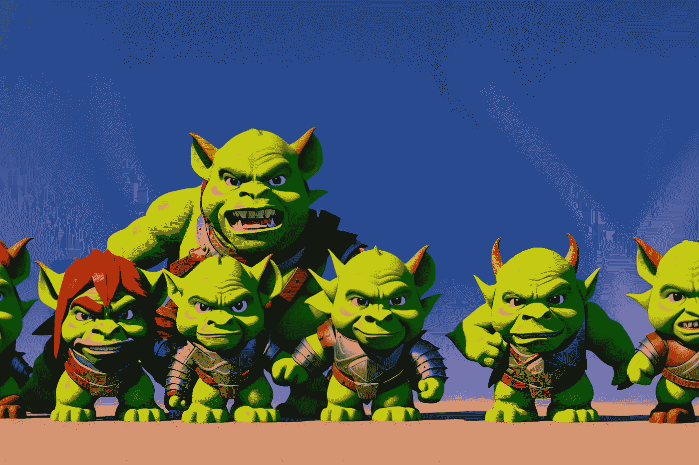
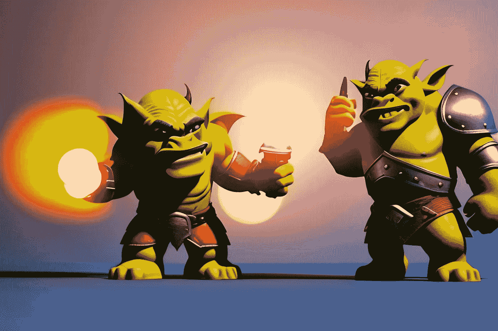
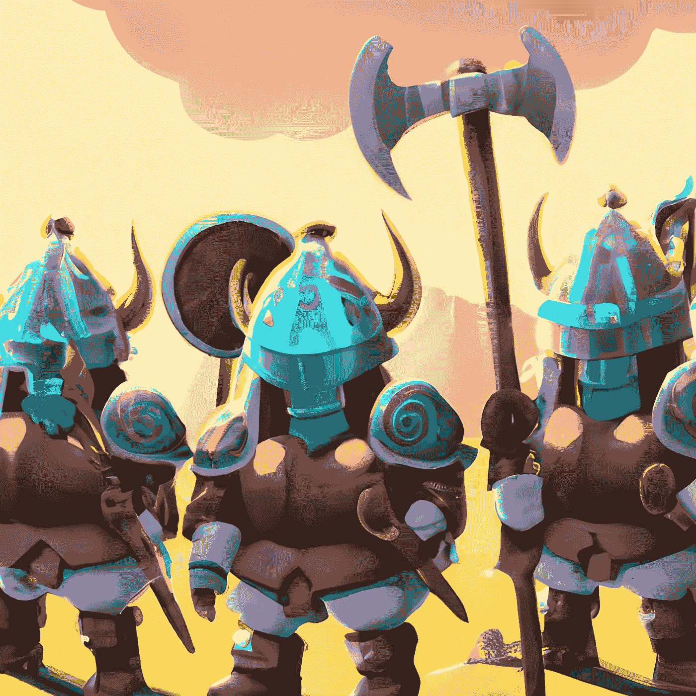

# 如何比较 JavaScript 中的数组元素

> 原文：<https://javascript.plainenglish.io/surviving-the-attack-solving-a-real-world-problem-with-javascript-f80509886cc5?source=collection_archive---------15----------------------->

## DevAdvent 2022

## 使用函数确定决斗的结果



今天的 DevAdvent 的问题是比较两个数组的元素。有趣的是，这个问题是如何通过一个真实世界的例子呈现出来的。想象一下，你想建立一个游戏，让两个团队互相对抗。每一名队员向对方队员挑战。在这种情况下，从数组中得到决斗结果的 JavaScript 函数正是我们所需要的。

# 问题:在攻击中生存下来

链接到[武士刀](https://www.codewars.com/kata/634d0f7c562caa0016debac5)


给定两个数组，其中值是每个士兵的力量，如果你在攻击中幸存，则返回真；如果你死亡，则返回假。

**条件**

*   每个士兵在阵列的同一索引中攻击对方士兵。幸存者是价值最高的数字。
*   如果价值是相同的，他们都灭亡了
*   如果其中一个值为空(不同的数组长度)，则非空值士兵存活。
*   为了生存，防守方必须比进攻方有更多的幸存者。
*   如果双方的幸存者人数相同，获胜者是初始攻击能力最高的队伍。如果双方的总攻击力量都是一样的，那也是事实。
*   初始攻击强度是每个数组中所有值的总和。

**示例**

```
attackers=[ 1, 3, 5, 7 ]   defenders=[ 2, 4, 6, 8 ]
//0 survivors                4 survivors
//return true

attackers=[ 1, 3, 5, 7 ]   defenders=[ 2, 4 ]
//2 survivors  (16 damage)   2 survivors (6 damage)
//return false

attackers=[ 1, 3, 5, 7 ]   defenders=[ 2, 4, 0, 8 ]
//1 survivors                3 survivors
//return true
```

# 解决方案


这个解决方案在概念上非常简单。我可以创建一个类似这样的 JavaScript 函数:

```
export const hasSurvived = (attackers, defenders) => {
  let attackingPower = attackers.reduce((acc, val) => acc + val, 0);
  let defendingPower = defenders.reduce((acc, val) => acc + val, 0);

  let attackingSurvivors = 0;
  let defendingSurvivors = 0;

  for (let i = 0; i < Math.max(attackers.length, defenders.length); i++) {
    if (i >= attackers.length) {
      defendingSurvivors++;
    } else if (i >= defenders.length) {
      attackingSurvivors++;
    } else if (attackers[i] > defenders[i]) {
      attackingSurvivors++;
    } else if (defenders[i] > attackers[i]) {
      defendingSurvivors++;
    }
  }

  return (
    defendingSurvivors > attackingSurvivors ||
    (defendingSurvivors === attackingSurvivors &&
      defendingPower >= attackingPower) ||
    (defendingSurvivors === attackingSurvivors &&
      attackingPower === defendingPower)
  );
};
```

该函数首先计算进攻和防守队的初始进攻力量。然后，它遍历数组并比较每个索引处的值。如果`attackers`数组中当前索引处的值大于`defenders`数组中相同索引处的值，则攻击幸存者的数量增加。如果`defenders`数组中当前索引处的值大于`attackers`数组中相同索引处的值，则防御幸存者的数量增加。如果两个阵列中的一个比另一个短，则较长阵列中幸存的士兵也会被计算在内。

最后，如果防御幸存者的数量大于攻击幸存者的数量，或者如果幸存的士兵数量相同但是防御团队有更高的初始攻击力量，或者如果双方的总攻击力量相同，则函数返回`true`。如果不满足这些条件，则返回`false`。

然而，有一件事我不喜欢。这一系列的“if…then…else”条件使得阅读代码变得困难，并且它们使得函数看起来不那么优雅。随着时间的推移，我注意到当一个 JavaScript 函数看起来很难看时，这意味着有一些地方需要改进。

让我们仔细看看代码。



我想做的是比较数组中的每个元素，然后计算有多少元素满足给定的条件。

我将尝试用不同的方式重新表述这个句子:我想从每个数组中获取满足特定条件的所有元素。换句话说，我想过滤掉所有大于另一个数组中相应元素的元素。

在这里，通过重新表述问题，我得到了一个新的想法。我可以使用 [Array.filter()](https://developer.mozilla.org/en-US/docs/Web/JavaScript/Reference/Global_Objects/Array/filter) 方法来比较每个数组中的各种元素，只保留我们感兴趣的元素。

```
let defendersAfterFight = defenders.filter((e, i) => 0 < e - attackers[i]);
let attackersAfterFight = attackers.filter((e, i) => 0 < e - defenders[i]);
```

现在我要做的就是计算每个数组的长度，找出进攻方和防守方有多少幸存者。

```
const hasSurvived = (attackers, defenders) => {
  let attackingPower = attackers.reduce((acc, val) => acc + val, 0);
  let defendingPower = defenders.reduce((acc, val) => acc + val, 0);

  let defendersAfterFight = defenders.filter((e, i) => 0 < e - attackers[i]);
  let attackersAfterFight = attackers.filter((e, i) => 0 < e - defenders[i]);

  return (
    defendersAfterFight.length > attackersAfterFight.length ||
    (defendersAfterFight.length === attackersAfterFight.length &&
      defendingPower >= attackingPower)
  );
};
```



我可以通过直接计算各种数组的长度来进一步简化代码。

```
const hasSurvived = (attackers, defenders) => {
  let attackingPower = attackers.reduce((acc, val) => acc + val, 0);
  let defendingPower = defenders.reduce((acc, val) => acc + val, 0);

  let defendersSurvived = defenders.filter(
    (d, i) => 0 < d - attackers[i]
  ).length;
  let attackersSurvived = attackers.filter(
    (a, i) => 0 < a - defenders[i]
  ).length;

  return (
    defendersSurvived > attackersSurvived ||
    (defendersSurvived === attackersSurvived &&
      defendingPower >= attackingPower)
  );
};
```

如果要夸大，可以进一步减少解决问题所需的代码行数。

但是我不推荐。JavaScript 函数很难读懂。使代码过于复杂没有实际好处。最好写干净、易读的代码:我们未来的自己会感谢我们的。

```
const hasSurvived = (a, d) =>
  d.filter((x, i) => 0 < x - a[i]).length >
    a.filter((x, i) => 0 < x - d[i]).length ||
  (d.filter((x, i) => 0 < x - a[i]).length ===
    a.filter((x, i) => 0 < x - d[i]).length &&
    d.reduce((c, v) => c + v, 0) >= a.reduce((c, v) => c + v, 0));
```

感谢阅读！敬请关注更多内容。

***不要错过我的下一篇文章—报名我的*** [***中邮箱列表***](https://medium.com/subscribe/@el3um4s)

[](https://el3um4s.medium.com/membership) [## 通过我的推荐链接加入 Medium—Samuele

### 阅读萨缪尔的每一个故事(以及媒体上成千上万的其他作家)。不是中等会员？在这里加入一块…

el3um4s.medium.com](https://el3um4s.medium.com/membership) 

*原载于 2022 年 12 月 22 日 https://blog.stranianelli.com*[](https://blog.stranianelli.com/devadvent-2022-22-survive-the-attack/)**。**

## *更多内容请访问 [PlainEnglish.io](https://plainenglish.io/) 。*

**报名参加我们的* [***免费周报***](http://newsletter.plainenglish.io/) *。关注我们上* [***推特***](https://twitter.com/inPlainEngHQ) ， [***领英***](https://www.linkedin.com/company/inplainenglish/) ***，***[***YouTube***](https://www.youtube.com/channel/UCtipWUghju290NWcn8jhyAw)***，以及****[***不和***](https://discord.gg/GtDtUAvyhW) **

## **想扩大你的软件创业规模吗？检查[电路](https://circuit.ooo/?utm=publication-post-cta)。**