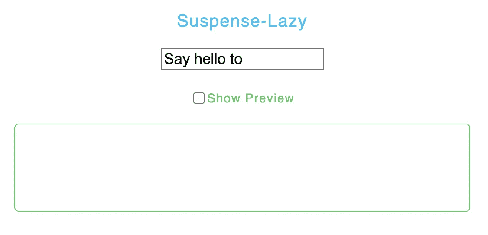
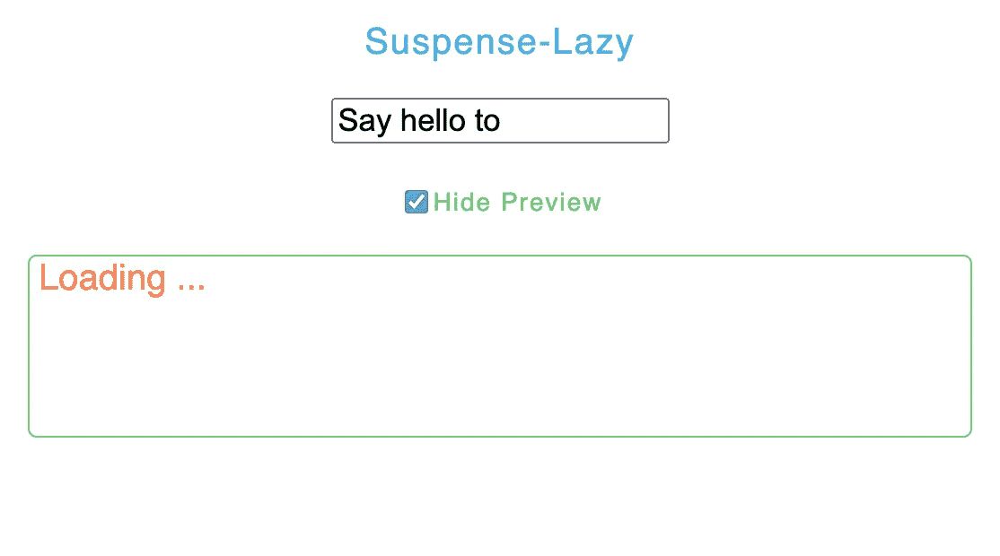
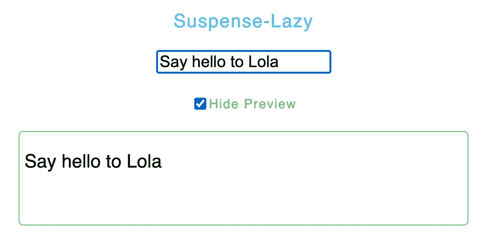

# 反应:与懒惰和 Axios 的悬念

> 原文：<https://javascript.plainenglish.io/suspense-with-lazy-axios-react-471a43113e4b?source=collection_archive---------3----------------------->

等等，悬疑不仅仅是代码分裂


关于 React 的未来，有一件事是肯定的:React 团队希望让 API 变得更容易、更简单🦋

react 16 . x 版本自发布以来就在业界掀起了一场风暴。在此次发布的新特性中，最受欢迎的是*挂钩*、*懒人*、*加载*、、*缓存*...等等。

> v16:异步模式
> 
> v17:并发模式
> 
> v18:并发渲染(并发)

并发不是一个特性，它是一个新的幕后机制，使 React 能够同时准备多个版本的 UI。

实现并发后，下一个方向可能会扩展可以使用并发的场景(*悬疑*、 *React.lazy* 、 *useTransition、* *流媒体服务器渲染*……)

最近，我试着用[](https://17.reactjs.org/docs/concurrent-mode-suspense.html#approach-3-render-as-you-fetch-using-suspense)**和[**Axios**](https://axios-http.com/docs/intro)**获取一些数据，并用 [**React.lazy**](https://reactjs.org/docs/code-splitting.html#reactlazy) 渲染组件，创作了一些例子，我想在本文中分享一下。****

****我们都知道这一点，如果一个组件的代码还没有加载，那么呈现它显然是“不安全”的。所以，从狭义上来说，代码准备好的组件才算“安全”，包括同步组件和异步组件(*你不知道什么时候能做好，就当是承诺:)*)。****

****那么悬念和这有什么关系呢？悬念字面意思是*未决定*，它让你的组件**等待⏰**对某事才能“放心地”渲染。****

****在我看来，这就像 *try…catch* ，决定 UI 是否“安全”，在加载时显示一些回退，并在完成时显示“安全”的组件，因为用户需要看到类似*微调器*或*加载状态*的东西，所以他们知道他们可以期待数据被显示。****

```
**try { 
    // things are not ready yet
} catch { 
    // immediately enter the catch block, show fallback 
}**
```

****但是也许你会想，为了显示一些加载状态，我们可以像平常一样进行条件渲染👇****

```
**function **ParentComponent**() {
  const [data, setData] = useState(null);
  useEffect(() => {    
    **fetchData**().then(res => setData(res));  
    }, []); if (data === null) {
     return <**LoadingSpinner1** />;
   }return (
    <>
      <h1>{**data**.**heading**}</h1>
      <**ChildComponent** />
    </>
  );
}

function **ChildComponent**() {
  const [otherData, setOtherData] = useState(null);
  useEffect(() => {    
    **fetchOtherData**().then(res => setOtherData(res));  
  }, []); return (
    <>{otherData === null? <**LoadingSpinner2** /> : otherData}</>
  );
}**
```

****效果很好，那为什么现在要用悬疑呢？以上代码实际上是这样说的:****

1.  ****开始获取**数据******
2.  ****显示 LoadingSpinner1，然后显示标题，然后等待…****
3.  ****完成提取数据****
4.  ****开始获取**其他数据******
5.  ****显示 LoadingSpinner2，然后等待…****
6.  ****完成提取其他数据****
7.  ****完成的****

****这是一个*瀑布*效应，我们必须等待一些请求数据的代码，直到它被加载，然后我们才能继续。为了改善这一点，**我们不应该等待响应，**这意味着我们应该同时获取代码和数据，处理异步操作，承诺。****

****👉悬念是为了解决异步操作，而不仅仅是显示组件的内容。****

****一般来说，悬念分为两个功能:异步加载**代码(** [*代码拆分*](https://reactjs.org/docs/code-splitting.html) )和异步加载**数据。******

****我们来看第一个例子:用*悬念*和*懒惰* API(动态导入组件)异步加载代码。****

****📌 [lazy](https://beta.reactjs.org/apis/react/lazy) API 是 react 给*lazy load**components*(***dynamically***import)提供的一个方法，它带一个参数并将其包装为 React 组件。****

```
**Promise<() => {default: **ReactComponent**}>**
```

****ReactComponent 可以是任何类型的组件，****

```
**const **Lazy** = **lazy**(() => import("./**LazyComponent**")) 
<Suspense **fallback**={<div>Loading ...</div>}> 
  <**Lazy**/> 
</Suspense>**
```

****由于 **Lazy** 经常从远程位置加载，React 直到加载完成才知道如何渲染组件，所以看起来*动态导入*类似于**承诺**，它也有三种状态(*待定*、*已解决*、*已拒绝)。*如果是待定，那么此时什么都不显示，会造成不好的用户体验。⚡️现在，悬念来了，它表明在加载过程中应该显示什么内容。当加载完成时，悬念将切换回**惰性**组件的内容。****

****我在这里创建了一个沙盒[](https://codesandbox.io/s/react-router-useeffect-suspense-lazy-t4tthn?file=/src/App.js)*，你可以从导航栏导航到“懒惰”并尝试一下。👐*****

*****在本例中，用户可以**在输入字段中键入**，并通过勾选“*显示预览*”复选框**预览**文本。在这里，预览的代码不会被加载，直到复选框被选中，如果预览还没有被加载，在它的位置会显示“*正在加载…”*。*****

**********

*****component initial render*****

**********

*****render fallback with suspense after checkbox is checked by user*****

**********

*****loading complete, render preview*****

*****在下面的代码中，我在**预览**组件上使用 *setTimeout* 来“伪造”一个长加载时间(2 秒)，以便查看加载回退是如何呈现的。👇*****

```
***import { useState, **Suspense**, **lazy** } from "react";
import InputField from "./components/InputField";*//* 🔴 *dynamic import and fake "delay" Preview* const **Preview** = **lazy**(async() => {
    return new Promise((resolve, reject) => {
       setTimeout(() => resolve(), 2000)
  })
   .then(() => **import**("./components/Preview"))
   .catch((e) => console.log(e))
});const SuspenseLazy = () => {
    const [inputValue, setInputValue] = useState("Say hello to");
    const [showPreview, setShowPreview] = useState(false);
    return (
     <>
       <p>Suspense-Lazy</p>
       <**InputField**
          inputValue={inputValue}
          showPreview={showPreview}
          setShowPreview={setShowPreview}
          setInputValue={setInputValue}/> {showPreview && (
          <Suspense **fallback**={<div>Loading ...</div>}>
            <**Preview** inputValue={inputValue} />
          </Suspense>
        )}
    </>
 )};
export default SuspenseLazy;export default function **InputField**(props) {
    const {showPreview, inputValue, setShowPreview, setInputValue} = props;
    return (
       <>
         <input
            value={inputValue}
            type="text"
            onChange={(e) => setInputValue(e.target.value)} />
         <input
            type="checkbox"
            onChange={() => setShowPreview(!showPreview)}
            checked={showPreview} /> <label>
           {!showPreview ? "Show Preview" : "Hide Preview"}
         </label>
      </>
 )}***
```

*****这样，代码加载就是一个异步的过程，整个加载状态不需要被开发人员控制。*****

*****虽然悬疑经常和懒一起用，但是悬疑**只有**可以和懒一起用吗？懒一定要配合悬疑吗？好吧，比方说，悬疑是加载数据的一个**标准**，懒是在这个标准下实现的一个**方法**。📌这就意味着**懒不能毫无悬念的使用**。*****

*****我们来看第二个例子:用*悬念* *和*[*Axios*](https://axios-http.com/docs/intro)*异步加载**数据**。******

*****如上所述，悬念是为了解决异步操作，而不仅仅是显示组件的内容，下面这个例子是使用 *axios* 和*悬念*来实现异步加载数据。*****

> *****悬念要求代码被挂起，即**抛出**一个可捕捉的承诺异常，在承诺结束后渲染组件。*****

******如果我们把没有承诺的组件用悬念包裹起来，有可能什么都没有发生，因为悬念需要孩子的承诺被触发，然后返回结果，渲染孩子。*****

*****这意味着如果我们想使用悬念，我们需要对它的子组件做些什么。*****

*   *****children 组件中必须有一个**承诺**。*****
*   *****儿童组件的承诺应**被置于**待定状态以供暂停。*****
*   *****承诺成功后，悬疑会重新渲染儿童组件。*****
*   *****重新呈现的子组件将不再执行承诺，因为数据已被缓存。*****
*   *****完成上述所有步骤后，您可以在组件上暂停显示回退。*****

*****因为 *Axios 支持 Promise API，*我们现在就从它开始。*****

******在同一个[沙箱](https://codesandbox.io/s/react-router-useeffect-suspense-lazy-t4tthn?file=/src/App.js)中，您可以从导航栏导航到“获取”并试用。👐*****

**********

*****render fallback*****

**********

*****cat images are complete*****

*****在这里，我将有一个需要获取一些猫的组件，让我们首先创建 axios 获取请求:*****

```
***import axios from "axios";export async function **fetchCats**() {
  return axios
    .get("https://...")
    .then((res) => res.data)
    .catch((err) => console.log(err));
 }***
```

*****如上所述，如果我们的组件正在加载或失败，我们需要抛出一个承诺异常，然后在承诺成功解决时返回响应。*****

*****在我们的例子中， *fetchCats* 将是一个承诺，现在我们需要"**包装**它，"**检查**承诺的状态然后"**返回"**一个与悬念兼容的响应对象并导出它:*****

```
***export default function **fetchAllCatsData**() {
   const catsPromise = **fetchCats**;
      return {
         **data**: **wrapPromise**(catsPromise)
  }}export function **wrapPromise**(promise) {
   let status = "pending";
   let result;
   let suspend = promise().then((res) => {
      status = "success";
      result = res;
     }, (err) => {
      status = "error";
      result = err;
  });
    return {
      👉**read**() {
         *// let suspense catch the error and return the fallback* if (status === "pending") {
            throw suspend;
       } else if (status === "error") {
            throw result;
       } 
         // *change fallback to content when value is returned* else if (status === "success") {
            return result;
}}}}***
```

*****上面的代码将检查承诺的状态，然后返回一个名为 **read** 的函数，稍后我们将在组件中用*fetchalcatsdata()*调用该函数。*****

*****❗️注意到，必须使用 **read** 方法，否则会抛出一个错误。*****

*****我们的组件代码:*****

```
***import { Suspense, lazy } from "react";
import **fetchAllCatsData** from "./fetchAllCatsData";const **resource** = fetchAllCatsData(); // 👉usedataconst **LazyCatsUsingSuspense** = lazy(async() => {
    ... // same as first example
    .then(() => import("./components/**CatsUsingSuspense**"))
 });const SuspenseFetch = () => {
  return (
    <Suspense **fallback**={<h1>Loading cats...</h1>}>
      <LazyCatsUsingSuspense fetchedResource={**resource.data**} />
    </Suspense>
)};function **CatsUsingSuspense**({fetchedResource}){
  return (
    <>
      {fetchedResource.**read**().map(({ url, id, width, height }) => {
         return (
            <div key={id}>
              
         );
      })}
</>)}***
```

*****就是这样！🍄你会看到“加载猫…”在图像出现之前，*数据将被缓存，要再次查看加载状态，刷新页面。*****

*****总结，使用悬念的部分:*****

1.  *******进口**悬念*****
2.  *******包装**带悬念获取数据的组件*****
3.  *****直到该数据被解析，它将呈现**回退*******
4.  *******渲染**你的组件*****

*****嗯，我还在学习，但是目前来说，我们可以尝试在某些情况下使用悬念，而不是 *useEffect* ，这有时会让人头疼。☘️*****

*****如果你也对我的其他与 React 相关的文章感兴趣，这里有一些链接，谢谢你的时间🌹*****

*****[](https://xiaominzhu.medium.com/common-use-cases-of-react-hook-form-b7cf961a42f6) [## React-Hook-Form 库|常见用例

### 因为绝对没有人喜欢创建和重建带有验证的复杂表单

xiaominzhu.medium.com](https://xiaominzhu.medium.com/common-use-cases-of-react-hook-form-b7cf961a42f6) [](/a-shopping-list-with-react-hook-usereducer-310a3b6578) [## 用 React Hook useReducer 创建购物清单

### 带有 useReducer React 挂钩的购物清单——一个让 useReducer 更容易理解的小练习。

javascript.plainenglish.io](/a-shopping-list-with-react-hook-usereducer-310a3b6578) [](/create-a-simple-react-custom-hook-fc733d7b977a) [## 创建一个简单的 React 自定义挂钩

### 关于如何创建一个简单的 React 自定义钩子的教程

javascript.plainenglish.io](/create-a-simple-react-custom-hook-fc733d7b977a) [](/create-a-simple-express-server-node-js-for-react-application-e2b2bd0c7e93) [## 为 React 应用程序创建一个简单的 Express 服务器(Node.js)

### 关于如何创建一个简单的 Express 服务器(Node.js)、将其连接到 React 应用程序以及解决错误的教程…

javascript.plainenglish.io](/create-a-simple-express-server-node-js-for-react-application-e2b2bd0c7e93) [](https://xiaominzhu.medium.com/react-functional-components-using-refs-a5ad1d2817d4) [## 使用引用对功能组件进行反应

### forwardRef 和 useImperativeHandle 的示例

xiaominzhu.medium.com](https://xiaominzhu.medium.com/react-functional-components-using-refs-a5ad1d2817d4) [](https://medium.com/geekculture/update-parent-state-from-child-component-with-react-context-api-a56cf3742428) [## 用 React 上下文将状态从子节点更新到父节点

### — React Context 提供了一种通过组件树传递数据的方法，而不必在…

medium.com](https://medium.com/geekculture/update-parent-state-from-child-component-with-react-context-api-a56cf3742428) 

*更多内容请看*[***plain English . io***](https://plainenglish.io/)*。报名参加我们的* [***免费周报***](http://newsletter.plainenglish.io/) *。关注我们关于*[***Twitter***](https://twitter.com/inPlainEngHQ)[***LinkedIn***](https://www.linkedin.com/company/inplainenglish/)*[***YouTube***](https://www.youtube.com/channel/UCtipWUghju290NWcn8jhyAw)***，以及****[***不和***](https://discord.gg/GtDtUAvyhW) *对成长黑客感兴趣？检查* [***电路***](https://circuit.ooo/) ***。**********