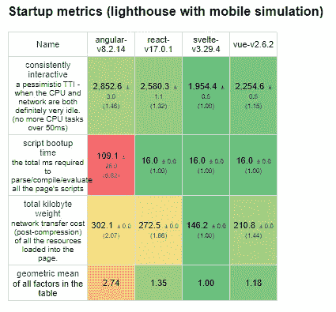

# 为什么我不愿意用苗条

> 原文：<https://javascript.plainenglish.io/svelte-first-impressions-lots-of-magic-99317fcaa35a?source=collection_archive---------4----------------------->


Svelte Logo (from twitter.com)

说到前端开发,“太神奇”是一件事吗？

前端很乱，不可预测，不规范。如果有一个框架来处理所有烦人的事情，那不是很好吗？

是的——算是吧。苗条是类固醇上的 Vue。Vue 让一切变得简单，Svelte 让一切变得更简单。代码更少，魔法更多。

它也带来了其他的东西。例如，与其他流行的 SPA 库或框架不同，Svelte 实际上是一个编译器。它智能地简化和优化您的代码，这使得它比大多数替代方案要快得多。它还有一个神奇的互动 REPL 教程。

所以，我试了一下。在用 Svelte 开发了一个应用程序之后，我被打动了——但肯定没有被接受。

# 让我们跳过无聊的理由

我们都见过避免任何新的、不成熟的框架的常见原因:学习曲线、较少的开发人员、很少用于生产、较小的生态系统等等。

这些是绝对重要的考虑因素——尤其是如果你正在构建一个大型的重要应用程序——但是它们适用于所有的新技术，并不十分有趣。

相反，让我们仔细看看框架本身的好、坏和丑。

# 如果你喜欢 Vue，你会喜欢 Svelte

斯维特相信魔法。它认为常见的用例应该是容易的。它认为代码越少，抽象越多越好。

男孩让事情变得简单。例如，创建一个全球商店实际上只有一行:

```
export const count = writable(0);
```

被动地使用它是不可能的简单:

```
<script>
 import { count } from './stores.js'; function increment() {
  count.update(n => n + 1);
 }
</script><h1>The count is {$count}</h1>
<button on:click={increment}>+</button>
```

此外，编写监视和计算语句就像美元符号一样简单。如果您想了解更多信息，请参见此处的。

你可能会认为所有这些神奇的东西可能会让你的应用程序变得臃肿和不必要的重新渲染。这就是 Svelte 编译器的好处:它自动为你做了很多优化。

# 它非常快

尽管我写的应用程序没有那么大，但 Svelte 仍然比我用过的其他 SPA 框架快得多——尽管这可能只是确认偏差。

但是指标本身就说明了问题。Svelte 确实比它的替代品快得多，这为大型企业应用程序提供了很多优势，在这些应用程序中，不必要的复杂性经常导致代码优化不佳。



Svelte benchmark metrics

您也可能认为编译器的好处是以开发时较慢的体验为代价的。以我的经验来看没有。我立即看到了我的更改，即使它们影响了一大堆组件。

# 语法是…嗯

这是苗条使魔术变得不那么神奇的原因之一。

Svelte 的语法感觉像是一次(相当成功的)试图将自己与 Vue 区分开来的尝试，并增加了“尽可能少用字符和代码”的理念。结果是语法感觉奇怪，可读性不如 Vue。

例如，下面是一个简单的 if/else 语句在 Svelte 的模板语法中的样子:


也许只是需要一些时间来热身，并习惯于看到和编写苗条的代码。但是这明显降低了构建一个苗条应用程序的乐趣，我真的希望他们采用 JSX 或者抄袭 Vue 的语法。

# 太多魔法是不好的

对于简单的用例和快速原型，Svelte 确实是一种乐趣。但是对于更复杂的用例，我可以很容易地想象这种魔力变得有点势不可挡。

每一层抽象都使得理解真实情况变得更加困难。这很重要，原因有很多:

1.  编写糟糕的代码很容易，但很难区分。魔法吸收了一些糟糕设计的成本。它也不能帮助您学习——并主动帮助您避免——最佳的 JavaScript 实践，并培养对呈现和事件处理的基本理解。
2.  **追踪虫子更难了。**当出现问题时，但你所有的代码都是隐藏了大量抽象概念的一行程序，很难找到问题的根源。越是神奇，就越难理解一切是如何组合在一起为最终结果服务的。

# 判决


Source: [https://www.gacovinolake.com/](https://www.gacovinolake.com/)

第一:自己试试。这至少是值得的。[教程](https://svelte.dev/tutorial/basics)是一个很好的起点。然而，如果不在项目中使用任何技术，就不可能完全欣赏它(或者相反的东西)。

最新的 SPA 框架有很多好处。像 Vue 一样，它是那种只会让你感觉更有效率的工具。它似乎对以下情况特别有用:

1.  需要快速启动并运行一些东西
2.  想要一个高度互动但简单的网站
3.  比什么都在乎性能

但我犹豫着是否要热情拥抱苗条身材带来的所有令人印象深刻的魔力。生产率和简单性的提高是以牺牲直观性和最佳设计实践为代价的。在我看来，这本书看起来不舒服，也不容易读懂。

尽管如此，我仍然希望它在未来几年里获得更多的关注，并在 web 开发人员中获得更多的欢迎，尤其是那些已经喜欢 Vue 的开发人员。我只是不确定它是否像许多人认为的那样是伟大的新事物。

*更多内容请看*[***plain English . io***](https://plainenglish.io/)*。报名参加我们的* [***免费周报***](http://newsletter.plainenglish.io/) *。关注我们关于*[***Twitter***](https://twitter.com/inPlainEngHQ)*和*[***LinkedIn***](https://www.linkedin.com/company/inplainenglish/)*。查看我们的* [***社区不和谐***](https://discord.gg/GtDtUAvyhW) *加入我们的* [***人才集体***](https://inplainenglish.pallet.com/talent/welcome) *。*