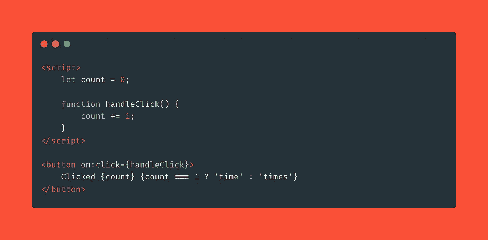

# React 开发者的苗条身材

> 原文：<https://javascript.plainenglish.io/svelte-for-react-developers-7edc099e03ed?source=collection_archive---------6----------------------->

## 如果你是一个 React 开发者，并且正在寻找一个苗条框架的新旅程，这是给你的！

# 什么是苗条？

让我们从它自己的[网站](https://svelte.dev/)来描述一下 Svelte:

> Svelte 是构建用户界面的一种全新方法。尽管 React 和 Vue 等传统框架在*浏览器*中完成了大部分工作，但 Svelte 将这些工作转变为*编译步骤*，这发生在你构建应用的时候。
> 
> Svelte 没有使用虚拟 DOM diffing 之类的技术，而是编写代码，当应用程序的状态改变时，以外科手术的方式更新 DOM

# 值得学习？

简而言之，是的！

作为一名超过 3 年的 React 开发人员，我接受了这个挑战，作为一名初级的苗条开发人员开始了新的职业生涯，以扩展我的知识，知道更多的工具和框架，而不仅仅是一个！但这是我个人的心态和原因。就性能而言，我们在 React 和 Svelte 之间有明显的差异，你可以从 SolidJS 官网上看到响应时间图。

# 语法怎么样？

Svelte 的书写形式对 React 开发者来说有点奇怪，因为没有 JSX 或包装组件。

让我们用一个小组件来比较它们:

1.  React 组件接收一个`name` prop 并返回一个`h1`标签，标签中包含名称 prop！

React JS

2.最简单的方法就是做和上面 React 例子中完全一样的事情。但是我们没有`return`或者`props`钥匙！

# 反应

Svelte 也遵循反应性原则，让你以一种简单的方式写可变的东西。

# 组件生命周期如何？

是啊！我们这里也有，让我给你看一个来自官方文件的例子。

很简单，对吧？在[苗条文档](https://svelte.dev/tutorial/onmount)阅读更多信息

# 学习苗条

[Svelte 的官方网站和文档](https://svelte.dev/tutorial/)是开始学习 Svelte 的非常好的资源，我个人建议从它自己的文档开始学习。

感谢你阅读这篇文章，希望你喜欢。: )

*更多内容请看*[***plain English . io***](https://plainenglish.io/)*。报名参加我们的* [***免费周报***](http://newsletter.plainenglish.io/) *。关注我们关于*[***Twitter***](https://twitter.com/inPlainEngHQ)*和*[***LinkedIn***](https://www.linkedin.com/company/inplainenglish/)*。查看我们的* [***社区不和谐***](https://discord.gg/GtDtUAvyhW) *加入我们的* [***人才集体***](https://inplainenglish.pallet.com/talent/welcome) *。*