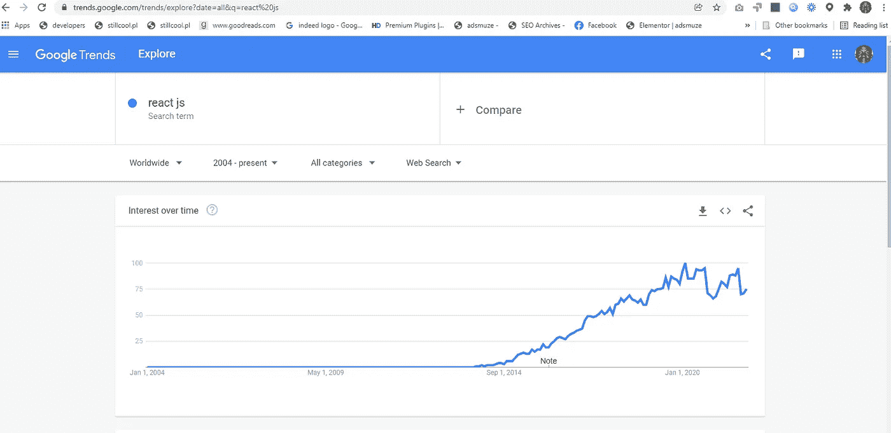
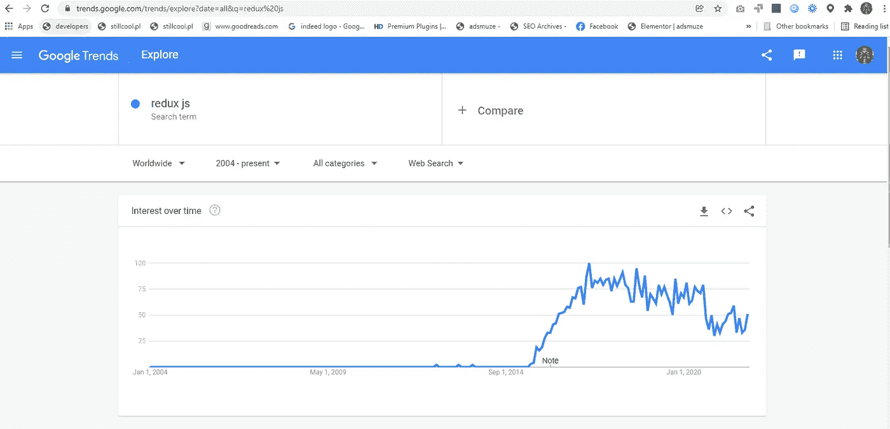
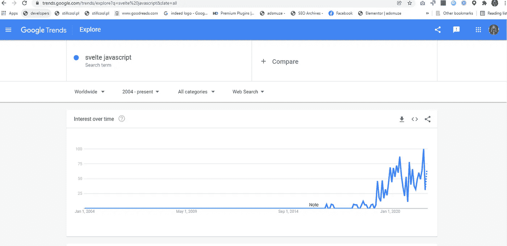
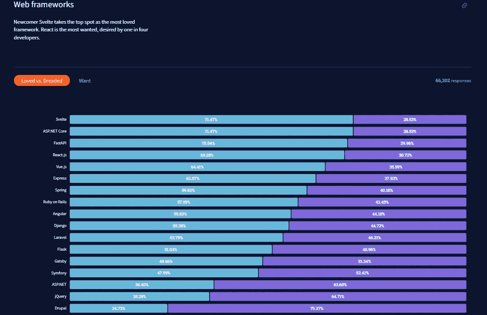

# 苗条和反应有相同的采用曲线

> 原文：<https://javascript.plainenglish.io/svelte-has-the-same-adoption-curve-as-react-563dce0c7b4a?source=collection_archive---------4----------------------->

## JavaScript 前端优化将是 2022 年工作的主要趋势。

creative 3d image of SvelteKit from the courtesy of [shipbit.de](https://shipbit.de/blog/migrating-from-sapper-to-svelte-kit/)

自 2012 年开始以来，我们都看到 React.js 的采用增长，react . js 是脸书内部诞生的 JavaScript 框架，用于轻松构建组件驱动的前端。许多像你我一样的开发人员已经开始学习这个前端框架，并在我们工作的项目中使用它，就像许多技术事物一样，采用通常是关于我们使用这个技术工具的影响，因为其他人也在使用它。影响力是采用创新的最重要的标准之一，如果你对此有疑问，你可以阅读埃弗雷特·罗杰斯关于创新扩散的书([此处](https://www.amazon.com/Diffusion-Innovations-5th-Everett-Rogers/dp/0743222091))。下面的 Google 趋势图显示了 React.js 在 2012 年之前的应用范围。

Google trend chart of the term React.js between 2004 to December 31, 2021

使用 React 组件范例突出了许多更重要的问题，以便构建更好的前端解决方案，并且已经构建了许多库来使 React 开发体验更好。状态管理就是其中之一，状态管理解决方案如 Redux，从 16.8 版本起，React 在其组件驱动的解决方案中包含了状态。但是状态管理仍然是整个 JavaScript 社区试图赢得的一场战斗，所有 JS 前端框架都试图提出内置的状态管理解决方案，而像 redux 这样的其他框架则提供以状态管理为中心的解决方案。其中一个以状态管理为中心的解决方案是反冲，下面的 google 趋势图显示了 JavaScript 开发人员对状态管理解决方案的兴趣。

Google trend chart of the term Redux JS between 2004 to December 31, 2021

但是状态管理不仅仅是前端开发人员的障碍，要交付给客户端浏览器的捆绑脚本的大小是一个很大的问题，不仅可以加快 web 体验，还可以让 web 平台运营商和用户节省网络带宽费用。为了实现减少 JavaScript 文件大小的目标，缩小器是不够的，我们探索了代码分割，即只向客户端交付用于所请求的 web 应用程序上下文的部分代码，而不是所使用的前端解决方案的所有源代码。通过缩小器和代码分割，我们减小了 JavaScript 文件的大小。

看到 JavaScript 前端代码优化中的这种差距，一些 JavaScript 开发人员决定开发新的 JavaScript 前端框架，这些框架旨在解决文件大小优化的问题，这将影响加载时间，加载时间对于 web 应用程序来说越来越重要，研究已经表明了网页加载时间对转化率和收入的影响。Svelte 是这些新诞生的 JavaScript 前端框架之一，旨在使 web 体验更快，下面的 Google 趋势图表显示的兴趣水平表明，像你我这样的开发人员关心这种针对速度的优化解决方案。

Google trend chart of the term Svelte JS between 2004 to December 31, 2021

但是这篇文章并不是要深入人心，解释它是如何工作的，为什么它会比 react 更好，而是要表明，有一种关于前端解决方案优化的趋势，每个前端工程师都应该关心，框架开发人员都在这样做，因为 React 是为了在这个速度优化的前端框架领域竞争而特意开发的 [Preact](https://preactjs.com/) 。

> 沃尔玛发现，页面加载时间每提高 1 秒，转化率就会提高 2%。来源: [cloudfare](https://www.cloudflare.com/fr-fr/learning/performance/more/website-performance-conversion-rates/)

像沃尔玛一样，当公司和创业公司越来越意识到 web 应用程序加载速度的重要性时，这种解决方案将越来越受欢迎，越来越多像你我这样的开发人员将采用它们，因为工作可用性也是采用新技术创新的一个重要标准，JavaScript 框架也不例外。事实上，有 470 个苗条的 JavaScript 职位(React 有 60，441 个职位)，LinkedIn 有 270 个苗条的职位(React 有 140，000 个职位)，随着这个框架被越来越多的人理解和采用，我们可以预计在不远的将来会有越来越多的苗条职位。

我目前正在收集一段时间内 Svelte JS (sveltekit)提供的工作数量的演变，这些数据收集将成为一篇文章，这篇文章将在我称为[工作度量](https://mkrdiop.medium.com/list/jobs-metrics-5397e4dc4fcc)的出版实验中发表，因为我猜测，如果你正在找工作，这个框架将是 2022 年的一个重要框架，来自 2021 年 StackOverflow 的这个[调查](https://insights.stackoverflow.com/survey/2021#most-loved-dreaded-and-wanted-webframe-love-dread)显示，它是最受欢迎的框架。

2021 survey about developers and dev technologies from [StackOverflow](https://insights.stackoverflow.com/survey/2021#most-loved-dreaded-and-wanted-webframe-love-dread)

**PS:** 同样，我并不主张采用苗条的 JS，而是展示速度对于网络应用的重要性，这也是我自 2019 年以来一直在做的事情，所有这些[关于核心网络生命的 10 篇文章](https://mkrdiop.medium.com/list/core-web-vitals-18257cfd0104)和这次谷歌更新。

*更多内容看* [*说白了。报名参加我们的*](http://plainenglish.io/) [*免费周报*](http://newsletter.plainenglish.io/) *。在我们的* [*社区*](https://discord.gg/GtDtUAvyhW) *获得独家写作机会和建议。*